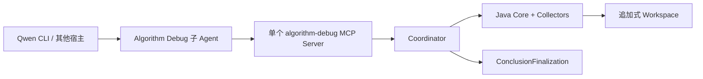

# Algorithm Debug Agent

面向本地 Java/Maven 算法 UT 的离线问题定位子 Agent。Qwen CLI 等宿主持有模型会话；Java 原生 MCP Server 负责
确定性源码查询、UT 执行、CodePath/JDWP 采集、证据归档、流程协调和结论门禁。

## 架构定位



- 宿主只暴露 Capability Manifest 中的 17 个 Tool；Resources/Prompts 是可选增强。
- 所有 Tool 强制经过 Coordinator。Prompt 帮助模型选择动作，但顺序、幂等、锁、证据义务和 Conclusion Gate 由代码执行。
- `analysis_finalize` 返回服务端 `ConclusionFinalization(candidate, decision)`；宿主不再让模型生成第二套完成契约。
- 可选知识只以有界 `KNOWLEDGE_HINT` 进入生成的子 Agent Prompt，不能成为 Evidence 或绕过门禁。
- MCP Server 不运行第二个模型、不持有模型凭据、不修改目标算法生产源码，也不接管生产决策。

详细边界见 [当前能力](docs/current-capabilities.md)、[模块详细设计](docs/architecture/algorithm-debug-agent-module-detailed-design-v1.md)
和 [工作流与产物](docs/algorithm-debug-workflow-and-artifacts.md)。

## 核心能力

- 对一个明确的 JUnit 5 测试类或方法建立追加式 Case/Analysis。
- 捕获并有界读取唯一算法输入；普通 Maven/JUnit Run 区分断言失败、目标异常、超时和 Agent/环境故障。
- 成功普通 Run 独立归档新增 Gantt；失败动态采集只用结构化失败指纹确认是否复现同类失败。
- 生成 Method Catalog，并通过 `source_query` 有界查询方法、调用者、被调用者、可达路径、源码窗口和符号。
- CodePath 使用 Byte Buddy 精确插桩，支持高频 `AGGREGATE` 与窄范围 `TRACE`。
- JDWP 使用精确断点、条件、命名标量投影和有界采样采集运行时状态。
- `evidence_query` 提供 SUMMARY、FILTER、WINDOW、COUNT 与 JDWP CHANGES，同时报告 coverage 和 limitation。
- Investigation Journal 保存竞争假设、Gap、冻结 Predicate 和 `TRUE/FALSE/UNKNOWN` Observation，反证不能被覆盖。
- Conclusion Gate 校验因果链、引用、竞争假设、截断和失败指纹，把结论限制为 `CONFIRMED`、
  `BOUNDED_HYPOTHESIS` 或 `MISSING_EVIDENCE`。

## 环境要求

- Agent 使用 JDK 21+ 构建和运行。
- 目标算法 UT 可以使用独立 JDK 17 或 JDK 21。
- Maven 能在目标算法模块执行指定 UT；离线环境所需业务依赖应已在内部镜像或本机仓库中。
- Qwen CLI 正式 Adapter 的最低版本由 `integrations/qwen-cli/adapter-manifest.json` 声明。

## 配置

Java MCP 入口读取 [config/mcp-agent-settings.json](config/mcp-agent-settings.json)：

| 字段 | 用途 |
| --- | --- |
| `workspaceDirectory` | Case、Run、Collection、Evidence、Conclusion 和日志根目录 |
| `agentJavaHome` | Agent 的 JDK 21+；空值时从环境发现 |
| `targetJavaHome` | 目标 UT 与 CodePath 使用的 JDK；空值时使用 Agent Java |
| `mavenExecutable` | Maven 可执行文件；空值时从环境发现 |
| `knowledgeDirectory` | 可选 Markdown 知识目录；为空或不存在不阻断分析 |

普通 Run 的业务结果目录等目标项目配置由运行时 Project 配置管理。旧
[config/agent-settings.json](config/agent-settings.json) 仅供 CLI/OpenCode 兼容路径使用；宿主 Adapter 不向目标仓库
写配置，也不修改目标 POM。

## 构建

```powershell
.\scripts\build-agent.ps1
```

该命令使用 Maven `codepath-launcher` Profile 构建 Java CLI、CodePath Launcher、JDWP Collector 和自包含 MCP
Server，并校验 Agent Definition、Prompt、Schema、Main class 与四类产物 SHA-256。

## Qwen CLI 安装

```powershell
.\integrations\qwen-cli\install.ps1 -RepositoryRoot . -Scope User
.\integrations\qwen-cli\check.ps1 -RepositoryRoot . -Scope User
```

安装器从 Canonical Agent Definition 生成 Qwen Extension 与子 Agent：先写同父目录 staging，再原子切换；已有受管
文件会通过 ownership hash 校验，避免覆盖用户修改。卸载使用：

```powershell
.\integrations\qwen-cli\uninstall.ps1 -RepositoryRoot . -Scope User
```

CI 或本地无副作用验证使用 `-Scope TestProfile`，不会接触用户 Qwen 配置。完整说明见
[Qwen CLI Adapter](integrations/qwen-cli/README.md)。

OpenCode 的旧入口仍可用于兼容验证，但不再是 Canonical Agent 的正式架构依赖。相关脚本保留在 `scripts/` 和
`integrations/opencode/`。

## 使用

在目标算法 Maven 模块中启动已安装该子 Agent 的宿主，明确给出 UT 和问题，例如：

```text
使用 algorithm-debug 分析
com.example.scheduler.SchedulerTest#shouldScheduleAllWafers：
为什么 WAFER-2 的 PICK 晚于可用腔室时间？
```

需要新证据时，子 Agent 先建立 Problem Frame，再捕获输入、运行基准 UT、查询源码并维护竞争假设。每轮动态 Plan
必须绑定一个 Gap、一个可证伪 Hypothesis 和一个能改变下一步决策的 Predicate。证据足够时提交 Candidate；被 Gate
拒绝时只能按 `allowedActions/missingEvidence` 继续或如实报告边界。

## Workspace

默认路径为 `%LOCALAPPDATA%\algorithm-debug-agent\workspace`，可配置。核心结构：

```text
projects/<projectId>/cases/<caseId>/
  case.json
  input/<original-input-name>
  analyses/<analysisId>/
    operations/
    investigation/
    source-queries/
    plans/
    conclusions/
  runs/<runId>/
  collections/<collectionId>/
  evidence/<evidenceId>/
  artifacts/<artifactId>.json
  logs/
```

历史产物只追加不覆盖。CodePath/JDWP 重跑不复制 Gantt，也不使用 Gantt SHA 作为门禁。知识文件不复制到 Case。

## 验证

```powershell
mvn -Pcodepath-launcher test
node --test agent-definition/test/*.test.mjs `
  integrations/host-adapter-kit/test/*.test.mjs `
  integrations/qwen-cli/test/*.test.mjs
node --test integrations/opencode/test/*.test.mjs agent-evals/test/*.test.mjs
.\integrations\qwen-cli\install.ps1 -RepositoryRoot . -Scope TestProfile
.\integrations\qwen-cli\check.ps1 -RepositoryRoot . -Scope TestProfile
.\integrations\qwen-cli\uninstall.ps1 -RepositoryRoot . -Scope TestProfile
```

完整交付检查见 [工具验证基线](docs/architecture/tool-validation-baseline.md)。
