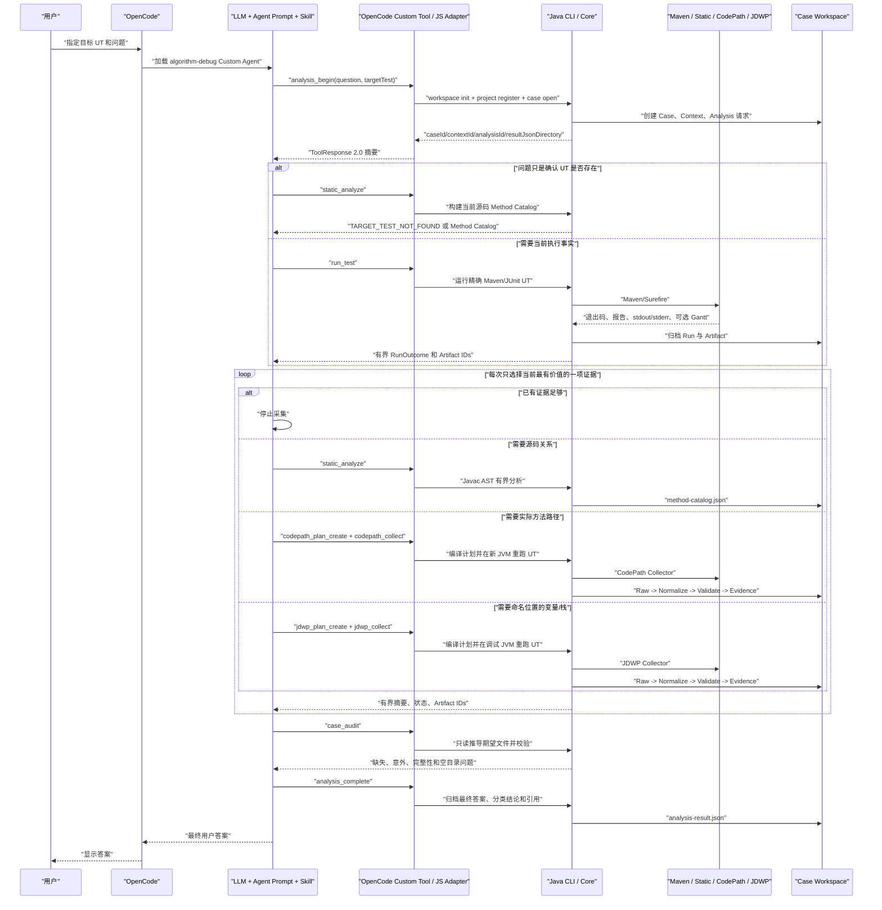

# Algorithm Debug Agent 工作流与产物

本文描述当前真实生效逻辑和 Case 中允许出现的文件。历史设计不作为运行时事实。

## 1. 运行入口

用户从目标 Maven 算法模块目录启动 OpenCode，指定一个 `class#method` UT。UT 自己负责构造、
赋值或读取算法输入。Agent 不接收独立算法输入路径。

算法结果目录由 Agent 仓库的 `config/agent-settings.json.resultJsonDirectory` 配置。普通使用中
大模型不询问、不猜测，也不向 Tool 传递该路径。

## 2. 完整交互流程



箭头含义：

| 箭头 | 含义 |
|---|---|
| 用户到 OpenCode | 自然语言问题进入会话 |
| LLM 到 Tool | 模型选择确定性能力，不直接写 Workspace |
| JS Adapter 到 Java CLI | 已解析配置和身份的内部子进程调用 |
| Java 到外部工具 | Maven、CodePath 或 JDWP 的受控进程 |
| Java 到 Workspace | 原子、追加、不可覆盖的归档 |
| ToolResponse 到 LLM | 有界结构事实，不发送整份大 Trace |
| LLM 到 analysis_complete | 模型解释结果并显式列出证据引用 |

## 3. analysis_begin 的作用

`analysis_begin` 不是算法分析，也不运行 UT。它完成：

| 动作 | 结果 |
|---|---|
| 初始化 Workspace | 创建 Workspace manifest 和项目注册区 |
| 注册当前工作目录 | 得到稳定 `projectId` 和 Maven 模块信息 |
| 打开 Case | 新问题创建 Case；追问可传旧 `caseId` |
| 创建 Context/Analysis | 给本轮问题分配不可变身份 |
| 返回结果路径 | 告知模型当前安装配置，不要求用户重复输入 |
| 绑定 DFX | 后续 Tool 事件写入本 Case 的 `interaction.jsonl` |

Case 本身只在 `analysis_begin` 成功后创建。项目准备失败时，不会制造半个 Case。

## 4. UT 结果处理

`run_test` 对所有结果采用同一通用模型，不把失败硬编码成封闭枚举。

| 事实 | 处理 |
|---|---|
| UT 通过 | 归档 Run、Surefire、日志和可选 Gantt |
| 业务代码抛异常 | 归档异常类型、消息、cause、stack 和最早失败事实 |
| 断言失败 | 归档 assertion expected/actual 和 stack |
| 输入读取失败 | 作为普通目标异常处理，不伪装成 Agent 工具失败 |
| Maven/进程工具失败 | 返回 Agent/Tool 边界，禁止推断算法根因 |
| 配置目录无 JSON | 只报告本轮未捕获 JSON，不猜测其他目录 |

算法结果捕获使用运行前后目录快照，只检查配置目录顶层新建或变化的 JSON。文件名时间戳不参与正确性，
绝对路径和相对路径均可配置。

## 5. CodePath 与 JDWP

两者独立，没有固定先后顺序。

| 工具 | 适合问题 | 主要输出 |
|---|---|---|
| CodePath | 哪些候选方法实际执行、进入次数、邻近路径 | `method-path-summary.json` |
| JDWP | 某方法某行的局部变量、字段、栈和命中次数 | `jdwp-snapshot-summary.json` |

每个动态 Collection 都会在新目标 JVM 中重新执行 UT。一次复杂问题可以有多个 Plan/Collection；
运行时没有全局固定采集次数。LLM 每轮根据证据缺口选择一个新的、有界计划，证据足够就停止。

Collection ToolResponse 将内部采集执行标识显示为 `collectorExecutionRunId`。它不是普通
`run_test` 的 Run，不应放入 `analysis_complete.referencedRunIds`；引用动态执行应使用
`collectionId`、`evidenceId` 和 Artifact IDs。

## 6. 动态基线

当前不比较成功 Run 的 Gantt SHA，也不要求成功结果完全一致。

| 目标结果 | baseline-check |
|---|---|
| 普通 Run 通过，动态重跑也完成 | `NOT_COMPARED`；Gantt 独立归档 |
| 普通 Run 失败，动态重跑复现同一结构化失败 | `MATCHED`；证据可继续使用 |
| 动态重跑出现不同结构化失败 | `CHANGED`；不能确认原问题 |
| 无法建立可比失败事实 | `INCOMPARABLE`；按缺失证据处理 |

失败指纹基于异常/断言等结构化事实，不基于 Gantt 文件名、空格或整体 JSON 内容。

## 7. Case 根目录

```text
<workspace>/projects/<projectId>/cases/<caseId>/
```

目录按生产者懒创建。没有 Run 就没有 `runs/`；没有动态采集就没有 `collections/` 和
`evidence/`；没有 Plan 就没有 `plans/`。Case Audit 将空目录视为问题。

## 8. Case 文件逐项说明

### 8.1 Case、Context、Analysis 和 DFX

| 相对路径 | 生产者 | 作用 |
|---|---|---|
| `case.json` | analysis_begin | Case、项目、目标 UT、Adapter 和创建时间 |
| `interaction.jsonl` | JS DFX Recorder | 真实 Tool/CLI 时间线；不是 Evidence |
| `contexts/<contextId>/context.json` | analysis_begin | 本轮 Context 身份和时间 |
| `contexts/<contextId>/reproduction.json` | 首次普通 Run | 供动态失败比较使用的普通 Run 引用；仅在需要时存在 |
| `analyses/<analysisId>/analysis-request.json` | analysis_begin | 本轮问题和 Context 关联 |
| `analyses/<analysisId>/analysis-result.json` | analysis_complete | 最终答案、分类结论、引用和缺失证据 |
| `analyses/<analysisId>/method-catalog.json` | static_analyze | 当前源码的有界方法与直接调用边 |
| `analyses/<analysisId>/plans/<planId>.json` | Plan Tool | 高层 CodePath 或 JDWP 计划 |

### 8.2 普通 Run

| 相对路径 | 作用 |
|---|---|
| `runs/<runId>/run-request.json` | 精确 UT、Analysis 和运行请求 |
| `runs/<runId>/run-outcome.json` | 进程、测试、Gantt 和结构化失败摘要 |
| `runs/<runId>/run-result-fingerprint.json` | 失败目标的结构化指纹；通过 Run 不生成 |
| `runs/<runId>/raw/stdout.log` | Maven/JUnit stdout 原始流 |
| `runs/<runId>/raw/stderr.log` | Maven/JUnit stderr 原始流；可合法为 0 字节 |
| `runs/<runId>/raw/surefire/*.xml` | 本次目标测试的 Surefire 报告 |
| `runs/<runId>/raw/gantt.json` | 本次捕获的算法 JSON；未产生时不创建 |

### 8.3 Collection 控制与原始文件

| 相对路径 | 作用 |
|---|---|
| `collections/<collectionId>/collection-request.json` | Collection 身份、Plan 和目标 UT 关联 |
| `collections/<collectionId>/manifest.json` | Agent 观察到的阶段、进程、预算、完成和失败事实 |
| `collections/<collectionId>/collection-summary.json` | 给 Case Digest/LLM 的有界完成摘要 |
| `collections/<collectionId>/collector-plan.json` | JDWP Collector 实际执行的运行时计划；不同于高层 Plan |
| `collections/<collectionId>/raw/codepath.jsonl` | CodePath 原始事件 |
| `collections/<collectionId>/raw/jdwp.jsonl` | JDWP 原始事件 |
| `collections/<collectionId>/raw/collector-manifest.json` | JDWP Collector 自己报告的版本、能力、预算和完成事实 |
| `collections/<collectionId>/raw/gantt.json` | 采集重跑产生的可选算法 JSON |
| `collections/<collectionId>/logs/stdout.log` | CodePath 目标进程 stdout |
| `collections/<collectionId>/logs/stderr.log` | CodePath 目标进程 stderr |
| `collections/<collectionId>/logs/target-*.log` | JDWP 目标 JVM 的 stdout/stderr |
| `collections/<collectionId>/logs/collector-*.log` | JDWP Collector 的 stdout/stderr |
| `collections/<collectionId>/validation/baseline-check.json` | `NOT_COMPARED/MATCHED/CHANGED/INCOMPARABLE` |
| `collections/<collectionId>/validation/post-processing-failure.json` | 后处理失败诊断；只有失败时存在 |

### 8.4 Derived 和 Evidence

| 相对路径 | 作用 |
|---|---|
| `collections/<collectionId>/derived/<evidenceId>/normalization-manifest.json` | Raw 到摘要的计数、截断和状态 |
| `.../method-path-summary.json` | CodePath 有界方法统计与路径 |
| `.../jdwp-snapshot-summary.json` | JDWP 有界命中、栈和值 |
| `.../collection-validation.json` | 身份、完成、预算、基线和 Evidence 可用性校验 |
| `evidence/<evidenceId>/evidence-build-request.json` | 模型请求的证据维度 |
| `evidence/<evidenceId>/evidence-bundle.json` | 确定性事实、校验结论、比较事实和 Artifact 引用 |
| `evidence/<evidenceId>/sufficiency-evaluation.json` | 覆盖、矛盾、截断和缺失维度判断 |

### 8.5 Artifact 注册

`artifacts/<artifactId>.json` 是注册元数据，不复制原文件内容。它保存：

- Artifact ID 和类型
- Case 内相对路径
- 媒体类型
- 归档时字节数
- 归档时 SHA-256
- 注册时间

Plan 只注册一次。JDWP 的 `collector-plan.json` 是单独的实际 Collector 输入，因此有自己的
ArtifactReference。

## 9. SHA 的准确边界

| SHA | 生产者 | 消费者 | 不一致行为 |
|---|---|---|---|
| Artifact SHA-256 | Java 在注册真实归档文件时读取并计算 | artifact_read、gantt_inspect、case_audit | 拒绝读取或标记完整性问题 |
| 失败事实 SHA-256 | 普通失败 Run 的结构化诊断指纹器 | 动态失败基线比较 | CHANGED/INCOMPARABLE，不用于确认原失败 |
| projectId/DFX/Eval 内部 Hash | 配置、脱敏和 Eval 代码 | 对应内部组件 | 只用于稳定 ID、隐私或报告可比性 |

不存在 Source SHA、POM SHA、Plan SHA、Raw Trace 重复 SHA、Gantt normalized SHA 或 Collector JAR SHA
运行门禁。LLM 不计算 SHA，只接收结构化成功或失败状态。

## 10. 如何人工复盘

1. 打开 Case 根目录的 `case.json` 确认目标 UT。
2. 打开 `interaction.jsonl` 查看 Tool 和 CLI 的真实执行顺序。
3. 查看 `analyses/<analysisId>/analysis-request.json` 和 `analysis-result.json`。
4. 查看普通 Run 的 `run-outcome.json`，按需打开 stdout、Surefire 或 Gantt。
5. 有 Collection 时先看 `collection-summary.json`、`baseline-check.json` 和 Derived 摘要。
6. 再看 `evidence-bundle.json` 和 `sufficiency-evaluation.json`。
7. 只有摘要不足时才打开 Raw Trace。
8. 执行 `case_audit` 或查看 Eval 的 `workspace-audit.json` 核对文件完整性。

DFX 脚本只是可选过滤器，不是生成日志的必要条件。日志本身已经在 Case 目录，可以直接打开。
