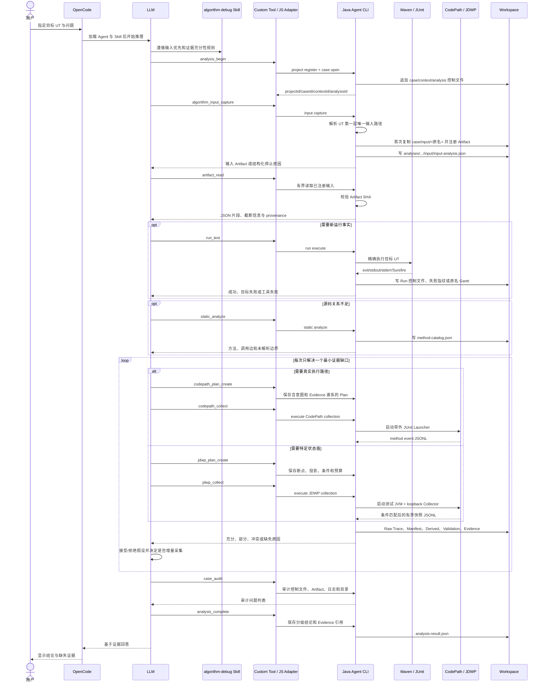

# 工作流与 Workspace 产物

## 1. 参与者与职责

| 参与者 | 职责 |
| --- | --- |
| 用户 | 提供目标 UT 和要解释的问题 |
| OpenCode | 承载会话、加载 Agent/Skill、执行 Custom Tool |
| LLM | 理解问题、提出假设、判断证据缺口、制定 Plan、解释结论 |
| Skill | 约束输入优先、因果搜索、动态采集和收尾顺序 |
| JS Adapter | 校验 Tool 参数，调用 Java CLI，记录交互并返回有界结果 |
| Java Agent CLI | 确定性执行、采集、校验和归档 |
| Workspace | 追加保存 Case 的控制文件、原始证据、派生证据、日志与报告 |

LLM 不直接伪造 Trace、Hash 或验证结论；Java 代码不内置调度业务语义。

## 2. 一次分析的完整时序



箭头表示一次真实请求或落盘动作，不表示模块静态依赖。`analysis_begin` 不是算法分析，它建立或复用 Project/Case/Context，并为本轮创建新的 `analysisId`。

## 3. 运行和失败处理

UT 结果不是通过预设枚举穷举业务错误，而是先确定执行边界：

- 目标测试不存在：停止并提示用户修正 UT。
- UT 已启动且退出非零：保留异常、断言和 Surefire 事实，由 LLM结合问题分析。
- Maven、JDK、脚本或 Agent 自身失败：标记工具失败，不输出目标算法根因。
- UT 成功：捕获本次新建或变化的 JSON Gantt，继续围绕用户问题分析。

失败 UT 的后续动态采集只用结构化失败指纹判断是否复现同类失败。成功 Gantt 每次运行允许不同，不做 SHA 相等要求。

## 4. 静态分析、CodePath 与 JDWP 的关系

三者不是固定串行，也不存在 CodePath 是 JDWP 前置条件：

- 静态分析回答“当前源码中可能有哪些方法、调用和分派边界”。
- CodePath 回答“这次 UT 实际经过哪些目标方法、顺序和重复模式”。
- JDWP 回答“指定位置在满足实体条件时，局部变量或对象字段是什么值”。

LLM 可以先用输入快照和静态分析形成假设，CodePath 验证路径，再用 JDWP 验证最小状态；若源码异常已足够，也可以跳过动态工具。大型算法允许多轮增量 Plan，但每轮必须引用已有 Evidence，不能重复同一个无效 Plan。

## 5. Workspace 根目录

根目录由 `config/agent-settings.json` 的 `workspaceDirectory` 配置。初始化只创建：

```text
<workspace>/
  workspace.yaml
  projects/
```

没有预建的空 Case 目录、知识目录或缓存目录。尚未建立 Case 的 Java 启动日志写入 `dfxDirectory/java/agent-bootstrap-YYYY-MM-DD.log`。

## 6. Case 文件清单

```text
projects/<projectId>/cases/<caseId>/
  case.json
  interaction.jsonl                         # 有 OpenCode Tool 交互时存在
  logs/agent-YYYY-MM-DD.log                 # Java 命令实际执行时存在
  input/<original-input-name>               # 首次输入捕获后存在且只复制一次
  artifacts/<artifactId>.json               # 每个归档 Artifact 的引用与 SHA
  contexts/<contextId>/
    context.json
    reproduction.json                       # 建立复现关系时可选
  analyses/<analysisId>/
    analysis-request.json
    analysis-result.json                    # analysis_complete 后存在
    input/input-analysis.json               # 每轮输入识别/复用结果
    method-catalog.json                      # 调用 static_analyze 后存在
    plans/<planId>.json                      # 创建动态 Plan 后存在
  runs/<runId>/
    run-request.json
    run-outcome.json
    run-result-fingerprint.json              # 可比较结果存在时生成
    raw/
      stdout.log
      stderr.log
      surefire/...
      <original-gantt-name>.json             # 普通成功 Run 捕获到结果时存在
  collections/<collectionId>/
    collection-request.json
    collection-summary.json
    manifest.json
    collector-plan.json                     # JDWP Collector 编译计划时存在
    raw/
      codepath.jsonl                         # CodePath Collection
      jdwp-events.jsonl                      # JDWP Collection
      stdout.log
      stderr.log
    validation/baseline-check.json
    derived/<evidenceId>/
      normalization-manifest.json
      method-path-summary.json               # CodePath
      jdwp-snapshot-summary.json             # JDWP
      collection-validation.json
  evidence/<evidenceId>/
    evidence-build-request.json
    evidence-bundle.json
    sufficiency-evaluation.json
```

可选文件只在相应动作发生时创建；Case 审计不要求未调用能力的文件出现，也禁止留下无意义空目录。

## 7. 各产物在分析中的作用

| 产物 | 生产者 | 消费者 | 作用 |
| --- | --- | --- | --- |
| `case.json` | Case Service | 全部后续命令 | 固定目标 UT 与 Case 身份 |
| `context.json` | Context Service | Run/Collection | 固定本轮目标模块与上下文 |
| `input-analysis.json` | Input Service | LLM/审计 | 记录输入路径识别、首次捕获或复用结果 |
| `case/input/<原名>` | Input Service | `artifact_read`/LLM | 保存算法运行前的完整输入快照 |
| `run-outcome.json` | Maven Runner | LLM/Collection 基线 | 区分成功、目标失败和工具失败 |
| `run-result-fingerprint.json` | Run Assembler | Baseline Validator | 对失败类型、异常和断言进行结构化比较 |
| 原名 Gantt | Result Capture | `gantt_inspect`/LLM | 呈现该普通 Run 的调度结果 |
| `method-catalog.json` | Static Analyzer | LLM | 给出候选方法、调用边和未解析边界 |
| `plans/<planId>.json` | Plan Engine | Collector/审计 | 固化问题、假设、预期观察、来源 Evidence 和预算 |
| Raw JSONL | Collector | Normalizer/人工复盘 | 不可改写的采集事实 |
| Derived Summary | Normalizer | Validator/LLM | 有界聚合，避免把无界 Trace 直接发送给模型 |
| `collection-validation.json` | Validator | Evidence Engine/LLM | 说明完整、部分、冲突和截断原因 |
| `evidence-bundle.json` | Evidence Engine | LLM | 汇总可引用的结构化证据 |
| `sufficiency-evaluation.json` | Evidence Evaluator | LLM | 阻止证据不足时输出确认性结论 |
| `analysis-result.json` | Analysis Service | 用户/后续轮次 | 保存分级结论、引用和剩余缺口 |
| `interaction.jsonl` | JS Adapter | 人工审计/Eval | 记录 Tool 请求、响应和关联 ID |
| `logs/*.log` | Java Logger | 人工排障 | 记录 Java 执行阶段和异常调用栈，不污染 Tool stdout |

## 8. SHA 的唯一产品含义

Artifact 注册时记录 SHA-256；`artifact_read` 前重新计算并比较。相同表示当前读取字节仍是已归档文件，不同则拒绝读取并提示 Artifact 已变化。它不用于判断两个算法运行业务等价，也不用于限制代码修改、Plan 修改、Gantt 文件名或 Gantt 内容变化。
