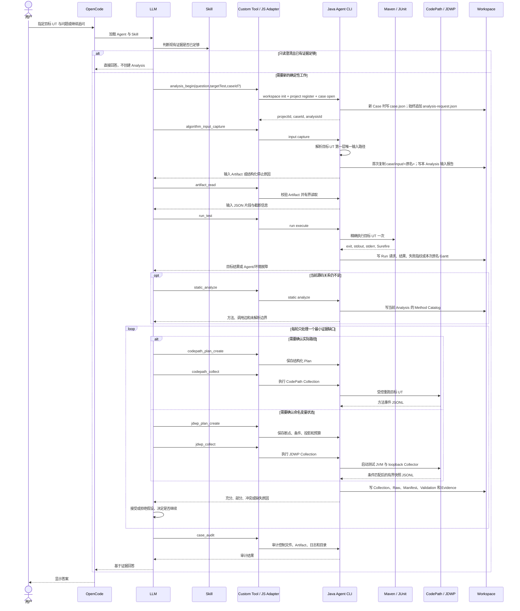

# 工作流与 Workspace 产物

## 1. 参与者与职责

| 参与者 | 职责 |
| --- | --- |
| 用户 | 指定一个目标算法 UT，并提出需要解释的问题 |
| OpenCode | 承载会话，加载 Agent、Skill 和 Custom Tool |
| LLM | 理解问题、提出假设、选择最小下一步证据并解释结论 |
| Skill | 约束输入优先、因果搜索、动态采集和证据分级 |
| JS Adapter | 校验 Tool 参数，调用 Java CLI，记录交互并返回有界 ToolResponse |
| Java Agent CLI | 确定性执行、采集、校验和归档 |
| Maven/JUnit | 执行目标 UT |
| CodePath/JDWP | 在受控重跑中采集调用路径或运行时状态 |
| Workspace | 追加保存控制文件、原始证据、派生证据、日志和最终报告 |

LLM 不生成伪造 Trace 或校验结论；Java 代码不内置目标算法业务语义。

## 2. 对话与执行时序



每个实线箭头表示一次真实请求、子进程调用或落盘动作，不表示模块静态依赖。虚线返回表示有界结果。`analysis_begin` 不分析算法，它只准备 Project/Case 并为需要新工作的轮次创建 `analysisId`。

## 3. 普通 Run 与动态 Collection

CodePath 和 JDWP 都会重新执行目标 UT，但它们的动态 Run 与普通 Run 使用不同 `runId`。二者通过同一 `analysisId` 关联。

- 普通 UT 失败时保存结构化失败指纹。
- 动态 UT 失败时与本 Analysis 最近的普通失败指纹比较。
- `MATCHED` 表示动态证据可用于确认同类失败。
- `CHANGED` 或 `INCOMPARABLE` 只作为线索，不能确认原失败。
- 普通 UT 成功时 Gantt 独立归档；CodePath/JDWP 重跑不复制 Gantt，也不比较 Gantt SHA。

## 4. Workspace 结构

目录按需创建，不为尚未发生的阶段创建空目录。

```text
projects/<projectId>/
  project.json
  cases/<caseId>/
    case.json
    input/<original-input-name>
    analyses/<analysisId>/
      analysis-request.json
      input/input-analysis.json
      method-catalog.json
      plans/<planId>/...
    runs/<runId>/
      run-request.json
      run-outcome.json
      run-result-fingerprint.json
      raw/<original-gantt-name and process artifacts>
    collections/<collectionId>/
      collection-request.json
      manifest.json
      raw/
      logs/
      validation/
      derived/<evidenceId>/
    evidence/<evidenceId>/
      evidence-build-request.json
      evidence-bundle.json
      sufficiency-evaluation.json
    artifacts/<artifactId>.json
    interaction.jsonl
    logs/agent-YYYY-MM-DD.log
```

## 5. 文件用途

| 文件或目录 | 作用 | 是否可作为问题证据 |
| --- | --- | --- |
| `project.json` | 记录目标模块、构建工具和结果目录配置 | 配置事实，不是算法根因 |
| `case.json` | 固定目标 UT 与初始问题身份 | 身份事实 |
| `input/<原名>` | Case 首次捕获的算法输入原始字节 | 可通过 Artifact 引用读取 |
| `analysis-request.json` | 记录一次确定性调查的用户问题和 `analysisId` | 控制文件 |
| `input-analysis.json` | 记录输入定位、复制或复用结果 | 可支持输入身份结论 |
| `method-catalog.json` | 当前源码的有界方法目录、调用边和 SourceAnchor | 静态推断，不是运行时证明 |
| `plans/<planId>` | 记录采集问题、假设、选点、投影和预算 | 采集意图，不是采集结果 |
| `run-request.json` | 一次目标 UT 的执行请求 | 控制文件 |
| `run-outcome.json` | 进程、测试、异常、Gantt 和 Artifact 事实 | 可作为目标执行证据 |
| `run-result-fingerprint.json` | 失败 Run 的结构化失败身份 | 只用于同 Analysis 动态比较 |
| `collections/<id>/raw` | Collector 原始事件或快照 | 原始证据，只读 |
| `manifest.json` | 启动、退出、预算、命中和截断事实 | 可作为采集完整性事实 |
| `validation` | 确定性校验和基线比较 | 可作为 Validator 结论 |
| `derived/<evidenceId>` | Normalizer 生成的有界摘要 | 可作为已校验动态证据 |
| `evidence-bundle.json` | 汇总当前证据、历史对比和覆盖维度 | LLM 的主要证据入口 |
| `sufficiency-evaluation.json` | 检查覆盖、矛盾、截断和缺失 | 决定能否输出确认性结论 |
| `artifacts/<artifactId>.json` | Artifact 注册、相对路径、大小和 SHA | 证据寻址与完整性 |
| `interaction.jsonl` | OpenCode Tool 与 CLI 调用顺序 | 仅 DFX，不作为业务证据 |
| `logs/agent-*.log` | Java 执行日志和异常栈 | 仅 DFX，不作为业务证据 |

## 6. 多轮追问

如果上一轮证据足以回答追问，LLM 直接回答，不创建 Analysis。需要重新执行当前代码或采集新证据时，复用原 `caseId` 调用 `analysis_begin`，得到新 `analysisId`。新 Analysis 可以引用同一 Case 的不可变历史证据，但当前源码的静态目录、普通 Run 和动态 Collection 必须重新按本轮需要生成。

用户明确说明代码已修改时，不创建新 Case；如果需要验证修改后的行为，则在原 Case 中创建新 Analysis。Agent 不猜测用户未说明的源码变化。
