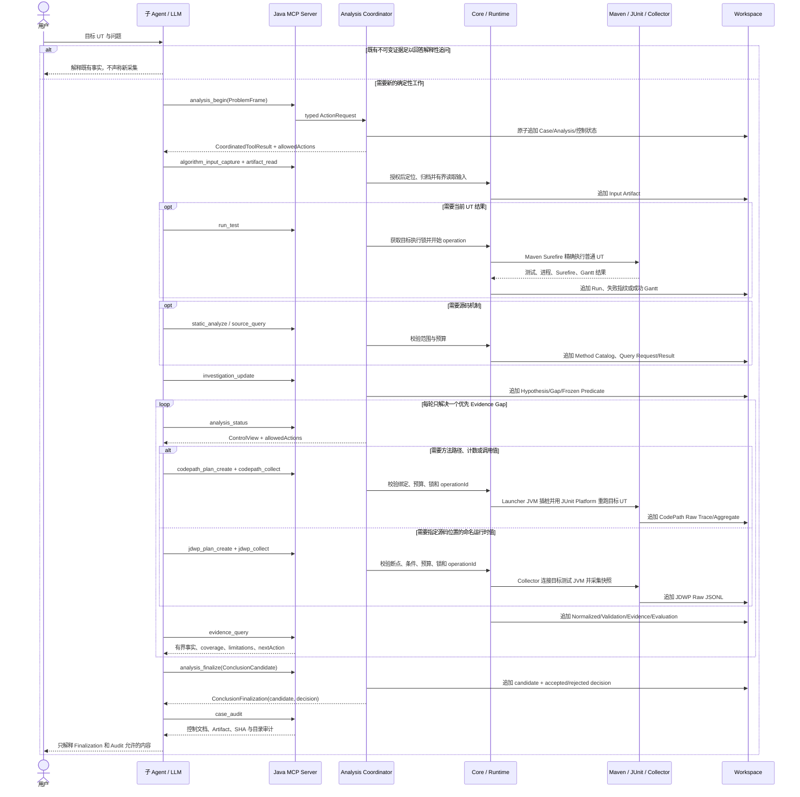

# 工作流与 Workspace 产物

更新日期：2026-09-29。

## 1. 参与者

| 参与者 | 职责 |
| --- | --- |
| 用户 | 指定一个目标算法 UT 并提出问题 |
| Qwen CLI / 其他宿主 | 创建模型子 Agent、持有凭据和会话、注册一个 stdio MCP Server |
| Algorithm Debug 子 Agent | 理解问题、形成竞争假设、选择最小证据步骤并解释门禁允许的结论 |
| Canonical Prompt / 可选知识 | 约束调查方法；知识只辅助理解和搜索，不是 Evidence |
| Java MCP Server | Tool Schema、协议、上下文、取消、错误映射与有界返回 |
| Analysis Coordinator | 动作授权、锁、幂等、后置校验、状态投影、证据义务和 Conclusion Gate |
| Java Core / Collector | 确定性执行、源码查询、采集、规范化、校验、注册和归档 |
| Maven/JUnit | 执行普通目标 UT 或为动态采集提供受控测试运行 |
| Workspace | 按 Project/Case/Analysis/Operation/Run/Collection 保存追加式事实 |

LLM 不生成 Raw Trace、哈希、Predicate Evaluation 或 Gate Decision；Java 代码不内置目标算法业务语义。

## 2. 完整时序


```mermaid
sequenceDiagram
    actor U as 用户
    participant L as 子 Agent / LLM
    participant M as Java MCP Server
    participant A as Analysis Coordinator
    participant R as Core / Runtime
    participant T as Maven / JUnit / Collector
    participant W as Workspace

    U->>L: 目标 UT 与问题
    alt 既有不可变证据足以回答解释性追问
        L-->>U: 解释既有事实，不声称新采集
    else 需要新的确定性工作
        L->>M: analysis_begin(ProblemFrame)
        M->>A: typed ActionRequest
        A->>W: 原子追加 Case/Analysis/控制状态
        A-->>L: CoordinatedToolResult + allowedActions
        L->>M: algorithm_input_capture + artifact_read
        A->>R: 授权后定位、归档并有界读取输入
        R->>W: 追加 Input Artifact
        opt 需要当前 UT 结果
            L->>M: run_test
            A->>R: 获取目标执行锁并开始 operation
            R->>T: Maven Surefire 精确执行普通 UT
            T-->>R: 测试、进程、Surefire、Gantt 结果
            R->>W: 追加 Run、失败指纹或成功 Gantt
        end
        opt 需要源码机制
            L->>M: static_analyze / source_query
            A->>R: 校验范围与预算
            R->>W: 追加 Method Catalog、Query Request/Result
        end
        L->>M: investigation_update
        A->>W: 追加 Hypothesis/Gap/Frozen Predicate
        loop 每轮只解决一个优先 Evidence Gap
            L->>M: analysis_status
            A-->>L: ControlView + allowedActions
            alt 需要方法路径、计数或调用值
                L->>M: codepath_plan_create + codepath_collect
                A->>R: 校验绑定、预算、锁和 operationId
                R->>T: Launcher JVM 插桩并用 JUnit Platform 重跑目标 UT
                T->>W: 追加 CodePath Raw Trace/Aggregate
            else 需要指定源码位置的命名运行时值
                L->>M: jdwp_plan_create + jdwp_collect
                A->>R: 校验断点、条件、预算、锁和 operationId
                R->>T: Collector 连接目标测试 JVM 并采集快照
                T->>W: 追加 JDWP Raw JSONL
            end
            R->>W: 追加 Normalized/Validation/Evidence/Evaluation
            L->>M: evidence_query
            M-->>L: 有界事实、coverage、limitations、nextAction
        end
        L->>M: analysis_finalize(ConclusionCandidate)
        A->>W: 追加 candidate + accepted/rejected decision
        A-->>L: ConclusionFinalization(candidate, decision)
        L->>M: case_audit
        M-->>L: 控制文档、Artifact、SHA 与目录审计
        L-->>U: 只解释 Finalization 和 Audit 允许的内容
    end
```

CodePath 与 JDWP 都会在新目标测试运行中采集。Project 级目标执行锁避免 MCP/CLI 多进程重叠；Case 写锁保护短事务。
Prompt 规定正常调用顺序，但真正的强制条件在 Coordinator：任何 Tool 调用都不能绕过身份、状态、义务、幂等或门禁。

## 3. Workspace 结构

目录按需创建，不为未发生阶段创建空目录。以下为逻辑结构；具体版本化文件名以 Schema 和 Repository 实现为准。

```text
projects/<projectId>/
  project.json
  .control/target-execution.lock
  control/analysis-begins/cases/<caseId>/analyses/<analysisId>/...
  cases/<caseId>/
    case.json
    .control/case-write.lock
    input/<original-input-name>
    analyses/<analysisId>/
      analysis-request.json
      input/input-analysis.json
      method-catalog.json
      operations/<operationId>/
        started.json
        completed.json | failed.json | uncertain.json
      coordination/...
      investigation/events/<sequence>-<eventId>.json
      source-queries/<queryId>/request.json
      source-queries/<queryId>/result.json
      conclusions/<conclusionId>/
        candidate.json
        accepted.json | rejected.json
      plans/<planId>/...
    runs/<runId>/
      run-request.json
      run-outcome.json
      run-result-fingerprint.json
      raw/<original-gantt-name and process artifacts>
    collections/<collectionId>/
      collection-request.json
      manifest.json
      raw/codepath.jsonl | raw/codepath-aggregate.json | raw/jdwp.jsonl
      logs/
      validation/
      derived/<evidenceId>/
    evidence/<evidenceId>/
      evidence-build-request.json
      evidence-bundle.json
      sufficiency-evaluation.json
    artifacts/<artifactId>.json
    interaction.jsonl
    logs/agent-YYYY-MM-DD.log
```

锁文件是同步设施，不是 Evidence。Analysis Begin 的引导控制记录位于 Project 控制根，确保正式 Analysis 目录创建前
也能幂等恢复；成功后不迁移或复制。Operation、Investigation 和 Conclusion 文件追加写入，双终态、重复序号或身份
不一致会被 State Projector/Audit 报告为损坏。

## 4. 关键文件用途

| 文件 | 用途 |
| --- | --- |
| `project.json` | 目标模块、构建工具和结果目录配置 |
| `case.json` | 固定目标 UT 与初始问题身份 |
| `input/<原名>` | 首次捕获的算法输入原始字节 |
| `analysis-request.json` | 一次确定性调查的问题、Problem Frame 和 Analysis ID |
| `operations/<operationId>` | 写动作 STARTED 与唯一终态；重试回放而不重复执行 |
| `coordination` | Action Decision、Control View 与版本化 Policy 结果 |
| `investigation/events` | 竞争假设、Gap、冻结 Predicate、三值 Evaluation 和反证账本 |
| `method-catalog.json` | 有界方法与候选调用关系，只支持静态推断 |
| `source-queries/<queryId>` | 有界源码请求、结果、完整性和 provenance |
| `plans/<planId>` | 调查绑定、精确方法/断点、Scope、投影、模式和预算 |
| `run-outcome.json` | 普通 UT 的进程、测试、异常和 Gantt 事实 |
| `run-result-fingerprint.json` | 失败 Run 的结构化身份，用于动态复现比较 |
| `raw/codepath.jsonl` | TRACE 逐事件原始证据 |
| `raw/codepath-aggregate.json` | AGGREGATE 运行时有界计数，不含逐调用顺序 |
| `raw/jdwp.jsonl` | JDWP 命中与快照原始记录 |
| `manifest.json` | 启动、退出、预算、命中/Scope 计数、截断和失败原因 |
| `derived/<evidenceId>` | Normalizer 生成的 Method Path 或 JDWP Snapshot 模型 |
| `evidence-bundle.json` | 当前证据维度、引用、覆盖和 lineage |
| `sufficiency-evaluation.json` | 覆盖、矛盾、截断和缺口检查 |
| `conclusions/<conclusionId>` | 原始 Candidate 与 Gate accepted/rejected Decision |
| `artifacts/<artifactId>.json` | Artifact 类型、相对路径、大小、SHA 和 provenance 登记 |
| `interaction.jsonl` / `logs` | DFX 调用顺序和异常，仅用于排障，不是算法 Evidence |

`evidence_query` 返回是临时有界视图，不新增 Workspace 文件。`ConclusionFinalization` 是 Tool 返回契约，由已归档的
candidate 与 decision 组成；最终自然语言回答本身不默认写入 Workspace。

## 5. 多轮追问与知识

上一轮证据足够时直接回答，不创建 Analysis。需要执行当前代码、读取新源码或采集新证据时，复用原 `caseId` 创建新
`analysisId`。新 Analysis 可以引用同一 Case 的不可变历史 Evidence，但自己的 Problem Frame、Investigation、Plan、
Operation 和 Conclusion 继续追加，绝不覆盖上一轮。

知识 Markdown 只在安装/渲染宿主子 Agent 时进入 Prompt，不复制到 Case，也不成为 Artifact。知识更新会改变生成的
宿主 Agent 内容和 provenance，但不会迁移、删除或重新解释历史 Workspace 证据。
