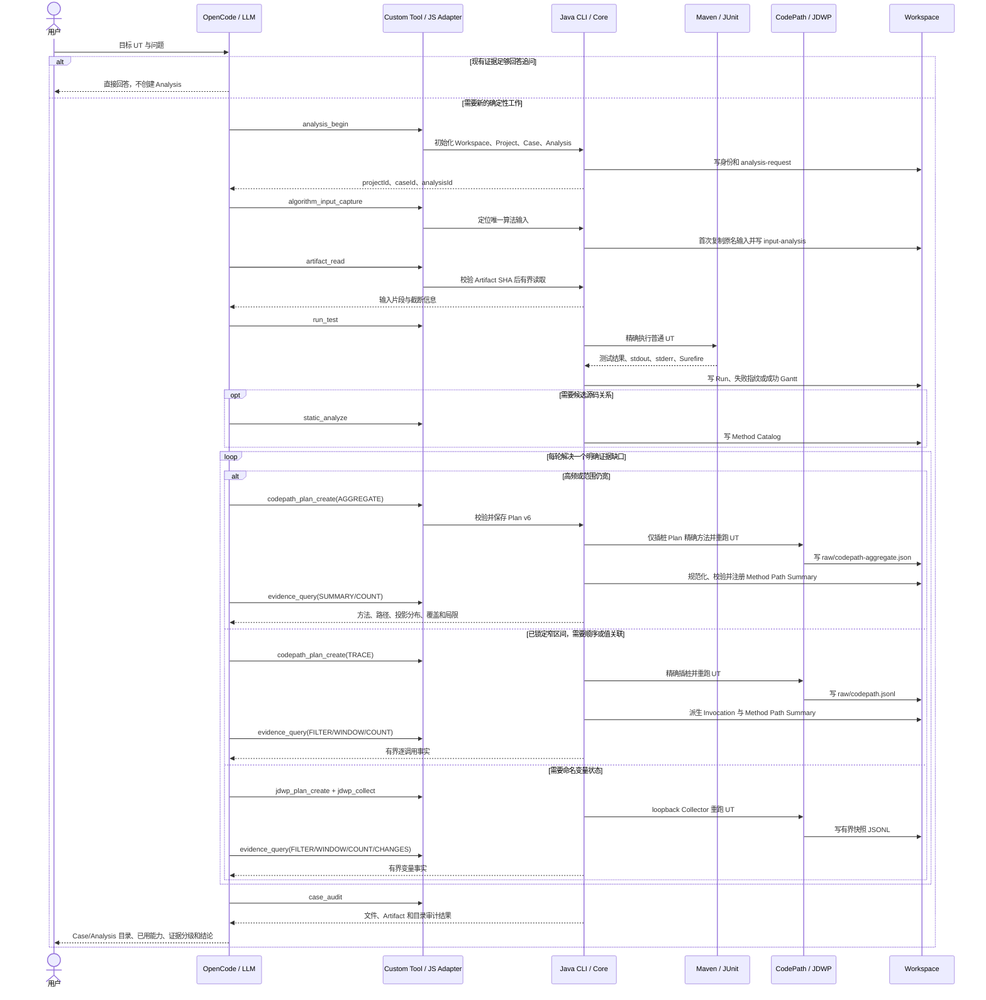

# 工作流与 Workspace 产物

## 1. 参与者

| 参与者 | 职责 |
| --- | --- |
| 用户 | 指定一个目标算法 UT 并提出问题 |
| OpenCode + LLM | 理解问题、形成假设、选择最小证据步骤并解释结论 |
| Skill | 告知模型输入优先、因果搜索、采集模式、查询方式和证据分级规则 |
| Custom Tool + JS Adapter | 校验参数、调用 Java CLI、记录交互并返回有界 ToolResponse |
| Java Agent CLI | 确定性执行、采集、规范化、校验、注册和归档 |
| Maven/JUnit | 执行目标 UT |
| CodePath/JDWP | 在受控重跑中采集路径或状态 |
| Workspace | 按 Case/Analysis/Run/Collection 保存不可变事实 |

LLM 不生成 Raw Trace、哈希或 Validator 结论；Java 代码不内置目标算法业务语义。

## 2. 完整时序


```mermaid
sequenceDiagram
    actor U as 用户
    participant L as OpenCode / LLM
    participant T as Custom Tool / JS Adapter
    participant A as Java CLI / Core
    participant M as Maven / JUnit
    participant C as CodePath / JDWP
    participant W as Workspace

    U->>L: 目标 UT 与问题
    alt 现有证据足够回答追问
        L-->>U: 直接回答，不创建 Analysis
    else 需要新的确定性工作
        L->>T: analysis_begin
        T->>A: 初始化 Workspace、Project、Case、Analysis
        A->>W: 写身份和 analysis-request
        A-->>L: projectId、caseId、analysisId
        L->>T: algorithm_input_capture
        T->>A: 定位唯一算法输入
        A->>W: 首次复制原名输入并写 input-analysis
        L->>T: artifact_read
        T->>A: 校验 Artifact SHA 后有界读取
        A-->>L: 输入片段与截断信息
        L->>T: run_test
        A->>M: 精确执行普通 UT
        M-->>A: 测试结果、stdout、stderr、Surefire
        A->>W: 写 Run、失败指纹或成功 Gantt
        opt 需要候选源码关系
            L->>T: static_analyze
            A->>W: 写 Method Catalog
        end
        loop 每轮解决一个明确证据缺口
            alt 高频或范围仍宽
                L->>T: codepath_plan_create(AGGREGATE)
                T->>A: 校验并保存 Plan v6
                A->>C: 仅插桩 Plan 精确方法并重跑 UT
                C->>W: 写 raw/codepath-aggregate.json
                A->>W: 规范化、校验并注册 Method Path Summary
                L->>T: evidence_query(SUMMARY/COUNT)
                A-->>L: 方法、路径、投影分布、覆盖和局限
            else 已锁定窄区间，需要顺序或值关联
                L->>T: codepath_plan_create(TRACE)
                A->>C: 精确插桩并重跑 UT
                C->>W: 写 raw/codepath.jsonl
                A->>W: 派生 Invocation 与 Method Path Summary
                L->>T: evidence_query(FILTER/WINDOW/COUNT)
                A-->>L: 有界逐调用事实
            else 需要命名变量状态
                L->>T: jdwp_plan_create + jdwp_collect
                A->>C: loopback Collector 重跑 UT
                C->>W: 写有界快照 JSONL
                L->>T: evidence_query(FILTER/WINDOW/COUNT/CHANGES)
                A-->>L: 有界变量事实
            end
        end
        L->>T: case_audit
        A-->>L: 文件、Artifact 和目录审计结果
        L-->>U: Case/Analysis 目录、已用能力、证据分级和结论
    end
```

每个实线箭头表示一次真实请求、子进程调用或落盘动作。CodePath 与 JDWP 都会重跑目标 UT，但在同一 OpenCode Runtime 中不允许目标执行重叠。

## 3. Workspace 结构

目录按需创建，不为未发生阶段创建空目录。

```text
projects/<projectId>/
  project.json
  cases/<caseId>/
    case.json
    input/<original-input-name>
    analyses/<analysisId>/
      analysis-request.json
      input/input-analysis.json
      method-catalog.json
      plans/<planId>/...
    runs/<runId>/
      run-request.json
      run-outcome.json
      run-result-fingerprint.json
      raw/<original-gantt-name and process artifacts>
    collections/<collectionId>/
      collection-request.json
      manifest.json
      raw/codepath.jsonl | raw/codepath-aggregate.json | raw/jdwp.jsonl
      logs/
      validation/
      derived/<evidenceId>/
    evidence/<evidenceId>/
      evidence-build-request.json
      evidence-bundle.json
      sufficiency-evaluation.json
    artifacts/<artifactId>.json
    interaction.jsonl
    logs/agent-YYYY-MM-DD.log
```

## 4. 关键文件用途

| 文件 | 用途 |
| --- | --- |
| `project.json` | 目标模块、构建工具和结果目录配置 |
| `case.json` | 固定目标 UT 与初始问题身份 |
| `input/<原名>` | 首次捕获的算法输入原始字节 |
| `analysis-request.json` | 一次确定性调查的问题和 Analysis ID |
| `input-analysis.json` | 输入定位、复制、复用或停止原因 |
| `method-catalog.json` | 当前源码的有界方法和候选调用关系，只支持静态推断 |
| `plans/<planId>` | 假设、精确方法、Scope、投影、模式和预算 |
| `run-outcome.json` | 普通 UT 的进程、测试、异常和 Gantt 事实 |
| `run-result-fingerprint.json` | 失败 Run 的结构化身份，仅用于同 Analysis 动态复现比较 |
| `raw/codepath.jsonl` | TRACE 逐事件原始证据 |
| `raw/codepath-aggregate.json` | AGGREGATE 有界计数原始证据，不含逐调用顺序 |
| `manifest.json` | 启动、退出、预算、Scope 计数、截断和失败原因 |
| `derived/<evidenceId>` | Normalizer 生成的 Method Path 或 JDWP 摘要 |
| `evidence-bundle.json` | 汇总当前证据维度、覆盖和 lineage |
| `sufficiency-evaluation.json` | 检查覆盖、矛盾、截断和缺口 |
| `artifacts/<artifactId>.json` | Artifact 类型、相对路径、大小和 SHA 登记 |
| `interaction.jsonl` | Tool 与 CLI 调用顺序，仅用于 DFX |
| `logs/agent-*.log` | Java 执行日志和异常栈，仅用于 DFX |

`evidence_query` 返回是临时有界视图，不新增 Workspace 文件。AGGREGATE 只生成 Summary，不创建空的 `codepath-invocations.jsonl`。

## 5. 多轮追问

上一轮证据足够时直接回答，不创建 Analysis。需要执行当前代码或采集新证据时，复用原 `caseId` 创建新 `analysisId`。新 Analysis 可以引用同一 Case 的不可变历史证据，但当前源码 Catalog、普通 Run 和新 Collection 按本轮问题重新生成。用户说明代码已修改时仍复用 Case；只有需要验证修改后行为时才创建新 Analysis。
