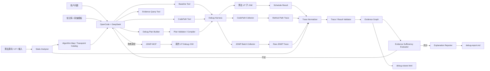

# Algorithm Debug Agent 完整架构与开发计划

- 文档状态：实施基线（已按工具单点验证校准）
- 版本：1.4
- 更新日期：2026-08-16
- 基线算法项目：`D:\javacode\hellomvn`
- 现有 JDWP 项目：`D:\mcpcode\mcp-jdwp-java`
- 产品定位：半导体设备晶圆调度算法的离线问题定位 Agent
- 核心约束：不修改被分析的算法源码，不接生产在线控制系统

## 1. 文档目的

本文档统一描述 Algorithm Debug Agent 的：

- 目标使用场景；
- 产品边界；
- 总体架构；
- CodePathTracer、JUnit Platform Launcher、JDI、JDWP 与 JDWP-MCP 的关系；
- 零源码侵入式动态数据采集方法；
- Debug Harness 与 JDWP Collector 的实现方式；
- 静态分析、动态 Trace、甘特图和输入字段的证据关联方法；
- 基于 OpenCode + DeepSeek 的 Agent 开发流程；
- Agent State、RAG、Evidence Sufficiency Evaluator 和 Agent Evaluation；
- 数据协议、运行产物和目录规范；
- 分阶段开发计划、验收标准、风险和测试策略。

本文档是后续实现的主设计基线。早期文档中提出的“在算法内部增加 Domain Trace Sink”不再作为主方案；真实算法和当前 Demo 均优先采用外部、零源码侵入的数据采集方式。

Case 与多轮协作模型已由 `ADR-006-case-as-analysis-dossier.md` 和
`../designs/2026-08-12-case-context-run-outcome-multiturn-analysis-design.md` 修订：Case 是一个用户问题的
分析档案；源码、输入或 UT 内容变化在同一 Case 内追加 Context Snapshot；Run、Analysis、Artifact 和
Evidence 按 `contextId` 作用域追加保存。本文中更早的复杂 Case State、Inquiry/Turn 或代码变化拆分
Revision Case 描述不再作为实施依据。

OpenCode 接入进一步由上述详细设计收敛：当前不实现 Algorithm Debug MCP Server；OpenCode 通过仓库内
Skill 与薄 Custom Tool 调用 `ada` CLI。Agent 产品资产保存在本仓库，一次性适配安装只登记
外部路径；此后用户进入目标算法仓库直接运行 `opencode`。每次 UT 运行以“结构化摘要 + 原始 Artifact
引用”返回，Skill 指导大模型自主决定是否继续读取、运行或采集。

CodePathTracer 与 JDWP Collector 的当前已验证能力、产物Hash、限制和“已实现/待实现”边界统一以 [工具单点验证基线](tool-validation-baseline.md) 为准。本文描述目标架构；若示例Schema包含尚未落地字段，不得据此宣称工具已经支持。

当前实现边界：外部 Workspace 初始化、独立 Maven 算法模块登记、固定四层配置解析、Doctor 和有界
JSON CLI 已实现。Workspace 位于目标算法仓库之外，目标模块及其上层大型软件仓库保持只读。
Case/Context/Run/Analysis Repository、Input Analysis、OpenCode 安装器、CodePath/JDWP 编排、Evidence
和端到端 `/debug-case` 仍未实现；以下相关内容描述目标架构，不代表当前可调用能力。

## 2. 执行摘要

目标产品的最终使用体验是：

```text
用户给出一个可重复运行的算法 UT
  + 一份确定的算法输入 JSON
  + 一份调度结果 / 甘特图 JSON
  + 一个自然语言问题

Agent 自动：
  1. 运行并确认基准结果；
  2. 静态分析相关算法代码；
  3. 通过 CodePathTracer 获得实际方法调用路径；
  4. 根据问题和实际路径生成 JDWP 数据采集计划；
  5. 重新运行相同 UT，由 JDWP Collector 采集关键变量；
  6. 将动态数据规范化为领域证据；
  7. 将输入字段、代码位置、运行时变量和甘特图操作关联；
  8. 校验证据是否充分；
  9. 证据不足时自动制定下一轮聚焦采集计划；
  10. 生成可审计的代码级解释报告。
```

典型问题：

- 为什么 Wafer1 比 Wafer2 先进入 CH1？
- 为什么某个 Chamber 空闲但没有安排某片 Wafer？
- 为什么某个 Job 被延后？
- 哪个 Filter 或 Strategy 排除了候选？
- 哪个输入字段改变了排序或资源可用时间？
- 某个甘特图条目具体由哪段代码和哪些运行时变量产生？

系统不允许大模型猜测执行过程。大模型负责规划、查询和解释；算法运行、静态分析、动态采集、规范化和约束校验由确定性工具完成。

## 3. 核心设计结论

### 3.1 算法源码零侵入

被分析算法不增加：

```java
trace.emit(...);
collector.capture(...);
debugProbe(...);
```

算法项目不依赖 JDWP Collector API。Collector 运行在目标 UT JVM 外部，其工作方式等价于自动化 IntelliJ Debugger。

### 3.2 原始 UT 可以保持不变

目标 UT 通过 JUnit Platform Launcher 在子 JVM 中执行。CodePathTracer 由外部 Debug Runner 包裹测试运行；JDWP Collector 从父进程连接子 JVM。

### 3.3 CodePathTracer 与 JDWP 分轮执行

由于同一个确定性 UT 可以重复运行，优先使用：

```text
Run 0：无 Trace 基准运行
Run 1：CodePathTracer 方法路径运行
Run 2：JDWP 关键状态运行
Run 3+：按需聚焦运行或 JDWP-MCP 交互式深挖
```

不同采集技术无需同时压在一次运行上。每轮结果必须与基准结果的语义 Hash 一致。

### 3.4 JDI 不替代 JDWP

概念层次：

```text
JDWP：调试器与目标 JVM 之间的底层通信协议
JDI：JDK 提供的 Java 调试 API，底层通过 JDWP 通信
JDWP Collector：使用 JDI/JDWP 批量采集运行时事实
JDWP-MCP：使用 JDI/JDWP 提供大模型交互式调试工具
JUnit Platform Launcher：程序化选择和运行 JUnit，不负责调试
```

现有 `mcp-jdwp-java` 本身已经是 JDI Client，且第一阶段共享 Core 抽取已经完成：`jdwp-core`供`jdwp-batch-collector`使用，`jdwp-mcp-server`保留交互式适配器。Agent 只复用版本锁定的 Collector/Core，不复制 JDI 实现。

### 3.5 第一阶段不需要 LangChain

OpenCode 已承担：

- 会话入口；
- DeepSeek 模型调用；
- Agent Prompt；
- 自定义 Agent；
- 自定义工具；
- MCP；
- 工具权限；
- 自定义命令。

第一阶段缺少的是确定性调试和分析工具，而不是第二套 Agent Runtime。Agent State、RAG、Evidence Evaluator 和 Evaluation 作为本地工具与文件协议实现，再通过 OpenCode 调用。

## 4. 名词与组件关系

| 名词 | 定义 | 是否修改算法 |
|---|---|---:|
| Algorithm UT | 读取固定输入并生成调度结果的原始 JUnit | 否 |
| JUnit Platform Launcher | 外部程序选择并执行指定 JUnit 的 API | 否 |
| CodePathTracer | 基于字节码增强的方法进入/退出路径采集器 | 否 |
| JDWP | JVM 调试通信协议 | 否 |
| JDI | JDK 的高层 Java 调试 API | 否 |
| JDWP Collector | 按计划自动设置断点、读取变量并写 JSONL 的独立程序 | 否 |
| JDWP-MCP | 面向大模型交互式调试的 MCP Adapter | 否 |
| Debug Harness | 编排基准、路径、JDWP 多轮运行的父进程 | 否 |
| Static Analyzer | 提取调用链、策略、变量、源码位置和 Tracepoint Catalog | 否 |
| Trace Normalizer | 把 JVM 原始事实转换成调度领域事件 | 否 |
| Trace Validator | 校验 Trace 完整性、调度约束和结果一致性 | 否 |
| Evidence Graph | 关联输入、代码、运行时事实、甘特图和结论的证据图 | 否 |
| Algorithm Debug Agent | 根据问题规划工具调用、评估证据并生成解释 | 否 |

## 5. 目标使用场景

### 5.1 用户输入

用户通过 OpenCode 会话输入：

```text
目标 UT：
org.example.scheduler.wafer.SimpleWaferSchedulerTest
#parallelModeAllowsJobsToAlternateOnSharedChamber

问题：
为什么 A-W1、B-W1、A-W2、B-W2 是现在这个进腔顺序？
为什么不是 A-W1、A-W2、B-W1、B-W2？
```

### 5.2 Agent 期望输出

Agent 的回答必须包含：

1. 甘特图现象；
2. 实际方法调用路径；
3. 关键运行时变量；
4. 导致结果的代码分支或 Comparator；
5. 相关输入字段；
6. Evidence ID 和代码位置；
7. 已确认事实、确定性推导和仍未确认假设。

示例：

```text
结论：
A-W1 在 B-W1 之前进入 CH1，首先由 orderedWafers 的排序结果决定，
随后被“整片 wafer 一次性排完”的主循环行为进一步放大。

动态证据：
E12: orderedWafers = [A-W1, B-W1, A-W2, B-W2]
E18: B-W1.waferReadyAt = 0
E18: B-W1.resourcesReadyAt = 8
E18: B-W1.start = 8

静态证据：
SimpleWaferScheduler.schedule() 按 orderedWafers 逐片调用 scheduleWafer()。
scheduleWafer() 返回前提交该 wafer 的完整操作链并更新 robotAvailableAt。

输入证据：
JOB-A.jobStartOrder = 1
JOB-B.jobStartOrder = 2
```

## 6. 产品目标与非目标

### 6.1 产品目标

- 支持指定一个 Maven/JUnit 算法 UT；
- 支持固定输入的多轮可重复运行；
- 自动保存调度结果和语义 Hash；
- 生成实际方法调用路径；
- 根据问题生成不同的动态采集计划；
- 无源码侵入地读取局部变量、对象字段和资源状态；
- 将 Raw Trace 规范化成调度领域事件；
- 将 Gantt operation 回溯到输入、代码和运行时状态；
- 证据不足时主动发起下一轮聚焦采集；
- 生成代码级、可审计的问题解释；
- 支持最后通过 JDWP-MCP 深入某个策略或规则。

### 6.2 非目标

- 不接生产在线设备；
- 不控制 PLC、MES、Robot 或 Chamber；
- 不让大模型修改生产调度结果；
- 不要求真实算法增加日志或 Trace Hook；
- 不把 JDWP-MCP 改造成调度业务引擎；
- 不用自然语言判断替代确定性约束校验；
- 第一阶段不建设多用户 Web 平台；
- 第一阶段不引入数据库、Kafka、Redis 或向量数据库；
- 第一阶段不要求一次运行采集所有数据。

## 7. 当前 Demo 基线

当前项目已经具备：

- Java 21、Maven、JUnit 5、Jackson；
- Job、Sequence、Wafer、Chamber、Load Port、Robot 模型；
- PICK、PLACE、RECIPE 操作；
- SERIAL/PARALLEL 模式；
- 基础防超车；
- Running Recipe 重调度；
- 多 Job、多 Wafer、五 Chamber Case；
- schedule-result.json；
- Gantt HTML Viewer；
- 可重复执行的 UT。

截至2026-08-10还完成了两条零侵入单点验证：

- 外部JUnit CodePath Launcher运行原始复杂UT，采集41,436条方法进入/退出事件，目标POM和原始UT无CodePath依赖；
- JDWP Batch Collector在`scheduleWafer():120`命中165次，采集stack/locals/this/object，UT通过且Gantt SHA-256保持不变。

这些验证只证明工具链可用，不代表Agent中的Harness、Plan Compiler、Normalizer、Evidence和易用CLI已经实现。

当前算法限制：

- 调度主循环仍接近“整片 wafer 路径排完后再处理下一片”；
- 没有显式 candidate/filter/score/select 模型；
- 没有保留未选候选和过滤原因；
- 现有并行模式不是完整的多 wafer、多 Chamber 流水调度；
- 甘特图只表示结果，不表示完整决策过程。

这些限制不会阻止 Agent MVP。MVP 先解释当前算法真实执行行为，而不是假设算法已经存在候选决策模型。

## 8. 总体架构



## 9. 一次问题分析的完整生命周期

### 9.1 Step 1：建立问题 Case

生成：

```text
runs/{caseId}/question.json
runs/{caseId}/agent-state.json
```

`question.json`：

```json
{
  "caseId": "CASE-WAFER-ORDER-001",
  "targetTest": {
    "className": "org.example.scheduler.wafer.SimpleWaferSchedulerTest",
    "methodName": "parallelModeAllowsJobsToAlternateOnSharedChamber"
  },
  "question": "为什么A-W1比B-W1先进入CH1？",
  "focus": {
    "waferIds": ["A-W1", "B-W1"],
    "resourceIds": ["CH1", "EQP-1-ROBOT"]
  }
}
```

### 9.2 Step 2：基准运行

不启用 CodePathTracer 和 JDWP：

```text
Run 0
  -> 执行原始 UT
  -> 保存 schedule-result.json
  -> 保存 test-result.json
  -> 计算 result-semantic-hash.txt
```

语义 Hash 计算前必须：

- operation 按稳定字段排序；
- Map 和资源列表排序；
- 排除 capturedAt、runId 等非业务字段；
- 使用规范化 JSON。

稳定阈值必须可配置。Phase 0 Reference Demo 使用两次以缩短集成测试时间，真实大型算法建议同一 UT
连续运行三次或更多。每次结果先保存为不可变 Run；相同 `CaseFingerprint` 下语义哈希不一致时标记
`BASELINE_UNSTABLE`，不能通过自动新建 Case 隐藏非确定性。

动态结果文件不按“目录最新文件”猜测。Adapter 只返回 `ScheduleResultSource`，Harness 在 UT 运行前后
执行目录快照差分，再用业务 Parser 验证本次新增或修改的唯一候选。

### 9.3 Step 3：静态分析

静态分析输出：

```text
static-analysis/call-chain.json
static-analysis/strategy-catalog.json
static-analysis/tracepoint-catalog.json
static-analysis/relevant-code.json
static-analysis/input-provenance.json
```

分析内容：

- UT 到算法入口的调用链；
- Strategy、Rule、Filter、Scorer、Selector、Dispatcher；
- Comparator 和排序字段；
- 循环、if/switch 和关键分支；
- 候选集合；
- 资源状态 Map；
- 调度操作创建位置；
- 操作提交和资源更新时间；
- 局部变量作用域；
- 输入模型字段到算法变量的映射。

### 9.4 Step 4：方法路径运行

CodePathTracer 只采相关包和方法：

```text
Run 1
  -> 外部 Debug Runner 包裹 JUnit Platform Launcher
  -> 执行原始 UT
  -> 输出 method-path-trace.jsonl
  -> 再次生成 schedule-result.json
  -> 校验结果 Hash 等于 Run 0
```

CodePathTracer 用于确认实际执行路径，不用于完整读取方法内部局部变量。

### 9.5 Step 5：生成 JDWP 计划

大模型结合：

- 用户问题；
- 领域知识；
- 静态调用链；
- 实际方法路径；
- 甘特图异常位置；
- Tracepoint Catalog；

生成语义 `debug-plan.json`。

计划经过确定性 Plan Validator / Compiler：

- 校验目标 UT；
- 校验类和方法；
- 将 sourceAnchor 解析成行号；
- 校验源码 Hash 和 class Hash；
- 校验局部变量作用域；
- 限制采集深度和大小；
- 禁止有副作用的任意表达式；
- 输出 `compiled-debug-plan.json`。

### 9.6 Step 6：JDWP 动态状态运行

```text
Run 2
  -> Harness 启动 UT 子 JVM，JDWP suspend=y
  -> Collector 连接子 JVM
  -> 安装全部采集点
  -> 恢复 JVM
  -> 命中后采集局部变量和对象字段
  -> 持续写 raw-jdwp-trace.jsonl
  -> UT 结束
  -> 校验结果 Hash 等于 Run 0
```

### 9.7 Step 7：规范化与证据关联

```text
schedule-result.json
method-path-trace.jsonl
raw-jdwp-trace.jsonl
static-analysis.json
input JSON
        ↓
Trace Normalizer
        ↓
normalized-trace.json
evidence-graph.json
```

### 9.8 Step 8：证据充分性判断

至少检查：

- 是否确认甘特图现象；
- 是否有实际执行路径；
- 是否有关键运行时变量；
- 是否定位决策代码；
- 是否关联输入字段；
- 是否存在其他未排除解释；
- Trace 是否完整；
- 多轮运行是否产生相同结果。

证据不足时更新 Agent State，并进入下一轮采集。

### 9.9 Step 9：报告或交互式深挖

证据充分则生成报告。

如果只知道某个 Filter 返回 false，但不知道内部原因：

```text
启动新的相同 UT Debug JVM
  -> JDWP-MCP attach
  -> 在具体策略内部设置条件断点
  -> 读取阈值、输入和返回条件
  -> 补充 Evidence Graph
```

Batch Collector 和 JDWP-MCP 不同时连接同一个 JVM。

## 10. Debug Harness 设计

### 10.1 定位

Debug Harness 是调试运行编排器，不是调试协议实现。

职责：

- 解析目标项目和目标 UT；
- 构建测试 classpath；
- 启动父子 JVM；
- 分配 JDWP 端口；
- 启用或禁用 CodePathTracer；
- 启动 JDWP Collector；
- 监控超时和退出码；
- 收集测试结果和调度结果；
- 生成运行清单；
- 对比基准语义 Hash。

### 10.2 进程模型

```text
父 JVM：
  Debug Harness
  JDWP Collector
  文件写入
  超时控制

子 JVM：
  JUnit Platform Launcher
  原始 UT
  原始算法
  可选 CodePathTracer
  JDWP Debug Agent
```

### 10.3 推荐 CLI

```powershell
java -jar algorithm-debug-cli.jar baseline `
  --project D:\javacode\hellomvn `
  --test "org.example.scheduler.wafer.SimpleWaferSchedulerTest#parallelModeAllowsJobsToAlternateOnSharedChamber" `
  --output runs\CASE-001\run-00-baseline
```

```powershell
java -jar algorithm-debug-cli.jar collect-path `
  --project D:\javacode\hellomvn `
  --test "org.example.scheduler.wafer.SimpleWaferSchedulerTest#parallelModeAllowsJobsToAlternateOnSharedChamber" `
  --plan runs\CASE-001\path-plan.json `
  --output runs\CASE-001\run-01-path
```

```powershell
java -jar algorithm-debug-cli.jar collect-jdwp `
  --project D:\javacode\hellomvn `
  --test "org.example.scheduler.wafer.SimpleWaferSchedulerTest#parallelModeAllowsJobsToAlternateOnSharedChamber" `
  --plan runs\CASE-001\compiled-debug-plan.json `
  --output runs\CASE-001\run-02-jdwp
```

### 10.4 JUnit Platform Launcher

Launcher 负责：

- 按类名和方法名选择 UT；
- 执行 JUnit TestEngine；
- 收集 TestExecutionSummary；
- 返回通过、失败、跳过和异常。

它不是 JDK 组件，需要引入：

```xml
<dependency>
  <groupId>org.junit.platform</groupId>
  <artifactId>junit-platform-launcher</artifactId>
</dependency>
```

## 11. CodePathTracer 设计

### 11.1 作用

CodePathTracer 回答：

```text
这次 UT 实际执行了哪些方法？
具体策略实现类是什么？
调用层级和进入顺序是什么？
```

当前已验证的开源版本稳定提供方法进入/退出、调用深度、线程、类名和方法名。参数/返回值摘要不是本次验证基线，若未来需要应先做独立能力验证；运行时业务值仍由JDWP Collector采集。

### 11.2 接入原则

- 不修改算法源码；
- 不修改原始 UT；
- 由 Debug Runner 包裹 JUnit Platform Launcher；
- 通过包、类和方法过滤限制事件；
- 输出结构化 JSONL，不解析箭头文本；
- 当前MVP不采参数和返回值对象；
- 禁止通过无界`toString()`扩展CodePath事件。

### 11.3 Path Plan

下面是Agent目标契约，不是当前CodePathTracer原生支持的配置文件。现有原型只接受`--test/--include/--trace`；正式`method-path-codepathtracer`模块必须实现`--plan`读取、Schema校验、exclude、预算、流式写盘和Manifest。

```json
{
  "planVersion": "1.0",
  "includePackages": ["org.example.scheduler.wafer"],
  "includeMethodPatterns": [
    "schedule",
    "scheduleWafer",
    "sort",
    "compare",
    "filter",
    "score",
    "select",
    "requiredResources",
    "operation"
  ],
  "excludeClassPatterns": [
    "*JsonWriter",
    "*InputReader"
  ],
  "limits": {
    "maxEvents": 10000,
    "maxValueLength": 1000,
    "maxArgumentItems": 10
  }
}
```

### 11.4 Path Event

```json
{
  "schemaVersion": "1.0",
  "runId": "RUN-01",
  "eventId": 12,
  "eventType": "METHOD_ENTER",
  "depth": 1,
  "threadName": "main",
  "className": "org.example.scheduler.wafer.SimpleWaferScheduler",
  "methodName": "scheduleWafer",
  "argumentSummary": {
    "jobId": "JOB-A",
    "waferId": "A-W1"
  }
}
```

## 12. JDWP Collector 设计

### 12.1 定位

JDWP Collector 是运行在算法 JVM 外部的批量自动化调试器。

它不：

- 理解自然语言问题；
- 进行静态分析；
- 判断调度正确性；
- 调用大模型；
- 修改算法源码；
- 生成最终根因结论。

它只：

- 读取编译后的采集计划；
- 连接目标 JVM；
- 安装采集点；
- 命中后读取状态；
- 持续写 Raw Trace；
- 恢复线程；
- 记录完整性和错误。

### 12.2 与现有 JDWP-MCP 的关系

重构前的MCP Server已经包含：

- `JDIConnectionService`；
- `JdiEventListener`；
- `BreakpointTracker`；
- ClassPrepare；
- 局部变量读取；
- 对象字段读取；
- 线程暂停和恢复；
- VMDeath 处理。

第一阶段重构后实际结构为：

```text
mcp-jdwp-java/
├── jdwp-core
│   ├── JdwpEndpoint
│   ├── JdiSocketAttacher
│   ├── SnapshotLimits
│   ├── JdiValueSnapshotter
│   └── FrameSnapshotter
├── jdwp-batch-collector
│   ├── CollectorMain
│   ├── DebugPlan
│   ├── TracePlanExecutor
│   └── JsonlTraceWriter
└── jdwp-mcp-server
    └── MCP Adapter
```

Collector MVP已经完成并通过真实晶圆UT验证。尚未完成的是字段路径投影、局部变量白名单、采样、异步有界Writer、完整硬预算和性能Manifest；这些属于P0加固，不得与MVP现有能力混淆。

### 12.3 启动方式

Harness 启动目标 UT：

```text
-agentlib:jdwp=transport=dt_socket,server=y,suspend=y,address=127.0.0.1:<port>
```

Collector：

```text
attach port
  -> 安装 ClassPrepareRequest / BreakpointRequest
  -> vm.resume()
  -> EventQueue 循环
  -> JSONL 写入
```

### 12.4 JDI 核心流程

```java
VirtualMachineManager manager =
        Bootstrap.virtualMachineManager();

AttachingConnector connector =
        findSocketAttachConnector(manager);

VirtualMachine vm = connector.attach(arguments);
EventQueue queue = vm.eventQueue();

installTracepoints(vm, plan);
vm.resume();

while (running) {
    EventSet eventSet = queue.remove();
    try {
        for (Event event : eventSet) {
            handle(event);
        }
    } finally {
        eventSet.resume();
    }
}
```

必须在任何错误路径上恢复 `EventSet`，避免 UT 永久暂停。

### 12.5 延迟断点

算法类尚未加载时：

1. 创建 `ClassPrepareRequest`；
2. 过滤目标类；
3. 收到 `ClassPrepareEvent`；
4. 根据编译计划定位 Method/Location；
5. 创建真正的 `BreakpointRequest`；
6. 注册 tracepointId；
7. 启用断点。

### 12.6 Suspend Policy

默认使用：

```text
SUSPEND_EVENT_THREAD
```

仅暂停命中事件的线程。只有必须读取跨线程一致性状态时才允许 `SUSPEND_ALL`，并需要计划显式批准。

### 12.7 变量采集

命中断点后：

```text
BreakpointEvent
  -> ThreadReference
  -> StackFrame frame 0
  -> visibleVariables()
  -> getValues()
  -> 直接遍历 ObjectReference fields
```

默认禁止：

- 调用任意业务方法；
- 调用未知 `toString()`；
- 修改字段；
- 修改局部变量；
- 任意表达式执行。

private record 通过底层字段读取，不依赖表达式编译器。

### 12.8 快照限制

```json
{
  "maxObjectDepth": 3,
  "maxCollectionItems": 20,
  "maxMapEntries": 20,
  "maxFields": 30,
  "maxStringLength": 2000,
  "maxEventBytes": 1048576,
  "maxTraceBytes": 52428800,
  "maxEvents": 10000
}
```

大集合优先采：

- size；
- selected；
- topN；
- score breakdown；
- reasonMap；
- resource summary；
- 指定 waferId/jobId/resourceId。

### 12.9 为什么必须直接写 JSONL

现有 MCP `get_events` 只适合近期事件查询，不适合全量批处理。复杂 Demo 已经可以产生超过 100 个操作。

Collector 必须在事件发生时直接写：

```text
raw-jdwp-trace.jsonl
```

优点：

- 不受查询条数限制；
- JVM 异常退出也保留已写事件；
- 支持大 Trace；
- 支持增量解析；
- 支持按 eventId 查询。

### 12.10 Raw Event Schema

```json
{
  "schemaVersion": "1.0",
  "runId": "RUN-02",
  "eventId": 18,
  "tracepointId": "TP-START-CALCULATED",
  "eventKind": "BREAKPOINT_SNAPSHOT",
  "thread": {
    "id": 1,
    "name": "main"
  },
  "location": {
    "className": "org.example.scheduler.wafer.SimpleWaferScheduler",
    "methodName": "scheduleWafer",
    "lineNumber": 133
  },
  "values": {
    "jobId": "JOB-B",
    "waferId": "B-W1",
    "operationType": "PICK",
    "requiredResources": ["EQP-1-ROBOT", "LP2"],
    "readyAt": 0,
    "resourcesReadyAt": 8,
    "start": 8
  },
  "captureStatus": "SUCCESS",
  "truncated": false
}
```

### 12.11 Collection Manifest

```json
{
  "runId": "RUN-02",
  "planId": "WHY-W1-BEFORE-B1",
  "testStatus": "PASSED",
  "vmDeathObserved": true,
  "requestedTracepoints": 3,
  "installedTracepoints": 3,
  "capturedEvents": 42,
  "captureErrors": 0,
  "droppedEvents": 0,
  "truncatedSnapshots": 0,
  "outputSemanticHashMatchesBaseline": true
}
```

## 13. Debug Plan 设计

### 13.1 大模型只生成声明式计划

不允许大模型直接提交任意 Java 表达式。

大模型输出：

```json
{
  "semanticPoint": "OPERATION_START_CALCULATED",
  "focus": {
    "waferIds": ["A-W1", "B-W1"]
  },
  "captureFields": [
    "waferId",
    "operationType",
    "requiredResources",
    "waferReadyAt",
    "resourceReadyAt",
    "start"
  ]
}
```

Plan Compiler 从 Tracepoint Catalog 中解析为 JDI 可执行计划。

### 13.2 Source Anchor

不长期依赖绝对行号。

语义位置：

```json
{
  "className": "org.example.scheduler.wafer.SimpleWaferScheduler",
  "methodName": "scheduleWafer",
  "sourceAnchor": "int start = Math.max(readyAt, resourcesReadyAt)"
}
```

编译后：

```json
{
  "resolvedLineNumber": 133,
  "methodDescriptor": "(...)V",
  "sourceHash": "sha256:...",
  "classHash": "sha256:..."
}
```

源码或 class 不匹配时拒绝采集。

### 13.3 计划安全规则

- UT 白名单；
- 项目路径白名单；
- 类包白名单；
- 只读捕获；
- 字段路径白名单；
- 对象深度限制；
- 集合大小限制；
- 超时；
- 最大事件数；
- 最大文件大小；
- 禁止非本机 JDWP；
- 禁止连接生产 JVM；
- 默认只允许 `127.0.0.1`。

## 14. Static Analyzer 设计

### 14.1 技术选型

第一版：

- JavaParser；
- JavaParser Symbol Solver。

后期补充：

- ASM；
- class Hash；
- LocalVariableTable；
- method descriptor；
- 无源码场景的字节码分析。

### 14.2 Algorithm Map

```json
{
  "entrypoints": ["SimpleWaferScheduler.schedule"],
  "callEdges": [],
  "strategies": [],
  "comparators": [],
  "candidateCollections": [],
  "resourceStateVariables": [],
  "commitLocations": [],
  "inputFieldMappings": []
}
```

### 14.3 Tracepoint Catalog

Catalog 是大模型计划和实际源码之间的安全桥梁：

```json
{
  "tracepointId": "OPERATION_START_CALCULATED",
  "className": "org.example.scheduler.wafer.SimpleWaferScheduler",
  "methodName": "scheduleWafer",
  "sourceAnchor": "int start = Math.max(readyAt, resourcesReadyAt)",
  "availableLocals": [
    "context",
    "planned",
    "requiredResources",
    "readyAt",
    "resourcesReadyAt",
    "start"
  ],
  "recommendedCaptures": [
    "context.job.jobId",
    "context.wafer.waferId",
    "planned.operationType",
    "requiredResources",
    "readyAt",
    "resourcesReadyAt",
    "start"
  ]
}
```

## 15. Trace Normalizer 与 Derived Domain Trace

### 15.1 定义

本系统不要求算法主动产生 Domain Trace。

```text
Raw JVM Trace
  + Method Path
  + Static Mapping
  + Schedule Result
        ↓
确定性 Normalizer
        ↓
Derived Domain Trace
```

### 15.2 事件可信度

每个事实标记：

- `OBSERVED`：运行时直接观察；
- `CODE_DERIVED`：根据明确代码和观察值确定性推导；
- `VALIDATOR_CONFIRMED`：由校验规则确认；
- `MODEL_INFERRED`：大模型推断；
- `UNKNOWN`：证据不足。

模型推断不能覆盖观察事实。

### 15.3 Normalized Event

```json
{
  "eventType": "operation_start_calculated",
  "jobId": "JOB-B",
  "waferId": "B-W1",
  "operationType": "PICK",
  "requiredResources": ["EQP-1-ROBOT", "LP2"],
  "waferReadyAt": 0,
  "resourceReadyAt": 8,
  "calculatedStart": 8,
  "derivedDelayReason": "RESOURCE_NOT_READY",
  "confidence": "CODE_DERIVED",
  "provenance": {
    "rawEventId": 18,
    "tracepointId": "TP-START-CALCULATED",
    "sourceLine": 133
  }
}
```

## 16. Trace Validator

Validator 不调用大模型。

### 16.1 采集完整性

- 所有请求采集点是否安装；
- VMDeath 是否正常观察；
- eventId 是否连续；
- captureErrors 是否为 0；
- Trace 是否截断；
- UT 是否通过；
- 调试运行结果 Hash 是否与基准一致。

### 16.2 调度结果一致性

- 同一 wafer 操作不重叠；
- Robot 不同时执行多个动作；
- Chamber 不同时处理多片 wafer；
- PICK/PLACE 同时占用正确的 Robot 与端点资源；
- wafer 位置连续；
- Sequence step 顺序正确；
- SERIAL 模式 Chamber owner 合法；
- 同 Job 防超车合法；
- Running Job 与快照一致；
- Trace 的 committed operation 与甘特图一致。

### 16.3 Finding Schema

```json
{
  "findingId": "FINDING-001",
  "severity": "ERROR",
  "ruleId": "ROBOT_OVERLAP",
  "message": "Robot has overlapping operations",
  "operationIds": ["OP-12", "OP-13"],
  "evidenceIds": ["EVENT-18", "EVENT-19"],
  "codeLocations": []
}
```

## 17. Evidence Graph

### 17.1 节点

- Question；
- InputField；
- Job；
- Wafer；
- SequenceStep；
- Resource；
- ScheduleOperation；
- Method；
- CodeLocation；
- RuntimeEvent；
- ValidatorFinding；
- Hypothesis；
- Conclusion。

### 17.2 边

- `INPUT_INFLUENCES_DECISION`；
- `METHOD_CALCULATES_VALUE`；
- `EVENT_OBSERVES_VALUE`；
- `DECISION_COMMITS_OPERATION`；
- `OPERATION_APPEARS_ON_GANTT`；
- `FINDING_REFERENCES_EVENT`；
- `CONCLUSION_SUPPORTED_BY`；
- `HYPOTHESIS_MISSING_EVIDENCE`。

第一版使用 JSON，不需要图数据库。

## 18. Algorithm Debug Agent 设计

### 18.1 Agent 与固定流水线的区别

固定流水线每次都执行相同步骤。

Agent 根据问题和观察结果动态决定：

- 是否需要 CodePath；
- 是否已有足够静态证据；
- 应该采哪个变量；
- 是否需要第二轮 JDWP；
- 是否需要进入某个 Strategy；
- 是否已经足以回答。

### 18.2 Agent Loop

```text
Question
  -> Observe
  -> Plan
  -> Act / Tool Call
  -> Collect Evidence
  -> Evaluate Evidence
      -> 不足：Replan
      -> 充分：Answer
```

### 18.3 Agent State

```json
{
  "caseId": "CASE-WAFER-ORDER-001",
  "question": "为什么A-W1比B-W1先进入CH1？",
  "targetTest": {
    "className": "SimpleWaferSchedulerTest",
    "methodName": "parallelModeAllowsJobsToAlternateOnSharedChamber"
  },
  "phase": "COLLECTING_RUNTIME_EVIDENCE",
  "iteration": 2,
  "baselineSemanticHash": "sha256:...",
  "observedFacts": [
    {
      "factId": "FACT-001",
      "statement": "orderedWafers中A-W1排在B-W1之前",
      "evidenceIds": ["JDWP-EVENT-12"]
    }
  ],
  "hypotheses": [
    {
      "hypothesisId": "H-001",
      "statement": "jobStartOrder决定初始顺序",
      "status": "PARTIALLY_SUPPORTED"
    }
  ],
  "missingEvidence": [
    "Comparator使用的真实字段",
    "B-W1调度时robotAvailableAt"
  ],
  "nextAction": {
    "tool": "collect_jdwp",
    "planFile": "plans/iteration-03.json"
  },
  "status": "IN_PROGRESS"
}
```

State 保存到文件，不依赖聊天上下文。

### 18.4 高层工具

Agent 优先使用高层工具：

- `locate_algorithm_test`；
- `run_baseline`；
- `profile_case`；
- `analyze_static_callchain`；
- `collect_method_path`；
- `build_debug_plan`；
- `collect_jdwp_state`；
- `normalize_trace`；
- `query_evidence`；
- `validate_evidence`；
- `search_scheduling_knowledge`；
- `interactive_debug`；
- `render_debug_report`。

低层 JDWP MCP 工具仅用于最后聚焦调试。

### 18.5 Planner、Critic、Reporter

第一版可以由一个 DeepSeek 模型使用三套 Prompt：

- Planner：问题分类、工具选择、计划生成；
- Evidence Critic：检查证据是否充分、是否存在无依据结论；
- Reporter：基于 Evidence Bundle 生成解释。

后期再拆为多个 OpenCode Agent。

## 19. Evidence Sufficiency Evaluator

### 19.1 确定性层

Java Evaluator 检查：

- 基准存在；
- 多轮 Hash 一致；
- 调用路径存在；
- 运行时变量存在；
- 代码位置存在；
- 输入字段来源存在；
- Trace 完整；
- Validator 通过或有明确 Finding。

### 19.2 LLM Critic 层

Critic 判断：

- 证据是否真正支持结论；
- 是否遗漏其他解释；
- 是否把相关性误写成因果；
- 是否把 `MODEL_INFERRED` 写成 `OBSERVED`；
- 下一次最小采集动作是什么。

### 19.3 Evaluator 输出

```json
{
  "sufficient": false,
  "coverage": {
    "schedulePhenomenon": true,
    "runtimePath": true,
    "runtimeVariables": true,
    "codeDecision": false,
    "inputProvenance": false
  },
  "missingEvidence": [
    "Comparator代码位置",
    "jobStartOrder输入字段来源"
  ],
  "recommendedNextAction": {
    "tool": "analyze_static_callchain",
    "focus": ["orderedWafers comparator", "jobStartOrder provenance"]
  }
}
```

### 19.4 停止条件

- 关键证据覆盖完整；
- Validator 没有未处理的完整性错误；
- 结论可以引用输入、代码和动态事件；
- 或达到最大采集轮数并明确报告不确定性。

建议默认：

```text
maxIterations = 5
maxJdwpRuns = 3
maxInteractiveDebugRuns = 1
```

## 20. RAG 与知识库

### 20.1 第一阶段

使用本地 Markdown、JSON 元数据、`rg`、BM25 或 SQLite FTS。

```text
knowledge/
├── equipment/
│   ├── resource-model.md
│   └── chamber-state.md
├── scheduling/
│   ├── serial-parallel-mode.md
│   ├── wafer-overtake.md
│   ├── sequence-routing.md
│   └── candidate-selection.md
├── trace-plans/
│   ├── chamber-entry-order.json
│   ├── resource-idle.json
│   ├── job-delay.json
│   └── reschedule.json
└── known-issues/
    └── whole-wafer-scheduling.md
```

### 20.2 RAG 的作用

RAG 不直接回答动态事实，而是帮助 Agent：

- 识别问题类型；
- 了解领域约束；
- 选择采集模板；
- 知道应关注哪些变量；
- 解释已确认事实。

### 20.3 后期升级条件

当出现数百份以上文档、多机型、多版本和大量历史案例时，再评估：

- Embedding；
- Vector DB；
- Hybrid Search；
- Reranker；
- 文档权限和版本。

LangChain 仍然只是可选集成层。

## 21. Agent Evaluation

### 21.1 Golden Questions

当前 Demo 建立：

1. 为什么 A-W1 比 B-W1 先进入 CH1？
2. 为什么某个 Chamber 在一段时间空闲？
3. SERIAL 模式为什么阻止后启动 Job 使用共享 Chamber？
4. 同 Job wafer 为什么没有超车？
5. Running Recipe 重调度时为什么 PICK 必须等待？
6. 为什么并行模式没有形成真正的多 wafer 流水？

### 21.2 Eval Case

```json
{
  "evaluationId": "EVAL-WAFER-ORDER-001",
  "targetTest": {
    "className": "SimpleWaferSchedulerTest",
    "methodName": "parallelModeAllowsJobsToAlternateOnSharedChamber"
  },
  "question": "为什么A-W1比B-W1先进入CH1？",
  "requiredFacts": [
    "orderedWafers中A-W1位于B-W1之前",
    "B-W1的resourcesReadyAt大于waferReadyAt",
    "scheduleWafer一次性处理完整wafer路径"
  ],
  "requiredEvidenceTypes": [
    "STATIC_CODE",
    "METHOD_PATH",
    "JDWP_SNAPSHOT",
    "SCHEDULE_RESULT"
  ],
  "forbiddenClaims": [
    "因为B-W1的recipe时间更长"
  ]
}
```

### 21.3 指标

- 结论正确率；
- 必要事实覆盖率；
- Evidence 引用正确率；
- 无依据结论数；
- 缺失证据识别率；
- 工具选择正确率；
- 采集计划成功率；
- JDWP 采集轮数；
- 调试运行结果一致率；
- 延迟和 Token 成本。

## 22. OpenCode 集成

### 22.1 目录

```text
skills/algorithm-debug/
├── SKILL.md
└── references/

integrations/opencode/
├── agents/algorithm-debug.md
├── commands/debug-case.md
├── commands/resume-debug-case.md
├── tools/algorithm-debug.ts
└── opencode-template.json
```

Skill 只有一份正式源码。`ada install opencode` 一次性登记 Agent 安装路径、Skill 来源和薄 Custom Tool；
日常使用是进入目标算法仓库直接运行 `opencode`。不把 Skill 复制到全局 Skill 目录或目标仓库。

### 22.2 工具实现

TypeScript 只做薄封装：

```text
OpenCode Custom Tool
  -> 参数 Schema 校验
  -> 从tool context取得当前directory/worktree
  -> 调用ada CLI
  -> 读取ToolResponse/RunOutcomeSummary
  -> 返回有界摘要和Artifact引用
```

不要把完整大型 Trace 或日志返回模型。模型先阅读本轮结构化摘要，需要时再通过 `query_evidence` 或
`artifact_read` 按 wafer、resource、eventType、timeRange 和 Artifact 引用查询有界切片。Custom Tool 不解释
异常或改变事实；具体根因由大模型结合 Skill、源码和 Evidence 分析。

### 22.3 Agent 权限

分析 Agent 推荐：

- 算法源码编辑：deny；
- 任意 bash：ask；
- `debug_*` 高层工具：allow；
- 访问生产路径：deny；
- JDWP 仅 localhost；
- 删除历史 run：ask。

### 22.4 最终命令

```text
/algorithm-debug
```

或：

```powershell
algorithm-debug analyze `
  --test "org.example.scheduler.wafer.SimpleWaferSchedulerTest#parallelModeAllowsJobsToAlternateOnSharedChamber" `
  --question "为什么A-W1比B-W1先进入CH1？"
```

## 23. 为什么第一阶段不使用 LangChain

当前 OpenCode 已经提供 Agent 和工具编排。引入 LangChain 会同时存在：

```text
OpenCode Agent Runtime
  -> LangChain Agent Runtime
      -> Java Debug Tools
```

会增加：

- 两套工具定义；
- 两套会话状态；
- 两套权限；
- 两套重试逻辑；
- 两套 Prompt；
- 更长的错误链。

以下场景再考虑 LangGraph/LangChain：

- 脱离 OpenCode 建设独立 Web/Backend；
- 多用户；
- 长任务 checkpoint；
- 分布式 Worker；
- 人工审批节点；
- 大规模 RAG；
- 独立模型路由。

即使后期引入，也建议使用明确状态图而非自由 Agent Loop。

## 24. 运行产物目录

```text
runs/
└── CASE-WAFER-ORDER-001/
    ├── question.json
    ├── agent-state.json
    ├── case-profile.json
    ├── static-analysis/
    │   ├── call-chain.json
    │   ├── strategy-catalog.json
    │   ├── tracepoint-catalog.json
    │   ├── relevant-code.json
    │   └── input-provenance.json
    ├── run-00-baseline/
    │   ├── schedule-result.json
    │   ├── test-result.json
    │   ├── run-manifest.json
    │   └── semantic-hash.txt
    ├── run-01-code-path/
    │   ├── path-plan.json
    │   ├── method-path-trace.jsonl
    │   ├── schedule-result.json
    │   ├── run-manifest.json
    │   └── semantic-hash.txt
    ├── run-02-jdwp/
    │   ├── debug-plan.json
    │   ├── compiled-debug-plan.json
    │   ├── raw-jdwp-trace.jsonl
    │   ├── collection-manifest.json
    │   ├── schedule-result.json
    │   └── semantic-hash.txt
    ├── normalized-trace.json
    ├── validation-findings.json
    ├── evidence-graph.json
    ├── evidence-sufficiency.json
    ├── debug-report.md
    └── debug-viewer.html
```

所有 Raw Artifact 保持不可变。Normalizer、Validator 和 Reporter 升级后可以重新处理，不需要重新运行 UT。

## 25. 代码组织建议

### 25.1 算法仓库

```text
D:\javacode\hellomvn
```

保持：

- 算法；
- UT；
- 输入 Case；
- 调度结果；
- Gantt Viewer；
- Agent 集成配置；
- Demo Golden Eval。

### 25.2 工具仓库

优先扩展：

```text
D:\mcpcode\mcp-jdwp-java
```

或者新建：

```text
D:\mcpcode\algorithm-debug-toolkit
```

推荐模块：

```text
algorithm-debug-toolkit/
├── algorithm-debug-model
├── debug-harness
├── codepath-collector
├── jdwp-collector-core
├── jdwp-batch-collector
├── static-analyzer
├── trace-normalizer
├── trace-validator
├── evidence-store
├── algorithm-debug-cli
└── opencode-integration
```

实施前需要把工具仓库作为可写 workspace 打开。

## 26. 分阶段开发计划

### Phase 0：文档和契约冻结

交付：

- 本文档；
- Question Schema；
- Run Manifest Schema；
- Semantic Hash 规则；
- Path Plan Schema；
- Debug Plan Schema；
- Raw JDWP Trace Schema；
- Evidence Schema。

验收：

- 所有产物有 `schemaVersion`；
- 明确零源码侵入；
- 不存在算法内 TraceSink 的实现依赖。

### Phase 1：Baseline Harness

交付：

- JUnit Platform Launcher Runner；
- 指定 class#method；
- 子 JVM 启动；
- stdout/stderr/退出码；
- schedule-result 复制；
- semantic hash；
- 三次重复运行检查。

验收：

- 当前 4 个主要 UT 均可通过 Harness 执行；
- 三次结果 Hash 一致；
- 原始 UT 和算法代码零修改。

### Phase 2：CodePathTracer Collector

状态：外部Launcher和Bundle单点验证已完成；Agent模块集成尚未开始。

交付：

- CodePathTracer 包装 Runner；
- package/method filter；
- JSONL formatter；
- 参数/返回值摘要；
- path manifest。

验收：

- 能显示 UT 到 `SimpleWaferScheduler` 的真实调用路径；
- Path 运行结果 Hash 等于基准；
- 不输出无界大对象。

### Phase 3：Static Analyzer

交付：

- JavaParser 调用链；
- Strategy Detector；
- Comparator/Loop/Resource Map 检测；
- Tracepoint Catalog；
- Source Anchor Resolver。

验收：

- 能定位当前 Scheduler 的入口、主循环、资源计算和操作提交位置；
- 能输出推荐采集变量。

### Phase 4：JDWP Collector MVP

状态：`mcp-jdwp-java`中的Core/Collector MVP与真实UT单点验证已完成；Agent侧`jdwp-collector-adapter`、动态端口、进程监管、计划编译和Hash自动校验尚未实现。

交付：

- 从现有 JDWP 项目抽取或复用 JDI Core；
- Attach；
- ClassPrepare；
- Line Breakpoint；
- EVENT_THREAD Suspend；
- 局部变量；
- primitive/String/enum；
- 普通对象和 record 字段；
- List/Map topN；
- JSONL Writer；
- VMDeath；
- Manifest。

验收：

- 不修改算法源码；
- 自动采集 `orderedWafers`；
- 自动采集 `readyAt/resourcesReadyAt/start`；
- 自动恢复并完成 UT；
- Trace 超过 100 条仍完整保存；
- 结果 Hash 等于基准。

### Phase 5：Plan Builder / Compiler

交付：

- 语义计划；
- Tracepoint Catalog 选择；
- Source Anchor 编译；
- source/class hash；
- 字段路径校验；
- 预算和权限；
- compiled plan。

验收：

- 大模型不能注入任意有副作用表达式；
- 代码变更导致 Anchor 不匹配时采集失败并明确报告。

### Phase 6：Normalizer、Validator、Evidence Graph

交付：

- Raw -> Normalized mapping；
- Gantt operation 对齐；
- 输入字段 provenance；
- 调度约束 Validator；
- Evidence Graph JSON；
- Evidence Query CLI。

验收：

- 一个 operation 可以回溯到运行时事件、代码位置和输入字段；
- Validator 能识别资源冲突和 Trace 不完整。

### Phase 7：OpenCode Agent MVP

交付：

- `.opencode/agents/algorithm-debug.md`；
- `/algorithm-debug`；
- 高层自定义工具；
- Agent State；
- Planner/Critic/Reporter Prompt；
- 最大迭代和停止条件。

验收：

- 用户只输入 UT 和问题即可完成至少两轮工具调用；
- Agent 根据 Evidence Sufficiency 决定是否重新采集；
- 结论包含 Evidence ID。

### Phase 8：知识库与计划模板

交付：

- 调度领域 Markdown；
- 问题分类；
- 采集模板；
- keyword/BM25/SQLite FTS；
- `search_scheduling_knowledge`。

验收：

- “进腔顺序”“资源空闲”“Job 延后”“超车”“重调度”映射到不同计划模板。

### Phase 9：Agent Evaluation

交付：

- Golden Questions；
- requiredFacts；
- forbiddenClaims；
- Evidence coverage scorer；
- Tool trajectory scorer；
- Eval Report。

验收：

- 能批量运行当前 Demo 的至少 5 个问题；
- 能检测无依据结论；
- 能比较 Prompt/模型版本效果。

### Phase 10：Viewer 与产品化

交付：

- Gantt + method path + runtime state；
- 点击 operation 查看证据；
- compare run；
- 历史 Case；
- 可选独立 Web/Backend。

## 27. 当前 Demo 的第一个端到端 MVP

### 27.1 问题

```text
为什么并行模式下 A-W1、B-W1、A-W2、B-W2 是这个顺序？
为什么没有形成真正的多 wafer 流水？
```

### 27.2 预期采集

CodePath：

- `schedule`；
- `scheduleWafer`；
- `buildPlan`；
- `requiredResources`；
- `operation`。

JDWP：

- `orderedWafers`；
- 当前 `context`；
- `planned`；
- `readyAt`；
- `resourcesReadyAt`；
- `start/end`；
- `resourceAvailableAt`；
- `chamberOccupant`。

静态：

- orderedWafers Comparator；
- 主循环；
- scheduleWafer 的整链操作循环；
- 资源更新时间。

### 27.3 验收报告

报告必须明确：

- 实际排序值；
- 实际方法调用顺序；
- Robot 和 CH1 的可用时间；
- 哪段代码导致整片 wafer 一次性排完；
- 为什么 PARALLEL 只实现 Job 交替而不是真实流水；
- 哪些结论是观察事实，哪些是代码推导。

## 28. 测试策略

### 28.1 Collector 单元测试

- mocked JDI；
- breakpoint registry；
- ClassPrepare promotion；
- Snapshot depth；
- List/Map truncation；
- VMDisconnect；
- `eventSet.resume()` 异常路径；
- JSONL Writer。

### 28.2 Forked JVM 集成测试

- 最小 Debuggee JVM；
- Attach；
- 行断点；
- 局部变量；
- record 字段；
- VMDeath；
- 超时；
- 采集超过 100 个事件。

### 28.3 Harness 集成测试

- JUnit 方法选择；
- 子 JVM classpath；
- CodePath 模式；
- JDWP 模式；
- 退出码；
- 结果复制；
- semantic hash。

### 28.4 Agent 测试

- 工具 Schema；
- 错误恢复；
- missingEvidence；
- 重新规划；
- 最大轮数；
- Evidence 引用；
- forbiddenClaims。

## 29. 风险与应对

| 风险 | 影响 | 应对 |
|---|---|---|
| class 无局部变量调试信息 | 无法读取 locals | 保留 `lines,vars,source`，否则退化到参数/字段 |
| 源码与 class 不一致 | 断点错位 | sourceHash/classHash/anchor 校验 |
| Tracepoint 太频繁 | UT 变慢 | 条件过滤、EVENT_THREAD、分轮采集 |
| 对象太大 | 暂停时间长、文件过大 | topN、白名单字段、深度和预算 |
| CodePath 事件过多 | 噪声和性能问题 | package/method filter |
| 多调试器同时连接 | Attach/暂停冲突 | Batch 和 MCP 使用不同 UT JVM |
| 调试改变并发时序 | 结果不可比 | 每轮 semantic hash；必要时标记不可靠 |
| LLM 生成危险表达式 | 改变算法状态 | 声明式计划，禁任意执行 |
| 模型过度推断 | 错误根因 | Evidence Critic、可信度类型、forbidden claims |
| 当前 Demo 缺少候选模型 | 无法解释不存在的候选 | 只解释真实代码，明确能力边界 |
| Agent 会话丢失 | 无法恢复 | 文件化 Agent State |
| 大 Trace 塞入上下文 | Token 爆炸 | Evidence Query，只返回切片 |

## 30. Definition of Done

一个问题被视为完成定位，需要：

1. 目标 UT 和输入明确；
2. 基准 UT 通过；
3. 多轮运行结果语义 Hash 一致；
4. CodePath 或等价实际路径存在；
5. 关键动态变量被观察；
6. 关键代码位置被定位；
7. 输入字段来源被关联；
8. Trace 完整性检查通过；
9. Validator 结果明确；
10. 结论引用 Evidence ID；
11. 报告区分 `OBSERVED/CODE_DERIVED/MODEL_INFERRED/UNKNOWN`；
12. 证据不足时明确说明并给出下一步；
13. 原始算法源码未为采集而修改；
14. 所有产物保存在独立 caseId/runId 中。

## 31. 关键架构决策

### ADR-001：算法源码零侵入

采集逻辑不进入算法源码。通过外部 Runner、ByteBuddy 方法路径和 JDI/JDWP 状态快照获取证据。

### ADR-002：父子 JVM 分离

Debug Harness/Collector 位于父 JVM，原始 UT 位于子 JVM，避免调试器暂停自身。

### ADR-003：多轮确定性采集

CodePath 和 JDWP 默认分轮运行，并以基准语义 Hash 校验行为未改变。

### ADR-004：Derived Domain Trace

领域 Trace 由 Raw Runtime Trace、静态映射和结果规范化得到，不要求算法主动发事件。

### ADR-005：共享 JDWP Core

Batch Collector 和 JDWP-MCP 共享 JDI/JDWP Core，分别服务自动采集和交互式深挖。

### ADR-006：大模型只生成声明式计划

Plan Compiler 决定真实代码位置和安全捕获动作。

### ADR-007：Validator 不调用 LLM

资源、顺序、一致性和完整性校验必须可重复。

### ADR-008：OpenCode 为第一阶段 Agent Runtime

不引入 LangChain。确定性工具通过 OpenCode Custom Tools 调用稳定 `ada` CLI 暴露；当前不实现
Algorithm Debug MCP Server，也不适配其他客户端。

### ADR-009：文件作为第一阶段持久化

Agent State、Trace、Evidence、Eval 均使用版本化文件，不使用数据库。

### ADR-010：MCP 是深挖层而非批量采集层

该历史决策只描述外部 JDWP-MCP 调试工具：完整批量 Trace 由 Collector 流式落盘，JDWP-MCP 仅保留为
可选人工疑难排查工具。它不表示 Algorithm Debug Agent 当前通过 MCP 接入 OpenCode。

## 32. 推荐立即启动的 Backlog

1. 将本文档设为主设计入口；
2. 定义 Run Manifest 和 Semantic Hash；
3. 实现可选择目标方法的 JUnit Platform Runner；
4. 实现 Baseline Harness；
5. 验证当前主要 UT 三次结果一致；
6. 将已验证CodePath Launcher迁入Agent模块，并补齐计划化、流式JSONL和Manifest；
7. 为当前 Scheduler 手工定义 3 个语义 Tracepoint；
8. 锁定并接入已抽取的`jdwp-core/jdwp-batch-collector`发行物；
9. 自动采集 `orderedWafers` 和操作时间变量；
10. 将已验证的`raw-trace.jsonl`接入Case Run目录并自动校验Manifest；
11. 将 Trace 与 `schedule-result.json` 对齐；
12. 生成第一份代码级 `debug-report.md`；
13. 冻结 RunOutcomeSummary、Artifact 引用和 Skill 协作契约；
14. 封装 OpenCode `run_test/collect_path/collect_jdwp/query_evidence` 薄 Custom Tool；
15. 实现幂等 `ada install opencode` 适配安装与直接 `opencode` 使用链路；
16. 建立第一个 Golden Evaluation。

## 33. 参考资料

- OpenCode Custom Tools：<https://opencode.ai/docs/custom-tools/>
- OpenCode Agents：<https://opencode.ai/docs/agents/>
- DeepSeek Tool Calls：<https://api-docs.deepseek.com/guides/tool_calls>
- JUnit Platform Launcher：<https://junit.org/junit5/docs/current/user-guide/>
- JDK 21 JDI：<https://docs.oracle.com/en/java/javase/21/docs/api/jdk.jdi/module-summary.html>
- Code Path Tracer：<https://github.com/takahirom/code-path-tracer>
- 现有 JDWP 架构：`D:\mcpcode\mcp-jdwp-java\docs\architecture.md`

## 34. 最终产品定义

```text
给我一个可复现的调度算法 UT、一次问题输入和一个甘特图现象，
系统将通过静态分析、实际方法路径、无源码侵入 JDWP 状态采集、
确定性校验和多轮 Agent 规划，解释这个现象在代码中是如何一步步形成的。
```
