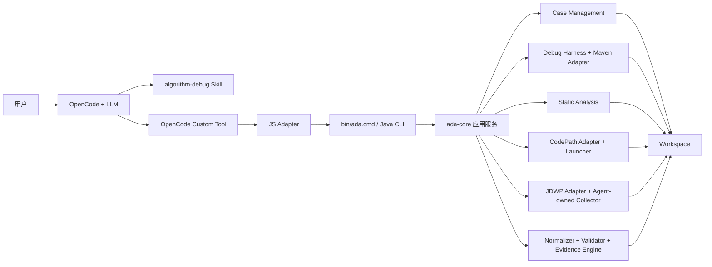

# Algorithm Debug Agent 模块详细设计

更新日期：2026-09-01。

## 1. 运行时边界

OpenCode 是唯一对话运行时。Java CLI 是被 Tool 调用的确定性后端，不是独立对话 Agent。CodePath Launcher 与 JDWP Collector 编译为 JAR，是因为它们需要在目标测试 JVM 或独立 Collector JVM 中运行，而不是在 OpenCode 的 Node 进程中直接执行源码。

## 2. Maven 模块职责

| 模块 | 职责 | 主要依赖方向 |
| --- | --- | --- |
| `ada-contracts` | ID、Case、Plan、Run、Collection、Evidence 等稳定契约 | 不依赖实现模块 |
| `adapter-sdk` | 目标算法适配 SPI | 仅依赖契约 |
| `case-management` | Workspace 布局、追加式 Repository、Artifact、审计、日志 | 依赖契约 |
| `debug-harness` | 外部进程、Maven/JUnit 执行、超时和日志捕获 | 依赖契约/Adapter SPI |
| `adapters/maven-junit-adapter` | 通用 Maven/JUnit 与 JSON 结果适配 | 依赖 Adapter SPI |
| `static-analysis` | 有界 Java 源码方法目录和调用关系 | 依赖契约 |
| `method-path-spi` | 方法路径采集 SPI | 依赖契约 |
| `method-path-codepathtracer` | CodePath 第三方集成与进程协调 | 依赖 SPI/Harness |
| `tools/code-path-tracer-junit-launcher` | 在目标测试 JVM 启动 JUnit 与 Tracer | 独立运行 JAR |
| `debug-plan-engine` | 校验并编译 CodePath/JDWP Plan | 依赖契约 |
| `jdwp-collector-core` | Agent 自维护的 JDWP 协议、断点、值采集和条件判断 | 不含调度语义 |
| `jdwp-collector-adapter` | 启动测试 JVM 与 Collector，协调生命周期 | 依赖 Collector 契约/Harness |
| `tools/jdwp-batch-collector` | 独立 Collector 可执行入口 | 依赖 Collector Core |
| `trace-normalizer` | Raw Trace 到有界摘要 | 依赖契约 |
| `trace-validator` | 完整性、预算、基线和冲突校验 | 依赖契约 |
| `evidence-engine` | Evidence Bundle 与充分性判断 | 依赖契约 |
| `ada-core` | 用例编排，不承载 UI 或业务语义 | 组合上述 SPI/服务 |
| `algorithm-debug-cli` | 严格 CLI 参数、JSON 输入输出、运行时装配 | 依赖 `ada-core` 和实现 Adapter |
| `integration-tests` | 跨模块契约和关键链路测试 | 测试范围依赖 |

根 Reactor 默认包含 18 个子模块；`codepath-launcher` Profile 额外构建 Launcher。

## 3. OpenCode Adapter

`integrations/opencode/tools/algorithm-debug.ts` 暴露 13 个 Tool：

1. `analysis_begin`
2. `case_inspect`
3. `algorithm_input_capture`
4. `case_audit`
5. `gantt_inspect`
6. `run_test`
7. `static_analyze`
8. `codepath_plan_create`
9. `codepath_collect`
10. `jdwp_plan_create`
11. `jdwp_collect`
12. `artifact_read`
13. `analysis_complete`

Tool 不包含业务推理。它负责参数 Schema、有界临时请求文件、调用 CLI、解析结构化响应、Case 交互日志和用户可理解错误。路径来自安装期配置及当前工作目录，不要求用户在问题中传路径。

## 4. 输入优先因果工作流

1. `analysis_begin` 固定目标 UT 与问题。
2. `algorithm_input_capture` 找到唯一输入；不满足单输入契约则停止。
3. `artifact_read` 有界读取输入快照，LLM 识别实体、剩余步骤、资源候选和配置开关。
4. `run_test` 获取真实成功 Gantt或失败事实。
5. `static_analyze` 在需要时建立候选调用和策略分派边界。
6. LLM 写出可证伪的因果假设。
7. CodePath 验证执行路径，JDWP 在必要时按实体条件验证状态。
8. Validator/Evidence Engine 判断覆盖、冲突、截断和基线。
9. `case_audit` 后由 `analysis_complete` 保存分级结论。

这套顺序不编码晶圆、腔室或调度策略语义。算法输入和源码帮助 LLM 形成业务假设，动态工具只验证必要事实。

## 5. 可靠性与低影响

- Maven、Launcher、测试 JVM、Collector 都是受监管外部进程，具备超时、退出码、stdout/stderr 和清理。
- CodePath/JDWP 每次都重新运行目标 UT；两者互不依赖，不并行启动。
- JDWP 断点命中会短暂停止事件线程以读取有界值，因此不是物理意义的零影响；对象深度、字段数、字节数、观察命中和快照数预算限制扰动。
- 条件先在栈顶帧解析值路径，再决定是否展开投影与写快照；未匹配命中只计数，不生成大快照。
- Raw Trace 只读，派生产物保留来源 Collection、Plan 和 Run。
- Artifact SHA 只校验归档字节完整性；失败指纹才用于失败复现一致性。
- Java 日志写文件，stdout 保留给 Tool JSON 协议。

## 6. 扩展边界

目标算法规模扩大时，优先扩展 Skill 中的证据策略、静态分析的通用 Java 解析能力和 Collector 的通用投影，不把特定调度业务硬编码进 Java。只有真实 Eval 证明现有契约无法表达时，才新增 Tool 或模块。
