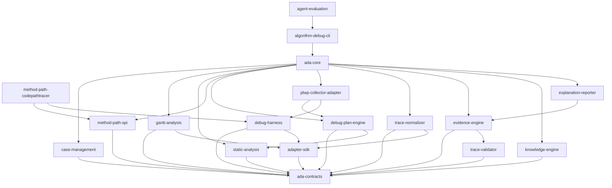

# Algorithm Debug Agent 模块详细设计

- 文档状态：实施基线；仓库骨架已创建，业务模块尚待分阶段实现
- 版本：1.3
- 日期：2026-08-12
- 当前目标算法 Demo：`D:\javacode\hellomvn`
- 当前 JDWP 工具仓库：`D:\mcpcode\mcp-jdwp-java`
- Agent 仓库：`D:\javacode\algorithm-debug-agent`
- 核心场景：用户指定一个可确定性重复运行并输出 Gantt JSON 的算法 UT，然后通过多轮自然语言问题获得证据驱动的代码级原因解释

## 1. 文档目的

本文档是 Algorithm Debug Agent 正式编码前的模块级详细设计，用于冻结：

- 仓库与 Maven 模块边界；
- 每个目录、核心类和配置文件的职责；
- 模块依赖方向；
- Case、Run、Analysis、Artifact、Evidence 数据模型；
- Baseline、CodePath、JDWP Collector、Evidence 和报告工作流；
- OpenCode、LLM 与 Java 后端的交互边界；
- 知识库组织、检索与版本策略；
- 错误处理、安全限制、性能预算和测试策略；
- MVP 实施顺序和阶段验收条件。

本文档现在作为新Agent仓库的模块实施基线。工具实际能力与验证证据统一见 [工具单点验证基线](tool-validation-baseline.md)；各阶段只能声明已经通过验证的能力。目标调度算法和原始UT仍保持零采集源码侵入。

2026-08-12 进一步确认当前 OpenCode 集成不使用 Algorithm Debug MCP：Agent 产品资产全部保存在本仓库，
一次性登记外部 Skill 与 OpenCode 适配器后，用户进入目标算法仓库直接运行 `opencode`。OpenCode
Custom Tool 调用稳定 `ada` CLI，CLI 返回“结构化摘要 + 原始 Artifact 引用”，版本化 Skill
指导大模型自主判断下一步。下文早期 `Inquiry/Turn`、`nextAllowedActions` 或 Agent MCP 描述均以此修订为准。

## 2. 最终产品定义

用户已经有：

1. 一个算法代码仓库；
2. 一个可以指定到 `class#method` 的 JUnit UT；
3. 一份固定算法输入；
4. 每次运行内容相同的调度结果/Gantt JSON；
5. 人工能从 Gantt 中指出可疑现象。

用户在 OpenCode 中输入：

```text
分析 UT：
org.example.scheduler.wafer.SimpleWaferSchedulerTest
#complexParallelModeSchedulesThreeJobsAcrossFiveChambers

问题：
为什么 JOB-A-W2 比 JOB-B-W1 更早进入 CH3？
```

系统自动完成：

```text
建立 Case
  -> 首次无采集运行冻结复现参考
  -> 解析并锚定 Gantt 现象
  -> 静态分析相关代码和策略
  -> CodePathTracer 采集实际调用路径
  -> 生成并校验 JDWP 采集计划
  -> JDWP Collector 分轮采集运行时事实
  -> 规范化为领域 Trace
  -> 校验 Trace 和调度结果
  -> 建立输入/代码/运行时/Gantt 证据图
  -> 证据不足则生成更小的下一轮计划
  -> 生成 debug-report.md 和 debug-viewer.html
```

## 3. 已冻结架构决策

### 3.1 目标算法源码零侵入

默认禁止在算法源码中增加：

```java
trace.emit(...);
debugProbe(...);
collector.capture(...);
```

默认也不修改原始UT。外部JUnit Launcher已经验证可行，因此MVP禁止生成Companion Debug UT，也禁止向目标项目POM加入CodePathTracer依赖。若未来遇到不兼容测试框架，必须通过Adapter能力评审新增运行器，而不是静默改写目标测试。

### 3.2 OpenCode 不默认接入 JDWP-MCP

正式链路为：

```text
OpenCode -> ada_* 高层工具 -> Java Agent 后端 -> JDWP Batch Collector
```

不是：

```text
OpenCode -> 大量低层 jdwp_set_breakpoint/jdwp_get_locals 调用
```

`jdwp-mcp-server` 仅保留为开发、Collector 自测和人工疑难排查工具，不属于 Agent MVP 的运行依赖。

### 3.3 多轮分析事实不依赖聊天上下文

OpenCode 会话可以关闭、压缩或更换模型。正式事实必须保存到 Case Workspace。核心层级为：

```text
Case -> Context -> Run / Analysis -> Artifact -> Evidence -> Answer
```

Case 是一个用户问题的分析档案，不是工作流状态机。同一问题的追问显式复用 `caseId` 并创建新的
`analysisId`；源码、输入或 UT 内容变化时在同一 Case 追加 Context，每轮 Analysis 记录历史复用、
变化摘要、证据缺口、采集计划、Evidence 选择和分级结论。完整规则
见 `../designs/2026-08-12-case-context-run-outcome-multiturn-analysis-design.md` 和
`../decisions/ADR-006-case-as-analysis-dossier.md`。

### 3.4 原始产物追加写入、永不覆盖

复现参考、原始 Gantt、原始 CodePath、Raw JDWP Trace、采集计划、Analysis 和历史回答均不可变。
可选索引和 Case Digest 是可删除、可重建的派生视图，不得成为事实源。

### 3.5 LLM 只生成意图和解释

LLM 可以：

- 理解问题；
- 分类问题；
- 从知识库选择计划模板；
- 提出声明式采集意图；
- 评价证据缺口；
- 根据证据生成解释。

LLM 不可以直接决定未经验证的类、行号、字段和采集预算。所有采集计划必须由 Java 编译器和 Validator 转换为可执行计划。

### 3.6 同一问题允许多次确定性重跑

CodePath、JDWP 广域采集、JDWP 聚焦采集分别运行同一个 UT。每轮都必须验证输入、代码版本和调度结果语义 Hash 与 Baseline 一致。

## 4. 仓库边界

### 4.1 新建通用 Agent 仓库

建议：

```text
D:\javacode\algorithm-debug-agent
```

它包含 Agent 的所有通用确定性能力、OpenCode 适配、知识库和 Demo Adapter。

### 4.2 当前算法 Demo 仓库

```text
D:\javacode\hellomvn
```

它继续保存：

- 晶圆调度算法；
- 算法输入；
- JUnit UT；
- Gantt JSON；
- Gantt HTML Viewer；
- Agent 集成配置；
- Golden Evaluation Cases。

正式实施时，建议把当前 `pom.xml` 的 `artifactId=algorithm-debug-agent` 改名为 `wafer-scheduling-demo`，避免与新 Agent 仓库重名。该变更需要在实施阶段单独确认。

### 4.3 JDWP 仓库

```text
D:\mcpcode\mcp-jdwp-java
```

保留：

```text
jdwp-core              通用 JDI/JDWP 原语
jdwp-batch-collector   正式批量采集器
jdwp-mcp-server        可选开发调试界面
```

Agent 通过版本锁定的可执行 Collector JAR 或 Java Library API 使用前两项，不复制 JDI 实现。

## 5. 推荐仓库结构

```text
algorithm-debug-agent/
├── pom.xml
├── mvnw
├── mvnw.cmd
├── README.md
├── AGENTS.md
├── LICENSE
├── .gitignore
├── opencode.json
│
├── ada-contracts/
├── ada-core/
├── case-management/
├── adapter-sdk/
├── debug-harness/
├── gantt-analysis/
├── static-analysis/
├── method-path-spi/
├── method-path-codepathtracer/
├── debug-plan-engine/
├── jdwp-collector-adapter/
├── trace-normalizer/
├── trace-validator/
├── evidence-engine/
├── knowledge-engine/
├── explanation-reporter/
├── algorithm-debug-cli/
├── agent-evaluation/
│
├── adapters/
│   └── wafer-demo-adapter/
├── schemas/
├── knowledge/
├── config/
├── examples/
├── integration-tests/
├── distribution/
├── docs/
├── skills/
│   └── algorithm-debug/
└── integrations/
    └── opencode/
        ├── agents/
        ├── commands/
        └── tools/
```

上述目录表示最终稳定结构。实施阶段可以在父 POM 中一次创建模块骨架，但按 Phase 逐步填充功能，避免同时开发全部模块。

## 6. 模块依赖规则



约束：

- `ada-contracts` 不依赖任何业务实现模块；
- Adapter 不依赖 `ada-core`；
- Collector Adapter 不理解晶圆业务语义；
- Normalizer 通过 Adapter SPI 获得业务映射；
- Validator 不调用 LLM；
- CLI 不包含业务逻辑，只解析参数和输出 Tool Response；
- OpenCode TypeScript 工具不直接运行 Maven/JDWP，只调用 CLI。

## 7. `ada-contracts` 详细设计

### 7.1 职责

定义跨模块、跨进程和落盘文件使用的稳定 Java Record/DTO、枚举和版本常量。

### 7.2 目录

```text
ada-contracts/src/main/java/.../contracts/
├── SchemaVersions.java
├── ProjectId.java
├── CaseId.java
├── ContextId.java
├── AnalysisId.java
├── RunId.java
├── EvidenceId.java
├── TargetTest.java
├── CaseFingerprint.java
├── ExecutionIdentity.java
├── BaselineManifest.java
├── BaselineRunObservation.java
├── BaselineVerification.java
├── CaseLifecycleState.java
├── RunStatus.java
├── GanttOperation.java
├── AnalysisQuestion.java
├── AnalysisFocus.java
├── MethodPathEvent.java
├── DebugIntent.java
├── CompiledDebugPlan.java
├── RawDebugEvent.java
├── DomainTraceEvent.java
├── ValidationFinding.java
├── Evidence.java
├── EvidenceRelation.java
├── EvidenceSufficiency.java
├── ArtifactReference.java
└── ToolResponse.java
```

当前已实现的 `InquiryId`、`TurnId` 在迁移期保留以避免无关破坏，但新 Case/Context/Analysis API 不引用
它们；确认无外部消费者后再通过独立兼容性变更废弃。

### 7.3 关键契约

运行身份拆成运行前与运行后两层：

```java
public record CaseFingerprint(
        String testSelector,
        String gitCommit,
        String sourceHash,
        String inputHash,
        String classpathHash,
        String javaVersion,
        String adapterId,
        String adapterVersion) {}

public record ExecutionIdentity(
        CaseFingerprint caseFingerprint,
        String scheduleSemanticHash) {}
```

`CaseFingerprint` 原 Phase 0 实现用于运行前选择、复用或派生 Case；按 ADR-006，新入口将其作为
Context Snapshot 的内容身份，用于界定 Run/Evidence 作用域和同 Context 采集一致性，不因同一问题的
代码变化自动拆分 Case。`ExecutionIdentity`只在结果已捕获并完成语义哈希后形成。
`BaselineManifest` Schema 已升级为 2.0。

`ToolResponse<T>`：

```java
public record ToolResponse<T>(
        String schemaVersion,
        boolean success,
        String code,
        String message,
        T data,
        List<ArtifactReference> artifacts) {}
```

ToolResponse 不承载固定状态机的 `nextAllowedActions`。它通过 `eventType`、`caseId/contextId/analysisId/runId`、
`latestRunForAnalysis`、目标/Agent 结果、比较状态和 Artifact 引用自描述本轮事实；大模型根据 Skill、问题和
证据缺口选择下一步。异常分类只表达构建、测试失败、测试错误、未执行、Agent 失败或未知，不推断业务根因。

### 7.4 设计规则

- 所有落盘对象包含 `schemaVersion`；
- 所有 ID 是不透明字符串，不把目录名解析逻辑散落到业务代码；
- 时间同时保存 ISO-8601 墙钟时间和算法相对时间；
- `Evidence` 必须包含来源，不允许无 Provenance 证据；
- JSON 向后兼容采用新增可选字段，破坏性变更提升主版本。

### 7.5 测试

- JSON round-trip；
- Schema 与 Java DTO 一致性；
- 旧版本fixture兼容；
- ID格式和必填字段校验。

## 8. `case-management` 详细设计

### 8.1 职责

持久化一个问题的 Case 身份、每次 UT 的 Run 事实和多轮 Analysis 证据引用，不依赖 OpenCode 会话
上下文。事实源由不可变记录组成，不使用复杂 Case 状态机驱动分析。

### 8.2 核心类

```text
CaseWorkspace
CaseResolutionService
BaselineStabilityService
CaseContextRepository
ContextSnapshotRepository
WorkspaceChangeDetector
RunRecordRepository
AnalysisRecordRepository
CaseDigestBuilder
ImmutableArtifactStore
ReproductionComparator
ScheduleResultDiffService
```

### 8.3 数据层级

```text
Case       一个目标项目、目标UT和用户问题的分析档案
Context    同一Case内一版源码、输入、UT内容和运行环境快照
Run        一次目标UT进程执行
Analysis   初始问题或追问的一轮大模型分析
Artifact   一份不可变文件
Evidence   从Artifact中提取的可引用事实
```

一个 Case 可以包含多个 Context、Run 和 Analysis。Analysis 显式引用历史 Context/Run/Evidence；
CodePathTracer、JDWP、Gantt、异常和日志属于 Artifact，确定性代码将其标准化为有界 Evidence 供
大模型使用。代码变化不会自动拆分新 Case，历史 Evidence 通过 `contextId` 保留作用域。

### 8.4 Case目录

```text
.algorithm-debug/cases/CASE-001/
├── case.json
├── contexts/
│   ├── CONTEXT-001/
│   │   ├── context.json
│   │   ├── change-summary.json
│   │   └── reproduction.json
│   └── CONTEXT-002/
├── runs/
│   ├── RUN-001/
│   │   ├── run-start.json
│   │   ├── run-outcome.json
│   │   ├── result/gantt.json
│   │   ├── diagnostics/test-failure.json
│   │   ├── codepath/
│   │   ├── jdwp/
│   │   └── logs/
│   └── RUN-002/
├── analyses/
│   ├── ANALYSIS-001/
│   │   ├── question.json
│   │   ├── context.json
│   │   ├── evidence-gaps.json
│   │   ├── plan.json
│   │   ├── evidence-selection.json
│   │   ├── result.json
│   │   └── answer.md
│   └── ANALYSIS-002/
└── evidence/
```

### 8.5 覆盖规则

不可覆盖：

- `case.json`；
- Context Snapshot 和 Change Summary；
- `run-start.json` 和 `run-outcome.json`；
- 复现参考和输入副本；
- Raw Trace；
- Plan版本；
- Collection Manifest；
- Evidence、Analysis 和回答版本。

允许重新构建但不得作为事实源：

- Case Digest；
- Evidence Catalog 索引；
- `evidence-graph.json` 派生视图。

### 8.6 不完整运行与并发

- Run 开始前以 create-new 语义写 `run-start.json`，终止后写一次 `run-outcome.json`；
- 只有 start 而没有 outcome 的目录派生为 `INCOMPLETE`，不重写历史、不升级为 Evidence；
- `caseId/runId/analysisId/evidenceId` 使用不透明唯一 ID，目录和终态文件拒绝覆盖；
- 当前不引入复杂 Case Lock、孤立 PID 扫描和事件重放；实测出现同 Case 并发冲突后再增加窄范围锁；
- 临时文件与最终 create-new/原子提交必须位于同一文件系统。

### 8.7 测试

- Case、Run 和 Analysis 拒绝覆盖；
- 不完整 Run 派生读取；
- 不可变产物拒绝覆盖；
- 相同ExecutionIdentity复用Case；
- 同一问题下输入、源码或 UT 内容变化追加 Context，不派生新 Case；
- 目标 UT selector 或独立问题变化默认创建新 Case；
- 同一 Case 多轮 Analysis 复用历史 Evidence；
- 跨 Context Gantt 变化生成 Diff，同 Context 采集变化降级 Evidence；
- UT 断言失败时仍捕获已产生 Gantt。

### 8.8 当前 Phase 0 实现

已实现 `CaseWorkspace`、`ImmutableArtifactStore`、`CaseResolutionService` 和
`BaselineStabilityService`。确定性规则为：

- 相同 `CaseFingerprint` 复用 Case；
- UT selector 改变创建新根 Case；
- 同 UT 的输入、源码或环境 Fingerprint 改变创建 Revision；
- 强制复用与 Fingerprint 冲突时返回 `CONFIRMATION_REQUIRED`；
- 同 Fingerprint 下结果语义哈希不同进入 `BASELINE_UNSTABLE`，不得自动拆 Case；
- LLM 只提供 `CaseIntent`，不能绕过上述规则。

后续持久化按
`../designs/2026-08-12-case-context-run-outcome-multiturn-analysis-design.md` 实现。现有
`CaseLifecycleState` 和 `BaselineStabilityService` 在迁移期保留，但新 OpenCode 协作入口不依赖复杂
状态转换；现有 `CaseResolutionService` 的“Fingerprint 变化创建 Revision”是已实现的 Phase 0 行为，
新入口将以 Context Snapshot 取代该延续规则，使同一问题在代码修改后仍留在原 Case。首次无采集 Run
默认作为每个 Context 的复现参考，只有检测到漂移或用户要求时才重复验证非确定性。

## 9. `adapter-sdk` 详细设计

### 9.1 职责

隔离通用 Agent 与具体算法仓库差异。真实公司算法只需要实现 Adapter，不修改 Agent Core。

### 9.2 核心 SPI

```java
public interface TargetProjectAdapter<T extends ScheduleResultSnapshot> {
    AdapterDescriptor descriptor();
    ProjectDescriptor inspect(Path projectRoot);
    TestLaunchSpec createLaunchSpec(
            ProjectDescriptor project,
            TargetTest test,
            RunMode mode);
    InputLocator inputLocator();
    ScheduleResultSource scheduleResultSource(
            ProjectDescriptor project,
            TargetTest test);
    ScheduleResultParser<T> scheduleResultParser();
    SemanticHashStrategy<T> semanticHashStrategy();
}
```

`TargetProjectAdapter`必须保持无状态，不得保存最近一次`inspect`得到的“当前项目”。项目上下文通过
`ProjectDescriptor`显式传递，保证同一Adapter可以服务多个Case并避免并发串扰。

辅助接口：

```text
InputLocator
ScheduleResultSource
ScheduleResultParser
SemanticHashStrategy
```

`ScheduleResultSource`只描述绝对输出目录和是否递归，不包含时间戳、glob 或最新文件选择规则。
`ScheduleResultLocator`保留为 Deprecated 兼容类型，但新 SPI 不再调用。Phase 0 已实现上述动态输出
契约。`DomainMappingProvider`、`SourceScopeProvider`和
`SensitiveFieldPolicy`仍是后续目标接口，必须分别由Normalizer、Static Analysis和安全策略模块的
可实施设计驱动后再加入，避免提前冻结推测性契约。

### 9.3 Adapter配置

目标项目中只需：

```text
.algorithm-debug/adapter.yaml
```

内容声明：

- Adapter ID和版本；
- 构建工具；
- Java Home策略；
- 测试运行方式；
- 输入定位规则；
- 结果定位规则；
- 源码include/exclude；
- 允许采集的字段；
- 语义Hash策略。

### 9.4 安全边界

Adapter不得：

- 修改算法生产源码；
- 调用外部生产系统；
- 上传输入或Trace；
- 把敏感字段默认返回给LLM；
- 绕过Collection Budget。

## 10. `debug-harness` 详细设计

### 10.1 职责

以可控子JVM运行指定UT，管理Java、Maven、classpath、JDWP端口、日志、超时和退出状态。

### 10.2 进程模型

```text
Algorithm Debug CLI JVM
  -> Debug Harness
      -> Maven/Launcher准备
      -> Target Test JVM
          -> 可选 External JUnit CodePath Launcher Bundle
      -> 可选 JDWP Collector JVM
```

### 10.3 核心类

```text
DebugHarness
BaselineRunner
TargetJvmLauncher
MavenTestExecutor
JunitPlatformExecutor
JavaRuntimeResolver
ClasspathResolver
DebugPortAllocator
ProcessSupervisor
OutputCapture
OutputDirectorySnapshotter
ScheduleResultCapture
RunTimeoutPolicy
RunManifestWriter
```

### 10.4 RunMode

```text
BASELINE
METHOD_PATH
JDWP_BATCH
JDWP_FOCUSED
VALIDATION_REPLAY
```

### 10.5 Baseline要求

首次无采集 Run 默认冻结为复现参考，不因流程要求重复执行。检测到语义 Hash 漂移、算法包含随机或
并发因素、采集前后结果冲突，或用户明确要求时，再按可配置阈值重复验证：

- 测试均通过；
- 输入Hash一致；
- 调度结果语义Hash一致；
- 运行命令与环境被记录。

同一 Fingerprint 的语义结果不一致时记录复现不稳定；与参考结果不一致的动态采集 Evidence 不得用于
自动给出确定根因，但不通过 Case 状态机阻止大模型继续分析缺失证据。

### 10.5.1 当前 Phase 0 实现

已实现有界 `OutputDirectorySnapshotter` 和 `ScheduleResultCapture`：运行前后比较新增或修改文件，
只对候选调用业务 Parser，只接受唯一合法结果，并用临时文件加原子移动复制到不可变 Run 路径。
当前尚未实现通用 Maven 子进程 Runner、文件锁和可配置稳定轮询；真实集成测试中的 ProcessBuilder
仅是测试驱动器，不属于 Harness 公共 API。

通用 Maven/JUnit Runner 已按
`../designs/2026-08-11-debug-harness-maven-junit-runner-design.md` 实现。当前正式链路采用“纯参数编译器
+ 通用进程监管器 + 调度结果组合器”，具备 stdout/stderr 有界归档、结构化运行结果、超时进程树
清理、稳定轮询和现有结果捕获集成；真实集成测试不再包含临时 `ProcessBuilder`。后续不实现复杂
Case State，而按 `../designs/2026-08-12-case-context-run-outcome-multiturn-analysis-design.md` 增加
Case Context、Run Start/Outcome、目标异常诊断和多轮 Analysis/Evidence 持久化；CLI 仍留在再下一切片。

### 10.6 子进程要求

- stdout/stderr分别保存；
- 超时后先正常终止，再升级终止；
- Windows下明确跟踪子进程树；
- 使用显式工作目录和绝对路径；
- JDWP只监听 `127.0.0.1`；
- 每次JDWP Run使用动态端口；
- 结束后确认端口释放。

## 11. `gantt-analysis` 详细设计

### 11.1 职责

把结果JSON转换成与用户问题相关的可查询调度现象，而不是让LLM直接读取整个大JSON。

### 11.2 核心类

```text
GanttAnalysisService
GanttTimelineIndex
OperationCorrelationIndex
ResourceOccupancyBuilder
WaferPathBuilder
JobTimelineBuilder
SuspiciousRegionDetector
QuestionFocusResolver
GanttSliceQuery
```

### 11.3 可查询视图

- 按Wafer查看完整操作链；
- 按Job查看Wafer顺序；
- 按Resource查看占用时间线；
- 查询某时间窗内候选操作；
- 查询两个Wafer的先后差异；
- 查询Chamber空闲窗口；
- 查询Gantt操作的`operationId`。

### 11.4 输出

```text
gantt-operations.json
resource-timeline.json
wafer-paths.json
job-timelines.json
suspicious-region.json
analysis-focus.json
```

### 11.5 第一版可疑点

第一版不自动判断算法“错误”，只检测值得分析的现象：

- 空闲资源窗口；
- 同Job顺序反常；
- 长等待；
- 前后Wafer进入相同Chamber的顺序；
- 资源冲突；
- Gantt操作链断裂。

## 12. `static-analysis` 详细设计

### 12.1 职责

建立从UT入口到算法决策点的静态地图，并生成稳定Source Anchor和候选Tracepoint Catalog。

### 12.2 技术选择

MVP建议 JavaParser + Symbol Solver。若真实项目存在复杂注解处理、Lombok、生成代码或多模块解析问题，再评估 Spoon/JDT。

### 12.3 核心类

```text
SourceIndexBuilder
TestEntryAnalyzer
CallGraphBuilder
StrategyDetector
DecisionStageDetector
ComparatorDetector
ResourceStateDetector
SourceAnchorFactory
TracepointCatalogBuilder
InputProvenanceAnalyzer
StaticAnalysisCache
```

### 12.4 Source Anchor

不能只保存行号。建议：

```json
{
  "className": "...SimpleWaferScheduler",
  "methodName": "scheduleWafer",
  "methodDescriptor": "(...)",
  "sourceFile": ".../SimpleWaferScheduler.java",
  "lineHint": 120,
  "anchorHash": "sha256:...",
  "statementFingerprint": "selected = candidates.get(0)"
}
```

Plan Compiler在执行前用Anchor重新解析实际行号，避免源码轻微变化导致旧计划打到错误位置。

### 12.5 缓存Key

```text
gitCommit/sourceHash + moduleClasspathHash + analyzerVersion
```

## 13. `method-path-spi` 与 `method-path-codepathtracer`

### 13.1 SPI职责

```java
public interface MethodPathCollector {
    MethodPathCollectionResult collect(
            TargetProject project,
            TargetTest test,
            MethodPathPlan plan,
            Path runWorkspace);
}
```

上层只依赖SPI，不绑定具体开源库。

### 13.2 CodePathTracer实现职责

```text
CodePathTracerDistributionResolver
CodePathTracerCapabilityDetector
CodePathTracerPlanWriter
MavenTestClasspathResolver
ExternalJunitTraceLauncher
CodePathTracerProcessLauncher
CodePathTraceReader
MethodPathSummarizer
MethodPathManifestWriter
```

`method-path-codepathtracer`负责把开源库封装在Agent工具侧。目标算法仓库只提供已经存在的UT、编译产物和测试运行时classpath，不引用CodePathTracer API。

### 13.3 已验证的接入决策

当前确认的开源实现为：

```text
repository: D:\mcpcode\code-path-tracer
git commit: f8be120
Maven coordinate: io.github.takahirom.codepathtracer:code-path-tracer:0.1.0-SNAPSHOT
minimum bytecode/runtime baseline of tracer: Java 17
```

该版本JAR没有`Premain-Class`，不能直接把它当成`-javaagent`使用。它的`CodePathTracerAgent.ensureInstalled()`在运行时通过Byte Buddy Attach API安装Instrumentation。因此MVP冻结为：

1. Agent发行包提供一个包含CodePathTracer及全部运行时依赖的Launcher Bundle JAR；
2. Debug Harness编译目标测试并解析测试classpath；
3. Harness启动一个干净的子JVM；
4. 外部JUnit Platform Launcher先安装Tracer，再发现和加载目标UT；
5. Launcher执行原始`class#method`，并把方法进入/退出事件写成JSONL；
6. 目标UT照常生成算法结果/Gantt JSON；
7. Harness比较本轮结果语义Hash与Baseline，确认采集没有改变算法行为。

默认禁止：

- 修改算法生产源码；
- 修改目标项目`pom.xml`；
- 给目标项目增加CodePathTracer依赖；
- 在目标项目生成或提交Companion Debug UT；
- 在已经运行过完整测试套件的同一JVM中再安装Tracer。

最后一条很重要：已加载的算法类可能无法获得完整的外层方法路径。每次METHOD_PATH Run都必须使用全新的子JVM，并在JUnit discovery之前安装Tracer。

### 13.4 Agent提供的依赖Bundle

本次已新增可执行原型：

```text
tools/code-path-tracer-junit-launcher/
├── pom.xml
├── README.md
├── THIRD_PARTY_NOTICES.md
└── src/main/java/org/example/algorithmdebug/codepath/
    └── ExternalJUnitTraceLauncher.java
```

构建后产物：

```text
tools/code-path-tracer-junit-launcher/target/code-path-tracer-junit-launcher.jar
```

Bundle通过Maven Shade打入：

- CodePathTracer `0.1.0-SNAPSHOT`；
- Byte Buddy与Byte Buddy Agent `1.15.11`；
- Kotlin stdlib `1.9.22`；
- JUnit Platform Launcher/Engine `1.10.3`；
- JUnit Jupiter Engine `5.10.3`。

上游CodePathTracer POM把Kotlin stdlib声明为runtime，但公开Java API暴露了`Function0`、`Function1`和`Unit`，所以本封装在编译期显式声明Kotlin stdlib。目标算法项目不需要知道这些传递依赖。

正式Agent仓库不应要求用户在目标电脑重新构建开源库。发行流程应把Bundle JAR、`THIRD_PARTY_NOTICES.md`、版本清单、许可证原文和SHA-256一起放入：

```text
distribution/tools/code-path-tracer/<version>/
```

`config/toolchain-lock.json`锁定Bundle版本、CodePathTracer commit、依赖版本和文件Hash。离线公司电脑只需复制Agent发行包；不需要Gradle，也不需要访问Maven Central。若因许可证策略不能发布fat JAR，则改为`launcher.jar + lib/*.jar`目录，Harness的接口保持不变。

### 13.5 外部JUnit Launcher执行流程

目标项目当前限定为Maven + JUnit 5。完整流程如下：

```text
用户指定 projectRoot + module + testClass#testMethod
  -> ada doctor检查Java、Maven、目标UT和Bundle
  -> mvn test-compile（只编译，不通过Surefire运行测试）
  -> MavenTestClasspathResolver生成test runtime classpath
  -> 创建不可变run目录与method-path-plan.json
  -> 以目标项目根目录作为working directory启动干净子JVM
  -> Bundle安装Instrumentation
  -> JUnit Platform按class#method发现并执行原始UT
  -> 原始UT生成正常Gantt JSON
  -> Bundle写raw-method-path.jsonl与运行摘要
  -> Harness写manifest、日志、Hash和状态
  -> 比较Gantt语义Hash与Baseline
```

必须以目标项目根目录为工作目录，否则UT中的相对输入/输出路径可能改变。Launcher JAR应放在classpath第一项，随后依次是目标模块的`target/test-classes`、`target/classes`和Maven测试依赖。

目标项目准备命令（当前原型）：

```powershell
mvn test-compile dependency:build-classpath `
  "-Dmdep.includeScope=test" `
  "-Dmdep.outputFile=target/test-runtime-classpath.txt"
```

Agent正式实现中由`MavenTestClasspathResolver`执行并读取结果，不要求用户手工拼接classpath。多模块项目还要传入`-pl <module> -am`，并从对应模块读取`target/test-classes`、`target/classes`和classpath文件。

### 13.6 当前可直接运行的完整示例

先构建Launcher：

```powershell
mvn -f tools/code-path-tracer-junit-launcher/pom.xml clean package
```

在`D:\javacode\hellomvn`执行：

```powershell
$launcherJar = (Resolve-Path `
  'tools/code-path-tracer-junit-launcher/target/code-path-tracer-junit-launcher.jar').Path
$dependencyCp = (Get-Content 'target/test-runtime-classpath.txt' -Raw).Trim()
$runtimeCp = "$launcherJar;$((Resolve-Path 'target/test-classes').Path);" +
             "$((Resolve-Path 'target/classes').Path);$dependencyCp"

java -XX:+EnableDynamicAgentLoading -cp $runtimeCp `
  org.example.algorithmdebug.codepath.ExternalJUnitTraceLauncher `
  --test 'org.example.scheduler.wafer.SimpleWaferSchedulerTest#complexParallelModeSchedulesThreeJobsAcrossFiveChambers' `
  --include 'org.example.scheduler.wafer' `
  --trace 'output/code-path-tracer/external-launcher-method-path.jsonl'
```

本次实际验证结果：

```text
testsFound       = 1
testsSucceeded   = 1
testsFailed      = 0
method events    = 41,436
Gantt SHA-256    = CD09CDB200821C47E6FB464274BD36C317245B4026E37999D27ED9614DC4CB4D
```

Trace中确认包含`SimpleWaferScheduler.schedule`和多次`SimpleWaferScheduler.scheduleWafer`进入/退出。随后已从目标算法根`pom.xml`移除临时CodePathTracer依赖，并删除临时采集UT；原有4个UT全部通过，外部Launcher仍得到相同事件数和Gantt Hash。这证明目标Maven项目不需要采集适配代码。

### 13.7 原始输出与Manifest

当前原型JSONL事件为：

```json
{"eventId":104,"eventType":"METHOD_ENTER","depth":1,"threadName":"main","className":"org.example.scheduler.wafer.SimpleWaferScheduler","methodName":"schedule"}
```

正式实现至少输出：

```text
raw-method-path.jsonl
method-path-summary.json
method-path-manifest.json
stdout.log
stderr.log
```

Manifest至少记录：

- `caseId/contextId/analysisId/runId`；
- 目标项目、模块、测试选择器和工作目录；
- Git commit或源码Hash、classpath Hash、Java版本；
- Bundle版本、CodePathTracer commit和SHA-256；
- include/exclude规则与预算；
- 测试发现/成功/失败数；
- 事件数、截断状态、开始/结束时间和退出码；
- 输入Hash、原始Gantt Hash、规范化后的语义Hash；
- 与Baseline是否一致。

原始JSONL只作为不可变证据保存。`MethodPathSummarizer`再生成按线程的调用树、方法计数、实际命中策略和UT到Scheduler的最短路径；LLM默认只读取摘要或按条件查询的切片。

### 13.8 采集计划与性能边界

- `include package`必填，禁止默认采集整个应用；
- 支持多个include prefix和class/method exclude；
- 默认排除JDK、JUnit、Jackson、Maven、Kotlin和Tracer自身；
- 默认过滤普通getter/setter、record访问器、`toString/hashCode/equals`；
- 计划必须包含`maxEvents`、`maxDepth`、`timeoutMs`和`maxOutputBytes`；
- 达到预算时停止记录并在Manifest标记`truncated=true`，但应让UT正常完成；
- CodePath只回答“实际走了哪些方法以及嵌套关系”，不采集大对象和局部变量；
- 局部变量、候选集摘要、分数和选择原因由后续JDWP Collector按聚焦计划采集；
- 大型项目先用静态分析缩小包/类范围，再运行CodePath，避免全量字节码增强。

当前原型已完成核心链路，但事件预算、exclude规则、流式写盘、Manifest和多模块classpath仍属于正式`method-path-codepathtracer`模块的P0实现项。当前原型把事件暂存在内存后写盘，只适合Demo验证，不是大型算法的最终性能形态。

### 13.9 Java与安全兼容性

- Launcher自身以Java 17字节码构建，当前目标范围是Java 17及以上；本Demo使用Java 21；
- Java 21运行动态Attach时显式增加`-XX:+EnableDynamicAgentLoading`，可避免动态Agent警告；
- Harness必须检查目标JDK是否允许Attach；失败时返回结构化错误，不能静默输出空Trace；
- 子JVM不开放网络端口，CodePath采集不需要JDWP端口；
- CodePath Run与JDWP Run默认分轮执行，用同一Baseline语义Hash关联；
- 依赖JAR必须经过Hash校验，只允许从Agent受控distribution目录加载；
- 目标classpath和输入可能含公司敏感路径，Manifest进入LLM前必须脱敏。

### 13.10 失败分类与诊断

```text
CODEPATH_BUNDLE_MISSING
TARGET_TEST_COMPILE_FAILED
TEST_CLASSPATH_RESOLVE_FAILED
TEST_NOT_FOUND
DYNAMIC_AGENT_ATTACH_DENIED
TRACER_INSTALL_FAILED
TEST_EXECUTION_FAILED
METHOD_PATH_EMPTY
METHOD_PATH_BUDGET_EXCEEDED
METHOD_PATH_WRITE_FAILED
RESULT_NOT_FOUND
RESULT_HASH_MISMATCH
```

`ada doctor --project <root>`应预检JDK版本、Maven、Bundle Hash、Attach能力、目标测试选择器、输出目录写权限和目标classpath。测试失败时仍应保留已产生的Trace、stdout/stderr和失败摘要，但不得把失败运行与Baseline一致的运行混合。

### 13.11 开源库首次构建与离线准备

这一步只由Agent维护者执行，不由算法项目使用者执行。当前仓库使用JDK 17构建：

```powershell
cd D:\mcpcode\code-path-tracer
$env:JAVA_HOME = 'D:\mcpcode\toolchains\jdk-17.0.20+8'
./gradlew.bat :code-path-tracer:clean `
  :code-path-tracer:test `
  :code-path-tracer:publishToMavenLocal
```

发布到本机Maven仓库后，再构建Launcher Bundle。正式CI应固定JDK、Gradle Wrapper、commit和依赖锁，并把构建产物及SBOM保存到Agent Release。目标算法仓库始终是Maven项目；Gradle只与上游CodePathTracer自身的首次构建有关。

### 13.12 后续CLI封装

最终用户不应手工执行上述PowerShell。预期命令为：

```text
ada collect method-path \
  --project D:\javacode\hellomvn \
  --test org.example.scheduler.wafer.SimpleWaferSchedulerTest#complexParallelModeSchedulesThreeJobsAcrossFiveChambers \
  --include org.example.scheduler.wafer \
  --case CASE-001 \
  --inquiry Q001
```

CLI负责构建、classpath解析、子JVM、超时、日志、产物目录、Hash验证和状态持久化。OpenCode只调用这个稳定命令并读取摘要，不直接拼classpath，也不直接操作CodePathTracer API。

## 14. `debug-plan-engine` 详细设计

### 14.1 职责

把“我需要知道W1/W2比较时的分数和tie-breaker”转换为可执行、有限、安全的JDWP计划。

### 14.2 三层模型

```text
DebugIntent         LLM可生成的业务采集意图
ResolvedDebugPlan   与静态代码、变量作用域关联后的计划
CompiledDebugPlan   Collector可以直接执行的计划
```

### 14.3 核心类

```text
QuestionToIntentMapper
TemplatePlanBuilder
DebugPlanResolver
SourceAnchorResolver
VariableProjectionResolver
DebugPlanCompiler
DebugPlanValidator
CollectionBudgetEstimator
PlanDeduplicator
PlanVersionService
```

### 14.4 DebugIntent示例

```json
{
  "questionType": "WAFER_ORDER_EXPLANATION",
  "focus": {
    "waferIds": ["W1", "W2"],
    "resourceIds": ["CH3"]
  },
  "requiredFacts": [
    "candidate order",
    "score breakdown",
    "tie breaker",
    "selected candidate"
  ]
}
```

### 14.5 编译后计划

必须包含：

- 精确类和方法；
- 解析后的Location；
- Source Anchor校验结果；
- 局部变量allowlist；
- 字段投影路径；
- 采样规则；
- 最大事件数/字节数；
- suspend policy；
- 失败策略。

### 14.6 计划版本

广域计划与聚焦计划均追加保存：

```text
CP-Q001-001-broad.json
CP-Q001-002-focused.json
```

新计划通过`parentPlanId`引用前一计划，不覆盖历史。

## 15. `jdwp-collector-adapter` 详细设计

### 15.1 职责

管理外部Collector进程和目标JDWP JVM，不实现JDI底层协议。

### 15.2 核心类

```text
JdwpCollectorService
CollectorDistributionResolver
CollectorCompatibilityChecker
JdwpTargetLauncher
CollectorProcessLauncher
CollectorReadinessProbe
CollectionMonitor
CollectionResultReader
CollectionConsistencyChecker
CollectorFailureClassifier
```

### 15.3 调用过程

```text
取得CompiledDebugPlan
  -> Debug Harness分配端口
  -> 启动suspend=y目标UT JVM
  -> 启动Collector并attach
  -> Collector安装采集点
  -> Collector恢复目标JVM
  -> 采集并持续写JSONL
  -> 目标UT结束
  -> 读取Manifest与Metrics
  -> 比较Baseline语义Hash
```

### 15.4 兼容性锁

`config/toolchain-lock.json`保存：

```json
{
  "jdwpCollector": {
    "version": "1.0.0",
    "gitCommit": "bc09262",
    "sha256": "...",
    "requiredPlanSchema": "1.x"
  }
}
```

### 15.5 失败分类

```text
TARGET_START_FAILED
JDWP_ATTACH_TIMEOUT
BREAKPOINT_UNRESOLVED
LOCAL_VARIABLE_UNAVAILABLE
COLLECTION_BUDGET_EXCEEDED
TARGET_VM_DISCONNECTED
TRACE_WRITE_FAILED
RESULT_HASH_MISMATCH
```

任何失败都必须确保事件线程恢复或目标进程终止，不能留下永久暂停的UT。

### 15.6 已验证能力与当前缺口

2026-08-10使用`SimpleWaferSchedulerTest#complexParallelModeSchedulesThreeJobsAcrossFiveChambers`重新验证：

```text
collector repository commit = 1ef7d22
tracepoint                  = SimpleWaferScheduler.scheduleWafer():120
installed locations         = 1
tracepoint hits              = 165
total JSONL events           = 167（含collector_started/finished）
completion reason            = vm_death
raw trace bytes              = 2,246,165
target test                  = 1 passed
Gantt SHA-256                = CD09CDB200821C47E6FB464274BD36C317245B4026E37999D27ED9614DC4CB4D
```

原始Trace已经实际读到`context.job.jobId`、`context.wafer.waferId`、`planned`、`requiredResources`、`readyAt`、`resourcesReadyAt`、stack和有界对象字段。165次命中等于15片wafer乘每片11个操作。

当前Collector仍依赖`className + line + optional methodName`，且`locals=true`会展开全部可见局部变量；HashMap/List快照可能暴露JDK内部结构。Agent接入前必须由Static Analyzer/Plan Compiler完成Source Anchor解析，并优先推动P0的local allowlist、字段路径投影、采样、总字节预算和异步有界Writer。Agent Adapter不能假设这些P0能力已经存在。

## 16. `trace-normalizer` 详细设计

### 16.1 职责

Raw JDWP Event只描述JVM事实；Normalizer通过Adapter规则生成算法领域事件。

### 16.2 核心类

```text
RawTraceReader
TraceNormalizationService
NormalizationRuleRegistry
EventTypeResolver
DomainFieldMapper
ObjectProjectionMapper
EventCorrelationService
TimelineBuilder
NormalizationManifestWriter
```

### 16.3 输出事件

MVP支持：

```text
case_loaded
candidate_generated
constraint_filtered
score_calculated
candidate_ranked
candidate_selected
resource_state_updated
schedule_committed
result_exported
```

### 16.4 可信等级

```text
OBSERVED          原始JDWP直接读取
DERIVED           确定性规则从Observed计算
MODEL_INFERRED    LLM推断，不进入确定性Domain Trace
```

Normalizer只允许产生前两种。`MODEL_INFERRED`由Evidence层单独管理。

### 16.5 可重放

Normalizer版本变化后可直接重放Raw Trace，无需重新运行UT。每次输出记录：

- normalizer版本；
- rule版本；
- input artifact Hash；
- output Hash。

## 17. `trace-validator` 详细设计

### 17.1 职责

执行完全确定性的完整性、时间线、资源和领域约束校验，不调用LLM。

### 17.2 Validator SPI

```java
public interface TraceRule {
    String id();
    Stream<ValidationFinding> validate(ValidationContext context);
}
```

### 17.3 通用规则

- Trace eventId连续性；
- Run/Plan/Case引用完整；
- 截断和采样情况可见；
- schedule committed事件与Gantt操作对应；
- 多轮运行语义Hash一致；
- 时间区间合法；
- 同资源占用冲突。

### 17.4 Wafer Demo规则

- Wafer操作符合Sequence；
- PICK/PLACE资源声明完整；
- Robot和端点资源同时占用；
- RECIPE占用Chamber；
- 同Job防超车；
- SERIAL模式共享Chamber所有权；
- 每片Wafer最终返回Load Port。

### 17.5 Finding级别

```text
INFO
WARNING
ERROR
INCONCLUSIVE
```

`INCONCLUSIVE`用于采样或缺失变量导致无法判定，不可错误地写成PASS。

## 18. `evidence-engine` 详细设计

### 18.1 职责

把输入、Gantt、源码、实际调用路径、运行时变量和Validator结论连接为可查询、可引用的证据图。

### 18.2 核心类

```text
EvidenceIngestService
EvidenceRepository
EvidenceGraphBuilder
EvidenceQueryService
EvidenceDeduplicator
EvidenceProvenanceValidator
EvidenceSufficiencyEvaluator
MissingEvidenceDetector
NextRoundRecommendationService
ConclusionVerifier
```

### 18.3 证据类型

```text
INPUT
GANTT
STATIC_CODE
METHOD_PATH
RUNTIME
VALIDATION
KNOWLEDGE
INFERENCE
```

### 18.4 核心关系

```text
GANTT_OPERATION produced_by SCHEDULE_COMMIT
SCHEDULE_COMMIT selected_from CANDIDATE_SET
CANDIDATE selected_by STRATEGY
CANDIDATE filtered_by CONSTRAINT
SCORE computed_from INPUT_FIELD
RUNTIME_EVENT occurred_at SOURCE_LOCATION
CONCLUSION supported_by EVIDENCE
```

### 18.5 充分性矩阵

不同问题类型要求不同证据：

`WAFER_ORDER_EXPLANATION`至少需要：

- 两个Gantt操作的实际顺序；
- 两个Wafer当时均为候选或为何不是候选；
- 资源ready time；
- 排序/评分/tie-breaker运行时值；
- 实际执行代码位置；
- 相关输入字段来源。

### 18.6 多轮合并

Evidence ID全Case唯一；同一事实可被多轮支持。旧Evidence不删除，新Evidence可：

- 增加支持来源；
- 标记冲突；
- 通过`supersededBy`替代错误派生结论；
- 不允许修改原始Observed Evidence内容。

## 19. `knowledge-engine` 详细设计

### 19.1 职责

提供问题分类、领域概念、采集模板和历史模式，不负责声明当前UT的动态事实。

### 19.2 知识分层

```text
knowledge/
├── general-debugging/
├── algorithm-debugging/
├── semiconductor-scheduling/
├── question-patterns/
├── collection-templates/
└── known-issues/
```

目标项目私有知识放在：

```text
<target>/.algorithm-debug/knowledge/
```

### 19.3 文档元数据

每份Markdown/YAML至少包含：

```yaml
id: wafer-ordering
version: 1.0
tags: [wafer, ordering, comparator, overtaking]
appliesTo: [wafer-scheduling]
sourceType: domain-specification
```

### 19.4 MVP检索

第一版使用：

- 标签过滤；
- 问题模式匹配；
- SQLite FTS或BM25；
- 文档片段和来源ID返回。

暂不引入向量数据库和LangChain。知识达到数百份、多机型且关键词召回明显不足后，再加入Hybrid RAG。

### 19.5 知识与事实边界

知识可以说：

```text
同Job防超车通常需要检查抽片顺序和目标Chamber入腔顺序。
```

知识不能说：

```text
本次W1一定因为jobStartOrder而先进入CH3。
```

后者必须由当前Case Evidence确认。

## 20. `explanation-reporter` 详细设计

### 20.1 职责

生成基于Evidence Bundle的Markdown报告和可视化数据；Reporter不得直接读取无限Raw Trace。

### 20.2 核心类

```text
EvidenceBundleBuilder
ReportPromptAssembler
ExplanationReportService
ReportCitationValidator
MarkdownReportWriter
ViewerDataBuilder
DebugViewerRenderer
ReportVersionService
```

### 20.3 报告结构

```text
1. 问题与目标UT
2. Baseline和确定性状态
3. Gantt中观察到的现象
4. 实际执行路径
5. 候选、过滤、评分和选择过程
6. 相关输入字段
7. 生效策略与源码位置
8. 根因结论
9. Validator发现
10. 未确认信息与证据限制
11. Evidence引用表
```

### 20.4 报告版本

```text
report-v001-preliminary.md
report-v002-partial.md
report-v003-confirmed.md
```

报告状态：

```text
PRELIMINARY
PARTIAL
CONFIRMED
INCONCLUSIVE
```

### 20.5 引用检查

报告中的每个确定性结论必须引用至少一个Evidence ID。`ReportCitationValidator`检查：

- ID存在；
- Evidence与Case/Context/Analysis作用域匹配；
- Evidence类型满足结论要求；
- `MODEL_INFERRED`不能被写成`OBSERVED`。

## 21. `ada-core` 详细设计

### 21.1 职责

编排全部确定性模块，提供状态机和高层Use Case，不执行低层解析或JDI操作。

### 21.2 核心类

```text
AlgorithmDebugApplication
AlgorithmDebugWorkflow
WorkflowStateMachine
WorkflowContext
WorkflowPolicy
CreateCaseUseCase
RunBaselineUseCase
FocusGanttUseCase
AnalyzeStaticUseCase
CollectMethodPathUseCase
CollectRuntimeUseCase
BuildEvidenceUseCase
EvaluateEvidenceUseCase
GenerateReportUseCase
ResumeCaseUseCase
```

### 21.3 状态机

```text
CREATED
BASELINE_RUNNING
BASELINE_VERIFIED
GANTT_FOCUSED
STATIC_MAPPED
PATH_CAPTURED
DEBUG_PLAN_READY
RUNTIME_CAPTURED
EVIDENCE_BUILT
EVIDENCE_PARTIAL
EVIDENCE_SUFFICIENT
REPORTED

终止状态：
NON_DETERMINISTIC
BLOCKED
FAILED
```

### 21.4 Agent Loop

```text
用户问题
  -> 查询已有Evidence
  -> 若充分，直接生成新版本回答
  -> 若不足，生成Missing Evidence
  -> 选择最小成本采集动作
  -> 执行新Round
  -> 合并Evidence
  -> 再评估
  -> 达到充分或预算上限
```

默认预算建议：

```text
maxTotalRuns = 6
maxCodePathRuns = 1
maxJdwpRuns = 4
maxTraceBytesPerRun = 50 MB
maxWallClockMinutes = 20
```

预算可按项目配置，超过预算后输出`INCONCLUSIVE`而不是继续无限采集。

## 22. `algorithm-debug-cli` 详细设计

### 22.1 职责

为OpenCode和人工终端提供稳定的高层入口。CLI输出简短JSON，完整数据写Artifact文件。

### 22.2 命令

```text
ada doctor
ada project init
ada project inspect
ada dependency import
ada case create
ada case resume
ada case status
ada analysis begin
ada analysis complete
ada run test
ada artifact read
ada baseline run
ada gantt focus
ada static analyze
ada codepath collect
ada plan build
ada jdwp collect
ada trace normalize
ada trace validate
ada evidence query
ada evidence evaluate
ada report generate
ada eval run
ada install opencode
ada uninstall opencode
```

### 22.3 CLI输出规则

- stdout只输出ToolResponse JSON；
- 日志写stderr和日志文件；
- 大Trace绝不打印到stdout；
- 返回有界结构化摘要、便携 Artifact 引用和完整性/截断信息；
- 退出码区分参数错误、环境错误、目标测试失败和采集失败。

## 23. OpenCode 集成详细设计

### 23.1 目录

```text
skills/
└── algorithm-debug/
    ├── SKILL.md
    └── references/

integrations/opencode/
├── agents/algorithm-debug.md
├── commands/debug-case.md
├── commands/resume-debug-case.md
├── tools/algorithm-debug.ts
└── opencode-template.json
```

`skills/algorithm-debug` 是唯一工作流源码；`integrations/opencode` 只适配 OpenCode。一次性执行
`ada install opencode`，在 OpenCode 用户配置中登记 Agent 安装路径、外部 Skill 来源和薄 Custom Tool
加载器。不得把 Skill 正文复制到全局 Skill 目录或目标算法仓库。安装必须幂等、可审计并支持卸载。

### 23.2 Agent职责

OpenCode Agent负责：

- 解析用户自然语言问题；
- 维持当前`caseId/analysisId`；
- 选择高层工具；
- 使用知识库解释Evidence；
- 在证据不足时提出下一轮DebugIntent；
- 生成对用户友好的回答。

### 23.3 Custom Tool 职责

OpenCode 薄 Custom Tool 仅完成：

```text
参数Schema校验
  -> 从tool context取得当前directory/worktree
  -> 启动ada CLI
  -> 解析ToolResponse
  -> 原样返回RunOutcomeSummary与Artifact引用
```

它不实现Java业务逻辑，不直接调用Maven，不直接启动Collector。

### 23.4 多轮会话

工具每次返回：

```json
{
  "eventType": "TARGET_TEST_RUN_COMPLETED",
  "caseId": "CASE-001",
  "contextId": "CONTEXT-001",
  "analysisId": "ANALYSIS-003",
  "runId": "RUN-005",
  "latestRunForAnalysis": true,
  "testOutcome": "ERROR",
  "scheduleResultPresent": false,
  "artifacts": []
}
```

即使OpenCode重新启动，也能通过`ada case resume CASE-001`恢复，不依赖旧聊天消息。

正常使用是一次安装后进入任意目标算法仓库直接运行 `opencode` 并提问。自动 Skill 发现之外保留
`/debug-case` 和显式 `algorithm-debug` Agent。`ada opencode --project ...` 仅用于开发、自测或临时免安装。

### 23.5 权限

- `ada_*`高层工具允许；
- 算法源码编辑默认拒绝；
- 任意Shell命令需要确认；
- JDWP只允许localhost；
- 删除Case和历史Run需要确认；
- 默认不配置JDWP-MCP；当前 Algorithm Debug Agent 接入链路也不实现 MCP Server。

## 24. `wafer-demo-adapter` 详细设计

### 24.1 职责

将当前`hellomvn`作为Reference Target，验证框架具备真实端到端能力。

### 24.2 文件

```text
adapters/wafer-demo-adapter/
├── pom.xml
├── src/main/java/.../
│   ├── WaferDemoAdapter.java
│   ├── WaferDemoCaseCatalog.java
│   ├── WaferInputLocator.java
│   ├── WaferScheduleResultLocator.java
│   ├── WaferScheduleResultParser.java
│   ├── WaferSemanticHashStrategy.java
│   ├── WaferScheduleSnapshot.java
│   └── WaferOperationSnapshot.java
└── src/main/resources/
    └── META-INF/services/
        └── org.example.algorithmdebug.adapter.TargetProjectAdapter
```

### 24.3 MVP目标UT

第一条端到端Golden Case建议使用多Job、多Wafer、CH1~CH5的复杂UT，问题固定为：

```text
为什么两个指定Wafer以当前顺序进入一个共享Chamber？
```

它必须验证：

- Baseline可重复；
- Gantt可以定位两条操作；
- 静态分析定位排序和资源更新时间；
- CodePath确认实际执行路径；
- JDWP采到ready time、资源状态、score或排序字段；
- Evidence关联到Gantt和源码；
- 第二轮追问可复用Case并追加Focused Run。

### 24.4 当前实现状态与边界

`wafer-demo-adapter` 已完成第一阶段实现，并通过 `ServiceLoader` 暴露给后续 Core/Harness：

- 显式支持 `SimpleWaferSchedulerTest` 的四个确定性 UT，不根据文件名猜测 Case；
- 识别 Maven/Java 21 Reference Demo，生成结构化 `TestLaunchSpec`；
- 定位输入 JSON 和调度结果 JSON，并解析为 Adapter 自有不可变快照；
- 语义哈希排除 snapshot、trigger 和解释文本噪声，保留时间、资源、位置与操作顺序差异；
- 不依赖目标算法 JAR，不修改目标仓库，不负责启动子进程；
- Domain Mapping、敏感字段策略、CodePath/JDWP 参数注入和实际执行保留给后续模块。

真实复杂 Case 验证基线为 3 个 Job、15 片 Wafer、CH1～CH5、165 个操作。详细实现与测试证据见
`docs/designs/2026-08-10-wafer-demo-adapter-design.md`。

## 25. `agent-evaluation` 详细设计

### 25.1 职责

验证Agent是否正确选择工具、采集足够证据并避免无依据结论，而不仅是检查文本是否好看。

### 25.2 文件

```text
agent-evaluation/
├── src/main/java/.../
│   ├── EvaluationRunner.java
│   ├── GoldenCaseLoader.java
│   ├── EvidenceCoverageMetric.java
│   ├── CitationAccuracyMetric.java
│   ├── ToolSequenceMetric.java
│   ├── UnsupportedClaimMetric.java
│   └── CollectionCostMetric.java
└── src/test/resources/golden-cases/
```

### 25.3 指标

- 根因正确率；
- 必要Evidence覆盖率；
- Evidence引用准确率；
- 无依据结论数；
- 采集计划命中率；
- 不必要采集轮数；
- Trace体积；
- 总运行时间；
- 多轮Evidence复用率。

## 26. Schema目录详细设计

```text
schemas/
├── case/
│   ├── case-manifest.schema.json
│   ├── case-state.schema.json
│   ├── inquiry.schema.json
│   └── turn.schema.json
├── execution/
│   ├── execution-identity.schema.json
│   ├── launch-spec.schema.json
│   └── run-manifest.schema.json
├── gantt/
│   ├── gantt-operation.schema.json
│   └── analysis-focus.schema.json
├── collection/
│   ├── method-path-plan.schema.json
│   ├── debug-intent.schema.json
│   ├── compiled-debug-plan.schema.json
│   └── collection-manifest.schema.json
├── trace/
│   ├── method-path-event.schema.json
│   ├── raw-jdwp-event.schema.json
│   └── domain-trace-event.schema.json
├── evidence/
│   ├── evidence.schema.json
│   ├── evidence-graph.schema.json
│   └── evidence-sufficiency.schema.json
└── report/
    └── report-manifest.schema.json
```

Phase 0先冻结这些Schema的最小字段，再开始Java实现。

## 27. 配置目录详细设计

```text
config/
├── application-default.yaml
├── collection-limits.yaml
├── security-policy.yaml
├── toolchain-lock.json
├── logging.xml
└── opencode-template.json
```

配置优先级：

```text
CLI参数
  > 目标项目.algorithm-debug配置
  > 用户主目录配置
  > Agent默认配置
```

敏感信息不得写入Case。MVP原则上不需要API Key，因为LLM由OpenCode管理。

## 28. 一次多轮问题定位的详细时序

### 28.1 第一轮主问题

```text
1. OpenCode识别UT和问题
2. ada case create
3. CaseService生成CASE-001
4. BaselineRunner运行3次UT
5. Adapter解析Gantt并计算语义Hash
6. Gantt Analyzer锚定W1/W2/CH3时间窗
7. Static Analyzer生成相关调用链和Tracepoint Catalog
8. CodePath Collector重跑UT并确认实际路径
9. Knowledge Engine匹配WAFER_ORDER_EXPLANATION模板
10. LLM提出DebugIntent
11. Plan Engine编译并校验计划
12. JDWP Collector执行R001广域采集
13. Normalizer生成领域事件
14. Validator检查完整性和结果一致性
15. Evidence Engine建立证据图
16. Sufficiency Evaluator发现缺少tie-breaker
17. 生成R002聚焦计划并重新采集
18. Evidence充分
19. Reporter生成report-v001-confirmed.md
```

### 28.2 用户继续追问

用户问：

```text
所以最终是jobStartOrder生效，而不是recipe时间吗？
```

流程：

```text
1. 创建TURN-002，不创建新Case
2. Evidence Query搜索jobStartOrder、recipe时间、Comparator结果
3. 若已有证据充分，不重跑UT
4. 生成report-v002-confirmed.md
5. 保存本轮问答与引用的Evidence ID
```

### 28.3 同一Gantt的新问题

用户问：

```text
为什么CH2空闲时没有安排W3？
```

流程：

```text
1. 在CASE-001下创建Q002
2. 复用Baseline、输入、静态索引和已有Path
3. 查询现有Evidence
4. 若不足，创建Q002/R003资源空闲计划
5. 新数据追加写入，不覆盖Q001数据
```

## 29. 性能设计

### 29.1 大Trace不进入LLM上下文

LLM只接收：

- Case摘要；
- Gantt切片；
- Method Path摘要；
- Evidence Query结果；
- Validator Finding；
- Artifact路径。

### 29.2 采集渐进策略

```text
Baseline无采集
  -> CodePath只采方法路径
  -> JDWP广域但浅快照
  -> JDWP聚焦字段投影
```

### 29.3 计划预算

- 局部变量allowlist；
- 对象字段projection；
- firstN/everyNth/maxCaptured；
- 最大对象深度；
- 最大集合元素；
- 最大事件和总字节；
- Collector异步批量写入；
- 达到硬限制后优雅停止并写Manifest。

JDWP Collector P0性能加固按现有专项设计文档实施，不在Agent仓库重复实现。

状态说明：上述`localVariables/paths/sampling/limits/writer`是目标契约。2026-08-10验证的Collector MVP只具备深度、元素数、字符串长度、单点命中数、Session事件数和idle timeout等基础限制；其余P0项仍待在JDWP仓库实现并通过兼容性锁接入。

## 30. 安全与非目标

### 30.1 默认安全规则

- 仅离线UT；
- 仅localhost JDWP；
- 不允许Attach生产JVM；
- 不执行任意表达式；
- 不修改局部变量和对象字段；
- 不调用未知`toString()`；
- 不自动上传源码、输入、Trace；
- 路径必须位于声明的目标项目、Case或工具目录；
- 采集字段执行allowlist和脱敏规则。

### 30.2 非目标

- 生产在线调度；
- 自动修复或自动发布算法；
- 用LLM代替约束Validator；
- 一次性采集整个JVM对象图；
- 第一阶段建设多用户Web平台；
- 第一阶段引入LangChain、Kafka、Redis或向量数据库。

## 31. 测试设计

### 31.1 单元测试

每个模块覆盖：

- 正常输入；
- Schema错误；
- 文件缺失；
- 截断；
- 版本不兼容；
- 预算超限；
- 空结果。

### 31.2 Forked JVM集成测试

测试：

- 子JVM启动和退出；
- 动态JDWP端口；
- ClassPrepare延迟断点；
- 局部变量不可用；
- Collector断开；
- 目标UT异常；
- 结果Hash不一致。

### 31.3 端到端测试

以`hellomvn`为目标仓库：

```text
CLI创建Case
  -> Baseline
  -> Gantt Focus
  -> Static
  -> CodePath
  -> JDWP
  -> Evidence
  -> Report
  -> 多轮追问复用Case
```

### 31.4 Golden Evaluation

至少准备：

1. Wafer进腔顺序；
2. Chamber空闲未调度；
3. SERIAL模式Job隔离；
4. 同Job防超车；
5. Running Recipe等待；
6. 证据不足时正确输出`INCONCLUSIVE`。

## 32. 分阶段实施计划

### Phase 0：仓库、契约和Fixture

状态：父POM、20个模块目录、Maven Wrapper、文档/Schema/Knowledge/OpenCode目录骨架已经创建并通过Reactor构建；Contracts、最小Schema和Fixture尚未实现。

交付：

- 新独立仓库；
- 父POM和模块骨架；
- Contracts；
- JSON Schema；
- Case目录Fixture；
- `hellomvn` Adapter配置草案。

验收：Schema、DTO和Fixture可互相校验。

### Phase 1：Case + Baseline + Gantt

交付：

- Case Management；
- Debug Harness；
- Wafer Demo Adapter；
- 三次Baseline确定性验证；
- Gantt Analysis；
- CLI基础命令。

这是第一个可演示里程碑：虽然尚未自动Debug，但能指定UT建立可查询Case。

### Phase 2：Static Analysis

交付调用链、策略目录、Source Anchor和Tracepoint Catalog。

### Phase 3：CodePath适配

已完成外部JUnit Launcher技术验证：目标Maven项目无需CodePath依赖、无需生成采集UT。下一步把现有原型迁入正式`method-path-codepathtracer`模块，补齐流式写盘、预算、Manifest、多模块classpath、`ada doctor`和发行包许可证/SBOM。

### Phase 4：JDWP Collector接入

Collector/Core单点能力已经验证。此Phase只负责Agent侧接入：锁定JAR/commit/hash，编译计划，动态分配localhost端口，启动`suspend=y`目标UT，监管Collector，读取Trace/Manifest，并自动验证Gantt语义Hash和错误恢复。

### Phase 5：Normalizer + Validator + Evidence

建立第一条完整证据链：

```text
输入 -> 代码 -> 运行时 -> Gantt
```

### Phase 6：OpenCode Agent MVP

提供仓库内唯一 Skill、`/debug-case`、多轮 `caseId/analysisId` 恢复、薄 Custom Tool `ada_*` 工具和一次性
OpenCode 适配安装。安装后用户进入目标算法仓库直接运行 `opencode`；当前阶段不实现 Agent MCP。

### Phase 7：Knowledge + Sufficiency Loop

实现问题模板、最小下一轮计划和最多四轮JDWP采集预算。

### Phase 8：Reporter + Viewer + Evaluation

完成报告版本、Evidence引用校验、交互式Viewer和Golden Evaluation。

## 33. 第一版Definition of Done

1. 能在不修改`hellomvn`算法源码和原始UT的情况下指定一个测试方法；
2. 能验证三次Baseline的Gantt语义Hash一致；
3. 能从用户问题定位Gantt中的Wafer/Resource/时间窗；
4. 能输出UT到Scheduler决策点的静态和实际调用路径；
5. 能按声明式计划采集至少五个指定局部变量或对象字段；
6. 能把Raw Trace规范化为至少四类领域事件；
7. 能把一个Gantt操作关联到代码位置和运行时Evidence；
8. 证据不足时能追加一轮Focused Plan且不覆盖旧数据；
9. OpenCode重启后能恢复同一Case；
10. 第二轮追问能优先复用已有Evidence；
11. 最终报告的确定性结论都有有效Evidence ID；
12. `mvn test`和端到端Golden Case通过。

## 34. 评审前必须确认的决策点

### D1：新仓库位置

已确认并创建：`D:\javacode\algorithm-debug-agent`。

### D2：当前Demo重命名

建议把`hellomvn`的Maven `artifactId`从`algorithm-debug-agent`改为`wafer-scheduling-demo`，但不立即执行。

### D3：Case存储位置

建议默认：

```text
<target-project>/.algorithm-debug/runs
```

优点是Case与代码仓库关联直观；大型Trace可通过`.gitignore`排除。也可配置到外部磁盘。

### D4：静态分析技术

建议MVP选择JavaParser + Symbol Solver；真实公司项目验证失败后再升级JDT/Spoon。

### D5：CodePathTracer准确项目

已确认本地仓库`D:\mcpcode\code-path-tracer`、commit `f8be120`及API；当前封装坐标为`io.github.takahirom.codepathtracer:code-path-tracer:0.1.0-SNAPSHOT`。正式发布前仍需由项目方复核上游许可证文本、第三方Notice和公司开源合规要求。

### D6：第一阶段测试运行器

已确认MVP只支持Maven + JUnit 5 + 单测试方法；CodePath外部Launcher和JDWP Surefire fork均已完成单点验证。Gradle目标项目和TestNG后续扩展。

### D7：语义Hash

建议由Adapter实现：忽略输出文件生成时间、随机ID和展示字段，只对调度操作关键字段规范排序后计算Hash。

### D8：LLM职责

建议第一版仍由OpenCode中的单一Algorithm Debug Agent承担Planner/Critic/Reporter三种角色，通过不同阶段Prompt实现，不急于拆多Agent。

### D9：Viewer优先级

建议Viewer排在完整Evidence链之后，MVP先交付Markdown报告和JSON证据。

### D10：JDWP-MCP

已确认不写入默认`opencode.json`。正式批量采集使用JDWP Batch Collector；JDWP-MCP只保留独立开发说明和可选聚焦深挖Profile，且不得与Collector同时attach同一目标JVM。

## 35. 与旧文档的关系

本设计继承以下原则：

- 零算法源码侵入；
- 父子JVM分离；
- CodePath和JDWP分轮采集；
- Evidence First；
- Validator确定性；
- OpenCode作为第一阶段Agent Runtime；
- 第一阶段文件持久化。

本设计修订以下早期内容：

1. 正式流程不再默认使用`interactive_debug`或JDWP-MCP；
2. Case模型升级为`Case/Run/Analysis/Artifact/Evidence`，Case 是问题档案而不是工作流状态机；
3. 原始采集计划、Trace和报告全部版本化，不覆盖；
4. 增加独立`gantt-analysis`和`debug-plan-engine`模块；
5. 明确当前`hellomvn`是目标算法Demo，不是未来Agent框架仓库；
6. Domain Trace只由外部采集事实派生，不要求算法内部Trace Sink。

## 36. 评审结论模板

设计讨论结束后，建议把本节更新为：

```text
已接受决策：D1、D3、D4……
需修改决策：……
推迟决策：……
允许进入实施的Phase：Phase 0 / Phase 1
实施仓库路径：……
首个Golden UT：……
首个Golden Question：……
```

在上述决策得到确认前，不开始新仓库代码实施。
