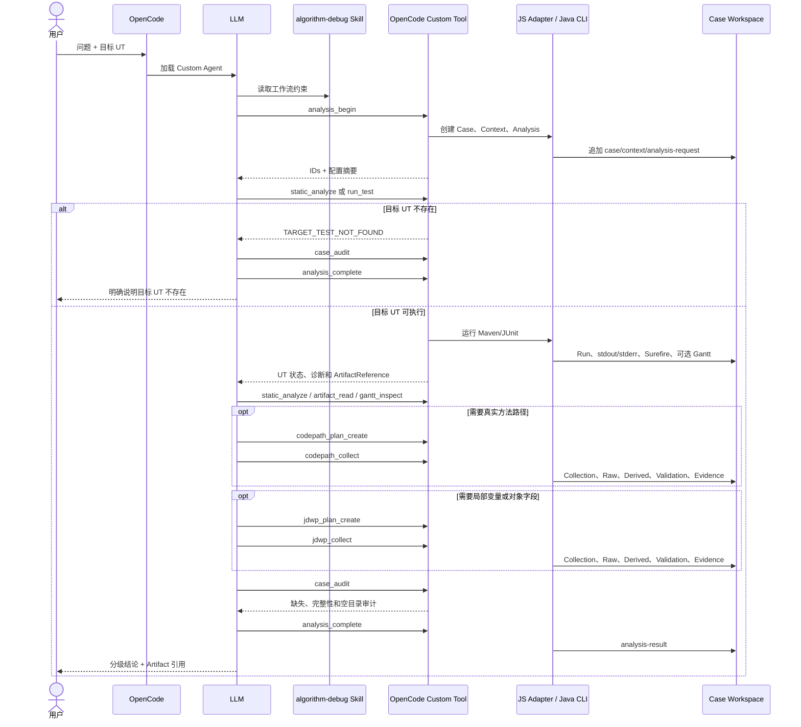

# Algorithm Debug Agent 当前模块详细设计

- 状态：Implemented
- 版本：2.0
- 日期：2026-08-25
- 范围：OpenCode + Maven/JUnit 5 + 单个算法模块中的目标 UT

## 1. 产品目标

用户给出算法问题和目标 UT。Agent 运行当前代码中的该 UT，归档控制台、测试报告和可选 Gantt；
LLM 再根据问题按需读取当前源码、采集方法路径或断点状态，最后给出带证据引用的解释。

Agent 是离线定位工具，不执行业务语义判断，不修改生产算法源码，不接管生产调度。

## 2. 运行时角色

| 角色 | 当前职责 | 明确不做 |
|---|---|---|
| OpenCode | 会话宿主，加载 Agent、Skill 和 Custom Tools，调用 LLM | 不实现 Java 分析逻辑 |
| LLM | 理解问题、选择下一工具、判断证据是否足够、解释结论 | 不伪造文件、校验、采集或 Gantt 语义 |
| Agent 文本 | 定义角色、工具权限和输出边界 | 不是后台服务 |
| Skill | 给 LLM 提供算法调试步骤、停止条件和证据规则 | 不直接执行 Java |
| OpenCode Tool | 将结构化参数转给 JS Adapter，返回 ToolResponse | 不分析业务根因 |
| JS Adapter | 启动 Java CLI、解析结构化输出、记录交互事件 | 不实现算法语义 |
| Java Agent | 执行 UT、静态分析、采集、归档、校验和有界读取 | 不替代 LLM 作业务解释 |
| Workspace | 追加保存 Case、Run、Analysis、Collection、Evidence 和答案 | 不是缓存垃圾目录 |
| Eval Harness | 启动真实 OpenCode 会话并确定性评分 | 不参与普通用户会话 |

## 3. 完整交互

箭头含义：

- `LLM -> Tool`：模型主动选择一个确定性能力，不表示固定状态机。
- `Tool -> Java CLI`：JS 只做协议适配和进程调用。
- `Java CLI -> Workspace`：产生追加式事实；失败也保存已获得的事实。
- `Workspace -> LLM`：只能通过 ToolResponse、ArtifactReference 或有界读取进入上下文。
- `LLM -> 用户`：解释由模型生成，Java 不生成业务根因。

## 4. 主流程和失败处理

### 4.1 目标 UT 不存在

`static_analyze` 返回 `TARGET_TEST_NOT_FOUND`。不得为了继续流程而执行其他 UT，也不得启动
CodePath/JDWP。LLM 直接说明 selector 不存在。

### 4.2 UT 成功

Run 归档进程输出、Surefire 报告和本次新生成的 Gantt。LLM 围绕用户问题读取源码和 Gantt；
证据不足时才选择动态采集。

### 4.3 UT 抛异常

异常发生在输入、测试准备或算法内部都按目标执行失败保存。LLM 先解释最早可信失败点；只有堆栈和
源码不足时才动态采集。

### 4.4 断言失败

归档 assertion 的 expected/actual、堆栈和源码位置。动态工具只用于解释产生差异的运行路径或状态。

### 4.5 工具失败

ToolResponse 保留稳定错误码、可安全展示的错误和已经落盘的 Artifact。LLM 必须把工具失败与目标
UT 失败分开，不得把缺失证据补成事实。

## 5. 确定性工具

| Tool | Java 能力 | 主要输出 |
|---|---|---|
| `analysis_begin` | 建立分析边界、解析统一配置 | caseId/contextId/analysisId |
| `run_test` | Maven/JUnit 单方法执行、结果捕获 | Run、Surefire、stdout/stderr、可选 Gantt |
| `static_analyze` | 当前源码 Javac AST 方法目录 | MethodCatalog、SourceAnchor、诊断 |
| `codepath_plan_create` | 编译精确方法选择计划 | CodePath Plan |
| `codepath_collect` | 独立重跑目标 UT，采集 enter/exit | Raw Trace、路径摘要、校验和 Evidence |
| `jdwp_plan_create` | 编译断点和投影计划 | JDWP Plan |
| `jdwp_collect` | 独立重跑目标 UT，采集 frame/local/field | Raw Trace、快照摘要、校验和 Evidence |
| `artifact_read` | 校验后有界读取归档文件 | 内容片段、截断信息 |
| `gantt_inspect` | JSON 结构、路径、分页和有界筛选 | 结构事实，不含业务语义 |
| `case_inspect` | 查看 Case 索引和已有动作 | 当前可复用事实 |
| `case_audit` | 按实际状态推导应有文件并校验 | expected/actual/missing/issues |
| `analysis_complete` | 归档最终答案和引用 | analysis-result |

## 6. 静态分析

当前实现使用 Java 21 Javac AST，范围是目标 Maven 模块的当前源码：

- 精确查找目标测试方法；
- 建立方法签名、当前行范围和直接调用关系；
- 给 CodePath 方法选择和 JDWP 候选位置提供导航；
- 保存 unresolved symbol 和覆盖边界。

不保存 whole-file Source SHA。行号只代表本次 Analysis 的当前源码位置，不是跨代码版本身份。
大型公司算法仍可使用该能力，但完整类型解析受 Maven test classpath 解析程度影响；`INCOMPLETE`
必须呈现给 LLM，不能宣称完整调用图。

## 7. CodePath 与 JDWP

两者独立，不存在“必须先 CodePath 后 JDWP”的技术绑定：

- CodePath 适合回答实际走过哪些方法、顺序和深度。
- JDWP 适合回答特定位置当时的局部变量、栈和受限对象字段。
- 同一次分析可以只用一个，也可以先用一个缩小另一个的范围。

每次 Collection 都会重新运行目标 UT。计划由 LLM 根据当前问题、源码和已有证据提出，Java 编译并
限制预算。超过预算时返回 `PARTIAL` 和明确截断原因；LLM 可以创建更窄的新 Plan 继续采集，而不是
让 Java 写死总采集轮数。

## 8. 动态证据基线

普通成功 Run 与动态成功 Run 的 Gantt 可以不同，不比较 Gantt SHA，Collection 标记
`NOT_COMPARED`。Gantt 仍分别归档供 LLM 按问题分析。

若普通 Run 的目标 UT 已失败，系统从结构化失败事实生成指纹；动态重跑后比较：

- `MATCHED`：复现同类失败，动态证据可用于确认该失败。
- `CHANGED`：出现不同失败，动态数据只能作探索线索。
- `INCOMPARABLE`：没有足够失败事实，不能确认。

该指纹不是源码身份，也不是算法结果正确性证明。

## 9. SHA 边界

生产链路只保留两个有用户行为闭环的 SHA：

1. `ArtifactReference.sha256`：文件登记时计算，读取/审计时重算；不一致则拒绝读取和引用。
2. 失败事实指纹 SHA：把结构化失败字段编码为稳定值，动态失败重跑时比较；不一致降低证据等级。

projectId、DFX 和 Eval 内部哈希只用于稳定 ID、脱敏或报告版本关联，不是运行门禁。

不使用 Source SHA、POM SHA、Plan SHA、Collector JAR SHA、Raw Trace 重复 SHA 或 Gantt
normalized SHA。

## 10. Workspace 规则

Case 按 `caseId/contextId/analysisId/runId/collectionId/evidenceId` 追加保存。目录仅在有文件时创建：

- 不预创建 `raw`、`logs`、`derived`、`validation` 或 `request`；
- 不使用 `.gitkeep`；
- 失败动作保留 manifest、退出码、错误和已有原始证据；
- `case_audit` 根据状态判断文件是否应该存在，不用固定模板误报；
- 空 stdout/stderr 是精确进程流记录，零字节有语义，不是占位文件。

每种文件的完整说明见
[工作流与产物](../algorithm-debug-workflow-and-artifacts.md) 和
[最终实施审计](../audits/agent-runtime-simplification-final-audit.md)。

## 11. 模块边界

| 模块 | 当前职责 |
|---|---|
| `ada-contracts` | 版本化公共模型和 Schema 契约 |
| `adapter-sdk` | 目标项目 Adapter SPI |
| `case-management` | Workspace、ArtifactReference、原子追加和审计 |
| `debug-harness` | Maven/JUnit 子进程、输出/Gantt/Surefire 捕获 |
| `static-analysis` | Javac AST MethodCatalog |
| `method-path-spi` | 方法路径采集契约 |
| `method-path-codepathtracer` | CodePath 外部 Launcher 适配 |
| `debug-plan-engine` | CodePath/JDWP Plan 编译与预算限制 |
| `jdwp-collector-core` | Agent 自维护的 JDWP 采集核心 |
| `jdwp-collector-adapter` | JDWP 进程编排和契约适配 |
| `tools/jdwp-batch-collector` | 可执行 Collector |
| `trace-normalizer` | Raw Trace 的确定性有界摘要 |
| `trace-validator` | Manifest、预算、完成状态和失败复现校验 |
| `evidence-engine` | Evidence Bundle 与充分性事实 |
| `ada-core` | 用例级应用服务编排 |
| `algorithm-debug-cli` | 稳定 JSON CLI |
| `adapters/maven-junit-adapter` | Maven/JUnit 项目识别 |
| `integration-tests` | 跨模块真实进程测试 |

`agent-evaluation`、`explanation-reporter`、`gantt-analysis`、`knowledge-engine` 已删除。
Eval Harness 位于 `agent-evals` 的 Node 脚本中；解释和 Gantt 语义由 LLM 负责。

## 12. 配置

仓库的 `config/agent-settings.json` 保存可移植默认值和可手工修改项。安装器读取该文件并把 Agent、
Skill、Tools、JS Adapter 和 Java 发布物复制到当前用户的 OpenCode 配置目录，同时打印：

- OpenCode 配置目录；
- Workspace 目录；
- 算法 Gantt 输出目录；
- DFX 目录；
- Eval 目录。

安装后 OpenCode 使用安装副本；仓库内容修改后需要重新运行安装器。

## 13. 可靠性

- 结论等级：`CONFIRMED_FACT`、`VALIDATOR_CONCLUSION`、`SOURCE_INFERENCE`、
  `LLM_HYPOTHESIS`、`MISSING_EVIDENCE`。
- Java 只输出可验证事实和状态，不输出虚构置信度。
- Raw Trace 不直接整份进入模型，通过摘要和有界读取控制上下文。
- 动态预算包括事件、命中、对象深度、元素、字符串、字节和超时。
- 多轮对话复用历史不可变证据，并用新的 analysisId/Plan/Collection 追加。

## 14. 当前限制

- 仅正式支持 Maven + JUnit 5 单测试方法。
- 静态 AST 在复杂依赖 classpath 下可能为 `INCOMPLETE`。
- CodePath 上游可能对未选方法仍有 Advice 成本。
- JDWP 命中会短暂停止事件线程，不是严格“完全无感”。
- 尚未完成大型公司算法的长时间、高事件量和高频断点压力验收。
- 不自动生成公司领域知识库，也不在 Java 中实现 Gantt 业务语义。
