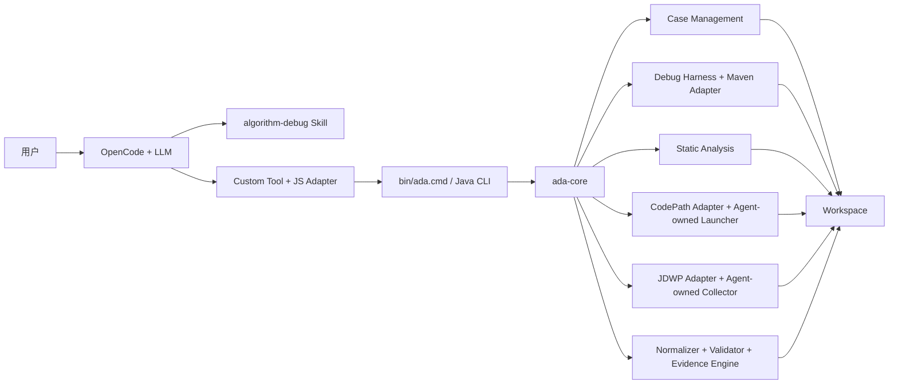
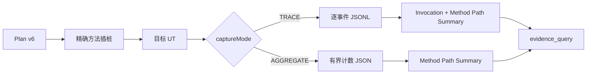

# Algorithm Debug Agent 模块详细设计

更新日期：2026-09-06。

## 1. 运行时边界

```mermaid
flowchart LR
    U["用户"] --> O["OpenCode + LLM"]
    O --> S["algorithm-debug Skill"]
    O --> T["Custom Tool + JS Adapter"]
    T --> CLI["bin/ada.cmd / Java CLI"]
    CLI --> CORE["ada-core"]
    CORE --> CASE["Case Management"]
    CORE --> RUN["Debug Harness + Maven Adapter"]
    CORE --> STATIC["Static Analysis"]
    CORE --> CP["CodePath Adapter + Agent-owned Launcher"]
    CORE --> JDWP["JDWP Adapter + Agent-owned Collector"]
    CORE --> E["Normalizer + Validator + Evidence Engine"]
    CASE --> W["Workspace"]
    RUN --> W
    STATIC --> W
    CP --> W
    JDWP --> W
    E --> W
```

OpenCode 是唯一对话运行时。Java CLI 是确定性后端。CodePath Launcher 在目标测试 JVM 内执行，因此编译为独立 JAR；JDWP Collector 在独立 JVM 通过 loopback 调试目标测试 JVM，也编译为独立 JAR。

## 2. 模块职责

| 模块 | 职责 |
| --- | --- |
| `ada-contracts` | ID、Case、Plan、Run、Collection、Evidence 和查询契约 |
| `adapter-sdk` | 目标算法项目适配 SPI |
| `case-management` | Workspace、追加式 Repository、Artifact、查询、审计和日志 |
| `debug-harness` | 外部进程、Maven/JUnit、超时和输出捕获 |
| `adapters/maven-junit-adapter` | 通用 Maven/JUnit 执行适配 |
| `static-analysis` | 有界 Java Method Catalog 与候选调用关系 |
| `method-path-spi` | 方法路径采集 SPI 和 Manifest |
| `method-path-codepathtracer` | Launcher 进程协调和 Collection 归档 |
| `tools/code-path-tracer-junit-launcher` | Plan 感知 Byte Buddy 插桩、TRACE/AGGREGATE 采集和 JUnit 启动 |
| `debug-plan-engine` | 确定性校验并编译 CodePath/JDWP Plan |
| `jdwp-collector-core` | JDWP 协议、断点、条件和值采集，不含业务语义 |
| `jdwp-collector-adapter` | 测试 JVM 与 Collector 生命周期协调 |
| `tools/jdwp-batch-collector` | JDWP Collector 可执行入口 |
| `trace-normalizer` | Raw Trace 到有界派生摘要 |
| `trace-validator` | 完整性、预算、基线和冲突校验 |
| `evidence-engine` | Evidence Bundle 与充分性判断 |
| `ada-core` | 用例编排，不承载 UI 或目标算法语义 |
| `algorithm-debug-cli` | CLI JSON 输入输出和运行时装配 |
| `integration-tests` | 跨模块契约与关键链路测试 |

根 Reactor 默认构建业务模块，`codepath-launcher` Profile 额外构建目标 JVM Launcher。

## 3. OpenCode 契约

`integrations/opencode/tools/algorithm-debug.ts` 暴露 13 个 Tool：`analysis_begin`、`case_inspect`、`algorithm_input_capture`、`case_audit`、`gantt_inspect`、`run_test`、`static_analyze`、`codepath_plan_create`、`codepath_collect`、`jdwp_plan_create`、`jdwp_collect`、`artifact_read`、`evidence_query`。

Tool 不做业务推理。JS Adapter 负责参数边界、临时请求、目标执行串行和结构化错误；Java CLI 负责确定性处理。`evidence_query` 是已注册动态 Artifact 的临时查询视图，不创建新 Artifact。

## 4. CodePath 设计

Plan v6 由精确方法、显式投影、可选 Scope 条件、采集模式、Scope ordinal 窗口和预算组成。Launcher 按 Plan 将方法分成仅路径、需要参数和需要返回值三类 Advice，只对明确选择的方法插桩。

```mermaid
flowchart LR
    P["Plan v6"] --> W["精确方法插桩"]
    W --> R["目标 UT"]
    R --> M{"captureMode"}
    M -->|TRACE| J["逐事件 JSONL"]
    M -->|AGGREGATE| A["有界计数 JSON"]
    J --> N1["Invocation + Method Path Summary"]
    A --> N2["Method Path Summary"]
    N1 --> Q["evidence_query"]
    N2 --> Q
```

AGGREGATE 用于高频宽范围发现，只支持 Summary/Count；TRACE 用于窄范围顺序和同次调用值关联。两者保留相同方法身份和投影路径语义，模型可用 AGGREGATE 结果创建更小的 TRACE Plan。所有计数和省略均显式记录，不把未跟踪值解释为不存在。

## 5. 可靠性与低影响

- 所有外部进程有超时、退出码、stdout/stderr、异常清理和有界输出。
- CodePath/JDWP 每次都重新运行目标 UT，但在单一 OpenCode Runtime 内串行。
- Raw 只读；Normalizer、Validator 和 Evidence 确定性派生，不修改 Raw。
- Artifact SHA 只检查文件完整性；失败指纹检查失败复现；成功 Gantt 不作为采集门禁。
- Collector 不猜业务字段，不展开完整对象图，不执行任意表达式。
- 新工具或模块只在真实 Eval 证明现有契约无法表达时引入。

## 6. 决策来源

- Plan 感知插桩与 AGGREGATE 模式见 [ADR-016](../decisions/ADR-016-plan-aware-codepath-weaving-and-aggregate-mode.md)。
- JDWP 源码归仓见 [ADR-014](../decisions/ADR-014-agent-owned-jdwp-collector.md)。
- 详细 CodePath 行为、预算与失败闭环见 [可扩展 CodePath 采集设计](../designs/2026-09-06-scalable-codepath-collection-design.md)。
