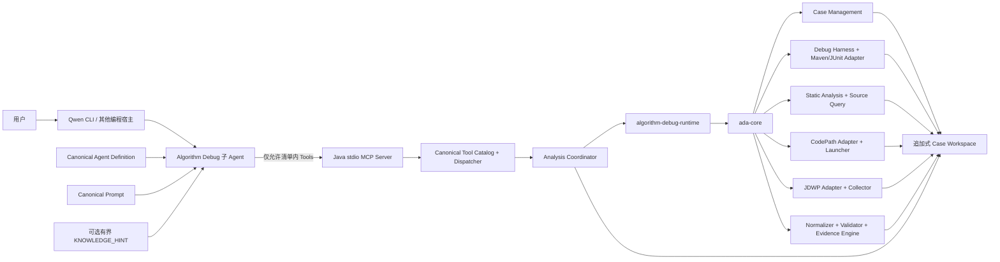
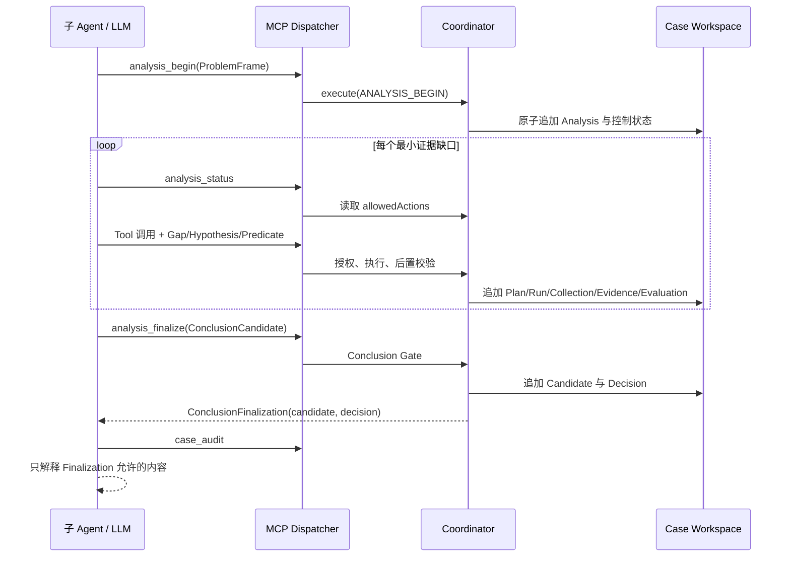
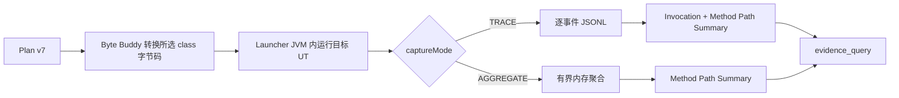

# Algorithm Debug Agent 模块详细设计

更新日期：2026-09-29。

## 1. 运行时边界


```mermaid
flowchart LR
    U["用户"] --> H["Qwen CLI / 其他编程宿主"]
    H --> A["Algorithm Debug 子 Agent"]
    D["Canonical Agent Definition"] --> A
    P["Canonical Prompt"] --> A
    K["可选有界 KNOWLEDGE_HINT"] --> A
    A -->|"仅允许清单内 Tools"| M["Java stdio MCP Server"]
    M --> C["Canonical Tool Catalog + Dispatcher"]
    C --> CO["Analysis Coordinator"]
    CO --> RT["algorithm-debug-runtime"]
    RT --> CORE["ada-core"]
    CORE --> CASE["Case Management"]
    CORE --> RUN["Debug Harness + Maven/JUnit Adapter"]
    CORE --> STATIC["Static Analysis + Source Query"]
    CORE --> CP["CodePath Adapter + Launcher"]
    CORE --> JDWP["JDWP Adapter + Collector"]
    CORE --> E["Normalizer + Validator + Evidence Engine"]
    CASE --> W["追加式 Case Workspace"]
    RUN --> W
    STATIC --> W
    CP --> W
    JDWP --> W
    E --> W
    CO --> W
```

宿主拥有模型会话、凭据和最终界面；仓库交付子 Agent 定义与确定性 MCP 能力，不在 MCP Server 内启动第二个模型。
Qwen CLI 是首个正式 Adapter，但不是核心依赖。其他宿主只要能创建子 Agent、注册本地 stdio MCP Server 并限制
工具清单，就能复用同一 Java 服务。OpenCode 入口保留为兼容路径，不再定义正式架构。

模型无法绕过 Coordinator：宿主只暴露 Capability Manifest 中的工具；每个 Tool Handler 又必须通过同一个
Dispatcher 和 Coordinator。Prompt 负责帮助模型选择动作，Coordinator 根据已归档状态执行身份、顺序、幂等、
互斥、后置条件、证据义务和 Conclusion Gate。即使模型跳步或重复调用，也只会得到结构化拒绝，不会直接进入
Collector 或 Core Service。

## 2. 模块职责

| 模块 | 职责 |
| --- | --- |
| `ada-contracts` | ID、Case、Plan、Run、Collection、Evidence、Investigation、Coordinator 与 Finalization 公共契约 |
| `adapter-sdk` | 目标算法项目适配 SPI |
| `case-management` | Workspace、追加式 Repository、Artifact、查询、审计、操作日志和跨进程锁 |
| `debug-harness` | 外部进程、Maven/JUnit、超时、退出码与输出捕获 |
| `adapters/maven-junit-adapter` | 通用 Maven/JUnit 执行适配 |
| `static-analysis` | 有界 Method Catalog、调用关系和 `source_query` |
| `method-path-spi` | 方法路径采集 SPI 和 Manifest |
| `method-path-codepathtracer` | Launcher 进程协调和 Collection 归档 |
| `tools/code-path-tracer-junit-launcher` | Plan 感知 Byte Buddy 插桩、TRACE/AGGREGATE 采集和 JUnit Platform 启动 |
| `debug-plan-engine` | 确定性校验并编译 CodePath/JDWP Plan |
| `jdwp-collector-core` | JDWP 协议、断点、条件和值采集，不含业务语义 |
| `jdwp-collector-adapter` | 测试 JVM 与 Collector 生命周期协调 |
| `tools/jdwp-batch-collector` | JDWP Collector 可执行入口 |
| `trace-normalizer` | Raw Trace 到有界派生摘要 |
| `trace-validator` | 完整性、预算、失败指纹、覆盖和冲突校验 |
| `evidence-engine` | Evidence Bundle、充分性与引用资格判断 |
| `ada-core` | Coordinator、调查状态、Conclusion Gate 与用例编排，不承载 UI 或目标算法知识 |
| `algorithm-debug-runtime` | CLI 与 MCP 共用的唯一生产组合根，装配 Core、Adapter、Collector 和 Repository |
| `algorithm-debug-mcp-server` | Java 原生 MCP Catalog、Schema、Dispatcher、stdio 生命周期与协议映射 |
| `algorithm-debug-cli` | 人工、CI、诊断和迁移兼容入口；不是模型正常调用路径 |
| `agent-definition` | Profile 2.0、Canonical Prompt 和 Capability Manifest |
| `integrations/host-adapter-kit` | 校验规范资产、映射权限、注入可选知识并原子生成宿主资产 |
| `integrations/qwen-cli` | Qwen Extension、子 Agent、安装、检查和卸载薄适配 |
| `integration-tests` | 跨模块契约与关键链路测试 |

根 Reactor 默认构建业务模块与 MCP Server；`codepath-launcher` Profile 额外构建目标 JVM Launcher。

## 3. MCP 能力契约

Capability Manifest 当前冻结 17 个 Tool：

```text
analysis_begin              case_inspect
algorithm_input_capture     case_audit
gantt_inspect               run_test
static_analyze              source_query
investigation_update        codepath_plan_create
codepath_collect            jdwp_plan_create
jdwp_collect                artifact_read
evidence_query              analysis_status
analysis_finalize
```

数量不是协议常量。新增能力必须进入 Java Catalog、Capability Manifest、Schema、Handler、Coordinator Policy、打包测试
和 Eval，不允许只在某个宿主模板中加名字。Agent Definition 不再复制工具分组，Capability Manifest 是宿主权限唯一
快照，构建测试验证其与 Java Catalog 完全一致。

MCP Server 还提供 4 个 Resource 和 3 个 Prompt，供支持这些能力的宿主使用。它们不是主流程硬依赖：只有 Tools 是
Profile 2.0 的必需宿主能力；不支持 MCP Prompt 的宿主由 Adapter 原样嵌入 Canonical Prompt。

Tool 不做模型推理。MCP 层只负责协议、Schema、上下文、取消和错误映射；Coordinator 执行确定性动作授权；Core 和
Collector 负责采集与归档。`evidence_query` 是注册 Artifact 上的有界临时查询视图，不创建或伪造新 Evidence。

## 4. 调查收敛与最终化


```mermaid
sequenceDiagram
    participant L as 子 Agent / LLM
    participant M as MCP Dispatcher
    participant C as Coordinator
    participant W as Case Workspace
    L->>M: analysis_begin(ProblemFrame)
    M->>C: execute(ANALYSIS_BEGIN)
    C->>W: 原子追加 Analysis 与控制状态
    loop 每个最小证据缺口
        L->>M: analysis_status
        M->>C: 读取 allowedActions
        L->>M: Tool 调用 + Gap/Hypothesis/Predicate
        M->>C: 授权、执行、后置校验
        C->>W: 追加 Plan/Run/Collection/Evidence/Evaluation
    end
    L->>M: analysis_finalize(ConclusionCandidate)
    M->>C: Conclusion Gate
    C->>W: 追加 Candidate 与 Decision
    C-->>L: ConclusionFinalization(candidate, decision)
    L->>M: case_audit
    L-->>L: 只解释 Finalization 允许的内容
```

收敛不是让模型“感觉足够”，而是把自由度限制在可审计边界内：

- 每轮动态采集绑定一个未关闭 Gap、一个可证伪 Hypothesis 和一个冻结 Predicate。
- Observation 保留 `TRUE/FALSE/UNKNOWN`；FALSE 必须作为反证，UNKNOWN/截断/不完整不能改写成支持。
- `analysis_status.allowedActions` 给出当前可执行动作，但不替模型选择业务假设。
- Conclusion Gate 检查引用、覆盖、反证、竞争假设、失败指纹、因果链和允许等级。
- `analysis_finalize` 返回服务端 `ConclusionFinalization`，把原始 Candidate 与同一身份、结论 ID、控制修订上的
  Decision 绑定。`ALLOWED` 才能解释已接受结论；`REJECTED` 只能继续允许动作或报告证据边界。

该机制不能保证模型提出的第一个假设一定正确，但能阻止“无证据强行解释”被包装为确认性根因，并让多次分析在相同
Evidence 与 Policy 下得到相同的资格边界。

## 5. 可选知识边界

`knowledgeDirectory` 由 Host Adapter 消费，不由 Coordinator 或 Evidence Engine 读取。Adapter 只接受非符号链接
目录中的有效 UTF-8 Markdown，并使用 Agent Definition 中的文件数、目录深度、单文件字节和总字节预算。文件按相对
路径稳定排序后附加到生成的子 Agent Prompt，每段记录相对路径、SHA-256 和字节数。

知识只用于理解术语、提出候选假设和选择源码查询方向，不能注册为 Evidence、改变 Predicate、满足证据义务或绕过
Conclusion Gate。目录未配置、不存在或为空均保持完整调查能力；非法文件和预算超限在宿主资产原子切换前失败。

## 6. CodePath 设计

Plan v7 绑定调查对象，并保留 v6 的精确方法、显式投影、可选 Scope 条件、采集模式、Scope ordinal 窗口和预算。
Launcher 按 Plan 将方法分成仅路径、需要参数和需要返回值三类 Advice，只对明确选择的方法插桩。


```mermaid
flowchart LR
    P["Plan v7"] --> W["Byte Buddy 转换所选 class 字节码"]
    W --> R["Launcher JVM 内运行目标 UT"]
    R --> M{"captureMode"}
    M -->|"TRACE"| J["逐事件 JSONL"]
    M -->|"AGGREGATE"| G["有界内存聚合"]
    J --> N1["Invocation + Method Path Summary"]
    G --> N2["Method Path Summary"]
    N1 --> Q["evidence_query"]
    N2 --> Q
```

插桩是 Agent 代码通过 Byte Buddy API 声明匹配规则和 Advice；Byte Buddy 在目标 class 被 Launcher JVM 加载时完成
字节码转换。产物不是改写磁盘 `.class` 或 UT，而是当前 Launcher JVM 内包含采集调用的目标业务方法。Launcher 再
通过 JUnit Platform 执行指定测试方法，采集运行时记录并落盘。它复用 Maven 解析的 test classpath，但不经过 Maven
Surefire Provider，因此必须显式等价传递所需 JVM 参数、系统属性和测试配置。

AGGREGATE 用于高频宽范围发现，只支持 Summary/Count；TRACE 用于窄范围顺序和同次调用值关联。两者使用不同的
运行时记录策略，不是对同一份原始事件做不同后处理；但保留相同方法身份、投影路径和覆盖语义。

## 7. JDWP 设计

JDWP Collector 通过 loopback 调试接口连接由 Agent 启动的目标测试 JVM，在 Plan 指定的可执行源码位置安装断点，
按条件筛选命中并读取显式命名的标量路径。Raw 快照保留线程、位置、frame、projection、命中计数和 sequence；
Normalizer 将 Collector 输出映射为稳定的 Summary/Evidence 模型并保留 rawArtifact、JSONL 行号和 sequence provenance。

归一化是确定性数据建模，不补造业务含义。`sequence` 表示 Collector 实际写出的记录顺序，因未匹配、采样、预算或
截断可以不连续；它不是业务步骤号。JDWP 证明指定位置和命名值的有界运行时观测，不能替代 CodePath 的方法路径，
也不能单独证明字段的业务含义。

## 8. 可靠性与低影响

- 所有外部进程有超时、退出码、stdout/stderr、异常清理和有界输出。
- CodePath/JDWP 每个 Collection 都在受控目标 UT 运行上采集；Coordinator 保证目标执行互斥和追加式归档。
- Raw 只读；Normalizer、Validator 和 Evidence 确定性派生，不修改 Raw。
- Artifact SHA 只检查文件完整性；失败指纹检查失败复现；成功 Gantt 不要求失败指纹或额外基准。
- Collector 使用 allowlist 和标量投影，不猜业务字段，不展开完整对象图，不执行任意表达式。
- MCP stdout 只允许协议帧；诊断进入 stderr、Case 日志或配置的 DFX 目录。
- 新工具或模块只在真实契约与 Eval 证明现有边界无法表达时引入，不为推测需求创建空悬 API。

## 9. 决策来源

- Java 原生 MCP、Coordinator 与宿主边界见 [ADR-018](../decisions/ADR-018-java-native-mcp-portable-subagent.md)。
- Profile 2.0、知识注入和 Finalization 简化见 [边界简化设计](../designs/2026-09-29-portable-agent-boundary-simplification-design.md)。
- Plan 感知插桩与 AGGREGATE 模式见 [ADR-016](../decisions/ADR-016-plan-aware-codepath-weaving-and-aggregate-mode.md)。
- JDWP 源码归仓见 [ADR-014](../decisions/ADR-014-agent-owned-jdwp-collector.md)。
- CodePath 行为、预算与失败闭环见 [可扩展 CodePath 采集设计](../designs/2026-09-06-scalable-codepath-collection-design.md)。
