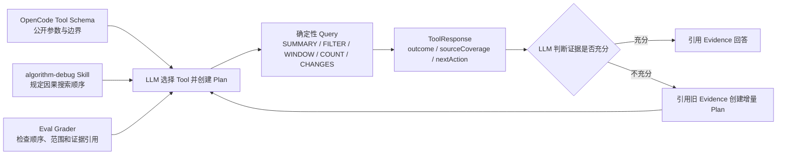

# 2026-09-05 Dynamic Evidence Discovery 最终审计

## 1. 审计目标

本轮优化解决的不是 Collector 完全无法采集数据，而是 CodePath/JDWP 数据量增大后，LLM 难以快速定位少量关键因果记录的问题。实现保持通用：Java 代码只处理调用、投影、条件、序号、计数、变化和覆盖状态，不解释 Wafer、资源或调度策略语义。

## 2. LLM 如何发现并正确使用能力

四层职责如下：

| 层 | 确定性职责 | 对 LLM 的作用 |
|---|---|---|
| OpenCode Tool Schema | 暴露 CodePath Scope 条件、JDWP 条件/采样和五种查询参数 | 告诉模型“能调用什么、参数怎么填” |
| Skill | 规定输入优先、宽范围到精确范围、CodePath 到 JDWP 的因果搜索顺序 | 告诉模型“什么时候调用、为什么调用” |
| ToolResponse | 返回 `MATCHED/NO_MATCH`、`COMPLETE/PARTIAL`、截断和下一动作 | 告诉模型“结果能证明什么、下一步做什么” |
| Eval | 检查真实 Tool 调用顺序、Scope 条件、查询模式和最终 Evidence 引用 | 防止模型绕过工具契约或过早下结论 |

## 3. 已实现能力

### 3.1 CodePath v5

- `scopeMethodKey + scopeConditions` 在 Scope 方法进入时按 ARGUMENT 标量投影执行最多 4 个 AND 精确条件。
- Scope 未匹配时不写入该调用的已选方法事件；匹配后保留完整的已选子调用区间。
- Manifest 分别记录 observed、matched 和 unavailable，避免把字段读取失败当成条件不匹配。
- 参数和返回值投影继续保留名称、来源路径、读取状态和值，LLM 可结合方法声明与源码解释含义。
- Invocation v2 增加 `parentSelectedEnterEventId`，表示最近的已选父调用，不伪装成 JVM 直接调用者，也不引入随机 Invocation ID。

### 3.2 Evidence Query v2

| 模式 | 确定性输出 | LLM 预期动作 |
|---|---|---|
| `SUMMARY` | 记录数、方法/Tracepoint、可用值名、状态和序号范围 | 先了解数据结构，再选过滤维度 |
| `COUNT` | 稳定排序的 topN、otherCount 和分布 | 找高频或稀有候选，不直接认定根因 |
| `FILTER` | 同一记录内满足全部谓词的调用或快照 | 缩小到目标实体、方法、操作或状态 |
| `WINDOW` | 锚点前后有界记录及父调用关系 | 恢复局部先后关系，查找更早原因 |
| `CHANGES` | 同一 JDWP Tracepoint 相邻已捕获快照的值变化 | 把连续状态压缩成转折点并映射回源码 |

所有查询只接受已注册并通过 SHA 完整性校验的 `CODEPATH_INVOCATIONS` 或 `JDWP_SNAPSHOT_SUMMARY`。查询结果不落盘，不修改 Raw Trace；原始和派生动态 Artifact 仍按 Case 归档。

### 3.3 JDWP 变化查询

- 保留现有条件、首批连续匹配和后续周期采样，不重写 Collector。
- `CHANGES` 第一版只支持 JDWP，避免把不同 CodePath 调用错误解释为同一对象状态变化。
- `skippedMatchedHits=0` 才表示两个快照对应连续 matched hit；存在采样间隔时返回 `PARTIAL` 语义，禁止宣称完整连续变化。
- 创建 CHANGES 计划时，Skill 要求 `maxCapturedHits` 和 `captureFirstMatchedHits` 至少为 2；单快照不能证明变化。

### 3.4 读取路由和归档闭环

- `artifact_read` 明确拒绝直接读取 CodePath Invocation 和 JDWP Snapshot Summary，并返回使用 `evidence_query` 的恢复动作。
- CodePath 后处理生成的 Invocation Artifact 被注册一次，并包含在 Collection ToolResponse 的 `artifactIds` 中。
- 成功但零命中、值不可用或截断的采集仍可生成 `MISSING_EVIDENCE`；工具进程失败不会生成可用于确认结论的目标 Evidence。
- DFX 日志记录查询模式、覆盖、扫描/命中/返回数量、截断和下一动作，不记录实际业务值。

## 4. 返回分支闭环审计

| 返回情况 | 可得结论 | 强制下一步 |
|---|---|---|
| `MATCHED + COMPLETE` | 在当前明确采集范围内存在匹配记录 | 查看记录、窗口和对应源码 |
| `MATCHED + PARTIAL` | 部分证据中存在正向线索 | 可沿线索继续，但不能排除未采集路径 |
| `NO_MATCH + COMPLETE` | 当前明确且完整的采集范围内没有匹配 | 检查条件后拒绝该范围内假设，必要时扩大范围 |
| `NO_MATCH + PARTIAL` | 当前部分证据未找到 | 补采集或修复 unavailable，禁止否定假设 |
| `queryMoreAvailable=true` | 查询输出预算已截断，源证据不一定截断 | 使用 continuation 继续查询 |
| Scope `unavailable>0` | 条件投影读取失败 | 修正投影或换到值可见的方法 |
| CHANGES `skippedMatchedHits>0` | 中间 matched hit 未捕获 | 只能描述采样快照变化，必要时提高连续捕获数 |
| Tool 结构化失败 | 请求、完整性或外部进程失败 | 按错误码修正调用，不得从失败 Tool 推断业务根因 |

审计未发现只有生产者没有消费者的新字段，也未发现没有 Skill/Eval 动作的返回分支。

## 5. 针对性真实 OpenCode E2E

报告目录：

`C:\Users\zhao1k\AppData\Local\algorithm-debug-agent\evals\20260904203853-5f9a9db3`

结果：`cross-wafer-causal` 通过，0 correctness failure、0 evidence failure、0 warning，耗时 303418 ms，未超时、未超过输出预算。

真实执行数据：

| 阶段 | 结果 |
|---|---|
| 普通 UT | 成功并归档输入、stdout、Surefire 和 102603 字节 Gantt |
| CodePath Plan | v5；Scope 为 `scheduleWafer`；条件为 `waferId=A-W2`；投影 Job/Wafer/操作/决策字段 |
| CodePath Collection | 观察 15 个 Scope 调用、匹配 1 个、不可用 0；保留 24 个事件、13502 字节；无截断 |
| CodePath Query | SUMMARY 扫描 12 条；FILTER 将数据缩到 4 条 PICK；COUNT 得到 `REQUIRED_RESOURCE=1`、`WAFER_PREDECESSOR=10` |
| JDWP Plan | 条件 `waferId=A-W2 AND operationType=PICK`；保留前 2 次匹配；采集 7 个命名状态值 |
| JDWP Collection | 观察 37 次、匹配 2 次、捕获 2 次；无条件不可用 |
| JDWP Query | CHANGES 得到 start 60 到 66、阻塞原因 `REQUIRED_RESOURCE` 到 `WAFER_PREDECESSOR` 等 5 个状态变化 |
| Evidence | CodePath 与 JDWP 两份 Sufficiency 均为 `SUFFICIENT` |
| Workspace Audit | 37 个注册 Artifact 完整性检查通过，无问题、无空目录 |
| Interaction Audit | 通过；普通 UT、CodePath UT 和 JDWP UT 串行，无目标执行重叠 |
| 最终回答 | 开头列出 Case/Analysis 目录和实际使用能力，并按证据等级解释结论 |

本次 E2E 中所有动态大数据均通过 `evidence_query` 读取；`artifact_read` 只读取算法输入、普通 UT 输出、Method Catalog 和有界 Method Path Summary。

## 6. 自动化验证

| 命令/门禁 | 结果 |
|---|---|
| 根项目 `mvn test` | 19 个 Reactor 模块 `BUILD SUCCESS`；138 份报告共 532 tests，0 failure，0 error，4 skipped |
| OpenCode/Eval Node tests | 70/70 通过 |
| `scripts/build-agent.ps1` | CLI、CodePath Launcher、JDWP Collector 构建通过 |
| 卸载、安装、`install-opencode.ps1 -Mode Check` | 通过；当前 OpenCode 配置、Workspace、Gantt、DFX 和 Eval 路径可解析 |
| 100000 条 CodePath 查询边界 | 单元测试覆盖完整扫描；100001 条按上限拒绝，不无界加载 |
| 真实 Case 文件审计 | expected/actual 一致，无空目录；空 stderr 文件仅表示成功进程没有错误输出 |

## 7. 精简边界和已知限制

- 未引入数据库、向量库、Embedding、图数据库、常驻索引服务或业务规则引擎。
- 未重写 JDWP Collector，未增加异步写盘、文件锁或跨 OpenCode 会话协调。
- 当前只保证一次 OpenCode 分析中的普通 UT、CodePath 和 JDWP 目标执行串行。
- CodePath Scope 只支持方法入参的显式标量投影精确匹配，不调用 getter，不递归展开集合/Map/完整对象图。
- `CHANGES` 只支持 JDWP；CodePath 通过 FILTER/WINDOW/父调用关系解释不同调用。
- CodePath 查询最多扫描 100000 条 Invocation；更大数据需要收紧 Plan/Scope，而不是增加无界内存。
- Agent 不猜测参数业务含义。LLM 根据参数名、类型、方法声明、投影路径、实际值、源码、算法输入和可选知识解释业务。

这些限制减少了并发、存储和业务过拟合风险，不影响当前目标：让模型从已采集的大量通用动态证据中确定性缩小到可解释的因果记录。

## 8. Quality-50 补充验证

2026-09-05 补跑完整 Quality-50 时产生两份报告：

| 报告 | 结果 | 判定 |
|---|---|---|
| `20260905010607-838b8043` | 10 PASS / 40 FAIL | 从 Agent 仓库目录误启动，`targetModule` 被解析为 Agent 仓库，50 个输入捕获均返回 `TARGET_TEST_NOT_FOUND`；该报告不作为产品能力证据 |
| `20260905013001-7fbc884a` | 6 PASS / 44 FAIL | 正确从 `D:\javacode\hellomvn` 启动；前 6 个 Case 真实执行并通过，后 44 个 Case 均在调用 Agent 前被 OpenCode TLS 错误阻塞 |

第二份报告中实际通过的是 `passing-01` 至 `passing-05` 和 `missing-ut-01`。六个已启动 Case 的 Workspace Audit 与 Interaction Audit 全部通过，Eval Workspace 没有空目录；五个正常成功场景的 Agent 日志没有 WARN/ERROR，缺失 UT 场景只记录了预期的 `TARGET_TEST_NOT_FOUND`。

后 44 个 Case 的 `stdout.jsonl` 均只有同一错误：`unknown certificate verification error`，`observedToolSequence` 为空，没有创建 Case，也没有执行 UT、CodePath 或 JDWP。单独重跑 `missing-ut-02` 仍复现该错误；不调用任何 Agent Tool 的最小 `opencode run` 请求也在同一 TLS 层失败。因此这 44 个结果属于外部模型连接阻塞，不能计为 Agent 功能失败，也不能计为通过。

当前 Quality-50 的严格结论为：6 个 Case 已验证通过，44 个 Case 待 OpenCode 模型连接恢复后补跑。完整 Quality-50 尚未全量验收，禁止宣称 50/50 通过。
