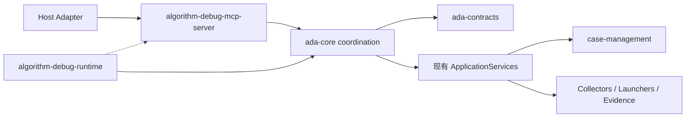

# 可移植 MCP 子 Agent 与 Coordinator 设计实施前审计

- 审计日期：2026-09-25
- 审计对象：
  - `docs/designs/2026-09-25-portable-mcp-subagent-and-coordinator-design.md` 0.3
  - `docs/decisions/ADR-018-java-native-mcp-portable-subagent.md`
- 审计阶段：生产代码实施前
- 审计结论：`TECHNICALLY_IMPLEMENTABLE / REVIEW_REQUIRED`

> 说明：本文件保存 2026-09-25 的实施前审计快照。2026-09-29 已由 Profile 2.0 边界简化设计取代其中“模型自填
> Completion Contract”的宿主契约；当前完成边界是服务端 `ConclusionFinalization(candidate, decision)`。

## 1. 结论

方案在架构、依赖方向、协议边界、状态恢复、并发控制、证据语义、兼容策略和测试入口上已经形成闭环，未发现
阻止进入详细实施计划的 Critical/High 级设计缺陷。

当前结论不是“代码已经可以直接开始写”。设计仍为 `Review`，ADR 仍为 `Proposed`；按仓库设计先行规则，应先由
用户复核并批准设计，再生成逐任务实施计划。MCP SDK 离线可用性、13/18 工具清单和宿主源码能力依赖是阶段 A
必须用真实输入验证的实施门禁，不授权用推测接口填补。

## 2. 审计方法

本次执行以下静态审计：

1. 对照根目录 `AGENTS.md` 的产品、证据、设计、测试、模块、契约、性能和 Agent 评测规则逐项检查。
2. 对照现有 Maven 模块、`ControlPlaneServices`、CLI、13 个工具、配置与构建脚本检查文件落点。
3. 检查 MCP Server、Coordinator、Core、Case Management、Agent Definition 和 Host Adapter 的职责边界。
4. 检查成功 UT、断言失败、异常失败、动态采集变化和证据不足的语义是否可以独立表达。
5. 检查 Case 状态恢复、并发目标执行、operation 幂等、取消和崩溃后的确定性行为。
6. 检查历史 Artifact、CLI `ToolResponse 2.0` 和 OpenCode 迁移窗口是否保留兼容路径。
7. 检查是否存在未定义文件、隐式旁路、占位设计、绝对开发机路径或无测试的核心规则。

## 3. 需求闭环审计

| 用户目标 | 设计落点 | 审计结论 |
|---|---|---|
| Agent 可适配任意编程工具 | Canonical Agent Definition + stdio MCP Server + Host Adapter Kit | 闭环；宿主无子 Agent 能力时只承诺 MCP 能力集成 |
| 不是一盘散沙的 MCP 工具 | Catalog、Dispatcher、Coordinator、ControlView、ConclusionFinalization | 闭环；统一性由服务内部控制面实现 |
| Coordinator 不依赖 Skill 约束 | 每次 Tool Call 在 Server 内强制经过 `AnalysisCoordinator` | 闭环；模型没有可绕过入口 |
| MCP Server 本身是否等于 Agent | 明确区分宿主模型子 Agent、Agent Definition 与 MCP 能力服务 | 语义清晰 |
| 先 Qwen，再适配其他宿主 | Qwen Adapter 为第一实现，第二宿主作为可移植性门禁 | 闭环；不把 Qwen 规则写入 Core |
| 当前根仓库实施 | ADR 明确禁止在 `.worktrees` 实施 | 闭环 |
| 分析更准确、稳定、可收敛 | 证据义务、结论门禁、收敛 Eval，不以措辞一致为目标 | 闭环；不虚假承诺模型推理绝对确定 |

## 4. 架构与依赖审计

### 4.1 依赖方向

目标依赖方向为：

审计结论：没有让 `ada-contracts` 依赖实现模块，没有让 Collector Adapter 承担晶圆调度语义，也没有让 Host
Adapter 反向成为业务事实源。MCP 模块直接调用 Core，消除了正常模型调用中的 JS → CLI → Core 重复协议。

### 4.2 Coordinator 边界

`AnalysisCoordinator` 只编排状态投影、Policy、Handler、锁、幂等、义务和结论门禁；Maven、CodePath、JDWP 的
具体实现仍由现有 ApplicationService 完成。Policy 与 Handler 独立注册，避免一个类同时包含全部工具逻辑。

审计结论：Coordinator 有成为 God Class 的结构风险，但设计已经用 Registry、Policy、Handler、Projector、
Lock 和 Conclusion Gate 分解，并要求类级单元测试。实施审查必须拒绝把各工具规则重新堆回 Coordinator 主类。

### 4.3 MCP 与 Agent 边界

MCP Server 不调用模型、不持有凭据、不实现第二个 Agent Loop；宿主负责创建子 Agent，Agent Definition 统一角色和
必需能力，Java Finalization 契约统一完成边界。该设计既能通过 MCP 跨宿主复用能力，又不会把“协议服务”误称为
“完整模型 Agent Runtime”。

审计结论：边界成立。

## 5. 证据语义审计

原问题是一个 `evidenceUsable` 布尔同时表达“数据是否完整可读”和“数据是否有资格支持确认性结论”，并把失败
复现基准错误应用到成功 UT。0.2 起设计拆为：

- Artifact 事实：`artifactReadable`、`collectionComplete`；
- 场景事实：`baselineRequired`、`baselineComparable`、`failureFingerprintMatched`；
- 调查事实：`obligationSatisfied`；
- 结论资格：`confirmationEligible`。

规则审计：

| 场景 | 数据是否保留 | 是否要求失败基准 | 可否支持确认性同类失败结论 |
|---|---|---|---|
| UT 成功 | 保留 | 否 | 按观测覆盖、完整性和矛盾独立判断 |
| UT 断言失败且指纹 `MATCHED` | 保留 | 是 | 可以，但仍受截断、覆盖和矛盾限制 |
| UT 异常失败且指纹 `MATCHED` | 保留 | 是 | 可以，但只确认同类异常失败及其覆盖范围 |
| `CHANGED/INCOMPARABLE` | 保留 | 是 | 不可以；只能作为线索或受限假设 |
| Collector/Artifact 不完整 | 保留可读部分 | 取决于场景 | 仅在未被缺失部分影响的范围内使用 |

审计结论：数据保存、失败复现和结论等级已经正交；成功 UT 不再因没有失败 RunTest 基准被丢弃。实现必须用回归
测试证明旧混合布尔不再参与最终资格计算，不能仅重命名字段。

## 6. 数据、并发与恢复审计

- `AnalysisControlView` 由不可变归档重建，不保存可覆盖的 `current-state.json`。
- 操作采用 `started.json` 加唯一终态文件；多个终态被视为冲突，不采用“最后写入获胜”。
- Coordination 和 Conclusion 决策按 ID 追加，包含 Schema、Policy、输入哈希和 provenance。
- 目标 UT、CodePath 和 JDWP 使用 Project 级 OS 文件锁；普通 Case 写入使用短事务锁。
- 获得锁后必须再次投影状态，避免等待期间依据过期状态执行。
- operationId 已完成时返回历史 receipt，进行中或结果不确定时不自动重复运行 UT。

审计结论：满足追加保存、跨进程互斥、崩溃可审计和目标执行不盲目重试的要求。锁文件位于 `.control`，与证据
Artifact 分离；它是同步设施而非事实源。

## 7. 兼容与迁移审计

设计初稿存在三项歧义，已经在 0.2 中修正：

1. 不再直接删除/改写现有 `config/agent-settings.json`；MCP 使用新增
   `config/mcp-agent-settings.json`，旧配置在迁移窗口保留。
2. 明确新增 `CliCoordinatedResultAdapter`；CLI 可保持 `ToolResponse 2.0`，但不能绕过 Coordinator。
3. 明确锁、operation、coordination 和 conclusion 的具体目录与只追加终态规则。

实施计划映射现有 `AdaMain` 后又发现：CodePath/JDWP 具体装配若分别放入 CLI 与 MCP 会形成重复组合根。
0.3 新增 `algorithm-debug-runtime`，将 ServiceLoader、Java/Maven、Collector 和 Doctor Probe 装配集中到一个模块；
CLI 与 MCP 只依赖该 Runtime，不互相依赖。该修订消除了入口重复，没有改变已批准的 MCP/Coordinator 边界。

历史 Case、Run、Collection、Evidence 和 ToolResponse 不升级原文件 Schema；新控制产物进入新增目录。OpenCode 资产
只有在 MCP 发布、回滚和宿主验证全部通过后才退出正式安装。

审计结论：兼容策略可实施，没有要求原地重写历史数据。

## 8. 测试充分性审计

设计已经列出精确测试文件，并覆盖：

- Unit：Projector、Policy、Coordinator、Conclusion、Evidence、Lock、Journal；
- Contract：Schema、15 个基线 Tool、MCP 结果、历史 Fixture；
- Integration：stdio 全协议、Server 重启、双 Server 竞争、取消和不确定操作；
- E2E：成功 UT、断言失败、异常失败、失败指纹变化、多轮 CodePath/JDWP；
- Security/Fault：路径逃逸、stdio 污染、子进程崩溃、写盘中断；
- Performance/Eval：冷启动、热调用、状态投影、10-Case Smoke、50-Case Quality 和重复运行收敛。

审计结论：验证层级完整。实施必须遵循阶段化 Red-Green-Refactor，并在跨模块契约完成后执行根项目
`mvn test`；不能等到全部代码完成才补测试。

## 9. 性能与安全审计

设计给出了请求/响应、对象深度、Tool 数、Artifact 数、投影时间、并发数和关闭等待的默认值与上限；大输出返回
Artifact 引用，不把 Raw Trace 直接发送给模型。stdio 不监听端口，Workspace 由受信根与 MCP roots 的交集确定，
不暴露任意 Shell、可执行文件、主类或输出目录。

审计结论：第一版边界符合本地子 Agent 用途，没有为不存在的远程需求引入 OAuth、多租户或 HTTP 服务。正式值仍
需用基准测试校准，但已有确定的超限行为，不会依赖无界内存或线程。

## 10. 剩余实施门禁

以下项目不是未决架构选择，但在对应阶段未完成前不能进入生产发布：

| 门禁 | 完成证据 | 未通过时行为 |
|---|---|---|
| 用户批准设计与 ADR | 文档状态改为 `Approved`，记录批准日期 | 不生成生产代码 |
| MCP SDK/离线镜像/许可证 | Maven dependency tree、离线解析、NOTICE/SBOM 检查 | 停止依赖接入，不私造协议 SDK |
| 13/18 工具清单 | 名称、输入 Schema、实现来源、测试和用途对照表 | 只实施已验证的 13+2 基线，不推测另外 5 个 |
| 宿主源码工具依赖 | Prompt/Eval 调用清单和真实 Case 证据 | 只按证据设计有界只读能力 |
| 逐任务实施计划 | 文件、测试、命令、提交边界和退出条件经批准 | 不开始生产实现 |
| 阶段验证 | 对应 Unit/Contract/Integration/E2E/Eval 结果 | 不进入下一阶段或发布 |

## 11. 缺陷等级与最终判定

| 等级 | 数量 | 说明 |
|---|---:|---|
| Critical | 0 | 无数据破坏、不可逆迁移或架构不可实施问题 |
| High | 0 | 无关键流程旁路或证据语义冲突 |
| Medium | 3 | SDK 离线预检、公司 5 工具清单、宿主源码能力清单；均已有显式门禁 |
| Low | 0 | 初稿三项歧义及组合根遗漏已在 0.2/0.3 修正 |

最终判定：设计在技术上可以实施，允许进入“用户复核 → 逐任务实施计划”阶段；尚不允许跳过复核直接修改生产
代码。实施过程中如发现需要改变 MCP/Agent/Coordinator 边界、公共 Schema 或持久化布局，必须先更新设计和 ADR，
再继续编码。
