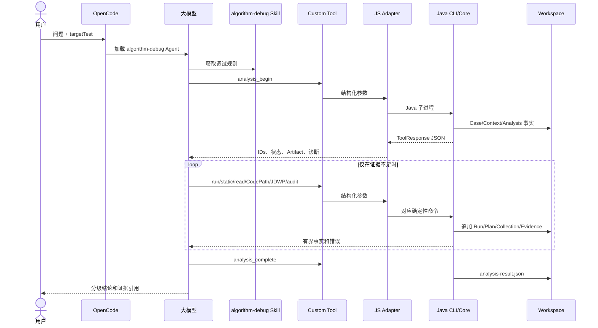

# Agent 运行时精简最终审计

- 审计日期：2026-08-25
- 审计范围：生产 Java、OpenCode 集成、Skill、安装器、Workspace、DFX、Eval 和真实 Demo E2E
- 结论：当前 OpenCode 算法 UT 调试主链路已实现；已删除无消费者模块、重复 SHA/Plan 和空目录创建。

## 1. 当前可用效果

用户在算法项目中启动 OpenCode，指定目标 JUnit 5 UT 并提出问题。LLM 能：

1. 建立 Case/Context/Analysis；
2. 检查目标 UT 是否存在；
3. 运行单个 Maven/JUnit UT；
4. 区分测试成功、目标异常、断言失败和工具失败的事实；
5. 归档 stdout/stderr、Surefire 和本次 Gantt；
6. 读取当前源码 MethodCatalog；
7. 按需独立执行 CodePath 或 JDWP；
8. 读取有界 Gantt/Artifact；
9. 审计 Workspace 完整性；
10. 归档带证据引用和结论等级的最终答案。

这不是 Java 固定工作流状态机。LLM 根据当前问题和已有证据决定下一步；Skill 约束必需动作、工具适用
条件、证据等级和停止条件。

## 2. OpenCode、LLM、Skill、Agent 交互

准确含义：

- OpenCode 是宿主，不是 Java Agent 本身。
- Agent 文件定义身份和权限，Skill 定义推理工作流。
- LLM 是唯一的业务问题解释者。
- Custom Tool/JS Adapter 是 OpenCode 到 Java CLI 的协议桥。
- Java Agent 负责可重复的执行、采集、校验和归档。
- Workspace 是每次动作的证据账本。
- Eval Harness 只在发布回归时扮演自动用户，不参与普通会话。

## 3. 当前模块审计

| 模块 | 生产 Java | 测试 Java | 用途 |
|---|---:|---:|---|
| ada-contracts | 84 | 24 | 公共契约和 Schema |
| adapter-sdk | 13 | 6 | 项目 Adapter SPI |
| case-management | 25 | 20 | Workspace、Artifact、审计 |
| debug-harness | 40 | 17 | Maven/JUnit 和结果捕获 |
| static-analysis | 5 | 2 | Javac AST MethodCatalog |
| method-path-spi | 7 | 2 | 方法路径 SPI |
| method-path-codepathtracer | 7 | 5 | CodePath 适配 |
| debug-plan-engine | 8 | 4 | 动态计划编译 |
| jdwp-collector-core | 5 | 1 | JDWP 采集核心 |
| jdwp-collector-adapter | 10 | 8 | JDWP 编排 |
| tools/jdwp-batch-collector | 4 | 2 | Collector 可执行入口 |
| trace-normalizer | 8 | 3 | 有界确定性摘要 |
| trace-validator | 5 | 3 | 完成、预算、基线校验 |
| evidence-engine | 4 | 2 | Evidence 和充分性事实 |
| ada-core | 27 | 14 | 应用服务 |
| algorithm-debug-cli | 6 | 4 | JSON CLI |
| adapters/maven-junit-adapter | 1 | 2 | Maven/JUnit 项目识别 |
| integration-tests | 0 | 1 | 跨模块真实进程验证 |

`integration-tests` 是有测试消费者的 test-only 模块，不是空模块。

已删除：

- `agent-evaluation`
- `explanation-reporter`
- `gantt-analysis`
- `knowledge-engine`

Eval 使用 `agent-evals` Node Harness；解释和 Gantt 语义由 LLM 处理，不需要四个空 Java 模块。

## 4. 12 个 OpenCode Tools

| Tool | 作用 | 主要 Workspace 写入 |
|---|---|---|
| analysis_begin | 建立分析边界和配置上下文 | case/context/analysis-request |
| case_inspect | 查看已有 Case 索引 | 无新证据 |
| case_audit | 推导并校验应有文件 | 审计结果返回，不制造占位文件 |
| gantt_inspect | 有界检查 Gantt JSON | 无派生业务语义 |
| run_test | 执行目标 UT | runs、raw、artifact metadata |
| static_analyze | 当前源码 AST | method-catalog、analysis metadata |
| codepath_plan_create | 创建精确路径计划 | plans、artifact metadata |
| codepath_collect | 采集实际方法路径 | collections、derived、validation、evidence |
| jdwp_plan_create | 创建断点投影计划 | plans、artifact metadata |
| jdwp_collect | 采集变量和对象字段 | collections、derived、validation、evidence |
| artifact_read | 完整性校验后有界读取 | 无 |
| analysis_complete | 保存最终回答和引用 | analysis-result |

## 5. 每个 Case 文件的作用

下表列出当前实现可能出现的全部文件模式。文件只在对应动作发生时出现。

| 相对路径 | 生成者 | 作用 | 何时存在 |
|---|---|---|---|
| `case.json` | analysis_begin | Case 身份和问题摘要 | 每个 Case |
| `interaction.jsonl` | DFX Recorder | 按时间记录工具开始/结束、状态、错误和 Artifact | 每个真实 OpenCode Case |
| `contexts/<contextId>/context.json` | analysis_begin | 目标项目、UT 和问题上下文 | 每个 Context |
| `contexts/<contextId>/reproduction.json` | run_test | 当前 Context 的失败复现参考 | 有可比较失败事实 |
| `analyses/<analysisId>/analysis-request.json` | analysis_begin | 本轮请求和 ID | 每个 Analysis |
| `analyses/<analysisId>/analysis-result.json` | analysis_complete | 最终答案、结论等级和引用 | 正常完成 |
| `analyses/<analysisId>/method-catalog.json` | static_analyze | 当前源码方法、行范围、调用边和覆盖诊断 | 执行静态分析 |
| `analyses/<analysisId>/plans/<planId>.json` | plan_create | Agent 编译后的 CodePath/JDWP 计划 | 创建动态计划 |
| `runs/<runId>/run-request.json` | run_test | 目标 selector 和执行配置 | 执行普通 Run |
| `runs/<runId>/run-outcome.json` | run_test | 进程、JUnit、目标失败和 Gantt 捕获状态 | 每个 Run，包括失败 |
| `runs/<runId>/run-result-fingerprint.json` | run_test | 结构化失败事实及紧凑指纹 | 目标失败且事实可用 |
| `runs/<runId>/raw/stdout.log` | Harness | 目标 Maven/JUnit 原始 stdout | 每个 Run |
| `runs/<runId>/raw/stderr.log` | Harness | 目标 Maven/JUnit 原始 stderr；可合法为 0 字节 | 每个 Run |
| `runs/<runId>/raw/surefire/*.xml` | Harness | 本次变化的 Surefire XML 快照 | Maven 产生报告 |
| `runs/<runId>/raw/gantt.json` | Harness | 本次 UT 新生成 Gantt 的不可变副本 | 成功定位新 JSON |
| `artifacts/<artifactId>.json` | CaseArchiveRepository | 指向实际归档文件的类型、相对路径、size、SHA 元数据 | 文件注册为 Artifact |
| `collections/<collectionId>/collection-request.json` | collect | Collection 与 Plan、基准 Run 的关联 | 每个 Collection |
| `collections/<collectionId>/collection-summary.json` | collect | 完成状态、预算、baselineOutcome、evidenceUsable | 每个 Collection |
| `collections/<collectionId>/collector-plan.json` | jdwp_collect | Collector 实际消费的运行时计划 | JDWP Collection |
| `collections/<collectionId>/manifest.json` | Agent Adapter | Agent 侧进程、路径和完成事实 | 每个动态 Collection |
| `collections/<collectionId>/raw/codepath.jsonl` | CodePath Launcher | 原始方法 enter/exit | CodePath 有事件 |
| `collections/<collectionId>/raw/jdwp.jsonl` | JDWP Collector | 原始断点和变量事件 | JDWP 有事件 |
| `collections/<collectionId>/raw/collector-manifest.json` | JDWP Collector | Collector 版本、事件、预算和结束原因 | JDWP Collection |
| `collections/<collectionId>/raw/gantt.json` | Collection Harness | 动态重跑产生的 Gantt 副本 | 本次产生新 JSON |
| `collections/<collectionId>/logs/stdout.log` | CodePath Adapter | Launcher stdout | CodePath Collection |
| `collections/<collectionId>/logs/stderr.log` | CodePath Adapter | Launcher stderr；可合法为空 | CodePath Collection |
| `collections/<collectionId>/logs/target-stdout.log` | JDWP Adapter | 目标 JVM stdout | JDWP Collection |
| `collections/<collectionId>/logs/target-stderr.log` | JDWP Adapter | 目标 JVM stderr；可合法为空 | JDWP Collection |
| `collections/<collectionId>/logs/collector-stdout.log` | JDWP Adapter | Collector stdout | JDWP Collection |
| `collections/<collectionId>/logs/collector-stderr.log` | JDWP Adapter | Collector stderr；可合法为空 | JDWP Collection |
| `collections/<collectionId>/validation/baseline-check.json` | Validator | NOT_COMPARED/MATCHED/CHANGED/INCOMPARABLE 及可用性 | 完成后处理 |
| `collections/<collectionId>/validation/post-processing-failure.json` | Core | Normalizer/Validator/Evidence 失败详情 | 仅后处理失败 |
| `collections/<collectionId>/derived/<evidenceId>/normalization-manifest.json` | Normalizer | 输入、输出、预算和截断事实 | Normalizer 执行 |
| `collections/<collectionId>/derived/<evidenceId>/method-path-summary.json` | Normalizer | 有界方法路径摘要 | CodePath |
| `collections/<collectionId>/derived/<evidenceId>/jdwp-snapshot-summary.json` | Normalizer | 有界断点快照摘要 | JDWP |
| `collections/<collectionId>/derived/<evidenceId>/collection-validation.json` | Validator | Manifest、预算、完成和基线结论 | Validator 执行 |
| `evidence/<evidenceId>/evidence-build-request.json` | Evidence Engine | 本次 Evidence 的输入引用 | 构建 Evidence |
| `evidence/<evidenceId>/evidence-bundle.json` | Evidence Engine | 可供 LLM 使用的事实和 provenance | 构建成功 |
| `evidence/<evidenceId>/sufficiency-evaluation.json` | Evidence Engine | 覆盖、截断、矛盾和缺失证据 | 充分性评估执行 |

`plans/<planId>.json` 是计划内容；`artifacts/<artifactId>.json` 只是该文件的完整性元数据，不是第二份
计划。JDWP 的 `collector-plan.json` 是协议转换后的 Collector 输入，也不是同一文件的重复登记。

## 6. SHA 审计

| 类型 | 是否保留 | 实际生效点 | LLM 感知 |
|---|---|---|---|
| ArtifactReference SHA | 是 | 登记后在 read/inspect/audit 重算 | 损坏时收到明确错误，禁止引用 |
| 失败事实指纹 SHA | 是 | 普通失败与动态失败比较 | MATCHED/CHANGED/INCOMPARABLE |
| projectId 短 SHA | 内部 | 稳定 Workspace 目录 ID | 不作为证据 |
| DFX 脱敏哈希 | 内部 | 日志隐私 | 不作为证据 |
| Eval 资产 SHA | 内部 | 报告版本关联 | 只在 Eval |
| Source/POM/Plan/JAR/Raw/Gantt SHA 门禁 | 否 | 已删除 | 无 |

## 7. 真实 OpenCode E2E 审计

报告路径均相对于已配置的 `evalDirectory`。下列 Windows 路径是验证机示例，不是生产硬编码。

| Case | Report ID | 文件 expected/actual | Workspace | Interaction | 关键事实 |
|---|---|---:|---|---|---|
| passing-ut | 20260825023435-29d270ff | 15/15 | PASS | PASS | 正常 Run 和 Gantt |
| missing-ut | 20260825041625-370250f9 | 5/5 | PASS | PASS | TARGET_TEST_NOT_FOUND，无 Run/Collection |
| missing-input | 20260825023435-29d270ff | 18/18 | PASS | PASS | 输入准备异常 |
| algorithm-loop-guard | 20260825042210-a9d37c6f | 18/18 | PASS | PASS | 算法异常，现有证据充分，模型未滥用采集 |
| assertion-failure | 20260825023435-29d270ff | 20/20 | PASS | PASS | expected/actual 和堆栈归档 |
| static-current-source | 20260825023435-29d270ff | 17/17 | PASS | PASS | 当前 AST，覆盖状态可见 |
| codepath-independent | 20260825030514-8706c6a0 | 46/46 | PASS | PASS | SUCCESS/NOT_COMPARED/usable |
| jdwp-independent | 20260825041928-58678468 | 54/54 | PASS | PASS | SUCCESS/NOT_COMPARED/usable，无重复 Plan |
| artifact-integrity-rejection | 20260825041336-75c5d79f | 15/15 | 预期拒绝 | PASS | 仅 ARTIFACT_SIZE_MISMATCH |

一次前台工具调用曾在等待批量 Suite 时超时，但持久化报告随后完整收尾：
`20260825023435-29d270ff/summary.json` 为 `passed=9, failed=0`，九份 `case-review.md` 均存在。
后续又分别重跑了缺失 UT、算法异常、CodePath、JDWP 和 Artifact 损坏等高风险 Case，并以上表较新的
报告作为最终证据。该现象是前台等待超时，不是 Agent Case 失败。

## 8. 无作用文件和空目录审计

- 九个最终 Case 的 empty directories 均为 0。
- expected files 与 actual files 全部一致。
- 仓库空 `.agents` 已删除。
- 没有 `.gitkeep`。
- 四个无生产实现的 Java 模块已删除。
- JDWP 同一 Plan 的重复 Artifact 登记已删除。
- Collection 临时 CodePath runtime plan 执行后清理。
- 允许的零字节文件仅为确实无输出的进程 stdout/stderr。

## 9. 可靠性评估

当前结构符合常见 Tool-using Agent 方向：

- 模型做自适应规划和解释；
- Skill 提供策略而不是硬编码状态机；
- 工具提供小而确定的能力；
- 外部运行和证据通过 Workspace 可追溯；
- Artifact 进入上下文前做完整性和大小控制；
- Eval 使用真实宿主会话检查行为回归。

没有给最终回答生成伪精确数值置信度。可信度来自证据等级、Artifact 引用、Validator 状态、截断和
缺失证据显式呈现。

## 10. 当前未完成和优化方向

1. 在公司算法上验证 Maven classpath、长 sequence、大 Gantt 和高事件量。
2. 改善静态分析对完整 test classpath 的解析，减少 `INCOMPLETE`；当前不需要引入新 AST 框架。
3. 建立 CodePath 未选方法 Advice 成本和 JDWP 高频命中扰动基线。
4. 增加多线程场景前，需要定义线程一致性和暂停影响，不在当前单线程目标内。
5. 自动领域知识文件尚未实现；当前由仓库文档、源码和用户问题共同提供上下文。
6. Eval 全 Suite 外层时限可按 Case 隔离，避免长动态用例耗尽批次总时限。

这些限制不会阻止当前 Demo 和同类 Maven/JUnit 单 UT 的手动 OpenCode 使用，但公司算法发布前必须
完成前 3 项规模化验收。
