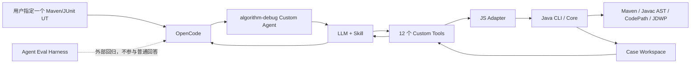

# 当前能力与边界

本文是当前实现事实，不包含未来占位模块。

## 1. 当前产品链路

大模型负责规划和解释。Java 负责确定性执行、归档、预算、解析、校验和审计。没有回答后的在线二次模型审计。

## 2. 已实现

- 任意合法 Maven/JUnit 单方法目标执行。
- 通过、异常、断言失败和工具失败的通用结构化结果。
- 顶层算法 JSON 差分捕获和 Gantt Artifact 归档。
- 有界 Gantt summary/slice 读取，不做业务语义结论。
- 当前源码 Javac AST Method Catalog，无 whole-file Source SHA。
- CodePath 精确方法 Plan、独立运行、Raw/Derived/Validation/Evidence。
- Agent 自有源码 JDWP Collector、精确 descriptor/line Plan、受限局部变量/字段/栈采集。
- 事件数、命中数、深度、字符串、集合项、字节数、超时和 idle timeout 预算。
- 失败目标结构化指纹 `MATCHED/CHANGED/INCOMPARABLE`。
- ArtifactReference 唯一文件完整性机制。
- Case/Context/Analysis/Run/Collection/Evidence 追加归档。
- Case-local DFX `interaction.jsonl`。
- `case_audit` 和 Eval Workspace/Interaction/Expected-Actual 审计。
- 12 个 OpenCode Custom Tools。
- 幂等 OpenCode 安装，不绑定 OpenCode 版本号。
- 9 个真实 OpenCode Smoke Case。

## 3. OpenCode Tools

| Tool | 作用 |
|---|---|
| `analysis_begin` | 初始化项目、Case、Context 和 Analysis |
| `case_inspect` | 返回 Case 的有界近期摘要 |
| `case_audit` | 审计 Case 文件、Artifact 和空目录 |
| `gantt_inspect` | 有界读取已注册 Gantt 的结构 |
| `run_test` | 运行目标 UT 并归档结果 |
| `static_analyze` | 构建当前源码 Method Catalog |
| `codepath_plan_create` | 校验并归档 CodePath Plan |
| `codepath_collect` | 独立重跑并采集方法路径 |
| `jdwp_plan_create` | 校验并归档 JDWP Plan |
| `jdwp_collect` | 独立重跑并采集运行时状态 |
| `artifact_read` | 按 Artifact ID 校验后有界读取 |
| `analysis_complete` | 归档最终答案和证据引用 |

## 4. 当前模块

18 个根 Maven 模块都有生产或测试职责。不存在空的 `agent-evaluation`、`explanation-reporter`、
`gantt-analysis` 或 `knowledge-engine` 模块。Eval 是 Node 外部 Harness；Gantt 读取复用
`debug-harness`；解释和可选领域知识属于 Skill/LLM。

模块逐项说明见
[模块详细设计](architecture/algorithm-debug-agent-module-detailed-design-v1.md)。

## 5. 保留的 SHA

| 机制 | 必要性 |
|---|---|
| Artifact SHA-256 | 防止注册后文件被替换、截断或篡改 |
| 失败事实 SHA-256 | 判断动态失败是否仍是同一个目标失败 |
| projectId/DFX/Eval 内部 Hash | 稳定 ID、脱敏和评测可比性，不是业务证据门禁 |

已删除 Plan、Raw Trace、Source、POM、成功 Gantt 和 Collector JAR 的重复 SHA 门禁。

## 6. 当前没有

- 多 Maven 模块跨 Reactor 完整调用图。
- 在线生产设备连接或生产调度决策。
- 自动修改算法生产源码进行插桩。
- Gantt 业务语义硬编码、字段级业务 Diff 或根因规则引擎。
- 自动生成公司领域知识库。
- 独立 MCP Server。
- 自动保证 LLM 结论绝对正确。

## 7. 需要继续优化

- 静态分析目前不注入完整 Maven test classpath，遇到 JUnit、Lombok、生成代码和外部依赖时会保留
  compiler/unresolved warnings，并将目录标记为 `INCOMPLETE`。
- CodePath 使用动态 Byte Buddy Attach，未来 JDK 默认禁用动态 Agent 加载时需要发布策略调整。
- 大型公司算法需要用真实规模 UT 测量 CodePath/JDWP 事件量、耗时和截断率，再调整默认预算。
- OpenCode Tool/Plugin 接口是客户端适配层；迁移到其他 CLI 时复用 Java CLI 和 Workspace，
  重新实现薄适配器与 DFX hook。
- LLM 具有非确定性；新增问题类型时应增加 Eval Case，而不是增加业务硬编码分类。
