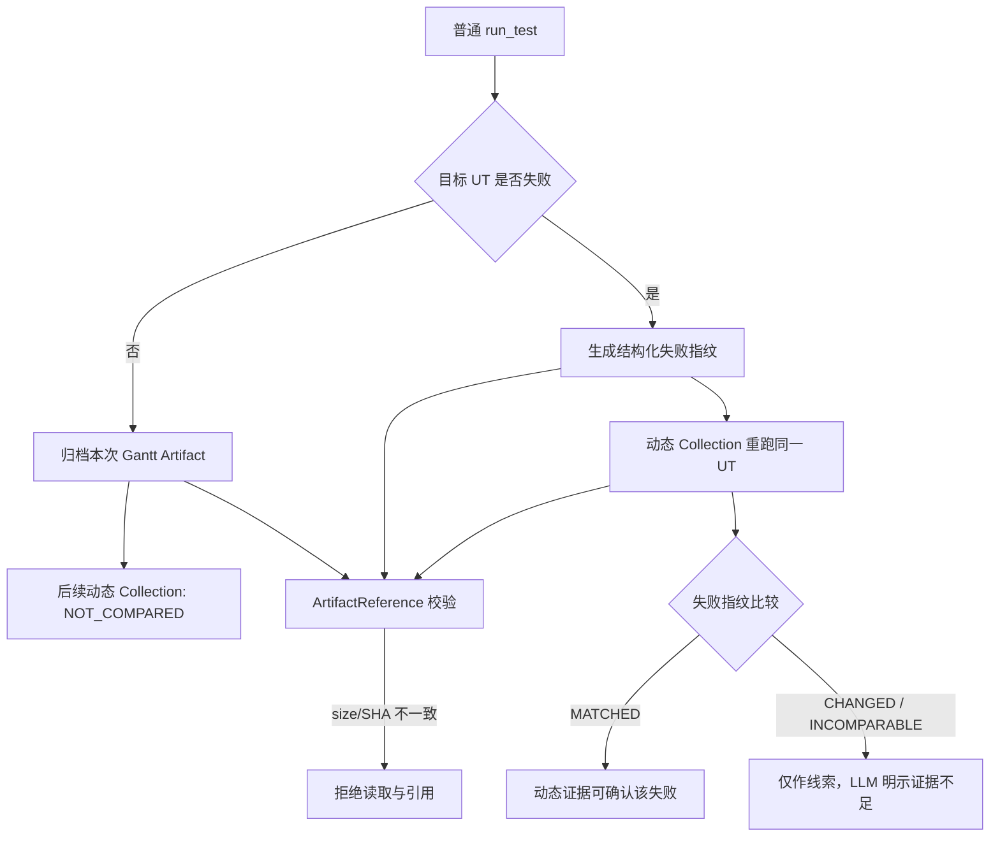

# ADR-008：Artifact 完整性与目标失败复现基线

- 状态：Accepted（取代旧 JSON/Gantt 内容指纹基线）
- 日期：2026-08-25

## 背景

旧设计把每次算法 Gantt JSON 的 normalized SHA 当作动态采集基线。实际产品允许当前代码、输入、
时序和算法结果在不同运行中变化；内容不同既不能证明采集干扰，也不能证明算法错误。该门禁会错误
拒绝本来有效的 CodePath/JDWP 证据，并引入额外模型、字段和分支。

另一方面，两个确定性问题仍需要稳定校验：

1. LLM 读取的归档文件是否仍是登记时的同一文件；
2. 对一个已经失败的目标 UT 做动态重跑时，是否复现了同类失败。

## 决策

### 1. ArtifactReference 是唯一文件完整性机制

归档文件登记时保存相对路径、字节数和 SHA-256。读取、引用和 Case 审计时统一检查：

- 路径位于 Case 根目录；
- 是普通文件且不是符号链接；
- 当前字节数与登记值相同；
- 当前 SHA-256 与登记值相同。

任一检查失败，Tool 返回结构化完整性错误，LLM 不得读取或引用该文件。

### 2. 成功 Gantt 不做跨运行 SHA 门禁

普通 Run 和动态 Collection 各自定位并归档本次 Gantt。文件名和内容都可以不同：

- Collection baseline 为 `NOT_COMPARED`；
- Gantt 的差异由 LLM 按用户问题通过 `gantt_inspect` 或有界读取分析；
- Java 不实现 Gantt 业务语义、normalized SHA 或字段级 diff。

### 3. 失败目标使用结构化失败指纹

普通 Run 失败时，从稳定失败事实构造指纹，例如测试 selector、失败类型、异常类、关键消息和首个可信
用户代码位置。动态重跑失败后比较该指纹：

- `MATCHED`：同类失败已复现，动态证据可用于确认；
- `CHANGED`：失败不同，动态证据只作探索；
- `INCOMPARABLE`：事实不足，不能确认。

SHA-256 只是该结构化值的紧凑稳定表示，不比较源码、Plan、Gantt 或文件名。

## 删除的机制

- Gantt raw/normalized SHA 基线；
- Source whole-file SHA；
- POM SHA；
- CodePath/JDWP Plan SHA；
- Collector JAR SHA；
- Manifest 中与 ArtifactReference 重复的 Raw Trace SHA；
- 多轮 Baseline 状态机和 Gantt 字段级通用 Diff。

projectId、DFX 和 Eval 内部哈希只用于稳定 ID、脱敏和版本关联，不属于证据门禁。

## 行为流程

## 影响

- 不同运行产生不同算法结果不再被误判为采集污染。
- 真正的文件篡改仍被确定性拒绝。
- 已失败 UT 的动态采集仍有明确复现门禁。
- LLM 能直接看到 `baselineOutcome` 和 `evidenceUsable`，无需理解 SHA 细节。
- 历史 Case 可保留旧字段，但当前运行不再消费旧 Gantt/Plan/Source SHA。
