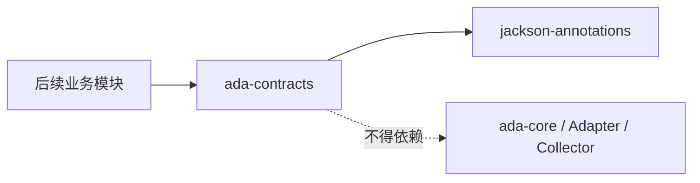
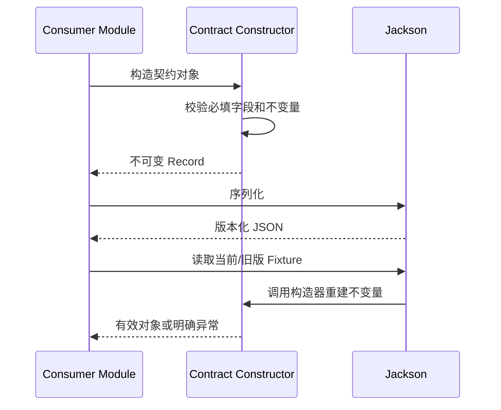

# ada-contracts Phase 0 可实施详细设计

> 2026-08-12 兼容性修订：`ToolResponse` 1.0 的 `nextAllowedActions` 固定状态机已由 ADR-006
> 废弃；当前实现升级为 2.0，由 `data` 中的自描述事实和版本化 Skill 指导大模型决策。

- 文档状态：Implemented
- 设计版本：1.1
- 创建日期：2026-08-10
- 目标里程碑：Phase 0 - 最小稳定契约
- 关联架构：`../architecture/algorithm-debug-agent-module-detailed-design-v1.md`
- 关联规则：`../development/development-rules.md`

## 1. 背景与问题

`ada-contracts` 当前只有空 Maven 模块。后续 Case Management、Debug Harness、工具 Adapter 和
Evidence Engine 都需要共享可序列化、可校验、无实现依赖的基础契约。如果直接一次性实现架构清单中
所有 Debug Plan、Trace、Finding 和 Evidence 类型，会在消费模块尚未开发前冻结推测性 API。

因此本轮只建立下一阶段能够直接消费的 Phase 0 基础契约，并通过 JSON round-trip 和旧版 fixture
兼容测试冻结其行为。

## 2. 目标与非目标

### 2.1 目标

- 提供集中管理的 Schema 版本常量；
- 提供不可变、JSON 中表现为字符串的不透明 ID；
- 表达目标 JUnit UT、执行身份和无采集基线清单；
- 表达带哈希的相对路径产物引用；
- 提供跨 Adapter/CLI 使用的统一 `ToolResponse<T>`；
- 对必填字段、相对路径、SHA-256 和集合不可变性执行构造时校验；
- 保证 Java 21、Jackson 2.17 和 JUnit 5 下可序列化与反序列化。

### 2.2 非目标

- 不实现 Case 存储、文件写入和目录分配；
- 不实现 Debug Plan、Raw/Domain Trace、Finding、Evidence Bundle；
- 不引入 Bean Validation、Spring、Lombok 或业务算法类型；
- 不在本轮提供全仓库所有 JSON Schema；消费场景稳定后按契约逐个增加。

## 3. 设计原则与依赖边界

- 主代码只依赖 `jackson-annotations`，不依赖 Jackson Databind 或任何实现模块；
- `jackson-databind` 和 `jackson-datatype-jsr310` 仅用于测试 JSON 契约；
- 所有公开类型位于 `org.example.algorithmdebug.contracts`；
- Record 在构造时建立不变量，后续无需二次校验才能安全使用；
- ID 只校验非空、长度和控制字符，不解析其中的业务结构。



## 4. 契约范围

| 类型 | 职责 |
|---|---|
| `SchemaVersions` | 集中保存当前契约版本 |
| `ProjectId/CaseId/InquiryId/TurnId/RunId/AnalysisId/EvidenceId` | 不透明强类型 ID |
| `TargetTest` | 表达 JUnit 类和方法选择器 |
| `ExecutionIdentity` | 冻结代码、输入、classpath、JVM、Adapter 和结果哈希 |
| `ArtifactReference` | 表达相对路径、媒体类型、SHA-256 和大小 |
| `BaselineManifest` | 关联一次无采集基线运行及调度结果 |
| `ToolResponse<T>` | 工具成功/失败、产物和允许的后续动作 |

## 5. 关键不变量

### 5.1 不透明 ID

- 长度为 1 到 128；
- 不允许前后空白和 ISO 控制字符；
- JSON 表现为一个字符串，而不是 `{ "value": "..." }`；
- 不从 ID 中推导目录、时间或对象类型。

### 5.2 产物引用

- `relativePath` 必须为 `/` 分隔的相对路径；
- 禁止绝对路径、盘符、空段、`.` 和 `..`；
- `sha256` 必须是 64 位十六进制；
- `sizeBytes` 不得为负数。

### 5.3 ToolResponse

- `success=true` 时必须有非空 `data`；
- `success=false` 时 `data` 必须为 `null`；
- `artifacts` 和 `nextAllowedActions` 防御性复制且对外不可变；
- 提供 `success(...)` 和 `failure(...)` 工厂方法，减少调用方构造错误状态。

## 6. JSON 流程



未知 JSON 字段由消费端 ObjectMapper 的兼容策略控制。本模块测试使用
`FAIL_ON_UNKNOWN_PROPERTIES=false` 验证新增字段的向后读取能力。

## 7. 测试设计

先提交并运行以下失败测试，再添加生产实现：

- `OpaqueIdentifierJsonTest`：字符串 JSON round-trip、非法 ID；
- `ArtifactReferenceTest`：路径、SHA-256、大小和标准化；
- `TargetTestTest`：选择器和非法类/方法名；
- `BaselineManifestJsonTest`：当前模型 round-trip、旧 fixture 新增字段兼容；
- `ToolResponseTest`：成功/失败不变量、集合防御性复制。

模块验收命令：

```powershell
mvn -pl ada-contracts test
```

根项目回归命令：

```powershell
mvn test
```

## 8. 兼容策略

- 当前版本从 `1.0` 开始；
- 新增可选 JSON 字段保持主版本；
- 删除字段、改变含义或类型时提升主版本并提供 fixture 迁移测试；
- 构造器校验变化如果会拒绝旧数据，视为破坏性变更。

## 9. 风险与缓解

| 风险 | 缓解 |
|---|---|
| 过早冻结过多 DTO | 本轮只实现 Phase 0 消费所需类型 |
| Jackson 注解污染纯领域模型 | 仅依赖轻量 annotations，换取稳定跨进程 JSON 表现 |
| ID 规则过度绑定业务 | 只做通用安全校验，不解析格式 |
| 相对路径跨平台不一致 | 契约统一使用 `/`，实际路径转换由存储模块负责 |

## 10. 实施步骤

1. 更新模块测试依赖；
2. 添加失败测试并确认失败原因是缺少契约实现；
3. 实现通用校验支持和不透明 ID；
4. 实现 Target、Identity、Artifact、Baseline 和 ToolResponse；
5. 运行模块测试和根项目测试；
6. 更新模块 README 与本文实现完成记录。

## 11. 实现完成记录

- 实际变更：实现 7 个不透明 ID、TargetTest、ExecutionIdentity、ArtifactReference、
  BaselineManifest、ToolResponse 和公共校验支持；主代码仅增加 Jackson annotations 依赖。
- 相对设计偏差：第一次 Red 阶段执行时 PowerShell `-LiteralPath` 未展开测试文件通配符，
  Maven 因未发现测试而成功；修正复制方式后重新执行，确认因 41 个“找不到契约类型”编译错误失败，
  随后才加入生产实现。
- 测试结果：初版 `mvn -pl ada-contracts test` 运行 12 个测试；2026-08-11 扩展后运行
  16 个测试，均为 0 失败、0 错误、0 跳过；
  根项目 `mvn test` 的 21 个 Reactor 模块全部构建成功。
- 已知限制：本阶段尚未发布完整 JSON Schema；Debug Plan、Trace、Finding 和 Evidence 类型由后续
  消费模块的可实施设计驱动增加。

## 12. 变更记录

| 日期 | 版本 | 变更内容 |
|---|---|---|
| 2026-08-10 | 1.0 | Phase 0 实施设计 |
| 2026-08-10 | 1.0 | 完成实现并记录测试结果 |
| 2026-08-11 | 1.1 | 增加 CaseFingerprint、BaselineVerification 与 Case 生命周期；BaselineManifest 升级 2.0 |

## 13. Phase 0 Baseline 生命周期扩展

跨模块设计 `2026-08-11-case-baseline-lifecycle-design.md` 已将运行身份拆分为运行前
`CaseFingerprint` 与运行后 `ExecutionIdentity`，并新增 `BaselineRunObservation`、
`BaselineVerification`、`CaseLifecycleState` 和 `RunStatus`。旧 `ExecutionIdentity` JSON 属于未发布
的 0.1.0 契约，随 `BaselineManifest` Schema 2.0 一次迁移。
