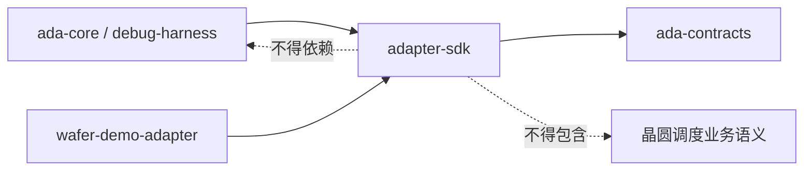
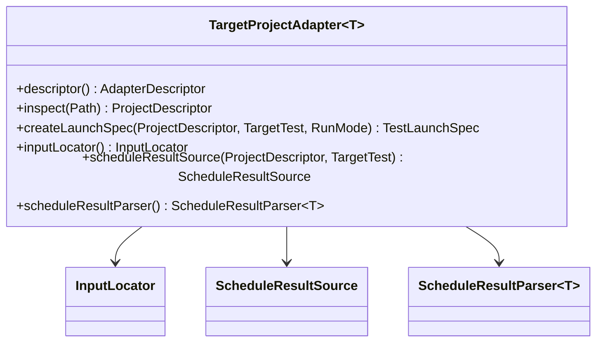

# adapter-sdk 可实施详细设计

- 文档状态：Review（1.1 已实现，1.2 变更待实施）
- 设计版本：1.2
- 创建日期：2026-08-10
- 目标里程碑：Phase 0 - 目标算法适配边界；Phase 1 - 内容指纹职责收敛
- 前置模块：`ada-contracts` Phase 0
- 关联架构：`../architecture/algorithm-debug-agent-module-detailed-design-v1.md`

## 1. 背景与问题

Algorithm Debug Agent 必须适配不同公司的 Maven 算法仓库，而不能在 Core 中写死 UT 启动方式、
输入位置和调度结果格式。1.1 已把语义 Hash 策略放在 Adapter 中，但真实时间戳文件名场景只需要
通用 JSON 内容一致性；继续由 Adapter 选择业务字段会过早引入目标业务耦合。初版建立 SPI 时，
其中 `createLaunchSpec(TargetTest, RunMode)` 没有目标项目参数，会迫使 Adapter 保存一次 inspect 的
可变状态，不利于多 Case 并发和复用。

1.1 已建立无状态、组合式 Adapter SPI；1.2 仅移除 Hash 职责，不改变项目识别、启动规格、输入定位、
结果发现或 Parser 边界。

## 2. 目标与非目标

### 2.1 目标

- 描述 Adapter 身份、版本和能力；
- 描述已检查的目标 Maven 项目；
- 用结构化 `TestLaunchSpec` 表达 UT 启动意图，不传递拼接后的 Shell 命令；
- 隔离输入定位、结果定位和结果解析；
- 以泛型约束 Parser 的类型化 Snapshot；
- 内容 Hash 由 Debug Harness 通用计算，Adapter 不负责 Baseline 比较；
- 统一 Adapter 错误码和异常 cause；
- 所有集合和值对象不可变并在构造时校验。

### 2.2 非目标

- 不运行 Maven/JUnit 子进程；
- 不实现 Wafer Demo Adapter；
- 不读取 `adapter.yaml`；
- 不定义 Domain Mapping、Source Scope 和 Sensitive Field Policy 的最终模型；这些能力等待
  Normalizer、Static Analysis 和 Security Policy 的消费设计稳定后再加入；
- 不实现 CodePath/JDWP Collector 调用。

## 3. 依赖边界



`adapter-sdk` 主代码只依赖 `ada-contracts` 和 JDK。测试只增加 JUnit 5。

## 4. 核心模型

| 类型 | 职责 |
|---|---|
| `AdapterDescriptor` | Adapter ID、版本、显示名和能力集合 |
| `AdapterCapability` | 声明已支持的执行/定位/采集能力 |
| `BuildTool` | 目标项目构建工具；首版只开放 Maven |
| `RunMode` | BASELINE、CODE_PATH、JDWP |
| `ProjectDescriptor` | 目标项目根目录、构建文件和 ProjectId |
| `TestLaunchSpec` | Maven goals/properties、JVM 参数和超时 |
| `ScheduleResultSnapshot` | Adapter 解析后的类型化结果标记及 Schema 版本 |
| `AdapterException` | 带稳定错误码和 cause 的受检异常 |

## 5. 组合 SPI



关键调整：Adapter 不保存“当前项目”状态；所有与项目有关的操作显式接收 `ProjectDescriptor`。
因此同一 Adapter 实例可以安全服务多个项目和 Case，实际实现仍需自行保证线程安全。

## 6. 启动规格安全边界

`TestLaunchSpec` 只描述参数列表，不包含单条 Shell 字符串：

```text
ProjectDescriptor
TargetTest
RunMode
Maven goals
Maven properties
JVM arguments
Timeout
```

Debug Harness 未来必须以参数数组启动进程，禁止把这些字段重新拼成未经转义的 Shell 命令。
Goals 必须是无空白 token；Maven property key 必须满足安全字符规则；超时必须大于零。

## 7. 路径规则

- `projectRoot` 必须是绝对规范化路径；
- 相对 `buildFile` 以项目根目录解析；
- `buildFile` 必须位于项目根目录内；
- Result Source 返回的路径必须由具体 Adapter 校验，SDK 不假设文件一定在调用前存在；
- Adapter 不得修改目标算法生产源码。

## 8. 错误模型

Adapter 的预期失败通过 `AdapterException` 返回：

- `ADAPTER_PROJECT_NOT_SUPPORTED`
- `ADAPTER_BUILD_FILE_MISSING`
- `ADAPTER_INPUT_NOT_FOUND`
- `ADAPTER_RESULT_NOT_FOUND`
- `ADAPTER_RESULT_PARSE_FAILED`

错误码允许具体 Adapter 扩展，但必须稳定、非空并保留原始 cause。参数编程错误继续使用
`IllegalArgumentException`。

## 9. 测试设计

先添加并运行以下失败测试：

- `AdapterDescriptorTest`：能力集合防御性复制和非法元数据；
- `ProjectDescriptorTest`：根目录、相对 build file 和目录逃逸；
- `TestLaunchSpecTest`：参数不可变、非法 goal/property 和超时；
- `AdapterExceptionTest`：错误码与 cause；
- `TargetProjectAdapterContractTest`：用测试 Fake 打通 inspect → launch spec → input → result →
  parse 的完整 SPI 链路，并确认 SPI 不承担 Hash/比较职责。

验收命令：

```powershell
mvn -pl adapter-sdk -am test
mvn test
```

## 10. 兼容性

- 首版 Java API 版本为 `0.1.0-SNAPSHOT`；
- 新增默认方法或新接口属于兼容扩展；
- 修改现有方法参数、返回类型或异常语义属于破坏性变更；1.2 在尚未发布的 `0.1.0-SNAPSHOT` 中
  删除 `semanticHashStrategy()`，仓库内 Adapter 与调用方必须同一提交迁移；
- 后续新增 Domain Mapping 等 SPI 前必须由消费模块设计驱动并增加契约测试。

## 11. 实施步骤

1.2 变更按 `2026-08-17-json-content-fingerprint-baseline-design.md` 执行：先修改契约测试，再删除
`SemanticHashStrategy` 和 `TargetProjectAdapter.semanticHashStrategy()`，并让 Harness 接管通用 JSON
内容指纹。以下为 1.0 已完成的历史步骤：

1. 让 `adapter-sdk` 依赖 `ada-contracts`；
2. 编写失败的值对象和完整链路契约测试；
3. 实现校验支持、枚举和值对象；
4. 实现组合 SPI 和异常模型；
5. 运行模块及全仓库测试；
6. 更新模块 README 和本文完成记录。

## 12. 实现完成记录

- 实际变更：1.1 已实现 AdapterDescriptor、ProjectDescriptor、TestLaunchSpec、AdapterException、
  3 个枚举、ScheduleResultSnapshot、4 个组合策略接口和泛型 TargetProjectAdapter；主代码只依赖
  ada-contracts。1.2 的 Hash SPI 移除尚待实施。
- 相对设计偏差：无。Red 阶段确认 adapter-sdk 因 64 个缺失生产符号编译失败后才加入实现。
- 测试结果：初版 adapter-sdk 运行 9 个测试；动态结果源扩展后运行 11 个测试，均为 0 失败、
  0 错误、0 跳过；根项目 Reactor 回归成功。
- 已知限制：首版只声明 Maven；adapter.yaml 加载、Domain Mapping、Source Scope 和敏感字段策略
  尚未实现，必须由后续消费模块设计驱动。

## 13. 变更记录

| 日期 | 版本 | 变更内容 |
|---|---|---|
| 2026-08-10 | 1.0 | Adapter SDK 首版可实施设计 |
| 2026-08-10 | 1.0 | 完成实现与模块测试 |
| 2026-08-11 | 1.1 | 用 ScheduleResultSource 替换主 SPI 中的固定文件 Locator |
| 2026-08-17 | 1.2 | 计划移除 Adapter 语义 Hash，由 Harness 通用 JSON 内容指纹取代 |

## 14. 动态结果源扩展

`TargetProjectAdapter` 现通过 `scheduleResultSource(project, targetTest)` 返回绝对输出目录和递归标志。
Adapter 不再选择最新文件或解释时间戳命名；`ScheduleResultLocator` 仅作为 Deprecated 兼容类型保留。
Debug Harness 负责运行前后目录差分，业务 Parser 是候选文件合法性的最终确定性判据。
