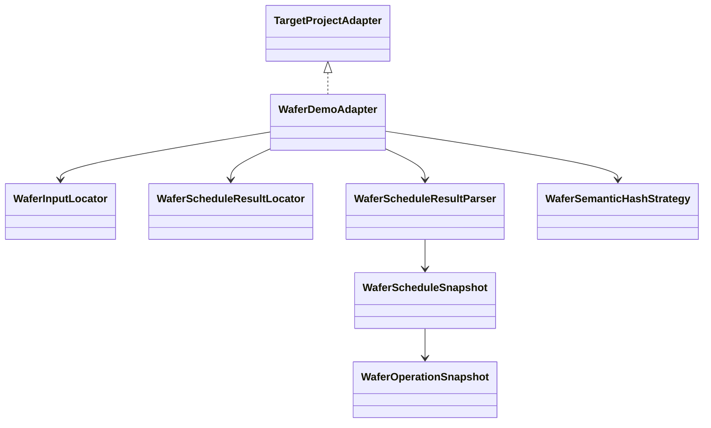

# wafer-demo-adapter 可实施详细设计

- 文档状态：Superseded
- 设计版本：1.2
- 创建日期：2026-08-10
- 目标里程碑：Phase 0 - 第一个真实目标算法 Adapter
- 前置模块：`ada-contracts`、`adapter-sdk`
- Reference Target：`D:\javacode\hellomvn`（本地验证示例，实际路径通过参数传入）

> 本文 1.0～1.2 记录历史实现。2026-08-11 起由
> `2026-08-11-case-baseline-lifecycle-design.md` 取代：Adapter 不再识别时间戳或选择最新文件，
> 只描述专用复现 UT 的公共结果目录；运行窗口差分由 Debug Harness 负责。2026-08-17 起专属
> `WaferSemanticHashStrategy` 也已删除，当前通用 JSON 内容指纹设计见
> `2026-08-17-json-content-fingerprint-baseline-design.md`。

## 1. 背景与问题

`adapter-sdk` 已提供无状态组合 SPI，但尚无真实实现。当前 Wafer Scheduling Demo 是 Maven/Java 21
项目，确定性 UT 会从 `input/cases` 读取 JSON 并向 `output` 写入调度甘特图 JSON。本模块把该项目
适配为 Agent 可识别目标，用于验证 SDK 边界和后续 Debug Harness。

Adapter 必须独立于 Demo 的 Java 模型，不能把 `hellomvn` 加为编译依赖，否则迁移到其他电脑或
其他算法仓库时会破坏插件边界。

## 2. 目标与非目标

### 2.1 目标

- 识别 Wafer Demo Maven 项目及关键测试源码；
- 支持四个现有 UT 的输入/结果映射；
- 为 BASELINE、CODE_PATH、JDWP 生成结构化 Maven 启动规格；
- 定位 UT 输入和甘特图结果；
- 将结果 JSON 解析为 Adapter 自有不可变快照；
- 计算对字段顺序、资源集合顺序和 `schedulingReason` 文本变化不敏感的语义 SHA-256；
- 通过 Java `ServiceLoader` 发布 Adapter；
- 使用可配置项目路径对真实 `hellomvn` 做 smoke 验证。

### 2.2 非目标

- 不启动 UT 子进程；
- 不修改 `hellomvn` 的源码或 POM；
- 不解析算法输入业务内容；
- 不实现 CodePath/JDWP 采集计划；
- 不实现 Domain Mapping、Normalizer 或 Validator。

## 3. 已支持 Case

| UT 方法 | 输入 | 结果 |
|---|---|---|
| `parallelModeAllowsJobsToAlternateOnSharedChamber` | `input/cases/20260810100001.json` | `output/gantt-results/parallel-shared-chamber/<yyyyMMddHHmmss>.json` |
| `serialModeKeepsSharedChamberOwnedByEarlierJobUntilAllItsWafersExit` | `input/cases/20260810100501.json` | `output/gantt-results/serial-shared-chamber/<yyyyMMddHHmmss>.json` |
| `rescheduleContinuesRunningRecipeFromSnapshotTime` | `input/cases/20260810101001.json` | `output/gantt-results/reschedule-running-recipe/<yyyyMMddHHmmss>.json` |
| `complexParallelModeSchedulesThreeJobsAcrossFiveChambers` | `input/cases/20260810101501.json` | `output/gantt-results/complex-parallel-five-chambers/<yyyyMMddHHmmss>.json` |

测试类固定为 `org.example.scheduler.wafer.SimpleWaferSchedulerTest`。未知方法返回稳定的
`ADAPTER_TEST_NOT_SUPPORTED` 错误，不猜测输入或输出。

## 4. 模块与类设计



| 类 | 职责 |
|---|---|
| `WaferDemoAdapter` | 组合 SPI、项目识别和启动规格 |
| `WaferDemoCaseCatalog` | 已支持 UT 与相对路径映射 |
| `WaferInputLocator` | 定位并验证输入文件 |
| `WaferScheduleResultLocator` | 计算结果路径 |
| `WaferScheduleResultParser` | Jackson 解析与结构校验 |
| `WaferSemanticHashStrategy` | 规范化并计算 SHA-256 |
| `WaferScheduleSnapshot` | Adapter 自有结果快照 |
| `WaferOperationSnapshot` | Adapter 自有操作快照 |

## 5. 项目识别

`inspect(projectRoot)` 必须检查：

- projectRoot 存在且为目录；
- `pom.xml` 存在；
- `src/test/java/org/example/scheduler/wafer/SimpleWaferSchedulerTest.java` 存在；
- 至少复杂 Case 的输入 JSON 存在。

失败分别返回 `ADAPTER_PROJECT_NOT_SUPPORTED`、`ADAPTER_BUILD_FILE_MISSING` 或
`ADAPTER_INPUT_NOT_FOUND`。`ProjectId` 使用稳定值 `wafer-scheduling-demo`，真实路径保存在
`ProjectDescriptor`，不写入 ID。

## 6. 启动规格

```text
mavenGoals       = [test]
mavenProperties  = test=<class#method>, failIfNoTests=true
timeout          = 5 minutes
runMode          = 调用方指定
```

Adapter 不注入 Agent、JDWP 参数或 CodePath Bundle。Debug Harness 和对应 Collector Adapter
根据 `runMode` 在后续阶段安全扩展启动规格。

## 7. 结果快照

快照保存甘特图解释和校验所需字段：

- snapshot/trigger/algorithm/equipment/mode/makespan；
- resources；
- operations 的 job、wafer、sequence、resource、位置、时间和来源；
- schedulingReason 供人查看，但不参与语义哈希；
- finalWaferLocations。

Parser 忽略未知可选字段，但缺少必填集合、非法时间区间或 `duration != end - start` 时拒绝结果。

## 8. 语义哈希


参与哈希：algorithm、equipment、mode、makespan、排序后的 resources、按 operationId 排序的完整
调度操作（不含 reason）、排序后的 final locations。这样采集前后只要实际调度相同，哈希稳定；
操作时间、资源、位置或顺序变化会改变哈希。

## 9. ServiceLoader

模块提供：

```text
META-INF/services/org.example.algorithmdebug.adapter.TargetProjectAdapter
```

内容为 `WaferDemoAdapter` 全限定类名，使 Core 将来不需要硬编码具体 Adapter。

## 10. 测试设计

先写失败测试：

- `WaferDemoAdapterTest`：项目识别、启动规格、四个 Case 映射和未知测试；
- `WaferScheduleResultParserTest`：Fixture 解析和非法操作拒绝；
- `WaferSemanticHashStrategyTest`：噪声变化稳定、调度变化敏感；
- `WaferDemoAdapterServiceLoaderTest`：SPI 可发现；
- `WaferDemoRealProjectSmokeTest`：仅在提供 `wafer.demo.projectRoot` 时验证真实项目 165 个操作。

命令：

```powershell
mvn -pl adapters/wafer-demo-adapter -am test
mvn -pl adapters/wafer-demo-adapter -am test `
  -Dwafer.demo.projectRoot=D:\javacode\hellomvn
mvn test
```

## 11. 依赖与迁移

主代码直接依赖：

- `ada-contracts`；
- `adapter-sdk`；
- `jackson-databind`。

不依赖 Demo JAR、`ada-core`、Collector 或 LLM。迁移到其他电脑时通过 CLI/配置传入目标项目路径。

## 12. 实施步骤

1. 更新 POM 和测试 Fixture；
2. 添加失败测试并确认 Red；
3. 实现 Case Catalog、DTO、Parser 和 Hash；
4. 实现 Locator 和 Adapter；
5. 注册 ServiceLoader；
6. 运行模块、真实项目 smoke 和全仓库测试；
7. 同步 README、架构状态和本设计完成记录。

## 13. 实现完成记录

- 实际变更：新增 10 个生产类、ServiceLoader 注册、1 个结果 Fixture 和 6 个测试类；实现项目识别、四个 UT 的显式 Case 映射、Maven 启动规格、时间戳输入定位、最新合法时间戳结果发现、独立结果快照解析及稳定语义哈希；
- 相对设计偏差：无功能偏差。`CODE_PATH`、`JDWP` 可生成结构化 `TestLaunchSpec`，但 Adapter 不宣称采集能力，也不注入工具参数；该部分仍由后续 Debug Harness 和 Collector Adapter 完成；
- 测试结果：初版 Red 阶段确认 29 个缺失生产符号；时间戳变更 Red 阶段确认旧固定路径导致 4 个错误；最新真实项目 Reactor 共 34 个测试通过，其中 Adapter 13 个测试通过；真实 `hellomvn` 6 个测试通过，冒烟测试从动态结果目录解析 165 个操作、15 个最终位置并生成 64 位语义哈希；
- 已知限制：当前只支持 `SimpleWaferSchedulerTest` 的四个显式方法；项目识别依赖 Reference Demo 的目录约定；Adapter 只描述启动和产物，不负责实际启动 Maven 子进程；最新文件发现必须由后续 Harness 的运行前后目录差分补强，才能严格归因到本次 UT。

## 14. 变更记录

| 日期 | 版本 | 变更内容 |
|---|---|---|
| 2026-08-10 | 1.0 | Wafer Demo Adapter 首版设计 |
| 2026-08-10 | 1.1 | 完成实现并补充真实复杂 Case 验证记录 |
| 2026-08-11 | 1.2 | 目标 Demo 改为时间戳输入与动态时间戳结果；Adapter 改为按 Case 目录发现最新合法结果 |
| 2026-08-11 | 2.0 | 本设计被动态结果源与 Case Baseline 生命周期设计取代 |

## 15. 时间戳输入输出适配补充设计

Reference Demo 用来模拟真实算法仓库的新约定如下：

- UT 在源码中显式指定 `input/cases/<yyyyMMddHHmmss>.json`；
- UT 把结果写入 `output/gantt-results/<case>/<yyyyMMddHHmmss>.json`；
- 不同 Case 使用不同结果目录，避免 Maven 全量测试在同一秒写出时互相覆盖；
- Writer 使用 `CREATE_NEW`，同一 Case 同一秒重复写出时拒绝覆盖既有证据。

Adapter 的 `CaseDefinition` 保存输入相对路径和结果目录，不再保存固定结果文件名。
`WaferScheduleResultLocator` 只接受 `\\d{14}\\.json`，按文件名排序并返回最新结果；目录不存在或没有
合法结果时返回 `ADAPTER_RESULT_NOT_FOUND`。`readme.json` 等无关文件必须被忽略。

当前 `ScheduleResultLocator` 只能发现最新文件，无法单独证明该文件由“本次”UT 生成。后续
`debug-harness` 必须在运行前记录目录清单，在运行成功后只接受新增产物；不能在 UT 失败时回退读取旧结果。
