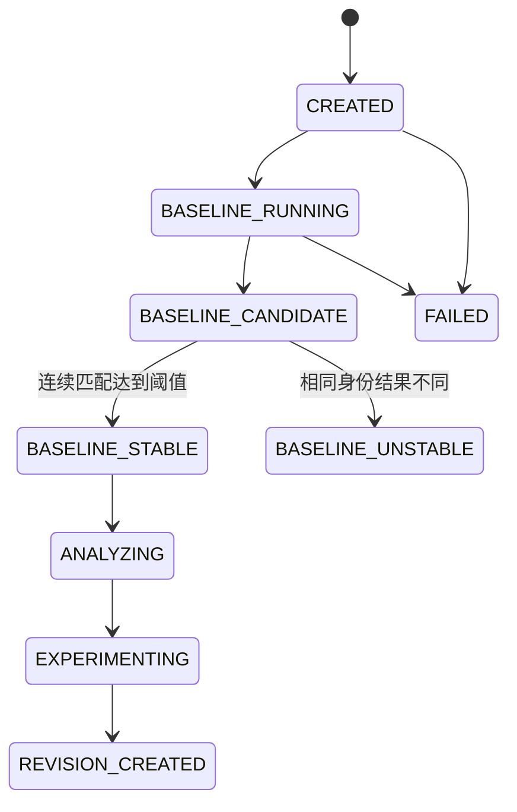
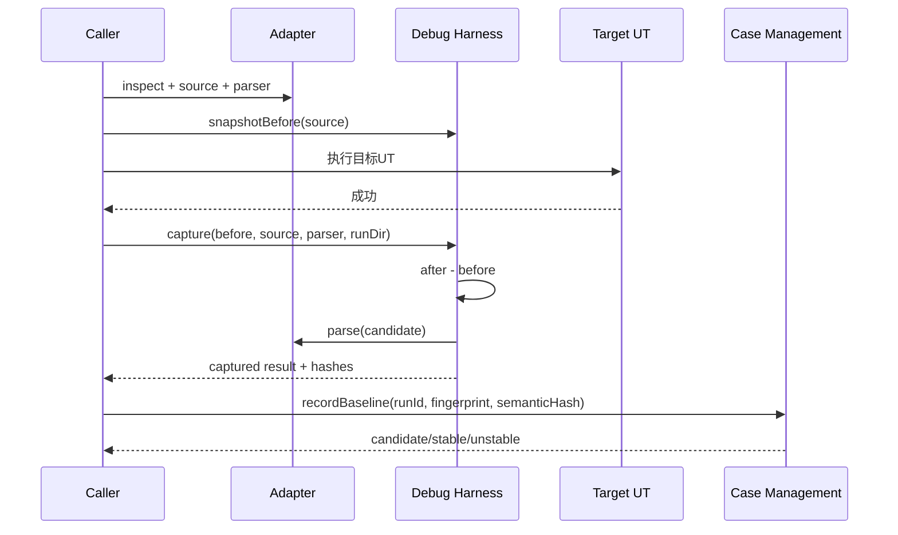

# Case Baseline 生命周期与动态调度结果采集可实施设计

- 文档状态：Implemented
- 设计版本：1.3
- 创建日期：2026-08-11
- 负责人：Codex / zhao1k
- 目标里程碑：Phase 0 - 可重复 Baseline 垂直闭环
- 关联需求：目标 UT 自持输入、动态文件名结果、Case 多次复现与多轮分析
- 关联架构与 ADR：`algorithm-debug-agent-module-detailed-design-v1.md`、`ADR-001-dynamic-output-and-case-identity.md`

> 后续边界：本文记录已实现的 Phase 0 动态结果捕获、Fingerprint 和稳定性行为；同一问题的多轮
> OpenCode 持久化与代码变化延续规则，以
> `2026-08-12-case-context-run-outcome-multiturn-analysis-design.md` 和 ADR-006 为准。
> 2026-08-13 已完成迁移：当前代码的 Fingerprint 变化返回 `NEW_CONTEXT`，不再创建 Revision；
> Inquiry/Turn 和复杂 Case 生命周期类型已经删除。本文相应术语只描述历史实现，不是当前 API。

## 1. 背景与问题

真实算法 UT 自己读取固定路径输入，运行后在固定目录写出动态名称的 Gantt 文件。Agent 不能把
`yyyyMMddHHmmss.json` 当作通用契约，也不能在 UT 失败后误读历史“最新文件”。现有
`ScheduleResultLocator` 返回单一结果路径，无法表达动态输出目录；现有 `ExecutionIdentity` 又把运行前
身份与运行后结果哈希合在一起，不能用于运行前选择 Case。

现有架构已经规定 `Case -> Inquiry -> Turn -> Run`、不可变产物和相同身份复用 Case，但
`case-management`、`debug-harness` 尚无实现。本设计在不接入 LLM、CodePath 或 JDWP 的前提下，建立
可测试的 Baseline 垂直闭环。

## 2. 目标与非目标

### 2.1 目标

- Demo 提供一个专用复现 UT：UT 自持输入并向公共目录写动态名称结果；
- Adapter 只描述输出目录，Parser 决定候选是否为合法调度结果；
- Harness 对输出目录做运行前后快照，只接受本次新增或修改的稳定文件；
- 每个 Run 的输入、结果和 Manifest 不可覆盖；
- 运行前 `CaseFingerprint` 与运行后 `ExecutionIdentity` 分层；
- 同一 Fingerprint 下连续两次语义哈希一致进入 `BASELINE_STABLE`；不一致进入
  `BASELINE_UNSTABLE`，不得自动拆成新 Case；
- UT 改变创建新 Case，输入/源码改变创建关联 Revision；换问题只创建 Inquiry；
- LLM 只能提出结构化意图，确定性 Case Resolution Service 做最终裁决。

### 2.2 非目标

- 不实现 OpenCode/LLM 调用；
- 不实现完整 Maven 子进程编排、CodePath 或 JDWP；
- 不自动分析 UT 源码推导输入路径；第一阶段由 Adapter 定位输入用于证据冻结；
- 不实现跨进程数据库和分布式锁；使用本地文件与单 Case 文件锁边界；
- 不实现内容寻址全局去重，只保证 Run 产物不可变。

## 3. 现状与约束

- `ada-contracts`、`adapter-sdk`、`wafer-demo-adapter` 已实现；
- `case-management`、`debug-harness` 为空模块；
- 目标算法仍位于外部仓库，Agent 不修改算法生产源码；
- 测试必须使用临时目录、固定时钟和固定 ID；
- SPI 尚未发布稳定版本，允许在 0.1.0 阶段替换错误的单文件 Locator 抽象。

## 4. 用例与验收标准

| 用例 | 输入/前置条件 | 预期结果 | 验证层级 |
|---|---|---|---|
| 动态结果采集 | 运行前旧文件，运行后新增可解析文件 | 只复制新增文件 | Unit |
| 同名文件修改 | 运行前后路径相同但指纹变化 | 识别为本次修改产物 | Unit |
| UT 无输出 | 运行后目录无变化 | `HARNESS_RESULT_NOT_PRODUCED` | Unit |
| 多个合法候选 | 本次产生两个可解析结果 | `HARNESS_RESULT_AMBIGUOUS` | Unit |
| 重复 Baseline | 相同 Fingerprint，连续语义哈希 A/A | `BASELINE_STABLE` | Unit |
| 非确定 Baseline | 相同 Fingerprint，语义哈希 A/B | `BASELINE_UNSTABLE` | Unit |
| UT 变化 | test selector 不同 | `NEW_CASE` | Unit |
| 输入/源码变化 | 同 UT、fingerprint 变化 | `NEW_REVISION` | Unit |
| Demo 真实结果 | 专用复现 UT | 165 个操作、15 个最终位置 | E2E smoke |

## 5. 总体方案

```mermaid
flowchart LR
    ADAPTER["TargetProjectAdapter"] --> SOURCE["ScheduleResultSource 输出目录"]
    SOURCE --> BEFORE["Harness 运行前快照"]
    BEFORE --> UT["目标 UT"]
    UT --> AFTER["Harness 运行后快照"]
    AFTER --> DIFF["新增/修改文件差分"]
    DIFF --> PARSER["Adapter Parser 验证"]
    PARSER --> RUN["不可变 Run 产物"]
    RUN --> HASH["ExecutionIdentity"]
    HASH --> BASELINE["BaselineStabilityService"]
    BASELINE --> CASE["Case 状态与 Resolution"]
```



文件名格式不参与 Agent 通用正确性。Harness 以运行窗口差分建立 provenance，Parser 以业务结构建立
合法性，Case Manager 以 Fingerprint 和语义哈希建立复现稳定性。

## 6. 模块与类设计

| 模块/类 | 职责 | 输入 | 输出 | 依赖 |
|---|---|---|---|---|
| `ada-contracts/CaseFingerprint` | 冻结运行前身份 | UT、源码、输入、环境 | SHA 字段集合 | 无实现依赖 |
| `ada-contracts/ExecutionIdentity` | 绑定运行前身份与结果语义 | Fingerprint、semantic hash | 运行后身份 | contracts |
| `ada-contracts/CaseLifecycleState` | Case 生命周期 | 状态转换 | 稳定枚举 | 无 |
| `ada-contracts/BaselineVerification` | 保存 Baseline 运行与 canonical hash | Run observation | 不可变验证状态 | contracts |
| `adapter-sdk/ScheduleResultSource` | 描述输出目录与扫描边界 | Project/UT | 规范化目录 | contracts |
| `debug-harness/OutputDirectorySnapshotter` | 创建目录快照 | result source | 文件指纹 Map | JDK NIO |
| `debug-harness/ScheduleResultCapture` | 差分、解析、复制 | before/after、Parser | captured artifact | adapter-sdk |
| `case-management/CaseResolutionService` | 确定复用、新建或 Revision | existing case、fingerprint、intent | decision | contracts |
| `case-management/BaselineStabilityService` | 确定稳定/不稳定 | prior verification、run hash | new verification | contracts |
| `case-management/CaseWorkspace` | 创建标准目录 | root、CaseId | workspace paths | JDK NIO |
| `case-management/ImmutableArtifactStore` | 不可变复制产物 | source、target relative path | ArtifactReference | contracts |

## 7. 数据与契约设计

### 7.1 两阶段身份

```text
CaseFingerprint（运行前）
  testSelector
  gitCommit
  sourceHash
  inputHash
  classpathHash
  javaVersion
  adapterId
  adapterVersion

ExecutionIdentity（运行后）
  caseFingerprint
  scheduleSemanticHash
```

`ExecutionIdentity` JSON 为破坏性变化，当前版本尚未发布；`BaselineManifest` Schema 主版本升级为 `2.0`。

### 7.2 Case 生命周期



### 7.3 Case 决策

```text
CaseIntent = AUTO | FORCE_NEW_CASE | FORCE_REUSE | FORCE_NEW_REVISION
CaseResolutionAction = NEW_CASE | REUSE_CASE | NEW_REVISION | CONFIRMATION_REQUIRED
```

确定性规则优先于 LLM 意图：相同 pre-run fingerprint 才可直接复用；同 UT 但输入、源码或环境改变时
创建 Revision；UT 改变时创建新 Case；相同 Fingerprint 但结果变化属于不稳定 Baseline。

## 8. 核心流程



## 9. 错误处理与可观测性

- `HARNESS_RESULT_SOURCE_MISSING`：输出目录不可用；
- `HARNESS_RESULT_NOT_PRODUCED`：本次运行未新增或修改文件；
- `HARNESS_RESULT_AMBIGUOUS`：多个候选通过 Parser；
- `HARNESS_RESULT_COPY_FAILED`：不可变复制失败；
- `CASE_ARTIFACT_ALREADY_EXISTS`：试图覆盖 Run 产物；
- `CASE_REUSE_CONFLICT`：强制复用与 Fingerprint 冲突；
- 失败 Run 保留 stdout/stderr 和 manifest 的设计边界，进程执行器后续阶段实现。

## 10. 性能与容量预算

| 指标 | 默认值 | 上限 | 超限行为 | 验证方法 |
|---|---:|---:|---|---|
| 输出目录文件数 | 1,000 | 10,000 | 拒绝并要求缩小目录 | Unit |
| 候选结果数 | 1 | 16 | 拒绝歧义 | Unit |
| 单结果文件 | 100 MB | 1 GB | 拒绝复制 | Unit |
| 稳定检查 | 2 次 | 5 次 | 报告未稳定 | Unit |

目录快照默认只计算元数据；只对新增/修改候选计算 SHA-256，避免每次扫描历史大文件。

## 11. 安全、隐私与无侵入性

- Demo 只修改测试入口和示例 Writer，不向真实算法生产逻辑注入 Trace；
- 目标输出只读，Agent 复制到自己的 Case 目录；
- 所有相对路径必须防止目录逃逸；
- 不引入新外部库，复用 JDK NIO、Jackson 和 JUnit。

## 12. 测试设计

### 12.1 单元测试

- `ScheduleResultSourceTest`：绝对路径、目录边界和参数校验；
- `OutputDirectorySnapshotterTest`：新增、修改和不变文件；
- `ScheduleResultCaptureTest`：唯一候选、无候选、歧义、不可变复制；
- `BaselineStabilityServiceTest`：A/A 稳定、A/B 不稳定；
- `CaseResolutionServiceTest`：复用、新 Case、Revision 和冲突；
- `CaseWorkspaceTest`：目录结构和不可覆盖。

### 12.2 契约测试

- `CaseFingerprintTest`、`ExecutionIdentityTest`、`BaselineVerificationTest`；
- `BaselineManifestJsonTest` 升级到 Schema 2.0。

### 12.3 集成与端到端测试

- Adapter 对真实 Demo 专用复现 UT 定位输入和输出目录；
- 真实 UT 执行后由 Harness 差分捕获 165 操作结果；
- 两次运行语义哈希一致后 Baseline 进入稳定状态。

## 13. 实施步骤

1. 归档本设计与 ADR；
2. 添加失败契约、SPI、Harness、Case Manager 测试；
3. 实现两阶段身份与 Case 状态契约；
4. 替换单文件 Locator 为动态 Result Source；
5. 实现目录快照、候选验证和不可变捕获；
6. 实现 Case Resolution、Workspace 和 Baseline 稳定性；
7. 修改 Demo 专用复现 UT 与 Wafer Adapter；
8. 运行模块、真实 Demo 和根 Reactor 回归；
9. 更新架构、计划、README 和设计完成记录。

## 14. 兼容、迁移与回滚

- `ScheduleResultLocator` 保留一个版本但标记 Deprecated，新的 SPI 不再调用；
- `ExecutionIdentity` JSON 升级为嵌套 Fingerprint，旧 Fixture 随 Schema 2.0 迁移；
- 现有固定名称 Gantt 文件视为历史产物，不自动导入新 Case；
- 回滚时可恢复 Adapter 的固定 Locator，但不得删除已生成 Run 证据。

## 15. 风险与待确认事项

| 风险/问题 | 影响 | 缓解措施 | 状态 |
|---|---|---|---|
| 目标目录被并发进程写入 | 多候选歧义 | Harness 明确失败，不猜测 | Resolved |
| 文件名相同且内容相同 | 元数据可能不足以识别 | 比较 mtime/size；真实执行阶段记录运行窗口 | Resolved |
| UT 隐藏输入路径 | 无法冻结 input hash | Adapter 或后续静态分析提供；缺失时拒绝稳定 Case | Resolved |
| LLM 错误要求复用 | 证据污染 | Case Resolution 确定性校验 | Resolved |

## 16. 文档同步清单

- [x] 架构/ADR（设计阶段定义，完成阶段同步正文）
- [x] Schema 与示例
- [x] README/使用说明
- [x] Mermaid 图
- [ ] Eval Case（本阶段仅确定性核心，LLM 接入时补充）

## 17. 实现完成记录

- 实际变更：实现两阶段身份、Baseline 状态契约、动态结果源 SPI、有界目录快照、唯一候选解析与
  原子复制、Case Resolution、Baseline 稳定性、标准 Case/Run 目录和不可变 Artifact Store；Demo
  新增专用复现 UT；Wafer Adapter 不再理解时间戳或选择最新文件；
- 相对设计的偏差：通用 Maven Process Runner、文件稳定轮询、JSON 持久化与多轮分析未在本次实现；
  真实集成测试使用测试内 ProcessBuilder 驱动两次 UT。Runner 后续已完成；持久化边界随后由
  2026-08-12 简化 Case/Run/Analysis 设计取代，不再计划 Inquiry/Turn 状态机；
- 测试与命令：Red 阶段先确认 15 个契约缺失编译错误；核心与 Adapter 共 52 个单元/契约测试通过；
  真实集成测试连续运行专用 UT 两次，分别捕获到 `RUN-001`、`RUN-002`，两次 165 操作结果语义哈希
  一致并进入 `BASELINE_STABLE`；Demo 自身 7 个测试通过；
- 性能结果：真实两次 UT 与完整捕获集成测试约 4.8 秒；目录快照限制 10,000 文件，结果文件限制由
  调用方配置，集成测试使用 100 MB；
- 已知限制：目录快照依据路径、大小和最后修改时间识别修改；完全相同内容在文件系统时间精度内原位
  重写的极端情况需后续 WatchService/运行锁或算法输出隔离补强；尚无通用 CLI 调用入口；
- 提交/版本：工作区实现，尚未提交 Git。

后续持久化边界已由
`2026-08-12-case-context-run-outcome-multiturn-analysis-design.md` 重新设计：Case 作为一个用户问题的
分析档案，不使用 `CaseLifecycleState` 驱动 OpenCode 多轮分析；目标 UT 的执行结果、Gantt 是否存在、
异常诊断和多轮 Analysis/Evidence 分别追加保存。本设计已经实现的动态结果捕获、Fingerprint、
Artifact Store 和可选稳定性服务继续复用，不再承担复杂 Case State Repository 的设计依据。
同一问题在源码、输入或 UT 内容变化后由新设计追加 Context Snapshot；本设计已实现的
`CaseResolutionService` 创建 Revision 行为只保留为历史 Phase 0 事实；当前实现已经替换为
`NEW_CONTEXT/REUSE_CONTEXT` 规则。

## 18. 变更记录

| 日期 | 版本 | 变更内容 | 作者 |
|---|---|---|---|
| 2026-08-11 | 1.0 | 动态结果采集与 Case Baseline 生命周期首版 | Codex / zhao1k |
| 2026-08-11 | 1.1 | 完成 Phase 0 垂直实现并记录真实两次运行验证 | Codex / zhao1k |
| 2026-08-12 | 1.2 | 明确后续多轮持久化由简化 Case/Run/Analysis 设计接管 | Codex / mh90901119-oss |
| 2026-08-12 | 1.3 | 明确 Fingerprint 变化在同一问题中映射为 Context Snapshot | Codex / mh90901119-oss |
| 2026-08-13 | 1.4 | 记录 Revision/Inquiry/Turn 迁移已经落地，本文旧术语仅为历史 | Codex / mh90901119-oss |
