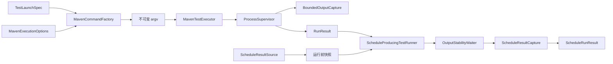
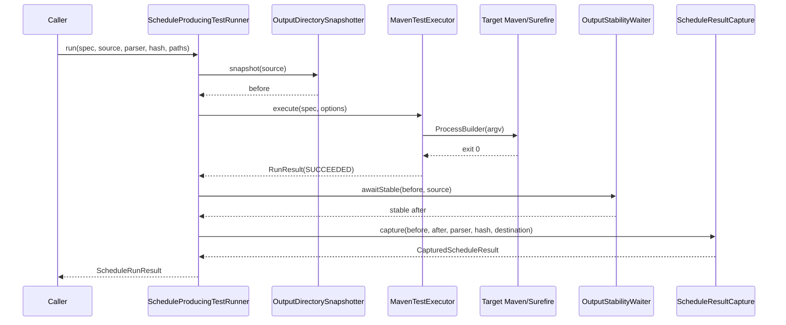
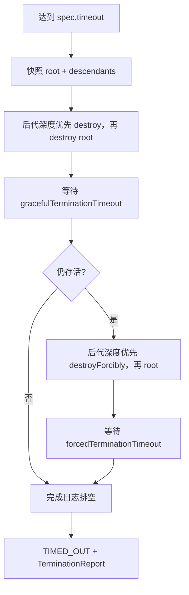

# Debug Harness 通用 Maven/JUnit Runner 可实施详细设计

- 文档状态：Implemented
- 设计版本：1.0
- 创建日期：2026-08-11
- 负责人：Codex / zhao1k
- 目标里程碑：P0 - Baseline 可正式调用纵向切片
- 关联需求：从测试内 `ProcessBuilder` 提取通用 Maven/JUnit Runner
- 关联架构与 ADR：`../architecture/algorithm-debug-agent-module-detailed-design-v1.md`、`2026-08-11-case-baseline-lifecycle-design.md`、`../decisions/ADR-001-dynamic-output-and-case-identity.md`

## 1. 背景与问题

Phase 0 已实现运行窗口目录差分、唯一合法调度结果捕获、原始/语义哈希和不可变 Run 结果复制，
但真实 Demo 的 Maven 子进程仍由 `WaferBaselineLifecycleSmokeTest` 内部直接创建。当前测试驱动器存在以下
不能进入正式链路的问题：

- Maven executable 和命令构造写死在测试中，不能由正式调用方配置；
- stdout/stderr 被合并为一个无容量预算的文件；
- 超时仅对根进程调用 `destroyForcibly()`，可能遗留 Surefire fork JVM；
- 没有结构化进程结果，调用方只能依赖断言和退出码；
- `TestLaunchSpec.jvmArguments` 没有被消费；
- 进程退出后立即扫描结果，缺少可配置的文件稳定确认；
- 真实集成测试验证的是测试内临时代码，而不是 `debug-harness` 公共能力。

本设计只补齐通用 Maven/JUnit 运行及其与现有结果捕获的组合，不同时实现 Case State、Run Manifest、
CLI、CodePath 或 JDWP。

## 2. 目标与非目标

### 2.1 目标

- 从 `TestLaunchSpec` 确定性构造 `ProcessBuilder` 参数数组，全链路不调用 Shell；
- 支持显式 Maven executable、目标项目工作目录、Maven `-D` properties、goals 和超时；
- 对 `TestLaunchSpec.jvmArguments` 采用明确且可测试的 Surefire `argLine` 规则，不允许静默忽略；
- 分别、持续排空 stdout/stderr，按字节预算归档并记录截断量；
- 将成功、非零退出和超时转换成不可变 `RunResult`；
- 超时或中断时幂等终止根进程及后代，并记录仍存活的 PID；
- 在成功进程之后执行有界文件稳定轮询，再调用现有 `ScheduleResultCapture`；
- 用正式 Runner 替换真实集成测试中的直接 `ProcessBuilder`；
- 保持 Runner 通用，不包含 Wafer、Case 状态或 Baseline 稳定性规则。

### 2.2 非目标

- 不新增 `algorithm-debug-cli baseline` 命令；
- 不写 Run Manifest、Case JSON、Baseline Verification JSON 或 ArtifactReference JSON；
- 不实现 Case Lock、崩溃恢复、Inquiry/Turn 持久化；
- 不构建测试 classpath，不接入外部 JUnit Platform Launcher；Baseline 仍通过 Maven/Surefire 执行；
- 不注入 CodePathTracer、JDWP agent 或启动 Collector；
- 不修改目标算法生产源码、目标 POM 或原始 UT；
- 不解析 Maven 文本来推断测试通过，退出状态只来自子进程退出码；
- 不提供任意环境变量注入，避免在本轮扩大敏感信息和可重复性边界；
- 不增加第三方依赖，使用 Java 21 `ProcessBuilder`、`ProcessHandle`、NIO 和并发 API。

## 3. 现状审计与约束

### 3.1 已完成能力

- `adapter-sdk/TestLaunchSpec` 已包含项目、目标测试、运行模式、goals、Maven properties、目标 JVM
  参数和总超时，并对集合做防御性复制；
- `OutputDirectorySnapshotter` 已实现有界目录扫描；
- `ScheduleResultCapture` 已实现运行窗口差分、Parser 验证、唯一候选、大小预算、哈希和原子复制；
- `WaferBaselineLifecycleSmokeTest` 已证明真实 Demo 连续两次运行可捕获 165 个操作并进入
  `BASELINE_STABLE`。

### 3.2 未完成能力

- 通用 Maven 命令编译和执行；
- Maven executable 的显式模型与校验；
- stdout/stderr 独立、有界归档；
- 结构化进程结果；
- 进程树分级终止；
- 文件稳定轮询；
- 正式 Runner 的真实目标项目集成测试。

### 3.3 仓库状态约束

当前 Git 仓库尚无首个 commit，所有文件均显示为 untracked。因此本轮不能用历史 diff 推断文件归属，
也不执行 checkout/reset/clean。实现时只触碰本设计列出的文件。

### 3.4 本轮基线证据

2026-08-11 执行：

```powershell
mvn -pl debug-harness,integration-tests -am test `
  "-Dwafer.demo.projectRoot=D:\javacode\hellomvn"
```

结果为 Reactor `BUILD SUCCESS`；相关七个模块共运行 53 个测试，失败 0、错误 0、跳过 0，其中真实
`WaferBaselineLifecycleSmokeTest` 运行 1 个测试并通过。首次沙箱执行因 Maven Central 网络权限失败，
获准联网后重试成功；该环境事实不属于产品行为。

### 3.5 文档与代码偏差

| 位置 | 文档描述 | 当前代码事实 | 本设计处理 |
|---|---|---|---|
| 完整架构 Phase 1 | Baseline Harness 包含 JUnit Platform Launcher Runner | 当前 Baseline 规格通过 Maven/Surefire 执行 | 本轮先正式化 Maven Runner；外部 Launcher 单独设计 |
| 模块设计 10.3 | 已列出 `MavenTestExecutor`、`ProcessSupervisor`、`RunManifestWriter` 等目标类 | 当前只有结果快照与捕获类 | 本轮实现前两类职责，不顺带实现 Manifest |
| 模块设计 `RunMode` | 目标枚举细分为 `METHOD_PATH/JDWP_BATCH/JDWP_FOCUSED` | 当前 SPI 只有 `BASELINE/CODE_PATH/JDWP` | 本轮不扩枚举，避免为未实现模式冻结 API |
| 旧阶段计划 Phase 1/下一步 | 保留算法内部 Domain Trace、优先 Gantt/Static 的历史路线 | 当前主架构和用户要求均为零侵入、先补 Runner | 已修订“下一步启动建议”；不修改历史章节 |
| `debug-harness` README | 明确 Runner、双流日志、超时、稳定轮询未实现 | 与代码一致 | 增加本 Review 设计入口 |

这些偏差中只有“下一步顺序”会误导当前实施，已同步修正。历史草案保留其 superseded 说明，不进行
大范围重写。

## 4. 方案比较与决策

### 4.1 方案 A：组合式三层 Runner（推荐）

分成纯命令编译、通用进程监管和调度结果编排三层。优点是职责清晰、进程安全能力可被后续
CodePath/JDWP 复用、单元测试可完全隔离；代价是新增若干小型不可变模型。

### 4.2 方案 B：单体 `DebugHarness.run(...)`

一个类同时拼命令、启进程、泵日志、杀进程树、轮询文件和解析结果。初始文件较少，但进程错误与业务
捕获错误互相缠绕，后续 CodePath/JDWP 必然出现条件分支和 God Class，不采用。

### 4.3 方案 C：本轮直接切换外部 JUnit Platform Launcher

可避开 Surefire，但需要先实现 test-compile、classpath 解析、多模块 Maven 处理和 Launcher 发行锁，
会把 Baseline Runner 与 Method Path Phase 混成一个大切片，不采用。本轮继续执行 Adapter 已声明的
Maven goals；外部 Launcher 由后续独立设计接入。

## 5. 总体方案



`MavenCommandFactory` 不访问文件系统也不启动进程；`ProcessSupervisor` 不理解 Maven 或调度结果；
`ScheduleProducingTestRunner` 只组合现有端口。Case Manager 和 CLI 后续消费 `ScheduleRunResult`，但
本轮不反向依赖它们。

## 6. 模块与类设计

### 6.1 `adapter-sdk` 契约调整

| 类型 | 变更 | 原因 |
|---|---|---|
| `TestLaunchSpec` | 保持字段不变 | Maven executable 属于运行环境，不属于业务 Adapter |
| `AdapterChecks` | 收紧 `jvmArguments`：禁止空白 token、NUL、CR/LF | 本轮只支持可无歧义编码到 Surefire `argLine` 的单 token 参数 |

`mavenProperties` 继续由 Adapter 声明目标测试选择器等业务相关参数；Maven executable、日志目录和
进程预算由调用环境提供，避免同一 Adapter 在不同机器上写死工具路径。

### 6.2 `debug-harness` 新类型

| 类型 | 职责 | 关键输入 | 关键输出 |
|---|---|---|---|
| `MavenExecutionOptions` | 定义机器相关执行选项 | executable、日志路径、日志/终止预算 | 不可变选项 |
| `ProcessLimits` | 定义 stdout/stderr、优雅/强杀等待预算 | 正数和非负时长 | 不可变预算 |
| `MavenCommandFactory` | 把 spec/options 编译为参数数组 | `TestLaunchSpec`、options | `List<String>` |
| `MavenTestExecutor` | 启动并监管一次 Maven 测试 | argv、工作目录、超时 | `RunResult` |
| `ProcessSupervisor` | 等待、超时、终止进程树 | `Process`、deadline、limits | `TerminationReport` |
| `BoundedOutputCapture` | 并发排空并分别归档两个流 | stdout/stderr、目标路径、预算 | 两个 `RunLog` |
| `OutputStabilityWaiter` | 有界轮询输出目录元数据 | before、source、poll policy | 稳定 after snapshot |
| `ScheduleProducingTestRunner<T>` | 组合快照、执行、稳定和捕获 | spec、parser/hash/source、目标路径 | `ScheduleRunResult<T>` |

### 6.3 公共不可变结果

```java
public enum RunCompletion {
    SUCCEEDED,
    FAILED,
    TIMED_OUT
}

public record RunLog(
        Path path,
        long capturedBytes,
        long discardedBytes,
        boolean truncated) {}

public record TerminationReport(
        boolean attempted,
        int gracefulSignals,
        int forcedSignals,
        List<Long> survivingProcessIds) {}

public record RunResult(
        RunCompletion completion,
        OptionalInt exitCode,
        Instant startedAt,
        Instant finishedAt,
        Duration elapsed,
        long rootProcessId,
        RunLog stdout,
        RunLog stderr,
        TerminationReport termination) {}

public record ScheduleRunResult<T extends ScheduleResultSnapshot>(
        RunResult run,
        Optional<CapturedScheduleResult<T>> scheduleResult) {}
```

约束：

- `RunResult(SUCCEEDED)` 必须有退出码 0；对应的 `ScheduleRunResult` 必须同时有捕获结果；
- `FAILED` 必须有非零退出码，不执行结果捕获；
- `TIMED_OUT` 的退出码可缺失，不执行结果捕获，`termination.attempted=true`；
- `ScheduleRunResult` 构造器强制上述组合不变量；
- 进程无法启动、日志文件无法安全创建、监管线程被中断或仍有存活后代属于 Harness 结构化异常，
  使用稳定错误码并保留 cause，不伪装成普通测试失败。

这些类型暂时只属于 `debug-harness` Java API，不落盘，因此本轮不新增 JSON Schema。Run Manifest
Writer 设计时再定义版本化 JSON DTO，避免提前把内部监管细节冻结为跨进程契约。

## 7. 命令编译规则

参数严格按以下顺序生成，每项是独立的 `ProcessBuilder` token：

```text
<absolute-maven-executable>
-D<propertyKey>=<propertyValue>   # 保留 LinkedHashMap 顺序
-DargLine=<jvmArg1 jvmArg2 ...>  # 仅 jvmArguments 非空时
<goal1>
<goal2>
...
```

规则：

1. 不调用 `cmd.exe`、PowerShell、`sh` 或 `bash`；
2. Maven executable 必须是显式绝对、规范化路径，并且是普通文件；Windows 允许 `.cmd`；
3. 工作目录固定使用 `spec.project().projectRoot()`，不得由 Adapter 另行逃逸；
4. property key 继续使用现有 `[A-Za-z0-9_.-]+` 校验；value 作为单一 argv 原样传递，不按 `;`、`&`、
   空格或引号拆分；
5. goals 必须是现有无空白 token；
6. `jvmArguments` 每项必须是无空白、无 CR/LF/NUL token，用单个空格连接为 Surefire `argLine`；
7. 若 properties 已包含 `argLine` 且 `jvmArguments` 非空，返回 `HARNESS_LAUNCH_SPEC_CONFLICT`，不猜测
   合并顺序；
8. 不在日志或异常中打印未脱敏的完整 `-D` value。本轮错误只报告参数索引和 key。

这一约束覆盖当前无 JVM 参数的 Baseline，并支持无空格的 `-agentlib:jdwp=...` 等后续参数。包含空格
的 javaagent 路径需要后续独立的 Surefire argLine 编码设计，不在本轮隐式支持。

## 8. 核心流程

### 8.1 正常流程



### 8.2 非零退出

Maven/Surefire 非零退出时返回 `RunCompletion.FAILED`，保留分离日志和退出码，不执行稳定轮询或
结果捕获，防止把失败运行产生的旧文件误当作合法结果。

### 8.3 超时和进程树清理



若强杀等待结束后仍有存活 PID，抛出 `HARNESS_PROCESS_TREE_CLEANUP_FAILED`，异常上下文包含已脱敏 PID
列表和已形成的 `RunResult` 摘要；不得宣称运行已安全结束。清理方法必须允许重复调用。

### 8.4 文件稳定轮询

进程成功退出后，`OutputStabilityWaiter` 每隔固定时长获取一次元数据快照。至少出现一个相对 before
新增或修改的候选，并连续两次快照相等时视为稳定。达到稳定超时仍变化，返回
`HARNESS_RESULT_NOT_STABLE`；一直没有变化则沿用 `HARNESS_RESULT_NOT_PRODUCED`。稳定后的 after
快照直接传给 `ScheduleResultCapture`，避免捕获器再做一次存在竞态的即时扫描。

`ScheduleResultCapture` 新增接收显式 after snapshot 的重载；现有重载保留并委托一次即时快照，避免
对当前调用方造成无必要破坏。正式 Runner 只调用新重载。

## 9. 错误处理与可观测性

### 9.1 新错误码

| 错误码 | 含义 |
|---|---|
| `HARNESS_MAVEN_EXECUTABLE_INVALID` | executable 不存在、非绝对路径或非普通文件 |
| `HARNESS_LAUNCH_SPEC_CONFLICT` | `argLine` 与 `jvmArguments` 等规格冲突 |
| `HARNESS_PROCESS_START_FAILED` | `ProcessBuilder.start()` 失败 |
| `HARNESS_LOG_OPEN_FAILED` | 日志目标无法以不可覆盖方式创建 |
| `HARNESS_LOG_CAPTURE_FAILED` | 流读取或日志写入失败 |
| `HARNESS_RUN_INTERRUPTED` | 当前线程被中断；完成清理后恢复中断标记 |
| `HARNESS_PROCESS_TREE_CLEANUP_FAILED` | 分级终止后仍存在目标进程 |
| `HARNESS_RESULT_NOT_STABLE` | 运行后结果目录在预算内未稳定 |

现有结果发现/歧义/复制/哈希错误码保持不变。目标测试断言失败不是 Harness 异常，而是
`RunResult(FAILED)`。

### 9.2 日志规则

- 在启动进程前以 `CREATE_NEW` 创建 `stdout.log` 和 `stderr.log`，禁止覆盖已有 Run 日志；
- 两个泵线程始终读取到 EOF；达到归档预算后继续读取并丢弃，防止子进程管道阻塞；
- `capturedBytes` 是落盘字节数，`discardedBytes` 是超预算后已读取但未落盘字节数；
- 日志捕获失败触发进程树清理，不能仅记录 warning 后继续；
- 本轮不解析、重写或脱敏目标进程日志内容；调用方必须把日志视为敏感本地产物，且不直接发送 LLM。

## 10. 性能与容量预算

| 指标 | 默认值 | 本轮硬上限 | 超限行为 | 验证方法 |
|---|---:|---:|---|---|
| 单次 Maven 运行超时 | Adapter `TestLaunchSpec.timeout` | 30 min | 终止进程树，`TIMED_OUT` | Unit/Integration |
| stdout 归档 | 10 MiB | 100 MiB | 继续排空并丢弃，标记 truncated | Unit |
| stderr 归档 | 10 MiB | 100 MiB | 继续排空并丢弃，标记 truncated | Unit |
| 优雅终止等待 | 2 s | 30 s | 升级强制终止 | Unit |
| 强制终止等待 | 2 s | 30 s | 结构化清理失败 | Unit |
| 稳定轮询间隔 | 100 ms | 5 s | 构造参数拒绝 | Unit |
| 文件稳定超时 | 2 s | 60 s | `HARNESS_RESULT_NOT_STABLE` | Unit |
| 连续稳定快照 | 2 次 | 5 次 | 构造参数拒绝 | Unit |

日志流按 8 KiB 缓冲块处理，不把完整 stdout/stderr 保存在内存。每次运行最多创建两个日志泵线程，
结束时必须关闭并回收。

## 11. 安全、隐私与无侵入性

- 不执行 Shell，因此 property value 中的 `&`、`;`、`|`、反引号或 `$()` 不会成为控制操作符；
- 不修改目标项目、POM、UT 或算法源码；目标项目只承担正常 Maven 输出；
- executable、工作目录、日志和捕获目标均规范化并验证；捕获目标继续由现有不可覆盖逻辑保护；
- 不把环境变量整表写入结果或日志；本轮也不提供环境变量覆盖 API；
- 不把完整命令行写入异常，避免 property 中的凭据或敏感本地路径泄漏；
- Maven/Surefire 启动的所有后代都属于本次运行的清理范围；不扫描或终止无亲缘关系的系统进程；
- 不新增外部依赖，因此无新增许可证、SBOM 或离线制品问题。

## 12. 测试设计（Red-Green-Refactor 顺序）

### 12.1 单元测试

先增加以下失败测试：

- `MavenCommandFactoryTest.shouldBuildArgumentVectorWithoutShellConcatenation`：验证每个 property/goal 是
  独立 token，含 Shell 元字符的 value 不被拆分；
- `MavenCommandFactoryTest.shouldRejectArgLineConflictAndInvalidExecutable`；
- `BoundedOutputCaptureTest.shouldSeparateAndTruncateStreamsWhileContinuingToDrain`；
- `ProcessSupervisorTest.shouldReturnNonZeroExitAsFailedResult`；
- `ProcessSupervisorTest.shouldTerminateRootAndDescendantOnTimeout`；
- `ProcessSupervisorTest.shouldRestoreInterruptFlagAfterCleanup`；
- `OutputStabilityWaiterTest.shouldRequireTwoEquivalentSnapshots`；
- `OutputStabilityWaiterTest.shouldRejectContinuouslyChangingOutput`；
- `ScheduleProducingTestRunnerTest.shouldCaptureOnlyAfterSuccessfulStableRun`；
- `ScheduleProducingTestRunnerTest.shouldNotCaptureOnFailedOrTimedOutRun`；
- `ScheduleResultCaptureTest.shouldUseProvidedStableAfterSnapshotWithoutRescanning`。

进程监管测试使用测试源码中的最小 Java `ProcessFixtureMain` 启动子 Java 进程，不依赖网络、Shell、真实
时间断言或开发机绝对路径。轮询测试注入可替换 sleeper/clock 或快照序列，避免 `Thread.sleep` 导致
不稳定单元测试。

### 12.2 契约与兼容性测试

- 更新 `TestLaunchSpecTest`，验证带空白/CR/LF/NUL 的 JVM argument 被拒绝，已有空参数 Baseline 保持
  兼容；
- `RunResultTest` 验证 completion、exitCode、termination 和日志元数据组合不变量；
- 本轮无 JSON 输出，因此不增加 Schema 测试。

### 12.3 集成与端到端测试

- 重构 `WaferBaselineLifecycleSmokeTest`：删除测试内 `ProcessBuilder` 和 `command(...)`，两次真实运行
  只调用 `ScheduleProducingTestRunner`；
- 保持现有断言：两次语义哈希一致、165 个操作、两个不可变 Run 结果、`BASELINE_STABLE`；
- 新增断言：两次 `RunResult` 均为 `SUCCEEDED`、退出码为 0、stdout/stderr 路径分离且存在、无进程树
  清理动作；
- Maven executable 通过测试系统属性传入，禁止测试写死开发机路径；缺失真实 Demo 配置时继续跳过
  外部仓库冒烟测试。

### 12.4 Fresh verification

实现完成后依次执行：

```powershell
mvn -pl debug-harness -am test
mvn -pl integration-tests -am test `
  "-Dwafer.demo.projectRoot=D:\javacode\hellomvn" `
  "-Dada.maven.executable=<当前 Maven 可执行文件绝对路径>"
mvn test "-Dwafer.demo.projectRoot=D:\javacode\hellomvn" `
  "-Dada.maven.executable=<当前 Maven 可执行文件绝对路径>"
```

验证报告必须分别列出模块、真实集成和根 Reactor 的 tests/failures/errors/skipped，不能只写
`BUILD SUCCESS`。

## 13. 实施文件与步骤

### 13.1 预计修改文件

```text
adapter-sdk/src/main/java/.../AdapterChecks.java
adapter-sdk/src/test/java/.../TestLaunchSpecTest.java
debug-harness/src/main/java/.../MavenExecutionOptions.java
debug-harness/src/main/java/.../ProcessLimits.java
debug-harness/src/main/java/.../MavenCommandFactory.java
debug-harness/src/main/java/.../MavenTestExecutor.java
debug-harness/src/main/java/.../ProcessSupervisor.java
debug-harness/src/main/java/.../BoundedOutputCapture.java
debug-harness/src/main/java/.../RunCompletion.java
debug-harness/src/main/java/.../RunLog.java
debug-harness/src/main/java/.../TerminationReport.java
debug-harness/src/main/java/.../RunResult.java
debug-harness/src/main/java/.../OutputStabilityWaiter.java
debug-harness/src/main/java/.../ScheduleRunResult.java
debug-harness/src/main/java/.../ScheduleProducingTestRunner.java
debug-harness/src/main/java/.../ScheduleResultCapture.java
debug-harness/src/test/java/...（对应单元/进程夹具测试）
integration-tests/src/test/java/.../WaferBaselineLifecycleSmokeTest.java
debug-harness/README.md
integration-tests/README.md
docs/designs/2026-08-11-debug-harness-maven-junit-runner-design.md
docs/architecture/algorithm-debug-agent-module-detailed-design-v1.md
docs/plans/algorithm-debug-agent-development-plan.md
```

不修改 `ada-contracts`、Schema、Case Management、Wafer Adapter 业务逻辑或 CLI。

### 13.2 Red-Green-Refactor 批次

1. **命令契约批次**：先写命令和参数校验失败测试，再实现纯 `MavenCommandFactory`；
2. **进程监管批次**：先写退出码、双流、截断、超时和子进程树失败测试，再实现日志泵与监管器；
3. **结果稳定批次**：先写稳定/持续变化测试，再实现 waiter 和显式 after snapshot 捕获重载；
4. **组合批次**：先写成功/失败不捕获测试，再实现 `ScheduleProducingTestRunner`；
5. **真实替换批次**：删除集成测试临时 `ProcessBuilder`，以正式 Runner 跑两次真实 Demo；
6. **文档和回归批次**：同步 README/架构/计划，执行模块、集成和根 Reactor fresh verification。

每批都必须先观察预期 Red，再提交最小 Green；本设计确认前不执行上述任何批次。

## 14. 兼容、迁移与回滚

- `TestLaunchSpec` 字段结构不变；仅 JVM argument 校验从“允许带空白”收紧为“单 token”，当前 Wafer
  Adapter 使用空列表，不受影响；
- `ScheduleResultCapture` 保留原方法签名，新重载不破坏现有调用；
- 集成测试从测试内驱动器迁移到正式 Runner 后，不保留两套执行路径；Git 可回滚代码，但不得删除已
  生成的外部 Case/Run 证据；
- 本轮无已发布 JSON/CLI 迁移；
- 若进程树清理在某受支持 Windows 环境不可可靠验证，则停止该批实现并更新设计，不退化为仅强杀根
  进程。

## 15. 风险与已决事项

| 风险/问题 | 影响 | 缓解措施 | 状态 |
|---|---|---|---|
| Surefire `argLine` 对含空格路径的编码跨平台复杂 | 可能错误启动 JVM | 本轮限定无空白 token，后续按真实工具路径单独设计 | Resolved |
| stdout/stderr 过大填满磁盘 | Case 运行失控 | 有界归档但持续排空，记录 discarded bytes | Resolved |
| 超时只杀 Maven 根进程 | 遗留 Surefire JVM | `ProcessHandle.descendants()` 深度优先分级终止 | Resolved |
| 进程退出后文件仍被异步写入 | 捕获半文件或解析失败 | 连续稳定快照 + 有界超时 + 显式 after snapshot | Resolved |
| 同目录有其他并发 Writer | 产生歧义或永不稳定 | 本轮明确失败；Case Lock 属于下一切片 | Resolved |
| Maven executable 通过 PATH 解析不确定 | 运行身份不可复现 | Runner 要求调用方传绝对路径；CLI/doctor 后续负责解析 | Resolved |
| `ProcessHandle` 清理存在竞态 | 后代在快照后再派生 | 分级操作前后重新读取存活 descendants，并以存活 PID 作为失败门禁 | Resolved |
| 日志可能含敏感生产数据 | 泄漏风险 | 仅本地不可变文件，不进入 LLM；脱敏策略后续单独设计 | Resolved |

## 16. 文档同步清单

- [x] 新增本可实施详细设计
- [x] 更新模块架构中的 Runner 当前边界与设计引用
- [x] 更新阶段计划，纠正旧的“下一步先 Gantt/Static”偏差
- [x] 更新 `debug-harness` README 的待确认设计入口
- [ ] Schema 与示例（本轮无落盘契约，不适用）
- [ ] ADR（未改变既有父子进程/零侵入架构，不需要新增）
- [ ] Eval Case（本轮为确定性基础设施，不适用）

## 17. 实现完成记录

- 实际变更：已实现安全 Maven argv、显式 executable、结构化 `RunResult`、有界双流日志、
  Maven/Surefire 进程树分级终止、结果稳定轮询、显式 after snapshot 捕获，以及正式结果组合器；真实
  集成测试已删除临时 `ProcessBuilder`；
- 相对设计的偏差：增加 `TargetTestExecutor` 端口以隔离组合器与真实进程，增加包内 `ProcessStarter`
  以验证日志冲突发生在进程启动前；`OutputStabilityPolicy` 独立建模轮询预算。三项均服务既定职责，
  未改变模块或跨进程契约；
- 修复缺陷：代码审计发现初版日志泵在线程中打开文件，已有日志冲突可能发生在目标进程启动之后；已
  先写 `MavenTestExecutorTest.shouldRejectExistingLogBeforeStartingTargetProcess`，再改为启动前原子准备
  stdout/stderr；
- 测试与命令：TDD Red 分别观察到 JVM 参数校验失败、新监管类型缺失、新稳定/组合类型缺失和日志
  预检端口缺失；Green 后 `mvn -pl debug-harness -am test` 通过，真实
  `mvn -pl integration-tests -am test` 通过；最终根 `mvn test` 的 21 模块 Reactor 全部成功，共运行
  68 个测试，Failures 0、Errors 0、Skipped 0；
- 性能结果：真实两次 Demo UT 的 integration-tests 阶段约 5.6 秒；forked-JVM 超时与子进程清理测试
  约 2 秒；日志使用 8 KiB buffer 且不在内存保存完整输出；
- 已知限制：含空白的 Surefire JVM argument 暂不支持；Run Manifest、Case State、Case Lock 和 CLI
  尚未实现；日志只本地归档，尚无敏感内容脱敏器；
- 提交/版本：当前仓库尚无 commit，本轮未提交。

## 18. 本轮开发边界与确认门

用户确认本设计后，下一轮只实施第 13 节列出的 Runner 纵向切片。完成条件是：

1. 集成测试不再包含直接 `ProcessBuilder`；
2. 正式 Runner 能安全执行真实 Demo 两次并捕获两个不可变结果；
3. 非零退出、日志截断、超时和子进程树清理均有确定性测试；
4. stdout/stderr、退出码、超时和清理结果可由 `RunResult` 查询；
5. 不产生 Run Manifest、不持久化 Case State、不增加 CLI；
6. 受影响模块、真实集成和根 Reactor fresh verification 全部通过。

确认门尚未通过前，不创建实现类、不修改测试行为、不修改 Schema。

## 19. 变更记录

| 日期 | 版本 | 变更内容 | 作者 |
|---|---|---|---|
| 2026-08-11 | 0.1 | 基于现状审计形成通用 Maven/JUnit Runner Review 稿 | Codex / zhao1k |
| 2026-08-11 | 1.0 | 完成 Runner、进程监管、稳定捕获和真实 Demo 集成 | Codex / zhao1k |
