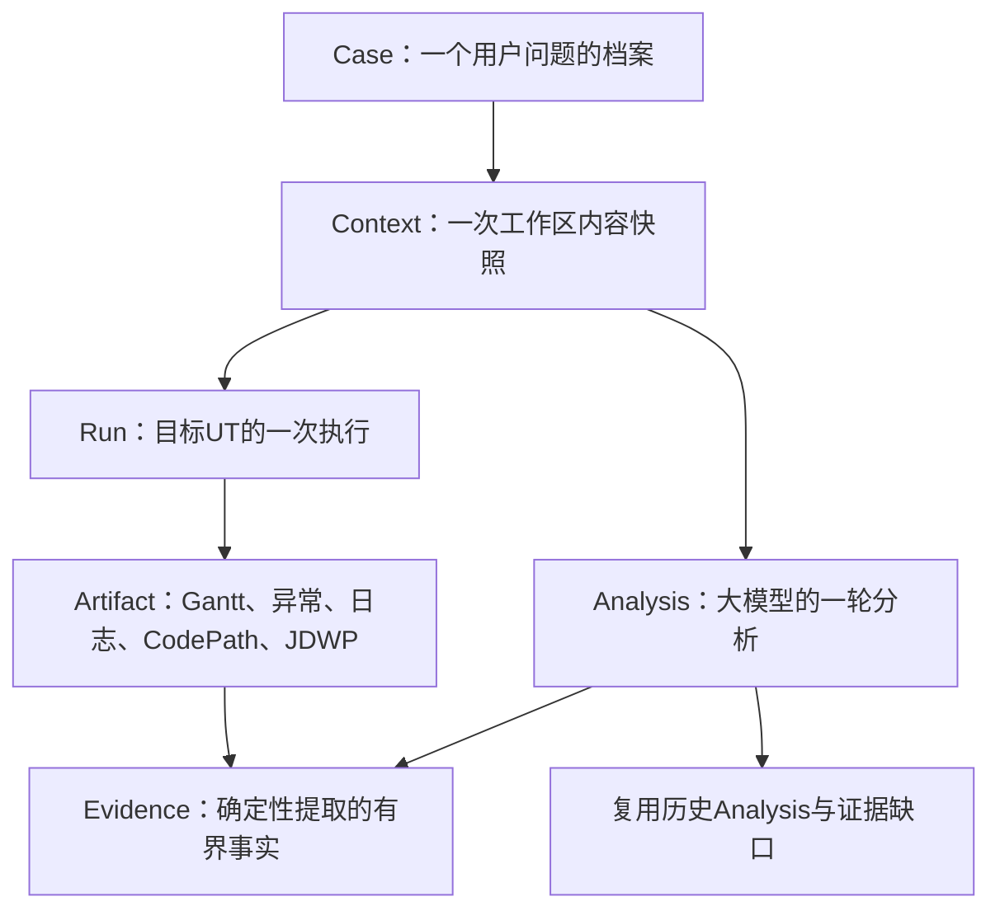
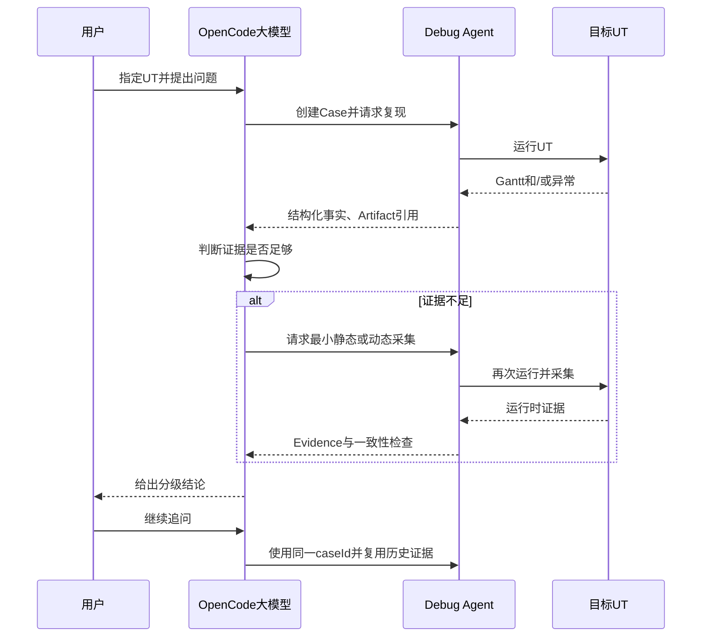
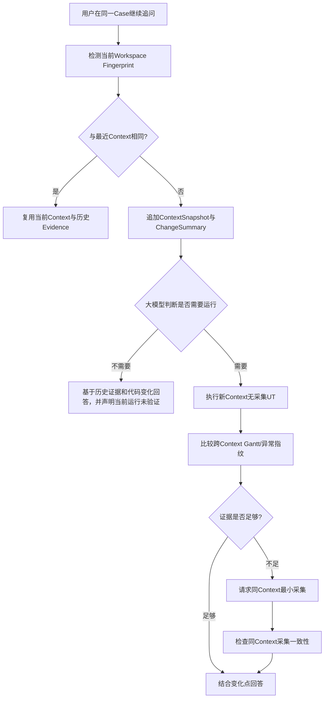

# Case Context、Run Outcome 与多轮 Analysis 持久化可实施设计

> **修订说明（2026-08-18）：** 本文的 Case 档案、Run Outcome 和多轮 Evidence 模型继续有效；
> `ContextSnapshotBuilder`、Workspace 指纹自动比较及 ChangeSummary 已由 ADR-010 和
> `2026-08-18-context-codepath-simplification-design.md` 取代。当前实现使用显式最小 Context。

- 文档状态：Approved / Core Persistence Implemented
- 设计版本：0.6
- 创建日期：2026-08-12
- 负责人：Codex / mh90901119-oss
- 目标里程碑：Phase 0 - OpenCode 多轮问题分析事实链
- 关联需求：在目标算法仓库中指定 UT，通过 OpenCode 与 Debug Agent 多轮运行、采集和分析同一问题
- 关联架构与 ADR：`algorithm-debug-agent-module-detailed-design-v1.md`、
  `ADR-001-dynamic-output-and-case-identity.md`、`ADR-006-case-as-analysis-dossier.md`、
  `ADR-007-opencode-adapter-via-cli.md`

> 2026-08-17 实现收敛：Gantt 复现比较按
> `2026-08-17-json-content-fingerprint-baseline-design.md` 使用 JSON Token 内容 SHA-256 和最小
> `MATCHED/CHANGED` 结论，不实现业务字段投影或字段级 Diff。本文早期提到的跨 Context “Diff”统一理解为
> 指纹变化事实与原始 Artifact 引用；具体变化位置由大模型按问题需要读取产物后解释。

## 1. 背景与问题

用户在目标算法代码仓库中打开 OpenCode，指定一个可由 Maven/JUnit 启动的 UT，并针对该 UT 的
Gantt 结果或异常提出问题。OpenCode 大模型调用 Algorithm Debug Agent 完成确定性执行、结果捕获、
异常解析、CodePathTracer/JDWP 采集和 Evidence 标准化；大模型结合多轮证据解释问题并决定下一次
最小采集动作。

目标 UT 的真实结果只有两大类：

1. UT 成功并产生 Gantt；
2. UT 抛出算法异常、输入异常或 JUnit 断言异常。断言异常以及部分算法异常发生前仍可能已经产生
   Gantt，因此“进程/测试失败”和“Gantt 是否存在”必须独立建模。

原架构拟使用复杂 `CaseLifecycleState`、`case-state.json`、Inquiry/Turn 和恢复状态机持久化整个过程。
该模型无法自然表达大模型同一轮内先分析、再采集、再分析的行为，也可能把目标 UT 异常误认为 Agent
失败并阻断后续诊断。本设计将 Case 简化为一个问题的分析档案，把事实拆分为不可变 Case、Run、
Analysis、Artifact 和 Evidence。

同一问题的多轮对话期间，用户可能在目标仓库修改算法源码后继续追问。代码变化不等于问题变化；
历史 Gantt 和运行时证据仍可用于解释修改前行为或与修改后结果比较，但不得冒充当前代码事实。因此
Case 内需要追加轻量 `ContextSnapshot` 标记每份 Run、Analysis 和 Evidence 所属的工作区版本。

## 2. 目标与非目标

### 2.1 目标

- 首次调用创建 Case，后续同一问题的 OpenCode 对话显式复用同一 `caseId`；
- 每次目标 UT 执行追加保存开始事实、终态事实、日志、Gantt 和结构化异常；
- 独立表达 UT 执行结果、JUnit 结果、Gantt Artifact 和目标/Agent 失败来源；
- 每次运行向大模型返回“结构化摘要 + 原始产物引用”，由版本化 Skill 指导其判断下一步；
- Agent 产品资产全部保存在本仓库，通过一次性 OpenCode 适配安装后，在目标仓库直接启动 `opencode`；
- 每轮分析以 `analysisId` 保存当前问题、历史复用、证据缺口、采集计划、Evidence 选择、分级结论与回答；
- CodePathTracer 与 JDWP 原始数据不可变保存，确定性 Normalizer 生成适合大模型读取的有界 Evidence；
- 新一轮大模型通过 Case Digest 复用历史事实和 Evidence，不依赖完整聊天记录仍留在上下文中；
- 每轮开始时确定性检测源码、输入和 UT 内容变化，并把历史证据作用域与变化摘要提供给大模型；
- 大模型自主决定是否复用历史、分析代码 Diff、运行 UT、比较 Gantt 或执行最小增量采集；
- 同一 Context 内动态采集运行与无采集参考进行一致性检查，变化时不得把采集证据用于确认该 Context
  的根因；不同 Context 之间只生成有范围的指纹变化事实与 Artifact 引用，供大模型解释；
- 目标 UT 抛异常时 Agent 保持可用，返回结构化诊断并允许大模型决定是否需要后续采集。

### 2.2 非目标

- 不实现复杂 Case 生命周期状态机、Inquiry/Turn 状态转换或事件溯源；
- 不自动判断两段自然语言是否属于同一 Case；
- 不因同一问题下的源码、输入或 UT 内容变化自动拆分新 Case；
- 不强制每个 Case 先运行两次无采集 Baseline；
- 不实现线程转储、孤立 PID 扫描或操作系统级 Dump；
- 不在本切片实现 CodePathTracer/JDWP Collector 本身，只定义其 Artifact/Evidence 接入契约；
- 不在本切片实现规划中的全部 CLI 命令，只实现支撑 begin/run/read/complete 与 OpenCode 适配安装的最小入口；
- 不把完整 Raw Trace、完整 Gantt 或对象图直接发送给大模型；
- 不穷举 Java 异常并用固定规则推断业务根因；
- 不实现 Gantt 业务字段投影或字段级结构化 Diff；
- 当前阶段不实现 Algorithm Debug MCP Server，不适配 Codex CLI、Qwen CLI 等其他运行时；
- 不把 Skill 复制到 OpenCode 全局 Skill 目录，也不要求目标算法仓库保存 Agent 产品代码。

## 3. 现状与约束

- `debug-harness` 已实现通用 Maven/JUnit Runner、超时进程树清理、有界 stdout/stderr、动态结果差分、
  文件稳定轮询和 Gantt 捕获；
- `case-management` 已实现追加式 Case/Context/Analysis/Run Repository、Context Snapshot、Case Digest、
  write-once reproduction reference、简单指纹比较及旧 Baseline 稳定性服务；
- `ada-contracts` 已存在 `CaseId`、`RunId`、`AnalysisId`、`ArtifactReference` 和证据分级规则；
- `RunOutcomeSummary` 已正交表达进程、测试、Gantt、目标失败和 Agent 失败；
- 目标算法源码和 UT 不得为采集而修改；输入、源码、UT 未变化时，默认目标 UT 结果确定；
- 所有路径写入 Artifact 前转为 Case/Run 相对路径，日志和回答不得泄漏未脱敏的公司路径；
- Case、Run、Analysis、Artifact 和 Evidence 历史只追加保存，不覆盖已有终态文件。

## 4. 用例与验收标准

| 用例 | 输入/前置条件 | 预期结果 | 验证层级 |
|---|---|---|---|
| 首轮成功 UT | 指定 UT 成功并输出一个合法 Gantt | 创建 Case、Run、Analysis，保存 Gantt 与 JSON Token 内容 Hash | Integration |
| 算法异常 | UT 抛出目标算法异常且无 Gantt | Run 为目标失败，保存异常 cause 与源码位置，Agent 返回可继续分析的响应 | Unit/Integration |
| 输入异常 | 输入文件不存在或格式错误 | 保存目标异常类、cause、消息和稳定业务栈帧，不标记 Agent 崩溃 | Unit |
| 断言失败且有 Gantt | UT 输出 Gantt 后 JUnit 断言失败 | 同一 Run 同时保存 Gantt 和断言诊断 | Integration |
| Maven 编译/发现失败 | UT 未实际执行 | 区分 Build/Test Discovery 与目标算法异常 | Unit |
| Agent 启动失败 | Maven 进程无法创建 | 标记 Agent 基础设施失败，不伪造目标异常 | Unit |
| 不完整 Run | 已写 `run-request.json`，没有 outcome | Digest 标记不完整 Run，不升级为 Evidence | Unit |
| 同问题追问 | 调用方传入已有 `caseId` | 新建 Analysis，复用历史 Evidence，不重复创建 Case | Integration |
| 新独立问题 | 同一 UT 但调用方未复用 caseId | 创建新 Case，避免不同问题的推理互相污染 | Unit |
| 代码变化后直接追问 | 同一 caseId，源码 Hash 已变化，大模型无需运行 | 创建新 Context，历史 Evidence 标为旧 Context，大模型可直接基于历史和 Diff 回答 | Integration/Eval |
| 代码变化后重跑 | 新 Context 的无采集 UT 产生不同 Gantt | 返回跨 Context `CHANGED` 与变化维度，不将变化误判为采集污染 | Integration |
| CodePath 采集 | Analysis 请求调用路径证据 | Raw Artifact 独立保存，Analysis 只引用标准化 Method Path Evidence | Contract |
| JDWP 采集 | Analysis 请求有界变量证据 | 保存预算、截断和 Raw Artifact，生成有 provenance 的 Evidence | Contract |
| 同 Context 采集一致 | 动态运行与本 Context 参考 Gantt Hash/失败特征一致 | Evidence 可用于分级结论 | Unit |
| 同 Context 采集改变行为 | 动态运行与本 Context 参考结果不一致 | Evidence 标记不可用于确认根因，保留为历史事实 | Unit |
| 无本 Context 参考即采集 | 新 Context 尚未无采集运行 | Evidence 可保存但标记缺少一致性参考，不支持确认性根因 | Unit |
| 历史假设复用 | 上轮只有 LLM Hypothesis | 新轮仍保持假设等级，除非新增 Evidence 支持或否定 | Eval |

## 5. 总体方案



Case 只保存创建时即可冻结的项目、目标 UT selector 和问题身份。Context 保存某轮分析开始时的源码、
输入、UT 内容和运行环境 Fingerprint；Run 保存目标 UT 的执行事实；Analysis 保存一轮推理所使用的
上下文、计划和结论；Artifact 保存工具原始输出；Evidence 保存确定性代码从 Artifact 中提取的可引用
事实。Case 的“当前情况”由这些追加记录构建，不使用可变状态机决定大模型下一步动作。

采用该方案的原因：

- 与 OpenCode 的实际多轮对话自然对应；
- UT 异常不会阻断分析；
- 大模型可灵活决定是否复用、静态分析或动态采集；
- 原始数据与 LLM 推理分离，结论可追溯且上下文有界；
- 通过唯一 ID、独立目录和 create-new 语义减少锁、恢复和覆盖规则。

该设计与当前 Agent 工程实践一致：[OpenAI Agent 指南](https://openai.com/business/guides-and-resources/a-practical-guide-to-building-ai-agents/)
把模型决策、动态工具选择和明确 Guardrails 作为核心；[Anthropic Building Effective Agents](https://www.anthropic.com/engineering/building-effective-agents)
建议从简单可组合模式开始，只在效果需要时增加复杂度，并区分固定 Workflow 与模型自主控制工具的
Agent；[ReAct](https://arxiv.org/abs/2210.03629) 通过 Reasoning、Action、Observation 交替更新计划。这里的
Context/Evidence 是可靠 Observation，运行和采集是 Action，大模型负责 Reasoning，确定性校验是
Guardrail，而不是用规则状态机代替模型推理。

## 6. 模块与类设计

| 模块/类 | 职责 | 输入 | 输出 | 依赖 |
|---|---|---|---|---|
| `ada-contracts/CaseManifest` | 冻结一个问题的身份 | Case、项目、UT selector、初始问题 | 不可变 Case DTO | contracts |
| `ada-contracts/ContextSnapshot` | 冻结一版工作区内容身份 | 源码、输入、UT内容、classpath、环境 | 不可变 Context DTO | contracts |
| `ada-contracts/WorkspaceChangeSummary` | 表达新旧 Context 的确定性变化 | 两个 Context、文件 Hash | 有界变化摘要 | contracts |
| `ada-contracts/RunRequest` | 记录 Run 启动事实 | caseId、contextId、runId、模式、时间、UT | 不可变 DTO | contracts |
| `ada-contracts/RunOutcomeSummary` | 面向 LLM 的有界本轮运行摘要 | RunOutcome、比较结论 | 结构化摘要与 Artifact 引用 | contracts |
| `ada-contracts/RunResultFingerprint` | 保存可比较的目标观察 | Gantt 原始/内容 Hash、目标失败 Hash | 不可变指纹 DTO | contracts |
| `ada-contracts/TargetFailureDiagnostic` | 保存异常类、消息、cause 与业务栈帧；原始报告由摘要 Artifact 引用 | Surefire 报告 | 通用诊断事实 | contracts |
| `ada-contracts/AnalysisRequest` | 保存一轮问题与 Context 归属 | 问题、caseId、contextId | 不可变 DTO | contracts |
| `case-management/CaseArchiveRepository` | create-new 追加 Case、Context、Analysis、Run、指纹与参考 | 稳定 contracts | 不可变 JSON 文档 | Jackson/JDK NIO |
| `case-management/ContextSnapshotBuilder` | 比较当前工作区与历史 Context | 项目路径、输入定位器 | Context Snapshot | JDK NIO |
| `case-management/CaseDigestReader` | 构建有界多轮上下文 | Case、Analysis、Run | CaseDigest | contracts |
| `case-management/ReproductionComparator` | 比较同/跨 Context 目标观察指纹 | 参考与当前 Run | 范围、结论、变化维度 | contracts |
| `debug-harness/SurefireTestResultReader` | 确定性读取目标测试报告 | 目标报告、target selector | TargetFailureDiagnostic | JDK XML |
| `debug-harness/ScheduleProducingTestRunner` | 组合 Runner、Gantt 捕获和 Agent 后处理诊断 | TestLaunchSpec、Parser | ScheduleRunResult | harness/adapter |
| `ada-core/RunApplicationService` | 归档一次 Run 并建立/比较复现参考 | Case/Analysis、Adapter | RunOutcomeSummary | contracts/case/harness |
| `evidence-engine/EvidenceCatalog` | 登记并筛选标准化 Evidence | Artifact/Evidence | 有界目录 | contracts |
| `algorithm-debug-cli` | 输出稳定 ToolResponse JSON，日志只写 stderr/Artifact | 高层命令 | 有界 JSON | core/contracts |
| `integrations/opencode` | 提供 Agent、Command 和薄 Custom Tool，调用 `ada` CLI | OpenCode tool call | ToolResponse | OpenCode/CLI |

公共 DTO 不泄露 Jackson、Surefire 或 Collector 内部类型。Repository 只依赖稳定 contracts；Harness
通过持久化端口写 Run 事实，避免 `debug-harness` 反向依赖 `case-management` 实现。

## 7. 数据与契约设计

### 7.1 Case、Run 与 Analysis 层级

```text
Case       一个目标项目、目标UT和用户问题的分析档案
Context    同一Case内一版源码、输入、UT内容和运行环境快照
Run        对目标UT的一次进程执行
Analysis   大模型针对初始问题或追问的一轮分析
Artifact   Gantt、异常报告、日志、Raw Trace等不可变文件
Evidence   从Artifact确定性提取的可引用事实
```

同一 OpenCode 对话围绕同一问题时显式复用 `caseId`；一次追问创建新 `analysisId`。同一 Analysis 可以
引用多个历史 Context/Run/Evidence，一次 Run/Evidence 也可以被多轮 Analysis 复用。每个 Run、Analysis、
Artifact 和 Evidence 必须绑定一个 `contextId`；跨 Context 引用表示历史或对比证据，不表示当前事实。

### 7.2 目录结构

```text
.algorithm-debug/cases/CASE-001/
├── case.json
├── contexts/
│   ├── CONTEXT-001/
│   │   ├── context.json
│   │   ├── change-summary.json
│   │   └── reproduction.json
│   └── CONTEXT-002/
├── runs/
│   ├── RUN-001/
│   │   ├── run-start.json
│   │   ├── run-outcome.json
│   │   ├── result/gantt.json
│   │   ├── diagnostics/test-failure.json
│   │   ├── codepath/
│   │   │   ├── collection-manifest.json
│   │   │   └── raw-method-path.json
│   │   ├── jdwp/
│   │   │   ├── collection-manifest.json
│   │   │   └── raw-events.jsonl
│   │   └── logs/
│   │       ├── stdout.log
│   │       └── stderr.log
│   └── RUN-002/
├── analyses/
│   ├── ANALYSIS-001/
│   │   ├── question.json
│   │   ├── context.json
│   │   ├── evidence-gaps.json
│   │   ├── plan.json
│   │   ├── evidence-selection.json
│   │   ├── result.json
│   │   └── answer.md
│   └── ANALYSIS-002/
└── evidence/
    ├── EVIDENCE-GANTT-001.json
    ├── EVIDENCE-CODEPATH-001.json
    └── EVIDENCE-JDWP-001.json
```

不存在 `case-state.json`、`run-registry.json` 或 `conversation-index.json`。目录枚举可确定性重建索引；
若后续性能数据证明需要缓存，可新增可删除、可重建的派生索引，但不得成为事实源。

`case.json` 不冻结源码、输入和 UT 内容 Hash；这些字段属于 Context。目标 UT selector 是 Case 的问题
锚点，默认改变 selector 时创建新 Case；在同一 selector 下修改 UT 源码、算法源码或输入时追加新
Context。`contextId` 由不透明 ID 表示，Context Fingerprint 用于检测内容相同而非推导目录名称。

### 7.3 Run Outcome 独立维度

`RunOutcome` 至少独立表达：

- `processCompletion`：`SUCCEEDED`、`FAILED`、`TIMED_OUT`；
- `testOutcome`：`PASSED`、`ASSERTION_FAILED`、`ERROR`、`NOT_EXECUTED`、`UNKNOWN`；
- `targetFailure.category`：`BUILD_FAILURE`、`TEST_FAILURE`、`TEST_ERROR`、`TEST_NOT_EXECUTED` 或
  `UNKNOWN`；它只表达目标执行阶段，不推断业务根因；
- `agentFailure`：独立的 Agent 采集、解析或持久化失败诊断，不混入目标失败分类；
- `scheduleResult`：可选 ArtifactReference，与 testOutcome 无绑定；
- `diagnostic`：可选 TargetFailureDiagnostic 引用；
- `stdout`、`stderr`、退出码、耗时、截断和进程清理报告。

因此允许 `ASSERTION_FAILED + scheduleResult present`，也允许目标算法在异常前产生部分 Gantt；后者
必须标记 Artifact 完整性，不能默认当作成功结果。

`TargetFailureDiagnostic` 不维护异常类型白名单。`NullPointerException`、`NoSuchFileException` 或业务
异常均原样记录类名、规范化消息、cause 和稳定业务栈帧；具体原因由大模型结合源码、输入和其他 Evidence
分析。无法可靠分类时使用 `UNKNOWN`，不得根据控制台文本猜造业务结论。

### 7.4 Analysis 内容

每轮 Analysis 保存：

1. 当前问题、`parentAnalysisId`、当前 `contextId` 和调用方对话引用；
2. `reusedContextIds`、`reusedAnalysisIds`、`reusedRunIds`、`reusedEvidenceIds`；
3. 当前证据缺口；
4. 最小静态/动态采集计划及预算；
5. 本轮新增 Run、Artifact 和 Evidence 引用；
6. 实际送入 LLM 的 Evidence Selection；
7. `CONFIRMED_FACT`、`VALIDATOR_CONCLUSION`、`SOURCE_INFERENCE`、`LLM_HYPOTHESIS`、
   `MISSING_EVIDENCE` 分级结论；
8. 对上一轮假设的 `SUPPORTED`、`REJECTED` 或 `UNRESOLVED` 关系；
9. 当前 Context Fingerprint、代码提交、Case Hash、Schema、工具、Prompt/Skill 和模型版本；
10. 面向用户的回答 Artifact。

Analysis 不复制 Raw Trace。历史 LLM 假设不会因被新一轮引用自动升级为事实。

### 7.5 Context、复现参考与两类变化

`beginAnalysis` 先比较当前工作区与最近 Context。Fingerprint 相同则复用 Context；源码、输入、UT 内容
或环境发生变化时，在同一 Case 下追加 Context 和有界 `change-summary.json`，但不自动运行 UT。
大模型可以根据用户问题和历史证据决定直接回答、读取源码 Diff，或请求新 Run。

每个 Context 的首次无采集 Run 可创建该 Context 的 `reproduction.json`，默认不要求第二次无采集运行。
参考结果按实际输出记录：

- UT 通过且有 Gantt：在 `RunResultFingerprint` 保存原始 SHA-256 和忽略格式空白的 JSON Token
  内容 SHA-256；
- UT 异常且无 Gantt：保存异常类、cause、稳定抛出位置和规范化消息形成的目标失败 SHA-256；
- 断言失败且有 Gantt：同时保存两类指纹；
- 输入不存在等已充分定位异常：允许直接回答，不强制动态采集。

变化必须区分：

- 不同 Context 的两个 Run：Gantt/异常变化是代码、输入或 UT 修改后的对比事实，返回
  `scope=CROSS_CONTEXT` 的 `MATCHED/CHANGED`、固定变化维度和参考 Run；不视为采集污染，也不由代码
  推断字段级原因；
- 同一 Context 的无采集与动态采集 Run：逐项比较参考中存在的维度，任何必比维度变化时保留该 Run，
  但其 Evidence 标记 `COLLECTION_BEHAVIOR_MISMATCH`，不得支撑该 Context 的确认性根因；
- 新 Context 尚无无采集参考却直接采集：Artifact/Evidence 仍保存，但标记 `MISSING_REFERENCE`；在补充
  同 Context 无采集参考前，不得用于确认性根因；
- 同一 Context 两次无采集 Run 不一致：当前返回 `CHANGED`，由大模型决定是否继续复现或
  调整问题范围。

失败特征只用于证明同一 Context 采集前后是否仍是同一可观察失败，不等同于根因结论。

### 7.6 Schema 与兼容性

新增 Schema 初始版本均为 `1.0`：

- `schemas/case/case-context-v1.schema.json`；
- `schemas/case/context-snapshot-v1.schema.json`；
- `schemas/execution/run-start-v1.schema.json`；
- `schemas/execution/run-outcome-v1.schema.json`；
- `schemas/execution/run-outcome-summary-v1.schema.json`；
- `schemas/analysis/analysis-record-v1.schema.json`；
- `schemas/evidence/evidence-record-v1.schema.json`；
- `schemas/evidence/context-change-diff-v1.schema.json`。

`BaselineManifest v2` 和 `BaselineVerification v1` 继续读取历史数据，但新入口不把它们作为通用 Case
工作流状态。实现直接将仅用于 Baseline 的 Java 枚举收敛为 `BaselineStabilityState`，保留
`BASELINE_CANDIDATE/STABLE/UNSTABLE` JSON 字面值；未发布且无生产引用的 `CaseLifecycleState`、
`InquiryId` 和 `TurnId` 删除，避免迁移期类型继续误导后续实现。

### 7.7 OpenCode 与 Agent 调用关联

OpenCode 不依赖自然语言相似度查找 Case。第一轮调用提交目标项目、UT、初始问题和可选的外部对话
引用，Agent 返回新 `caseId` 与 `analysisId`；后续追问必须显式带回 `caseId`。外部对话引用只用于
审计，不作为 Case 身份或自动复用依据。

协作 API 分为两个边界：

1. `beginAnalysis` 创建 `analysisId` 并返回 Case Digest、可用 Evidence Catalog 和当前证据缺口；
2. `completeAnalysis` 保存实际使用的 Evidence、分级 Claims、未解决问题和面向用户的回答。

中间的运行、静态分析、CodePathTracer 或 JDWP 请求均携带 `caseId`、`contextId` 与 `analysisId`。
源码、输入或 UT 内容 Fingerprint 变化时创建新 Context，不返回冲突；项目身份或目标 UT selector 与
已有 Case 不一致时返回结构化 `CASE_IDENTITY_CONFLICT`。调用方不传 `caseId` 时创建新问题 Case，Agent
不猜测自然语言是否与历史问题相同。若大模型在生成回答前异常退出，Analysis 目录保留 request、plan
和已产生 Evidence，但没有 `result.json`，读取时派生为不完整 Analysis，不重写历史文件。

若本轮调用运行了 UT，Analysis 追加 `newRunIds`，工具立即返回自描述的 `RunOutcomeSummary`。摘要至少
包含 `eventType=TARGET_TEST_RUN_COMPLETED`、`caseId`、`contextId`、`analysisId`、`runId`、
`latestRunForAnalysis=true`、进程/测试/Gantt/Agent 结果、比较状态和 Artifact 引用。Analysis 不复制
Run 的日志或 Gantt；`latestRunForAnalysis` 只表示本轮新产生，不表示它覆盖历史事实。

OpenCode 大模型默认只接收有界摘要、关键异常片段和 Artifact 引用。完整 stdout、stderr、Surefire
报告和 Gantt 按需读取，避免无界日志占满上下文。即使 Skill 未加载，ToolResponse 自身也必须足以区分
本轮 Run、历史 Run、目标 UT 失败和 Agent 工具失败。

## 8. 核心流程

### 8.1 标准协作循环



OpenCode 大模型负责理解问题、判断证据充分性和选择下一步；Debug Agent 负责确定性执行、解析、
采集、校验、哈希、持久化和证据检索。LLM 不直接拼 Maven/classpath、不修改原始 Artifact，也不能
绕过一致性检查。

### 8.2 多轮 Analysis 复用

每轮开始时 `CaseDigestBuilder` 生成有界摘要：

- Case 初始问题与当前追问；
- 当前 `contextId`、目标 UT 和源码/输入/UT 内容 Fingerprint；
- 与上一 Context 的变化摘要，以及历史 Evidence 的 Context 作用域；
- 历史已确认事实和 Validator 结论；
- 仍为假设或已被否定的结论；
- Evidence Catalog、截断、冲突和一致性状态；
- 未解决证据缺口。

LLM 优先读取 Case Digest 和相关 Evidence 切片，只有核验需要时才按 ArtifactReference 获取原始文件
局部。新 Analysis 明确列出复用引用，避免聊天上下文压缩后失去 provenance。

历史 Evidence 不因 Context 变化而删除或失效：它仍可解释修改前行为或参与新旧对比，但大模型必须在
回答中区分“历史 Context 已确认事实”和“当前 Context 尚未验证事实”。已有证据足以回答历史原因、
源码意图或概念问题时，大模型可以不运行 UT；需要确认当前运行效果时再请求无采集 Run。

### 8.3 CodePathTracer 与 JDWP 接入

CodePathTracer Raw Artifact 保存完整工具输出，Normalizer 提取与当前问题相关的方法路径、源码位置和
截断信息。JDWP Raw Artifact 采用 JSONL 流式保存，只采集计划 allowlist 中的变量，并生成命中、
过滤决策或状态投影 Evidence。两者都必须记录 `analysisId`、`runId`、工具版本、采集配置、预算、
截断原因和源 Artifact Hash。

### 8.4 代码修改后的继续分析



跨 Context 的 `MATCHED/CHANGED` 是分析对象；同 Context 采集一致性是后续动态证据 Guardrail。
确定性代码只报告比较范围、参考 Run 和变化维度，不输出字段级 Diff；二者也不得使用同一个
`BASELINE_MISMATCH` 语义。

### 8.5 OpenCode 适配与日常使用

当前阶段使用 OpenCode 作为唯一 Agent Runtime，不实现 Algorithm Debug MCP Server。调用链固定为：

```text
OpenCode大模型
  -> algorithm-debug Skill
  -> OpenCode Custom Tool
  -> ada CLI
  -> Java Agent Core
  -> Case/Context/Run/Analysis/Evidence
```

唯一 Skill 源码位于 Agent 仓库 `skills/algorithm-debug/SKILL.md`；`integrations/opencode` 只保存 Agent、
Command、Custom Tool 和配置模板。一次性执行 `ada install opencode`（最终命令名可在 CLI 设计中保持该语义）
后，OpenCode 用户配置只登记 Agent 安装路径、外部 Skill 来源和薄 Custom Tool，不复制 Skill 正文或
Java 业务实现。安装必须可重复执行、检测版本冲突并支持移除适配。

正常使用流程是用户进入目标算法仓库后直接运行 `opencode` 并指定 UT 提问。Custom Tool 从 OpenCode tool
context 获取当前 directory/worktree，调用 `ada` CLI 时自动传递项目路径。`ada opencode --project ...`
仅作为开发、自测或临时免安装入口，不是正式日常流程。自动 Skill 发现之外保留 `/debug-case` 和显式
`algorithm-debug` Agent 作为兜底。

目标仓库不保存 Agent 产品代码；默认只产生可忽略的 `.algorithm-debug/cases` 运行证据，并允许通过配置
将 Case Workspace 放到外部目录。

## 9. 错误处理与可观测性

- 目标异常、断言失败、构建失败和 Test Discovery 失败统一返回终态 `RunOutcome`，不让
  Agent 因 Maven 非零退出码崩溃；
- Agent 进程启动、日志捕获、解析和持久化错误使用独立 `failureOrigin=AGENT` 与结构化错误码；
- 已存在的 Gantt 即使 UT 失败也执行 provenance 差分和 Parser 校验，并独立记录完整性；
- Surefire 报告缺失时保留 stdout/stderr，诊断标记 `INCOMPLETE`，不得根据日志猜造异常字段；
- 只有 `run-start.json` 的目录读取为 `INCOMPLETE`，不产生 Evidence，不需要修改历史文件；
- 超时保留 `TARGET_TIMEOUT`、日志和清理报告；本阶段不采集线程转储；
- Analysis 记录 Evidence 缺失、截断、矛盾和参考不一致，不允许静默降级结论强度。
- Workspace 变化只创建 Context 和 Change Summary，不自动运行 UT；历史 Evidence 的 `contextId` 不得
  丢失，跨 Context 使用时必须在 Claim 中声明作用域；
- 异常类和消息作为事实提供给大模型，确定性代码不把它们映射成输入配置、算法缺陷等业务根因；

## 10. 性能与容量预算

| 指标 | 默认值 | 上限 | 超限行为 | 验证方法 |
|---|---:|---:|---|---|
| Case Digest | 256 KiB | 1 MiB | 拒绝构建并要求缩小 Evidence 选择 | Unit |
| Workspace Change Summary | 256 KiB | 1 MiB | 只保留路径与 Hash 摘要，完整 Diff 按需读取 | Unit |
| 单轮 Evidence 引用 | 100 | 1,000 | 截断目录并记录总数 | Unit |
| 单个标准化 Evidence | 64 KiB | 1 MiB | 标记截断，不发送 Raw Artifact | Unit |
| JDWP Raw 事件 | 由采集计划指定 | 计划硬上限 | Collector 停止并记录截断原因 | Integration |
| CodePath 方法节点 | 1,000 | 10,000 | 输出有界子图并记录截断 | Integration |
| Analysis 回答 | 256 KiB | 1 MiB | 拒绝写入 | Unit |

现有 stdout/stderr、结果文件和目录快照预算继续由 Runner 设计控制。本模块不得无界读取全部历史 Raw
Trace 构建 Case Digest。

## 11. 安全、隐私与无侵入性

- 不修改目标算法源码或 UT；
- 目标仓库路径只作为调用参数，持久化时优先使用项目相对路径和脱敏显示；
- 异常原始消息可能包含绝对路径，Raw Artifact 原样受控保存，Evidence 与 LLM 输入使用脱敏字段；
- JDWP 只采集计划 allowlist，不展开完整对象图；
- Case/Run/Analysis 目录必须位于配置的 workspace 内并拒绝路径逃逸；
- 不新增第三方运行时依赖；XML 解析禁用外部实体和 DTD，避免 XXE；
- 日志、Analysis 回答和 Evidence 不保存凭据、环境 Token 或未授权生产数据。

## 12. 测试设计

### 12.1 单元测试

- `CaseArchiveRepositoryTest`：重复写同一 Case/Run/指纹必须失败，reproduction 只能首次建立；
- `ContextSnapshotBuilderTest`：代码变化产生新 Context，内容未变时复用 Context；
- `CaseDigestReaderTest`：只有 `run-request.json` 时读取为不完整；
- `RunOutcomeSummaryTest`：失败与 Gantt 可同时存在，目标与 Agent 失败不得混淆；
- `SurefireTestResultReaderTest`：提取 cause 和业务栈帧，只区分测试阶段而不推断根因；
- `RunOutcomeSummaryTest.shouldIdentifyLatestRunAndBoundExcerpts`：本轮标识、摘要预算和引用完整；
- `CaseDigestBuilderTest.shouldReuseFactsWithoutPromotingHypotheses`：历史假设保持原等级；
- `CaseDigestBuilderTest.shouldEnforceSizeBudget`：摘要不得无界增长；
- `ReproductionComparatorTest.shouldCompareGanttAndAssertionWithinSameContext`：同 Context 组合结果逐维比较；
- `ReproductionComparatorTest.shouldNotTreatCrossContextChangeAsCollectionMismatch`：跨 Context 变化不是采集污染；
- `JsonTokenContentHasherTest`：忽略格式空白，同时保留字符串内容、字段/数组顺序和数字 Token；
- `AnalysisRequest` 归档测试：历史 Analysis 不可覆盖；
- `OpenCodeAdapterContractTest.shouldReturnCliToolResponseWithoutRewritingFacts`：薄适配层不得改变事实字段。

### 12.2 契约与兼容性测试

- Java DTO 与八个 JSON Schema 的必填字段、枚举和 round-trip 一致；
- 旧 `BaselineManifest v2` 与 `BaselineVerification v1` Fixture 仍可读取；
- ArtifactReference 必须使用便携相对路径并匹配 SHA-256；
- CodePath/JDWP Evidence 必须包含 source Artifact、runId、analysisId、工具版本和截断状态。

### 12.3 集成与端到端测试

- 真实 Demo UT 成功时创建 Case、Run、Analysis 并捕获 165 个 operation 的 Gantt；
- Fixture UT 在输出 Gantt 后断言失败时，同时捕获 Gantt 与 Surefire Assertion；
- Fixture UT 输入不存在时输出结构化目标异常，Agent 调用正常返回；
- 同一 caseId 的第二轮 Analysis 复用第一轮 Gantt Evidence，并只新增所需 Run；
- 修改源码后继续同一 caseId 时创建新 Context，且大模型可在不运行 UT 的情况下复用历史 Evidence；
- 新 Context 重跑产生相同 Gantt 时返回跨 Context `MATCHED`，改变 JSON 值时返回 `CHANGED`；
- 同 Context 模拟采集结果 Hash 变化时，新 Evidence 被标记采集行为不一致。

### 12.4 性能测试与 Agent Eval

- Eval 成功：已有证据足够时不重复运行 UT；
- Eval 证据不足：大模型请求最小 CodePath/JDWP 采集；
- Eval 工具失败：保留失败事实并降低结论，不中断 Case；
- Eval 错误假设：上一轮假设被新证据否定后不得继续当作事实；
- Eval 代码变化：模型明确知道历史证据属于旧 Context，自主选择直接回答、运行或继续采集；
- 生成包含 1,000 条 Evidence 目录的 Case，Case Digest 构建保持有界和确定。

### 12.5 测试夹具与 Golden 数据

- 使用仓库内最小 Maven/JUnit Fixture，不依赖网络或真实时间；
- Fixture 覆盖成功 Gantt、算法异常、输入异常、断言失败且有 Gantt、编译/发现失败；
- CodePath/JDWP 使用最小脱敏 Raw Fixture 验证 Normalizer，不依赖外部工具在线运行；
- Golden 更新必须说明 Schema 或工具输出变化原因，不得为通过测试弱化断言。

## 13. 实施步骤

1. 先增加 Case、Context、Run、Analysis、Evidence Schema 契约失败测试和不可变 DTO；
2. TDD 实现 Context 变化检测、create-new JSON Repository、目录边界和不完整 Run 派生视图；
3. TDD 实现 Surefire 诊断读取与目标/Agent 失败分类；
4. 组合 Runner、Gantt 捕获和 Run 持久化，覆盖失败但有 Gantt；
5. TDD 实现 Analysis、Case Digest、跨 Context 简单指纹比较；Evidence Catalog 后续实施；
6. 增加 CodePath/JDWP Artifact/Evidence 接入契约 Fixture；
7. 实现仓库内版本化 Skill、OpenCode Custom Tool/Agent/Command 与一次性幂等适配脚本；
8. 更新真实 Demo 集成测试、README、架构和开发计划；
9. 逐模块代码审计，修复发现的缺陷并运行受影响模块及根项目测试。

## 14. 兼容、迁移与回滚

- 已有 `BaselineManifest` 和 `BaselineVerification` Schema 保持可读；Java 侧只保留专用
  `BaselineStabilityState`，不再保留复杂 Case 生命周期枚举；
- 新持久化格式使用独立 Schema，不尝试自动导入历史测试临时目录；
- 旧代码仍可使用 `BaselineStabilityService`，新 OpenCode 协作入口默认使用首次复现参考；
- `CaseResolutionService` 不再创建 Revision：同一目标 UT 的 Fingerprint 变化返回 `NEW_CONTEXT`，
  完全一致返回 `REUSE_CONTEXT`，目标 UT selector 变化返回 `NEW_CASE`；`NEW_CONTEXT/REUSE_CONTEXT`
  同时返回现有 `caseId/contextId`，供调用方建立新 Context 的父作用域或直接复用；
- 如果新多轮持久化不可用，Runner 仍可独立执行并返回内存 `RunResult`，但必须明确提示未形成可恢复 Case；
- 回滚实现时保留全部已生成 Case/Run/Analysis Artifact，不执行破坏性迁移。

## 15. 风险与决策结果

| 风险/问题 | 影响 | 缓解措施 | 状态 |
|---|---|---|---|
| 同一 UT 同时有多个用户问题 | Evidence 串用 | 每个问题显式创建独立 Case | Resolved |
| OpenCode 忘记传 caseId | 意外创建新 Case | 返回明确的新 Case 摘要，后续 CLI 提供 resume 参数 | Resolved |
| 历史 Analysis 过多 | LLM 上下文膨胀 | Case Digest 有预算，按 Evidence 相关性选择 | Resolved |
| 断言失败仍有 Gantt | 丢失关键证据 | RunOutcome 独立建模 testOutcome 与 scheduleResult | Resolved |
| 异常消息含动态字段 | 采集前后误判不一致 | Raw 完整保存，比较规范化稳定字段 | Resolved |
| LLM 把旧假设当事实 | 错误结论累积 | Claim Type 固化且升级必须引用新增 Evidence | Resolved |
| 代码变化后沿用旧运行事实 | 把历史行为误报为当前行为 | Context 作用域、Change Summary 和 Claim contextId | Resolved |
| 跨 Context Gantt 变化被当成采集污染 | 丢失修改效果 | 比较结果明确 `scope=CROSS_CONTEXT` | Resolved |
| CodePath/JDWP Raw 数据过大 | 内存和上下文失控 | 流式落盘、预算、Normalizer 与 Evidence 切片 | Resolved |
| 并发写同一 Case | 目录或 ID 冲突 | 不透明唯一 ID、create-new 文件语义；有实测冲突后再引入窄锁 | Implemented |

## 16. 文档同步清单

- [x] 架构/ADR
- [ ] Schema 与示例（实施时新增并由契约测试约束）
- [ ] README/CLI 使用说明（实施时同步）
- [x] Mermaid 图
- [ ] 知识库与 Prompt/Skill 版本（OpenCode 协作入口实施时同步）
- [ ] Eval Case（Analysis 编排实施时新增）

## 17. 实现完成记录

截至 2026-08-17，`RunOutcomeSummary`、通用 Surefire 诊断、追加式 Case/Context/Run/Analysis
Repository、Case Digest、JSON 内容/目标失败指纹、write-once Context reference、简单比较、规范 Skill、
OpenCode 适配资产和外部 Workspace 控制面 `ada` CLI 已增量实现；动态采集/Evidence 编排和 OpenCode
安装器尚未实现。任何 README 和 ADR 不得将“适配资产存在”表述为“用户已可在目标仓库直接调用完整
Agent”。实现边界如下：

- 一旦 Harness 已取得 `RunResult`，后续 Gantt 扫描、稳定、解析、复制或哈希失败必须返回
  `GanttOutcome.INCOMPLETE` 与独立 Agent 诊断，不得遮蔽目标 UT 结果；Harness 内部组合结果保留底层
  cause，面向模型的诊断只暴露有界错误码、说明和异常类；
- `RunOutcomeSummary` 拒绝测试状态、目标失败分类和 Gantt Artifact 之间的矛盾组合；
- Surefire Reader 只读取目标测试报告，支持参数化方法名、最深 cause 与文件大小预算；
- 不完整 Gantt 返回本轮变化候选路径和 Agent 错误码/异常类，后续持久化层负责按预算保存原始部分产物；
- OpenCode 薄适配只原样返回通过 ToolResponse 2.0 校验的有界 stdout，启动/超限/协议失败返回结构化
  Adapter 失败且不回显原始日志；
- `ada` CLI 当前只实现 Workspace init、项目 register 和 Doctor；Case 编排命令与幂等 OpenCode
  安装器仍作为后续独立模块，不以适配资产或脚手架冒充已完成能力。

## 18. 变更记录

| 日期 | 版本 | 变更内容 | 作者 |
|---|---|---|---|
| 2026-08-12 | 0.1 | 根据用户实际 OpenCode 多轮协作场景重构 Case、Run、Analysis 与 Evidence 模型 | Codex / mh90901119-oss |
| 2026-08-12 | 0.2 | 增加 ContextSnapshot，支持代码变化后在同一 Case 内由大模型自主复用、运行和对比 | Codex / mh90901119-oss |
| 2026-08-12 | 0.3 | 明确结构化摘要、原始产物引用与 Skill 协作；收敛异常分类；采用一次性 OpenCode 适配并排除当前 MCP | Codex / mh90901119-oss |
| 2026-08-13 | 0.4 | 根据代码审计修复结果遮蔽、旧 Case 状态模型、契约不变量、Surefire 边界和 OpenCode 有界协议，并明确 CLI 非目标 | Codex / mh90901119-oss |
| 2026-08-16 | 0.5 | 同步外部 Workspace 控制面 CLI 的已实现边界，继续明确 Case Repository 与 OpenCode 安装器未实现 | Codex / mh90901119-oss |
| 2026-08-17 | 0.6 | 同步 Case Repository、JSON 内容/失败指纹和简单比较实现；撤销字段级 Gantt Diff 预期 | Codex / mh90901119-oss |
