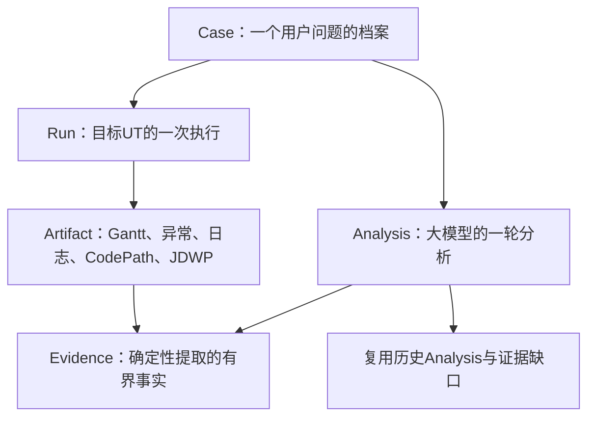
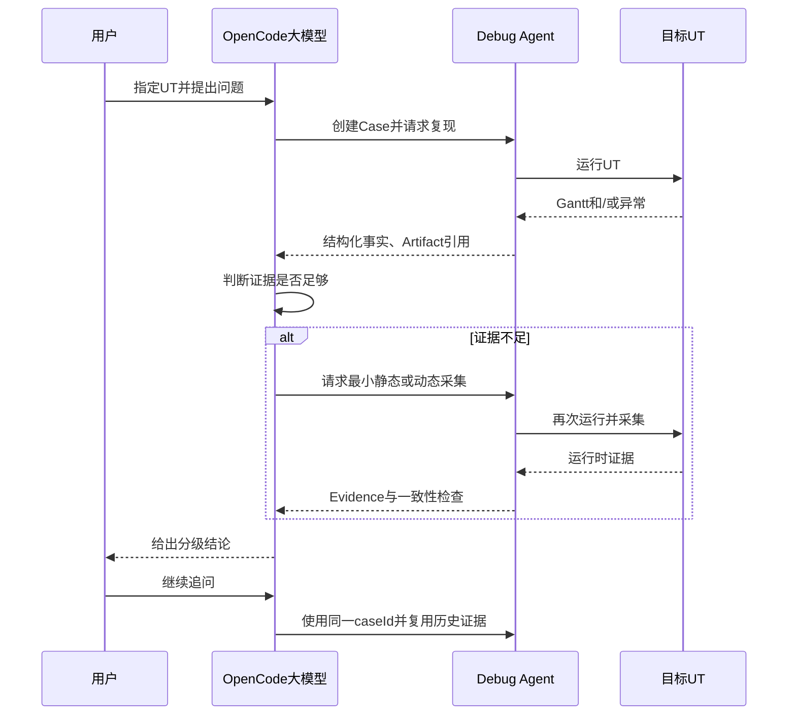

# Case Context、Run Outcome 与多轮 Analysis 持久化可实施设计

- 文档状态：Review
- 设计版本：0.1
- 创建日期：2026-08-12
- 负责人：Codex / mh90901119-oss
- 目标里程碑：Phase 0 - OpenCode 多轮问题分析事实链
- 关联需求：在目标算法仓库中指定 UT，通过 OpenCode 与 Debug Agent 多轮运行、采集和分析同一问题
- 关联架构与 ADR：`algorithm-debug-agent-module-detailed-design-v1.md`、
  `ADR-001-dynamic-output-and-case-identity.md`、`ADR-006-case-as-analysis-dossier.md`

## 1. 背景与问题

用户在目标算法代码仓库中打开 OpenCode，指定一个可由 Maven/JUnit 启动的 UT，并针对该 UT 的
Gantt 结果或异常提出问题。OpenCode 大模型调用 Algorithm Debug Agent 完成确定性执行、结果捕获、
异常解析、CodePathTracer/JDWP 采集和 Evidence 标准化；大模型结合多轮证据解释问题并决定下一次
最小采集动作。

目标 UT 的真实结果只有两大类：

1. UT 成功并产生 Gantt；
2. UT 抛出算法异常、输入异常或 JUnit 断言异常。断言异常以及部分算法异常发生前仍可能已经产生
   Gantt，因此“进程/测试失败”和“Gantt 是否存在”必须独立建模。

原架构拟使用复杂 `CaseLifecycleState`、`case-state.json`、Inquiry/Turn 和恢复状态机持久化整个过程。
该模型无法自然表达大模型同一轮内先分析、再采集、再分析的行为，也可能把目标 UT 异常误认为 Agent
失败并阻断后续诊断。本设计将 Case 简化为一个问题的分析档案，把事实拆分为不可变 Case、Run、
Analysis、Artifact 和 Evidence。

## 2. 目标与非目标

### 2.1 目标

- 首次调用创建 Case，后续同一问题的 OpenCode 对话显式复用同一 `caseId`；
- 每次目标 UT 执行追加保存开始事实、终态事实、日志、Gantt 和结构化异常；
- 独立表达 UT 执行结果、JUnit 结果、Gantt Artifact 和目标/Agent 失败来源；
- 每轮分析以 `analysisId` 保存当前问题、历史复用、证据缺口、采集计划、Evidence 选择、分级结论与回答；
- CodePathTracer 与 JDWP 原始数据不可变保存，确定性 Normalizer 生成适合大模型读取的有界 Evidence；
- 新一轮大模型通过 Case Digest 复用历史事实和 Evidence，不依赖完整聊天记录仍留在上下文中；
- 动态采集运行与首次无采集参考结果进行一致性检查，变化时不得把采集证据用于确认原问题根因；
- 目标 UT 抛异常时 Agent 保持可用，返回结构化诊断并允许大模型决定是否需要后续采集。

### 2.2 非目标

- 不实现复杂 Case 生命周期状态机、Inquiry/Turn 状态转换或事件溯源；
- 不自动判断两段自然语言是否属于同一 Case；
- 不强制每个 Case 先运行两次无采集 Baseline；
- 不实现线程转储、孤立 PID 扫描或操作系统级 Dump；
- 不在本切片实现 CodePathTracer/JDWP Collector 本身，只定义其 Artifact/Evidence 接入契约；
- 不在本切片实现完整 `algorithm-debug-cli`，CLI 在持久化契约稳定后接入；
- 不把完整 Raw Trace、完整 Gantt 或对象图直接发送给大模型。

## 3. 现状与约束

- `debug-harness` 已实现通用 Maven/JUnit Runner、超时进程树清理、有界 stdout/stderr、动态结果差分、
  文件稳定轮询和 Gantt 捕获；
- `case-management` 已实现 `CaseWorkspace`、`ImmutableArtifactStore`、Case Fingerprint Resolution 和
  两次成功结果的 Baseline 稳定性服务，但尚无 JSON 持久化；
- `ada-contracts` 已存在 `CaseId`、`RunId`、`AnalysisId`、`ArtifactReference` 和证据分级规则；
- `RunCompletion.FAILED` 当前不区分目标异常、构建失败和 Agent 基础设施失败；
- 目标算法源码和 UT 不得为采集而修改；输入、源码、UT 未变化时，默认目标 UT 结果确定；
- 所有路径写入 Artifact 前转为 Case/Run 相对路径，日志和回答不得泄漏未脱敏的公司路径；
- Case、Run、Analysis、Artifact 和 Evidence 历史只追加保存，不覆盖已有终态文件。

## 4. 用例与验收标准

| 用例 | 输入/前置条件 | 预期结果 | 验证层级 |
|---|---|---|---|
| 首轮成功 UT | 指定 UT 成功并输出一个合法 Gantt | 创建 Case、Run、Analysis，保存 Gantt 与语义 Hash | Integration |
| 算法异常 | UT 抛出目标算法异常且无 Gantt | Run 为目标失败，保存异常 cause 与源码位置，Agent 返回可继续分析的响应 | Unit/Integration |
| 输入异常 | 输入文件不存在或格式错误 | 明确分类为目标输入异常，不标记 Agent 崩溃 | Unit |
| 断言失败且有 Gantt | UT 输出 Gantt 后 JUnit 断言失败 | 同一 Run 同时保存 Gantt 和断言诊断 | Integration |
| Maven 编译/发现失败 | UT 未实际执行 | 区分 Build/Test Discovery 与目标算法异常 | Unit |
| Agent 启动失败 | Maven 进程无法创建 | 标记 Agent 基础设施失败，不伪造目标异常 | Unit |
| 不完整 Run | 已写 `run-start.json`，没有 outcome | 读取结果为 `INCOMPLETE`，不升级为 Evidence | Unit |
| 同问题追问 | 调用方传入已有 `caseId` | 新建 Analysis，复用历史 Evidence，不重复创建 Case | Integration |
| 新独立问题 | 同一 UT 但调用方未复用 caseId | 创建新 Case，避免不同问题的推理互相污染 | Unit |
| CodePath 采集 | Analysis 请求调用路径证据 | Raw Artifact 独立保存，Analysis 只引用标准化 Method Path Evidence | Contract |
| JDWP 采集 | Analysis 请求有界变量证据 | 保存预算、截断和 Raw Artifact，生成有 provenance 的 Evidence | Contract |
| 采集一致 | 动态运行与参考 Gantt Hash/失败特征一致 | Evidence 可用于分级结论 | Unit |
| 采集改变行为 | 动态运行与参考结果不一致 | Evidence 标记不可用于确认根因，保留为历史事实 | Unit |
| 历史假设复用 | 上轮只有 LLM Hypothesis | 新轮仍保持假设等级，除非新增 Evidence 支持或否定 | Eval |

## 5. 总体方案



Case 只保存创建时即可冻结的问题身份。Run 保存目标 UT 的执行事实；Analysis 保存一轮推理所使用的
上下文、计划和结论；Artifact 保存工具原始输出；Evidence 保存确定性代码从 Artifact 中提取的可引用
事实。Case 的“当前情况”由这些追加记录构建，不使用可变状态机决定大模型下一步动作。

采用该方案的原因：

- 与 OpenCode 的实际多轮对话自然对应；
- UT 异常不会阻断分析；
- 大模型可灵活决定是否复用、静态分析或动态采集；
- 原始数据与 LLM 推理分离，结论可追溯且上下文有界；
- 通过唯一 ID、独立目录和 create-new 语义减少锁、恢复和覆盖规则。

## 6. 模块与类设计

| 模块/类 | 职责 | 输入 | 输出 | 依赖 |
|---|---|---|---|---|
| `ada-contracts/CaseContext` | 冻结一个问题的身份 | Case、项目、UT、初始问题、Fingerprint | 不可变 Case DTO | contracts |
| `ada-contracts/RunStart` | 记录 Run 启动事实 | caseId、runId、模式、时间、UT | 不可变 DTO | contracts |
| `ada-contracts/RunOutcome` | 独立记录进程、测试、Gantt 和失败事实 | Runner、捕获、诊断结果 | 不可变终态 DTO | contracts |
| `ada-contracts/TargetFailureDiagnostic` | 保存目标异常稳定字段与原始报告引用 | Surefire 报告 | 结构化诊断 | contracts |
| `ada-contracts/AnalysisRecord` | 保存一轮分析的事实索引 | 问题、历史引用、计划、证据、结论 | 不可变 DTO | contracts |
| `case-management/CaseContextRepository` | create-new 写入与读取 `case.json` | CaseContext | CaseContext | Jackson/JDK NIO |
| `case-management/RunRecordRepository` | 追加 Run start/outcome，读取派生视图 | RunStart、RunOutcome | RunRecordView | Jackson/JDK NIO |
| `case-management/AnalysisRecordRepository` | 追加保存一轮 Analysis 文件集合 | AnalysisRecord | AnalysisRecord | Jackson/JDK NIO |
| `case-management/CaseDigestBuilder` | 构建有界多轮上下文 | Case、Analysis、Evidence Catalog | CaseDigest | contracts |
| `debug-harness/SurefireDiagnosticReader` | 确定性读取测试报告 | reports 目录、target selector | TargetFailureDiagnostic | JDK XML |
| `debug-harness/PersistedTestRun` | 组合 Runner、Gantt 和异常诊断 | TestLaunchSpec、Case/Run | RunOutcome | harness/case ports |
| `evidence-engine/EvidenceCatalog` | 登记并筛选标准化 Evidence | Artifact/Evidence | 有界目录 | contracts |

公共 DTO 不泄露 Jackson、Surefire 或 Collector 内部类型。Repository 只依赖稳定 contracts；Harness
通过持久化端口写 Run 事实，避免 `debug-harness` 反向依赖 `case-management` 实现。

## 7. 数据与契约设计

### 7.1 Case、Run 与 Analysis 层级

```text
Case       一个目标项目、目标UT和用户问题的分析档案
Run        对目标UT的一次进程执行
Analysis   大模型针对初始问题或追问的一轮分析
Artifact   Gantt、异常报告、日志、Raw Trace等不可变文件
Evidence   从Artifact确定性提取的可引用事实
```

同一 OpenCode 对话围绕同一问题时显式复用 `caseId`；一次追问创建新 `analysisId`。同一 Analysis 可以
引用多个历史 Run/Evidence，一次 Run/Evidence 也可以被多轮 Analysis 复用。

### 7.2 目录结构

```text
.algorithm-debug/cases/CASE-001/
├── case.json
├── baseline/
│   └── reproduction.json
├── runs/
│   ├── RUN-001/
│   │   ├── run-start.json
│   │   ├── run-outcome.json
│   │   ├── result/gantt.json
│   │   ├── diagnostics/test-failure.json
│   │   ├── codepath/
│   │   │   ├── collection-manifest.json
│   │   │   └── raw-method-path.json
│   │   ├── jdwp/
│   │   │   ├── collection-manifest.json
│   │   │   └── raw-events.jsonl
│   │   └── logs/
│   │       ├── stdout.log
│   │       └── stderr.log
│   └── RUN-002/
├── analyses/
│   ├── ANALYSIS-001/
│   │   ├── question.json
│   │   ├── context.json
│   │   ├── evidence-gaps.json
│   │   ├── plan.json
│   │   ├── evidence-selection.json
│   │   ├── result.json
│   │   └── answer.md
│   └── ANALYSIS-002/
└── evidence/
    ├── EVIDENCE-GANTT-001.json
    ├── EVIDENCE-CODEPATH-001.json
    └── EVIDENCE-JDWP-001.json
```

不存在 `case-state.json`、`run-registry.json` 或 `conversation-index.json`。目录枚举可确定性重建索引；
若后续性能数据证明需要缓存，可新增可删除、可重建的派生索引，但不得成为事实源。

### 7.3 Run Outcome 独立维度

`RunOutcome` 至少独立表达：

- `processCompletion`：`SUCCEEDED`、`FAILED`、`TIMED_OUT`；
- `testOutcome`：`PASSED`、`ASSERTION_FAILED`、`ERROR`、`NOT_EXECUTED`、`UNKNOWN`；
- `failureOrigin`：缺失、`TARGET`、`AGENT`；
- `failureKind`：输入、算法异常、断言、构建、发现、超时、进程启动或持久化等稳定代码；
- `scheduleResult`：可选 ArtifactReference，与 testOutcome 无绑定；
- `diagnostic`：可选 TargetFailureDiagnostic 引用；
- `stdout`、`stderr`、退出码、耗时、截断和进程清理报告。

因此允许 `ASSERTION_FAILED + scheduleResult present`，也允许目标算法在异常前产生部分 Gantt；后者
必须标记 Artifact 完整性，不能默认当作成功结果。

### 7.4 Analysis 内容

每轮 Analysis 保存：

1. 当前问题、`parentAnalysisId` 和调用方对话引用；
2. `reusedAnalysisIds`、`reusedRunIds`、`reusedEvidenceIds`；
3. 当前证据缺口；
4. 最小静态/动态采集计划及预算；
5. 本轮新增 Run、Artifact 和 Evidence 引用；
6. 实际送入 LLM 的 Evidence Selection；
7. `CONFIRMED_FACT`、`VALIDATOR_CONCLUSION`、`SOURCE_INFERENCE`、`LLM_HYPOTHESIS`、
   `MISSING_EVIDENCE` 分级结论；
8. 对上一轮假设的 `SUPPORTED`、`REJECTED` 或 `UNRESOLVED` 关系；
9. 代码提交、Case Hash、Schema、工具、Prompt/Skill 和模型版本；
10. 面向用户的回答 Artifact。

Analysis 不复制 Raw Trace。历史 LLM 假设不会因被新一轮引用自动升级为事实。

### 7.5 复现参考与采集一致性

首次无采集 Run 创建 `baseline/reproduction.json`。默认不要求第二次无采集运行。参考结果按实际输出记录：

- UT 通过且有 Gantt：保存 `scheduleSemanticHash`；
- UT 异常且无 Gantt：保存异常类、cause、稳定抛出位置和规范化消息形成的失败特征；
- 断言失败且有 Gantt：同时保存 Gantt Hash 与断言失败特征；
- 输入不存在等已充分定位异常：允许直接回答，不强制动态采集。

动态采集后逐项比较参考中存在的维度。任何必比维度变化时，保留该 Run，但其 Evidence 标记为
`BASELINE_MISMATCH`，不得支撑确认性根因。失败特征只用于证明采集前后是否仍是同一可观察失败，
不等同于根因结论。

### 7.6 Schema 与兼容性

新增 Schema 初始版本均为 `1.0`：

- `schemas/case/case-context-v1.schema.json`；
- `schemas/execution/run-start-v1.schema.json`；
- `schemas/execution/run-outcome-v1.schema.json`；
- `schemas/analysis/analysis-record-v1.schema.json`；
- `schemas/evidence/evidence-record-v1.schema.json`。

`BaselineManifest v2` 和 `BaselineVerification v1` 继续读取历史数据，但新入口不把它们作为通用 Case
工作流状态。迁移期保留现有 `CaseLifecycleState` Java 类型，新 API 不依赖该枚举；若无外部消费者，
后续独立兼容性变更可将其标记 Deprecated。

### 7.7 OpenCode 与 Agent 调用关联

OpenCode 不依赖自然语言相似度查找 Case。第一轮调用提交目标项目、UT、初始问题和可选的外部对话
引用，Agent 返回新 `caseId` 与 `analysisId`；后续追问必须显式带回 `caseId`。外部对话引用只用于
审计，不作为 Case 身份或自动复用依据。

协作 API 分为两个边界：

1. `beginAnalysis` 创建 `analysisId` 并返回 Case Digest、可用 Evidence Catalog 和当前证据缺口；
2. `completeAnalysis` 保存实际使用的 Evidence、分级 Claims、未解决问题和面向用户的回答。

中间的运行、静态分析、CodePathTracer 或 JDWP 请求均携带 `caseId` 与 `analysisId`。如果调用方传入
的 Case Fingerprint、目标 UT 与已存在 Case 冲突，Agent 返回结构化 `CASE_CONTEXT_CONFLICT`，不得
静默把新问题或新代码证据写入旧 Case。若大模型在生成回答前异常退出，Analysis 目录保留 request、
plan 和已产生 Evidence，但没有 `result.json`，读取时派生为不完整 Analysis，不重写历史文件。

## 8. 核心流程

### 8.1 标准协作循环



OpenCode 大模型负责理解问题、判断证据充分性和选择下一步；Debug Agent 负责确定性执行、解析、
采集、校验、哈希、持久化和证据检索。LLM 不直接拼 Maven/classpath、不修改原始 Artifact，也不能
绕过一致性检查。

### 8.2 多轮 Analysis 复用

每轮开始时 `CaseDigestBuilder` 生成有界摘要：

- Case 初始问题与当前追问；
- 当前目标 UT、源码/输入 Fingerprint；
- 历史已确认事实和 Validator 结论；
- 仍为假设或已被否定的结论；
- Evidence Catalog、截断、冲突和一致性状态；
- 未解决证据缺口。

LLM 优先读取 Case Digest 和相关 Evidence 切片，只有核验需要时才按 ArtifactReference 获取原始文件
局部。新 Analysis 明确列出复用引用，避免聊天上下文压缩后失去 provenance。

### 8.3 CodePathTracer 与 JDWP 接入

CodePathTracer Raw Artifact 保存完整工具输出，Normalizer 提取与当前问题相关的方法路径、源码位置和
截断信息。JDWP Raw Artifact 采用 JSONL 流式保存，只采集计划 allowlist 中的变量，并生成命中、
过滤决策或状态投影 Evidence。两者都必须记录 `analysisId`、`runId`、工具版本、采集配置、预算、
截断原因和源 Artifact Hash。

## 9. 错误处理与可观测性

- 目标异常、输入异常、断言失败、构建失败和 Test Discovery 失败统一返回终态 `RunOutcome`，不让
  Agent 因 Maven 非零退出码崩溃；
- Agent 进程启动、日志捕获、解析和持久化错误使用独立 `failureOrigin=AGENT` 与结构化错误码；
- 已存在的 Gantt 即使 UT 失败也执行 provenance 差分和 Parser 校验，并独立记录完整性；
- Surefire 报告缺失时保留 stdout/stderr，诊断标记 `INCOMPLETE`，不得根据日志猜造异常字段；
- 只有 `run-start.json` 的目录读取为 `INCOMPLETE`，不产生 Evidence，不需要修改历史文件；
- 超时保留 `TARGET_TIMEOUT`、日志和清理报告；本阶段不采集线程转储；
- Analysis 记录 Evidence 缺失、截断、矛盾和参考不一致，不允许静默降级结论强度。

## 10. 性能与容量预算

| 指标 | 默认值 | 上限 | 超限行为 | 验证方法 |
|---|---:|---:|---|---|
| Case Digest | 256 KiB | 1 MiB | 拒绝构建并要求缩小 Evidence 选择 | Unit |
| 单轮 Evidence 引用 | 100 | 1,000 | 截断目录并记录总数 | Unit |
| 单个标准化 Evidence | 64 KiB | 1 MiB | 标记截断，不发送 Raw Artifact | Unit |
| JDWP Raw 事件 | 由采集计划指定 | 计划硬上限 | Collector 停止并记录截断原因 | Integration |
| CodePath 方法节点 | 1,000 | 10,000 | 输出有界子图并记录截断 | Integration |
| Analysis 回答 | 256 KiB | 1 MiB | 拒绝写入 | Unit |

现有 stdout/stderr、结果文件和目录快照预算继续由 Runner 设计控制。本模块不得无界读取全部历史 Raw
Trace 构建 Case Digest。

## 11. 安全、隐私与无侵入性

- 不修改目标算法源码或 UT；
- 目标仓库路径只作为调用参数，持久化时优先使用项目相对路径和脱敏显示；
- 异常原始消息可能包含绝对路径，Raw Artifact 原样受控保存，Evidence 与 LLM 输入使用脱敏字段；
- JDWP 只采集计划 allowlist，不展开完整对象图；
- Case/Run/Analysis 目录必须位于配置的 workspace 内并拒绝路径逃逸；
- 不新增第三方运行时依赖；XML 解析禁用外部实体和 DTD，避免 XXE；
- 日志、Analysis 回答和 Evidence 不保存凭据、环境 Token 或未授权生产数据。

## 12. 测试设计

### 12.1 单元测试

- `CaseContextRepositoryTest.shouldCreateImmutableCaseContext`：重复写同一 Case 必须失败；
- `RunRecordRepositoryTest.shouldDeriveIncompleteWhenOutcomeIsMissing`：只有 start 文件时读取为不完整；
- `RunOutcomeTest.shouldAllowAssertionFailureWithScheduleResult`：失败与 Gantt 可同时存在；
- `RunOutcomeTest.shouldRejectTargetFailureWithoutDiagnosticCode`：目标失败必须结构化；
- `SurefireDiagnosticReaderTest.shouldExtractTargetExceptionCauseAndSource`：提取 cause 和业务栈帧；
- `SurefireDiagnosticReaderTest.shouldDistinguishAssertionFromAlgorithmError`：断言与算法异常分离；
- `CaseDigestBuilderTest.shouldReuseFactsWithoutPromotingHypotheses`：历史假设保持原等级；
- `CaseDigestBuilderTest.shouldEnforceSizeBudget`：摘要不得无界增长；
- `ReproductionComparatorTest.shouldCompareGanttAndAssertionIndependently`：组合结果逐维比较；
- `AnalysisRecordRepositoryTest.shouldRejectOverwrite`：历史 Analysis 不可覆盖。

### 12.2 契约与兼容性测试

- Java DTO 与五个 JSON Schema 的必填字段、枚举和 round-trip 一致；
- 旧 `BaselineManifest v2` 与 `BaselineVerification v1` Fixture 仍可读取；
- ArtifactReference 必须使用便携相对路径并匹配 SHA-256；
- CodePath/JDWP Evidence 必须包含 source Artifact、runId、analysisId、工具版本和截断状态。

### 12.3 集成与端到端测试

- 真实 Demo UT 成功时创建 Case、Run、Analysis 并捕获 165 个 operation 的 Gantt；
- Fixture UT 在输出 Gantt 后断言失败时，同时捕获 Gantt 与 Surefire Assertion；
- Fixture UT 输入不存在时输出结构化目标异常，Agent 调用正常返回；
- 同一 caseId 的第二轮 Analysis 复用第一轮 Gantt Evidence，并只新增所需 Run；
- 模拟采集结果 Hash 变化时，新 Evidence 被标记参考不一致。

### 12.4 性能测试与 Agent Eval

- Eval 成功：已有证据足够时不重复运行 UT；
- Eval 证据不足：大模型请求最小 CodePath/JDWP 采集；
- Eval 工具失败：保留失败事实并降低结论，不中断 Case；
- Eval 错误假设：上一轮假设被新证据否定后不得继续当作事实；
- 生成包含 1,000 条 Evidence 目录的 Case，Case Digest 构建保持有界和确定。

### 12.5 测试夹具与 Golden 数据

- 使用仓库内最小 Maven/JUnit Fixture，不依赖网络或真实时间；
- Fixture 覆盖成功 Gantt、算法异常、输入异常、断言失败且有 Gantt、编译/发现失败；
- CodePath/JDWP 使用最小脱敏 Raw Fixture 验证 Normalizer，不依赖外部工具在线运行；
- Golden 更新必须说明 Schema 或工具输出变化原因，不得为通过测试弱化断言。

## 13. 实施步骤

1. 先增加 Case、Run、Analysis、Evidence Schema 契约失败测试和不可变 DTO；
2. TDD 实现 create-new JSON Repository、目录边界和不完整 Run 派生视图；
3. TDD 实现 Surefire 诊断读取与目标/Agent 失败分类；
4. 组合 Runner、Gantt 捕获和 Run 持久化，覆盖失败但有 Gantt；
5. TDD 实现 Analysis Record、Case Digest 和 Evidence Catalog；
6. 增加 CodePath/JDWP Artifact/Evidence 接入契约 Fixture；
7. 更新真实 Demo 集成测试、README、架构和开发计划；
8. 逐模块代码审计，修复发现的缺陷并运行受影响模块及根项目测试。

## 14. 兼容、迁移与回滚

- 已有 `BaselineManifest`、`BaselineVerification` 和 `CaseLifecycleState` 在本切片不删除；
- 新持久化格式使用独立 Schema，不尝试自动导入历史测试临时目录；
- 旧代码仍可使用 `BaselineStabilityService`，新 OpenCode 协作入口默认使用首次复现参考；
- 如果新多轮持久化不可用，Runner 仍可独立执行并返回内存 `RunResult`，但必须明确提示未形成可恢复 Case；
- 回滚实现时保留全部已生成 Case/Run/Analysis Artifact，不执行破坏性迁移。

## 15. 风险与决策结果

| 风险/问题 | 影响 | 缓解措施 | 状态 |
|---|---|---|---|
| 同一 UT 同时有多个用户问题 | Evidence 串用 | 每个问题显式创建独立 Case | Resolved |
| OpenCode 忘记传 caseId | 意外创建新 Case | 返回明确的新 Case 摘要，后续 CLI 提供 resume 参数 | Resolved |
| 历史 Analysis 过多 | LLM 上下文膨胀 | Case Digest 有预算，按 Evidence 相关性选择 | Resolved |
| 断言失败仍有 Gantt | 丢失关键证据 | RunOutcome 独立建模 testOutcome 与 scheduleResult | Resolved |
| 异常消息含动态字段 | 采集前后误判不一致 | Raw 完整保存，比较规范化稳定字段 | Resolved |
| LLM 把旧假设当事实 | 错误结论累积 | Claim Type 固化且升级必须引用新增 Evidence | Resolved |
| CodePath/JDWP Raw 数据过大 | 内存和上下文失控 | 流式落盘、预算、Normalizer 与 Evidence 切片 | Resolved |
| 并发写同一 Case | 目录或 ID 冲突 | 不透明唯一 ID、create-new 文件语义；有实测冲突后再引入窄锁 | Resolved |

## 16. 文档同步清单

- [x] 架构/ADR
- [ ] Schema 与示例（实施时新增并由契约测试约束）
- [ ] README/CLI 使用说明（实施时同步）
- [x] Mermaid 图
- [ ] 知识库与 Prompt/Skill 版本（OpenCode 协作入口实施时同步）
- [ ] Eval Case（Analysis 编排实施时新增）

## 17. 实现完成记录

本设计处于 Review，尚未开始生产代码、Schema 或 CLI 实现。现有 Runner、Gantt 捕获、Case Resolution
和 Baseline Stability 实现作为输入复用，不把其测试结果误记为本设计已完成能力。

## 18. 变更记录

| 日期 | 版本 | 变更内容 | 作者 |
|---|---|---|---|
| 2026-08-12 | 0.1 | 根据用户实际 OpenCode 多轮协作场景重构 Case、Run、Analysis 与 Evidence 模型 | Codex / mh90901119-oss |
