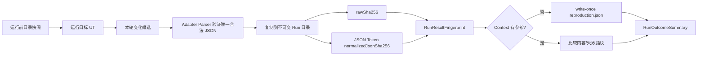

# JSON 内容指纹与 Baseline 比较闭环可实施设计

- 文档状态：Review
- 设计版本：0.2
- 创建日期：2026-08-17
- 负责人：Codex / mh90901119-oss
- 目标里程碑：Phase 1 - 最小可比较 Run
- 关联需求：时间戳文件名 Gantt 的内容一致性；成功与失败 Run 的简单复现参考
- 关联架构与 ADR：`algorithm-debug-agent-module-detailed-design-v1.md`、
  `2026-08-12-case-context-run-outcome-multiturn-analysis-design.md`、
  `ADR-006-case-as-analysis-dossier.md`、`ADR-008-json-content-fingerprint-baseline.md`

## 1. 背景与问题

目标 UT 每次生成一个以运行时间命名的 JSON 文件。Harness 已通过运行前后目录快照找到本轮新增或修改
文件，并由 Adapter Parser 验证唯一合法结果。文件名只是发现产物的手段，不是算法结果语义。

对 `D:\javacode\hellomvn\output\algorithm-results` 最近五次真实结果的只读检查显示：文件名不同，
文件大小均为 102,603 字节，原始内容 SHA-256 完全相同。这证明当前场景不需要条目投影、业务字段模型
或结构化 Diff；只需要把内容 Hash 接入 Context 参考和现有 `comparisonOutcome`。

原始 SHA 对缩进和换行敏感。为容忍只改变 JSON 格式的情况，本设计增加一个流式 JSON Token Hash，
忽略 Token 之间的格式空白，但保留字符串内部空格、字段顺序、数组顺序和实际值。

本文件取代同日上一版“语义调度结果投影、最小 Diff 与 Baseline”Review 设计。上一版没有生产代码，
不需要迁移或回滚实现。

## 2. 目标与非目标

### 2.1 目标

- 原始 `rawSha256` 继续证明归档文件字节完整性；
- 新增通用 `normalizedJsonSha256` 判断两个合法 JSON 内容是否一致；
- 文件名、目录和最后修改时间不参与两种内容 Hash；
- 每个有效 Run 追加保存一个小型 `RunResultFingerprint`；
- 每个 Context 的首次有效无采集 Run 建立 write-once `reproduction.json`；
- 后续 Run 只返回 `MATCHED`、`CHANGED`、`NOT_COMPARED` 或 `INCOMPARABLE`；
- 无 Gantt 目标失败使用简单失败指纹，断言失败且有 Gantt 时两维同时比较；
- 新 Context 首次 Run 只与最近旧 Context 参考比较是否变化，不生成字段级 Diff；
- 保留参考和当前原始 Artifact，供大模型按需读取；
- 不自动重跑 UT，每次 `run execute` 仍只执行一次。

### 2.2 非目标

- 不定义通用 operation、resource、wafer、job 或扩展业务属性模型；
- 不生成新增/删除 operation、时间或资源字段级 Diff；
- 不判断调度结果的业务正确性或根因；
- 不实现 `gantt-analysis` 生产代码；
- 不实现自然语言 Gantt 查询；
- 不实现 CodePathTracer、JDWP、Evidence、Reporter 或 OpenCode 安装器；
- 不对旧 Run 反向生成指纹或比较结论；
- 不引入可变 Baseline 状态机、数据库或事件溯源。

## 3. 现状与审计结论

### 3.1 已有能力

- `ScheduleResultCapture` 已计算原始文件 SHA-256；
- `ScheduleProducingTestRunner` 已保证目标进程结果不会被 Gantt 后处理失败遮蔽；
- Adapter Parser 已用于识别本轮唯一合法结果；
- `RunOutcomeSummary` 已有 `comparisonOutcome` 和 `comparisonSummary`，但当前固定为
  `NOT_COMPARED`；
- Case/Context/Analysis/Run Repository 与 ArtifactReference 已可追加式保存；
- `TargetFailureDiagnostic` 已包含失败分类、异常类、规范化消息、cause 和稳定业务栈帧。

### 3.2 必须修改的代码

- `CapturedScheduleResult.semanticHash` 改为明确的 `normalizedJsonSha256`；
- `ScheduleResultCapture` 在不可变复制后计算 raw SHA 和 JSON Token Hash；
- `ScheduleProducingTestRunner` 不再接收 Adapter Hash 策略；
- `TargetProjectAdapter.semanticHashStrategy()` 和未发布 `SemanticHashStrategy<T>` SPI 删除；
- `WaferSemanticHashStrategy` 及其业务字段 Hash 测试删除，改为通用 JSON 空白归一化测试；
- 新增一个 `RunResultFingerprint` 契约/Schema；
- `CaseArchiveRepository` 增加 Run 指纹、Context reproduction 的 create-new 读写；
- 新增简单失败指纹和复现比较服务；
- `RunApplicationService` 在完成 RunOutcome 前归档指纹、选择参考并填充比较结果；
- `RunOutcomeAssembler` 不再永久硬编码 `NOT_COMPARED`。

### 3.3 不需要修改的模块

- `gantt-analysis` 保持空骨架；
- Wafer Snapshot/Parser 继续用于结果合法性验证，不增加 Projector；
- CLI 命令和参数不变；
- Case/Context/Analysis/Run 目录主结构不变；
- OpenCode Tool 和 Skill 本阶段不增加新命令；
- 旧 `BaselineVerification`/`BaselineStabilityService` 只保留历史显式稳定性原型，新默认链路不依赖它。

## 4. 用例与验收标准

| 用例 | 输入/前置条件 | 预期结果 | 验证层级 |
|---|---|---|---|
| 不同文件名、相同字节 | 两个时间戳文件名，内容相同 | raw/normalized Hash 均相同 | Unit/Real fixture |
| 只有格式空白变化 | 缩进、换行、Token 间空格不同 | raw Hash 不同，normalized Hash 相同 | Unit |
| 字符串内部空格变化 | `"A B"` 与 `"AB"` | normalized Hash 不同 | Unit |
| 字段顺序变化 | `{"a":1,"b":2}` 与 `{"b":2,"a":1}` | normalized Hash 不同，保持简单保守比较 | Unit |
| 数组顺序变化 | 数组条目调换 | normalized Hash 不同 | Unit |
| JSON 非法 | 本轮候选不能完整解析 | 不生成 normalized Hash，保留目标/Agent 事实 | Unit |
| 首次成功 Run | Context 没有 reproduction | 写指纹和 reproduction，`NOT_COMPARED` | Integration |
| 同 Context 内容一致 | normalized Hash 与参考相同 | `MATCHED` | Integration |
| 同 Context 内容变化 | normalized Hash 不同 | `CHANGED`，返回原始 Artifact 引用 | Integration |
| 新 Context 内容变化 | 新 Context 首次 Run 且存在旧参考 | 建立新参考，同时报告 `CHANGED` | Integration |
| 相同无 Gantt 异常 | 两次失败指纹一致 | 第二次 `MATCHED` | Unit/Integration |
| 异常发生变化 | 异常类/cause/稳定栈帧/消息变化 | `CHANGED`，不解释原因 | Unit |
| 断言失败且有 Gantt | 两个观察维度都存在 | 逐维比较后给出综合结果 | Integration |
| 只有 Agent 失败 | Maven 未启动且无目标观察 | 不写 reproduction，`NOT_COMPARED` | Integration |
| 历史 Run | 没有指纹 Artifact | Case Digest 正常读取，保持历史结论 | Compatibility |

## 5. 总体方案



Adapter 仍负责识别什么是合法目标结果；一旦结果被确认并复制，内容 Hash 完全由 Harness 通用实现。
比较层不读取具体业务字段。Hash 变化只返回变化事实和 Artifact 引用，大模型自主决定是否读取文件、
分析代码或请求后续采集。

## 6. 模块与类设计

| 模块/类 | 职责 | 输入 | 输出 | 依赖 |
|---|---|---|---|---|
| `ada-contracts/RunResultFingerprint` | 保存一个 Run 的 Gantt/失败内容指纹 | IDs、可选 Hash | 不可变 DTO | contracts |
| `debug-harness/JsonTokenContentHasher` | 忽略 JSON 格式空白并流式计算 SHA-256 | 已捕获 JSON Path | 64 位 Hash | Jackson Core/JDK |
| `debug-harness/CapturedScheduleResult` | 保存 raw/normalized 两个 Hash 和 Snapshot | 捕获结果 | 不可变记录 | adapter-sdk |
| `debug-harness/TargetFailureFingerprinter` | 对已有通用诊断计算简单 SHA-256 | TargetFailureDiagnostic | 可选 Hash | contracts/JDK |
| `case-management/CaseArchiveRepository` | 追加 Run 指纹并原子建立/读取 reproduction | fingerprint | create/read | contracts/JDK NIO |
| `case-management/ReproductionComparator` | 逐维比较两个指纹 | reference/current | outcome + summary | contracts |
| `ada-core/RunApplicationService` | 组合指纹、参考选择、比较和 Run 完成 | Run 事实 | RunOutcomeSummary | harness/case |

不新增 Projector、条目 DTO、Diff DTO、比较 Repository 或 `gantt-analysis` 依赖。`RunResultFingerprint` 是
本阶段唯一新增持久化业务 DTO。

## 7. 数据与契约设计

### 7.1 RunResultFingerprint 1.0

```json
{
  "schemaVersion": "1.0",
  "caseId": "case-001",
  "contextId": "context-001",
  "runId": "run-001",
  "ganttRawSha256": "aaaaaaaaaaaaaaaaaaaaaaaaaaaaaaaaaaaaaaaaaaaaaaaaaaaaaaaaaaaaaaaa",
  "ganttNormalizedJsonSha256": "bbbbbbbbbbbbbbbbbbbbbbbbbbbbbbbbbbbbbbbbbbbbbbbbbbbbbbbbbbbbbbbb",
  "targetFailureSha256": null
}
```

约束：

- raw/normalized Gantt Hash 必须同时存在或同时缺失；
- 三个观察 Hash 至少有一个存在；
- 字段均为小写 64 位 SHA-256；
- `run-result-fingerprint.json` 写入 `runs/{runId}/`，并作为 `RUN_RESULT_FINGERPRINT` Artifact 引用；
- 首次有效无采集 Run 的同一 JSON 原子写入 `contexts/{contextId}/reproduction.json`；
- reference 文件保留原 `runId`，不复制或重命名 ID。

### 7.2 JSON Token Hash

`JsonTokenContentHasher` 使用 Jackson Streaming API 依次读取 Token，并按以下内容更新 SHA-256：

- Token 类型；
- 字段名和字符串值的 UTF-8 长度前缀及原值；
- 数字的原始 Token 文本；
- boolean/null 类型。

Token 之间的空格、制表符、CR/LF 和缩进不会成为 Token，因此自然被忽略。对象成员和数组顺序不排序；
当前相同 Writer 场景无需更复杂的 JSON Canonicalization Scheme。算法标识固定为
`JSON_TOKEN_SHA256_V1`，改变规则时升级 Schema/算法版本。

### 7.3 失败指纹

失败指纹对以下已有字段做长度前缀 SHA-256：

- `FailureCategory`；
- exception class；
- normalized message；
- cause；
- stable business frame。

只折叠字段首尾/连续空白并去除稳定栈帧的源码行号，不删除任意数字或业务 ID。失败指纹只表示可观察
失败是否一致，不是根因结论。

### 7.4 综合比较

- 没有参考：`NOT_COMPARED`；
- 一方有 Gantt、另一方没有：`CHANGED`；
- 两方都有 Gantt：比较 `ganttNormalizedJsonSha256`；
- 一方有目标失败、另一方没有：`CHANGED`；
- 两方都有目标失败：比较 `targetFailureSha256`；
- 至少一个维度参与且全部相同：`MATCHED`；
- 任一参与维度变化：`CHANGED`；
- 参考文件损坏或 Schema 不兼容：`INCOMPARABLE` 并附 Agent 诊断。

不新增结构化 Diff。`comparisonSummary` 使用有界固定模板，包含参考 `runId`、比较范围
`SAME_CONTEXT`/`CROSS_CONTEXT` 和变化维度，不写业务原因。

## 8. 核心流程

### 8.1 首次参考

1. 执行一次 UT 并形成目标 Run 事实；
2. 有合法 Gantt 时计算 raw/normalized Hash；
3. 有目标失败时计算失败指纹；
4. 至少一个目标观察存在时写 `run-result-fingerprint.json`；
5. 当前 Context 没有 reproduction 时原子 create-new；
6. 没有旧 Context 参考则返回 `NOT_COMPARED`；
7. 存在旧 Context 参考时只比较是否变化，并明确标记 `CROSS_CONTEXT`。

### 8.2 后续同 Context Run

1. 每次调用仍只运行一次 UT；
2. 读取当前 Context 的 `reproduction.json`；
3. 逐维比较当前指纹；
4. 填充现有 `comparisonOutcome/comparisonSummary`；
5. 归档 RunOutcome，不覆盖参考或历史 Run；
6. 大模型依据 `MATCHED/CHANGED` 和 Artifact 引用决定下一步。

### 8.3 失败和 Agent 异常

- 断言失败但有 Gantt：同时保存两类 Hash；
- 算法/输入异常无 Gantt：只保存失败 Hash；
- 编译失败或测试未发现：现有 TargetFailureDiagnostic 可形成失败 Hash；
- 超时没有确定性目标诊断：不伪造失败 Hash；
- JSON Hash、指纹或参考持久化失败：目标进程/测试/Gantt 事实仍保留，增加 Agent 诊断。

## 9. 错误处理与可观测性

- `GANTT_JSON_TOKEN_HASH_FAILED`：合法候选复制后无法完成 Token Hash；
- `RUN_FINGERPRINT_WRITE_FAILED`：Run 指纹写入失败；
- `REPRODUCTION_REFERENCE_WRITE_FAILED`：Context 参考原子创建失败；
- `REPRODUCTION_REFERENCE_INVALID`：参考缺失、损坏或身份不一致；
- `TARGET_FAILURE_FINGERPRINT_FAILED`：失败字段无法规范化；
- `RUN_COMPARISON_INCOMPARABLE`：存在观察但不能可信比较。

所有错误作为 `AgentFailureDiagnostic` 返回，不覆盖目标 UT 的进程、测试、异常或 Gantt 存在事实。

## 10. 性能与容量预算

| 指标 | 默认值 | 硬上限 | 超限行为 | 验证方法 |
|---|---:|---:|---|---|
| 原始 Gantt 文件 | 64 MiB | 64 MiB | 复用现有捕获失败语义 | Integration |
| Token Hash 内存 | 64 KiB 级流式缓冲 | 1 MiB | 实现不得构建完整树 | Unit/heap observation |
| Run 指纹 JSON | 小于 2 KiB | 8 KiB | 拒绝写入 | Contract |
| reproduction JSON | 小于 2 KiB | 8 KiB | 拒绝读取/写入 | Contract |
| comparisonSummary | 1 KiB | 2 KiB | 固定模板拒绝溢出 | Unit |

本设计不生成 Diff 文件，不增加与 operation 数量成比例的额外内存结构。

## 11. 安全、隐私与无侵入性

- 不修改目标算法源码或 UT；
- 文件名、绝对路径和时间戳不写入内容 Hash；
- Jackson Streaming 禁用外部引用，不执行目标 JSON 中的代码；
- 原始 Gantt 继续只读保存，指纹只包含 Hash 和不透明 ID；
- 失败指纹不保存新的原始敏感文本，只 Hash 已有有界诊断字段；
- 新增 Jackson 依赖使用父 POM 已锁定版本，不引入网络运行依赖。

## 12. 测试设计

### 12.1 单元测试

- `JsonTokenContentHasherTest.shouldIgnoreFormattingWhitespace`；
- `JsonTokenContentHasherTest.shouldPreserveWhitespaceInsideStrings`；
- `JsonTokenContentHasherTest.shouldPreserveObjectAndArrayOrder`；
- `JsonTokenContentHasherTest.shouldRejectMalformedOrTrailingJson`；
- `CapturedScheduleResultTest.shouldKeepRawAndNormalizedHashesDistinct`；
- `TargetFailureFingerprinterTest.shouldMatchStableFailure`；
- `TargetFailureFingerprinterTest.shouldDetectChangedCauseOrFrame`；
- `RunResultFingerprintTest.shouldRequireAtLeastOneTargetObservation`；
- `CaseArchiveRepositoryTest.shouldCreateReproductionOnlyOnce`；
- `ReproductionComparatorTest` 覆盖首次、匹配、变化、双维和不可比。

### 12.2 契约与兼容性测试

- `run-result-fingerprint-v1.schema.json` 与 Java DTO round-trip；
- 历史 `RunOutcomeSummary 1.0` 无指纹 Artifact 时继续读取；
- `TargetProjectAdapterContractTest` 不再要求业务 Hash 策略；
- ArtifactReference 路径、SHA 和大小约束保持不变。

### 12.3 集成与端到端测试

- 两个不同时间戳文件名但相同内容得到相同 Token Hash；
- 真实最近五份 Wafer 结果原始 Hash 一致的事实作为手工验收记录，不把本机绝对路径写入生产测试；
- 受控 Maven/JUnit Fixture 连续两次运行，第二次 `MATCHED`；
- 受控 Fixture 改变一个 JSON 值，第二次 `CHANGED`；
- 断言失败有 Gantt、业务异常、编译失败、测试未发现和超时继续形成稳定 RunOutcome；
- `case inspect` 同时读取新旧 Run，不崩溃。

### 12.4 性能与 Eval

- 使用接近 64 MiB 的生成式 JSON 验证流式 Hash 不构建完整对象树；
- 本阶段不新增模型 Eval；OpenCode 端到端阶段增加“MATCHED 时不重复运行”和“CHANGED 后按需读取
  Artifact”用例。

## 13. 实施步骤

1. 先审计并单独处理现有 `BaselineStabilityState` 未提交迁移，不混入新功能提交；
2. 先写 `JsonTokenContentHasher` 失败测试，再实现流式 Token Hash；
3. 修改捕获记录、Runner 和 Adapter SPI，删除 Wafer 专属 Hash，并运行 Harness/Adapter 测试；
4. 先写 `RunResultFingerprint`/Schema 失败测试，再实现唯一新增持久化 DTO；
5. 先写失败指纹和 `ReproductionComparator` 测试，再实现简单比较；
6. 扩展 `CaseArchiveLayout/Repository` 的指纹和 reproduction write-once 路径；
7. 把指纹、参考和比较接入 `RunApplicationService/RunOutcomeAssembler`；
8. 更新 Case Digest/CLI 集成测试，但不增加新命令；
9. 同步 README、架构、Skill 事实说明和测试数量；
10. 每个切片完成后执行代码审计、Bug 修复、受影响 UT，最终运行根 `mvn test`、真实 UT 验收和
    `git diff --check`。

## 14. 兼容、迁移与回滚

- 旧 Run、Gantt、`BaselineVerification` 和 `BaselineManifest` 不迁移、不覆盖；
- 没有 `run-result-fingerprint.json` 的历史 Run 继续显示原有 `NOT_COMPARED`；
- `SemanticHashStrategy<T>` 只在未发布 `0.1.0-SNAPSHOT` 中移除，仓库内唯一生产 Adapter 同步迁移；
- 新指纹 Schema 或算法规则变化时升级版本，旧 reproduction 无法比较时返回 `INCOMPARABLE`；
- 回滚时停止生成新指纹即可，已归档指纹和 reproduction 保留，不删除历史证据。

## 15. 风险与决策结果

| 风险/问题 | 影响 | 缓解措施 | 状态 |
|---|---|---|---|
| 直接删除所有空格破坏字符串 | 不同结果被误判相同 | 使用 JSON Token 流而非正则替换 | Resolved by design |
| 对象字段顺序变化被视为不同 | 可能出现保守的 CHANGED | 当前 Writer 稳定；有真实需求再引入排序规范 | Accepted |
| Adapter Parser 与 Token Hash 重复解析 | 增加一次流式读取 | 文件上限 64 MiB，换取通用且低内存的简单边界 | Accepted |
| 变化时没有字段级说明 | 大模型需要读取两份 Artifact | 当前需求只要知道变化；真实成本出现后再设计 Diff | Accepted |
| 首次异常成为参考 | 后续成功显示 CHANGED | 这是正确的可观察变化，不自动重写参考 | Accepted |
| 当前未提交迁移与新实现重叠 | 提交污染或覆盖 | 先审计迁移、精确暂存每个切片 | Managed |

## 16. 文档同步清单

- [x] ADR-008 改为 JSON 内容指纹决策
- [x] 本详细设计替换复杂投影/Diff 方案
- [x] README/架构/阶段计划的下一步说明
- [ ] 实施时新增 Schema 与示例
- [ ] 实施时更新 Skill 比较结果指引
- [ ] OpenCode 阶段新增 Eval

## 17. 实现完成记录

- 实际变更：尚未修改生产代码；等待本修订设计评审。
- 相对设计的偏差：上一版 Proposed 投影/Diff 方案已在编码前撤回。
- 测试与命令：设计阶段核验真实最近五份结果的 size/raw SHA，并执行文档自审和 Git 检查。
- 性能结果：尚未实现；流式 Hash 预算将在实现阶段验证。
- 已知限制：字段或条目级变化位置不由代码输出，大模型按需读取原始 Artifact。
- 提交/版本：本次独立设计修订，不包含生产代码或既有工作区改动。

## 18. 变更记录

| 日期 | 版本 | 变更内容 | 作者 |
|---|---|---|---|
| 2026-08-17 | 0.1 | 初始通用投影和结构化 Diff 方案，编码前撤回 | Codex / mh90901119-oss |
| 2026-08-17 | 0.2 | 根据真实时间戳文件名场景收敛为 JSON Token 内容 Hash 和简单比较 | Codex / mh90901119-oss |
