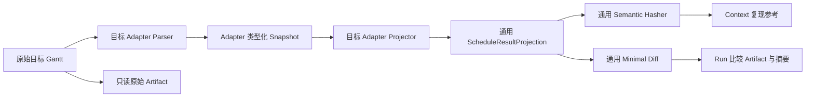
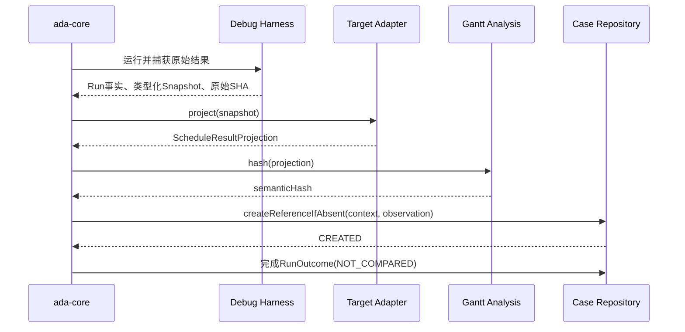
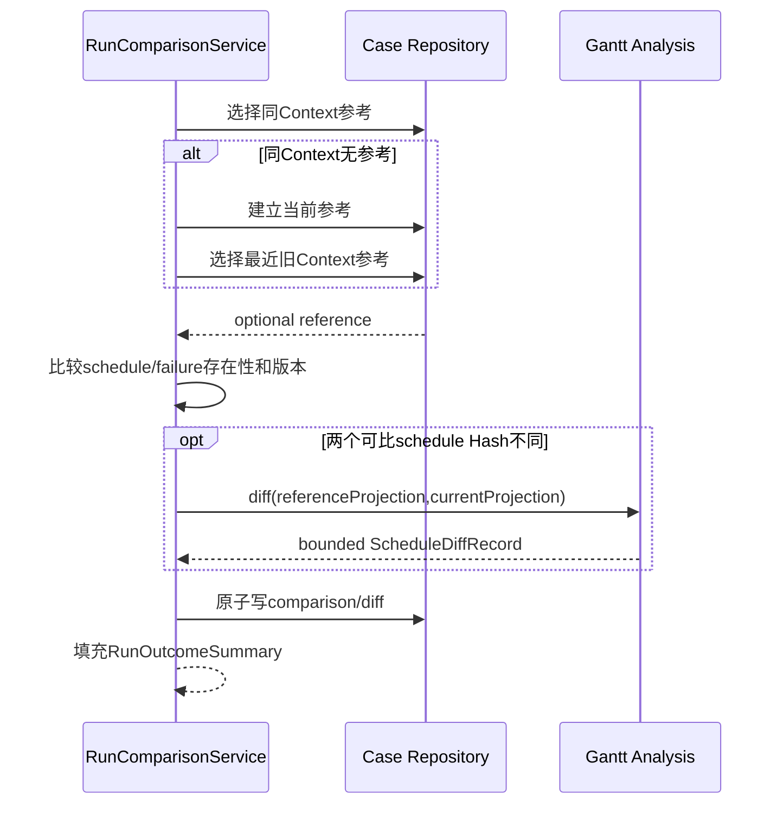

# 语义调度结果投影、最小 Diff 与 Baseline 比较闭环可实施设计

- 文档状态：Review
- 设计版本：0.1
- 创建日期：2026-08-17
- 负责人：Codex / mh90901119-oss
- 目标里程碑：Phase 1 - 可比较的 Run 事实
- 关联需求：Adapter 适配不同目标算法；统一语义 Hash 与最小结构化 Diff；建立成功和失败复现参考
- 关联架构与 ADR：`algorithm-debug-agent-module-detailed-design-v1.md`、
  `2026-08-11-case-baseline-lifecycle-design.md`、
  `2026-08-12-case-context-run-outcome-multiturn-analysis-design.md`、
  `ADR-006-case-as-analysis-dossier.md`、`ADR-008-adapter-semantic-schedule-projection.md`

## 1. 背景与问题

当前纵向切片已经能初始化外部 Workspace、登记独立 Maven 算法模块、创建或恢复 Case/Context/Analysis、
显式运行一个 JUnit 方法，并把 stdout、stderr、Surefire XML、Gantt 和 `RunOutcomeSummary` 追加归档。
成功 Gantt 已由 Wafer Demo Adapter 解析并计算语义 Hash，但所有正式 Run 仍返回
`comparisonOutcome=NOT_COMPARED`。

现有 Hash 由 Adapter 自己实现并直接操作 Wafer DTO。若继续在 `gantt-analysis` 中使用 `waferId`、
`jobId` 或 `Chamber`，通用 Agent 将被 Reference Demo 绑定；若让未来每个 Adapter 分别实现 Hash 和
Diff，则排序、预算和语义字段容易不一致。失败 Run 也尚无可与参考运行比较的稳定失败指纹。

本设计把下一阶段收敛为三个连续切片：目标 Adapter 生成专属但遵循通用契约的语义投影；通用模块对
该投影统一计算 Hash 和最小 Diff；Case/Core 将成功投影或失败指纹建立为每个 Context 的首次复现参考，
使大模型明确知道当前 Run 是否变化以及变化发生在哪里。

## 2. 目标与非目标

### 2.1 目标

- 定义不包含 Wafer 固定字段的版本化 `ScheduleResultProjection`；
- 由 Adapter 显式选择目标算法的语义字段、稳定条目 Key 和噪声字段；
- 由同一通用规范化实现计算语义 SHA-256 和条目/字段级最小 Diff；
- 保留原始 Gantt，同时把投影、比较记录和必要 Diff 作为不可变 Artifact 归档；
- 每个 Context 的首次有效无采集 Run 原子建立一次复现参考，不自动重跑 UT；
- 同 Context 后续无采集 Run 与本 Context 参考比较；新 Context 首次 Run 可与最近旧 Context 参考比较；
- 无 Gantt 的目标失败使用版本化失败指纹；断言失败且有 Gantt 时同时保留两类观察；
- `RunOutcomeSummary` 继续提供有界 `comparisonOutcome`、说明和 Artifact 引用；
- 为未来 CodePath/JDWP 同 Context 采集一致性校验保留相同比较入口，但本切片不执行采集模式；
- 每个实现切片完成后执行代码审计、缺陷修复和受影响测试。

### 2.2 非目标

- 不判断 wafer、订单或任务是否应该优先；
- 不实现资源冲突、SERIAL/PARALLEL、防超车、候选评分或等待原因 Validator；
- 不把自然语言问题编译成复杂 Gantt 查询；
- 不实现 CodePathTracer、JDWP、Trace Normalizer、Evidence Graph 或 Reporter；
- 不实现 OpenCode 一次性安装器或新的 Agent Runtime；
- 不支持无稳定身份时的模糊条目匹配；
- 不对旧 Run 反向生成投影、失败指纹或比较结果；
- 不引入数据库、事件溯源或复杂 Case 状态机。

## 3. 现状与约束

- `TargetProjectAdapter<T>` 当前暴露 Parser 和 `SemanticHashStrategy<T>`，唯一生产实现为 Wafer Demo；
- `ScheduleResultCapture` 当前同时复制原始结果和调用 Adapter Hash，职责需要拆分；
- `gantt-analysis` 只有 Maven 骨架，没有生产代码；
- `CaseArchiveRepository` 已实现 Case/Context/Analysis/Run 的 create-new JSON 写入与有界读取；
- `RunOutcomeSummary` 已包含 `comparisonOutcome`、`comparisonSummary` 和 Artifact 引用，可在不破坏旧
  Run 文档的前提下填入真实比较事实；
- 当前工作区已有未提交的 `CaseLifecycleState -> BaselineStabilityState` 迁移，实施时必须先作为独立
  兼容性清理审计，禁止与无关 OpenCode 修改混合提交；
- 目标算法和原始 UT 不得因投影或比较而修改；
- Hash、Diff、失败指纹、参考选择和持久化必须由确定性代码实现，LLM 只决定是否再运行或继续采集；
- 原始文件最大 64 MiB；投影不得把任意对象图或未界定的大字段带入内存和模型上下文。

## 4. 用例与验收标准

| 用例 | 输入/前置条件 | 预期结果 | 验证层级 |
|---|---|---|---|
| 通用投影字段较少 | 只有 key/start/end 的中性算法 Fixture | 投影合法，空 lane/属性不影响 Hash/Diff | Contract |
| 通用投影字段更多 | Adapter 增加 priority/setupType 等标量属性 | 属性参与同一 Hash/Diff，不修改通用引擎 | Contract |
| Wafer 映射 | `WaferScheduleSnapshot` | Adapter 映射条目、时间、资源和声明的语义属性 | Unit |
| 噪声变化 | 原始顺序、说明文字或运行 ID 变化，投影相同 | Hash 相同且 Diff 为空 | Unit |
| 最小变化 | 一个条目的时间、泳道或属性变化 | Hash 不同，Diff 精确指出 key 和字段 | Unit |
| 无稳定 Key | Adapter 产生空或重复 key | 投影拒绝，比较为不可比并保留原始 Gantt | Unit/Integration |
| 首次成功 Run | Context 无参考且有完整投影 | 写入一次复现参考，Run 为 `NOT_COMPARED` | Integration |
| 同 Context 匹配 | 后续无采集 Run 与参考投影一致 | `MATCHED`，不生成空 Diff Artifact | Integration |
| 同 Context 变化 | 后续无采集 Run 与参考投影不同 | `CHANGED`，生成有界比较和 Diff Artifact | Integration |
| 新 Context 变化 | 新 Context 首次 Run，存在旧 Context 参考 | 建立新参考并生成 `CROSS_CONTEXT` Diff | Integration |
| 相同目标异常 | 两次无 Gantt Run 失败指纹一致 | 第二次为 `MATCHED` | Unit/Integration |
| 失败变化 | 异常类、cause、稳定业务帧或规范化消息变化 | `CHANGED`，不推断根因 | Unit |
| 断言失败且有 Gantt | 参考与当前均有投影和失败诊断 | 两个维度逐项比较，综合结论确定 | Integration |
| Agent 自身失败 | Maven 缺失且没有目标观察 | 不建立算法参考，保持 `NOT_COMPARED` | Integration |
| 投影预算超限 | 条目或属性超过硬预算 | 原始 Gantt 保留，Agent 诊断明确，不计算截断 Hash | Unit |
| 旧 Run 读取 | 历史 `NOT_COMPARED` Run 无投影/比较 Artifact | Case Digest 继续正常读取 | Compatibility |

## 5. 总体方案

选择“Adapter 投影、通用 Hash/Diff”而不是原始 JSON Diff。Adapter 最了解目标结果格式，负责把业务差异
收敛为稳定投影；通用引擎只处理条目、时间、泳道和有界标量，不理解属性名称的业务含义。Hash 与 Diff
消费同一投影，消除两套语义定义不一致的风险。

一次 Run 最多执行一次自动比较：优先选择同 Context 复现参考；本 Context 尚无参考时，先原子建立当前
参考，再选择创建时间最近的旧 Context 参考执行跨 Context 比较。没有任何参考时只报告参考已建立。

## 6. 模块与类设计

| 模块/类 | 职责 | 输入 | 输出 | 依赖 |
|---|---|---|---|---|
| `ada-contracts/ScheduleResultProjection` | 保存通用结果级投影 | profile、属性、条目 | 不可变投影 | contracts |
| `ada-contracts/ScheduleEntryProjection` | 保存一个稳定 Gantt 条目 | key、时间、lane、属性 | 不可变条目 | contracts |
| `ada-contracts/SemanticScalar` | 表达有界 STRING/INTEGER/DECIMAL/BOOLEAN | 类型和值 | 规范标量 | contracts |
| `ada-contracts/ScheduleDiffRecord` | 保存比较范围、计数、截断和差异详情 | 两个投影 | 版本化 Diff | contracts |
| `ada-contracts/ReproductionReference` | 保存 Context 的首次有效观察 | run、投影 Hash、失败指纹 | 写一次参考 | contracts |
| `ada-contracts/FailureFingerprint` | 保存失败规范版本和 SHA-256 | TargetFailureDiagnostic | 稳定失败指纹 | contracts |
| `ada-contracts/RunComparisonRecord` | 保存参考身份和逐维比较 | reference/current | 结构化比较 | contracts |
| `adapter-sdk/ScheduleResultProjector<T>` | 把 Adapter Snapshot 投影为通用结果 | T | ScheduleResultProjection | contracts |
| `adapter-sdk/TargetProjectAdapter` | 暴露 Parser 与 Projector | 项目/结果 | Adapter 能力 | contracts |
| `gantt-analysis/ScheduleProjectionHasher` | 对投影做唯一规范化并计算 SHA-256 | projection | semantic hash | contracts |
| `gantt-analysis/ScheduleProjectionDiffer` | 按稳定 key 做最小字段 Diff | reference/current | ScheduleDiffRecord | contracts |
| `gantt-analysis/ProjectionBudget` | 固化并校验投影/Diff 预算 | counts/bytes | 通过或结构化失败 | JDK |
| `debug-harness/ScheduleResultCapture` | 仅发现、解析、复制和计算原始 SHA | Parser/result window | CapturedScheduleResult | adapter-sdk |
| `case-management/ReproductionReferenceRepository` | 原子创建/读取 Context 参考 | reference | create/read result | contracts/JDK NIO |
| `case-management/RunComparisonRepository` | 在当前 Run 内追加比较 JSON | comparison/diff | Artifact path | contracts/JDK NIO |
| `case-management/FailureFingerprintService` | 规范化失败字段并计算 SHA | diagnostic | fingerprint | contracts |
| `ada-core/RunComparisonService` | 选择参考、逐维比较和归档 | run observation | comparison facts | case/gantt |
| `wafer-demo-adapter/WaferScheduleResultProjector` | 映射 Wafer DTO，不执行通用 Diff | Wafer snapshot | projection | adapter-sdk |

公共 Contracts 不依赖 Adapter 或实现模块；`gantt-analysis` 不依赖具体 Adapter；`ada-core` 新增对
`gantt-analysis` 的单向依赖。Projector 必须无状态，所有列表和映射在构造时防御性复制。

## 7. 数据与契约设计

### 7.1 通用投影

`ScheduleResultProjection 1.0` 包含：

- `schemaVersion`：固定 `1.0`；
- `semanticProfileId`：Adapter 定义的稳定语义 Profile，例如 `wafer-schedule`；
- `semanticProfileVersion`：字段或规范化规则变化时升级；
- `summaryAttributes`：结果级有界 `Map<String, SemanticScalar>`；
- `entries`：完整、未截断的 `ScheduleEntryProjection` 集合。

`ScheduleEntryProjection` 包含：

- `entryKey`：同一 Profile 内稳定且唯一；
- `start`、`end`：`BigDecimal`，规范化为无无效尾零的十进制文本，要求 `end >= start`；
- `laneKeys`：可为空，规范化时排序并拒绝重复；
- `semanticAttributes`：Adapter 声明的有界标量 Map，可为空。

`SemanticScalar` 仅支持 `STRING`、`INTEGER`、`DECIMAL`、`BOOLEAN`。数值使用规范文本参与 Hash，禁止
NaN、Infinity、区域化数字和任意嵌套 JSON。属性名只作为数据比较，不触发通用业务判断。

### 7.2 唯一规范化和 Hash

规范化顺序固定为：Schema/Profile -> 按属性名排序的结果属性 -> 按 `entryKey` 排序的条目 -> start/end
-> 排序后的 lane -> 按属性名排序的条目属性。所有字符串使用 UTF-8 和长度前缀，避免拼接歧义。

同一规范化写入器同时服务 Hasher 和 Differ 的相等判断。`semanticProfileId/version` 不同的两个投影不可
直接比较。Hash 算法标识为 `SCHEDULE_PROJECTION_SHA256_V1`。

### 7.3 最小 Diff

`ScheduleDiffRecord 1.0` 至少记录：

- reference/current Context 与 Run ID；
- semantic profile；
- reference/current semantic hash；
- added/removed/changed/unchanged 条目计数；
- 结果级属性变化；
- 条目级 `ADDED`、`REMOVED` 或 `MODIFIED`；
- `MODIFIED` 只列出发生变化的 `start`、`end`、`laneKeys` 和语义属性；
- `detailCount`、`totalChangeCount`、`truncated` 和 `truncationReason`。

Hash 相同时不生成 Diff Artifact。Hash 不同但所有投影字段 Diff 为空属于内部不变量错误
`GANTT_HASH_DIFF_INCONSISTENT`。

### 7.4 失败指纹

`FailureFingerprint 1.0` 使用以下已提取事实计算长度前缀 SHA-256：

- `FailureCategory`；
- exception class；
- 规范化消息；
- 最深 cause；
- 去除源码文件行号后的稳定业务栈帧。

规范化只折叠空白、统一路径分隔符、替换已知时间戳和去除栈帧行号；不删除任意数字或业务 ID，避免
把不同失败过度合并。算法标识为 `TARGET_FAILURE_SHA256_V1`。指纹只证明可观察失败是否一致，不解释
业务根因。

### 7.5 复现参考和比较结论

`contexts/{contextId}/reproduction-reference.json` 是 write-once 文档，记录首次有效无采集 Run 的：

- case/context/referenceRunId；
- 可选 schedule profile、semantic hash 和投影 ArtifactReference；
- 可选失败指纹；
- 创建时间。

只要有效 schedule projection 或 target failure fingerprint 至少存在一个即可建立参考。仅有
`agentFailure`、未启动 Maven 或无可信目标观察时不得建立参考。

综合比较规则：

- 没有可选参考：`NOT_COMPARED`；
- 至少一个维度可比较且全部匹配：`MATCHED`；
- 任一可比较维度内容或存在性变化：`CHANGED`；
- 有观察但因 Profile/算法版本不兼容而没有可比维度：`INCOMPARABLE`；
- 断言失败且有 Gantt 时 schedule 与 failure 两维分别记录，再计算综合结果。

`runs/{runId}/derived/run-comparison.json` 保存 `RunComparisonRecord`。Hash 变化且两份投影可比时同时保存
`schedule-diff.json`。它们通过 `RUN_COMPARISON`、`SCHEDULE_DIFF` ArtifactReference 加入现有
`RunOutcomeSummary.artifacts`；顶层 `comparisonOutcome` 和有界 `comparisonSummary` 填入真实事实。
现有 `RunOutcomeSummary 1.0` 字段不变，旧 Run 无需迁移。

### 7.6 Schema 与 Provenance

新增 Schema：

- `schemas/execution/schedule-result-projection-v1.schema.json`；
- `schemas/execution/schedule-diff-record-v1.schema.json`；
- `schemas/execution/reproduction-reference-v1.schema.json`；
- `schemas/execution/run-comparison-record-v1.schema.json`。

每个派生 Artifact 记录源 Gantt Artifact ID/SHA、Adapter ID/version、semantic profile 和生成器版本。
原始 Gantt 不被回写。Schema 演进默认增加可选字段；改变语义字段或规范化规则必须升级 Profile 版本。

## 8. 核心流程

### 8.1 首次有效 Run

Reference 创建使用原子 create-new。若并发运行先创建了参考，当前 Run 重新读取已存在参考并执行普通
比较，禁止覆盖。

### 8.2 后续或跨 Context 比较

最近旧 Context 按 `createdAt` 排序，`contextId` 作为确定性并列键。跨 Context 比较标记
`CROSS_CONTEXT`，同 Context 标记 `SAME_CONTEXT_REPRODUCTION`，二者不共享“采集干扰”解释。

### 8.3 失败和部分成功

- Gantt 完整、Surefire 失败：同时生成投影和失败指纹；
- Gantt 缺失、目标失败存在：只比较失败指纹；
- Gantt 后处理失败但目标失败存在：原始候选和 Agent 诊断保留，可仅以失败维度建立或比较参考；
- 只有 Agent 失败：不建立参考，不伪造失败指纹；
- 比较或 Diff 持久化失败：目标 Run 事实仍归档，增加 Agent 诊断并将比较标记为不可用。

## 9. 错误处理与可观测性

- `ADAPTER_PROJECTION_FAILED`：Adapter 无法生成合法投影；
- `GANTT_PROJECTION_BUDGET_EXCEEDED`：完整投影超过硬预算；
- `GANTT_PROJECTION_DUPLICATE_KEY`：条目 Key 不唯一；
- `GANTT_PROJECTION_INVALID_TIME`：时间非法；
- `GANTT_PROFILE_INCOMPATIBLE`：两个投影 Profile 不兼容；
- `GANTT_DIFF_BUDGET_TRUNCATED`：Diff 详情有界截断，计数仍完整；
- `GANTT_HASH_DIFF_INCONSISTENT`：Hash 与 Diff 内部不变量冲突；
- `FAILURE_FINGERPRINT_FAILED`：目标失败事实无法规范化；
- `REPRODUCTION_REFERENCE_WRITE_FAILED`：参考原子写入失败；
- `RUN_COMPARISON_WRITE_FAILED`：比较 Artifact 未能保存。

这些错误使用 `AgentFailureDiagnostic`，不改变已经确定的进程、测试或 Gantt 存在事实。日志只写错误码、
Run/Context ID 和脱敏相对路径；原始异常 cause 留在 Agent 日志，不发送无界堆栈给模型。

## 10. 性能与容量预算

| 指标 | 默认值 | 硬上限 | 超限行为 | 验证方法 |
|---|---:|---:|---|---|
| 投影条目数 | 100,000 | 100,000 | 拒绝投影，不计算截断 Hash | Unit/benchmark |
| 结果级属性数 | 64 | 64 | 拒绝投影 | Unit |
| 单条目属性数 | 64 | 64 | 拒绝投影 | Unit |
| 单条目 lane 数 | 32 | 32 | 拒绝投影 | Unit |
| 属性名长度 | 128 chars | 128 chars | 拒绝投影 | Unit |
| 标量值长度 | 1 KiB | 4 KiB | 默认拒绝；可由 Adapter 降维后重试 | Unit |
| 投影 JSON Artifact | 32 MiB | 64 MiB | 拒绝持久化并保留 Raw Gantt | Integration |
| Diff 摘要详情 | 100 changes | 100 changes | 截断并记录总数 | Unit |
| Diff Artifact 详情 | 10,000 changes | 10,000 changes | 截断详情、保留完整计数 | Unit/load |
| Diff Artifact 大小 | 16 MiB | 32 MiB | 截断详情并记录原因 | Integration |

投影必须完整才能产生语义 Hash。Diff 可以截断详情，因为综合 Hash、总变化计数和截断标记仍能证明
“发生变化”；被截断 Diff 不足以证明未列出条目的具体变化，模型需要请求更窄的后续查询。

## 11. 安全、隐私与无侵入性

- 不修改目标算法源码或 UT；
- Adapter 只读取已捕获 Snapshot，通用分析不访问目标仓库；
- 原始 Gantt 只读保存，投影和 Diff 是带 source SHA 的派生产物；
- Adapter 不得把凭据、绝对路径或未经授权的大文本放入语义属性；
- 属性和比较摘要进入 LLM 前执行现有路径与大小约束；
- 不引入第三方依赖，使用 Java 21、Jackson 和 JDK SHA-256；
- 本阶段不启动新的外部进程，不改变 Maven/JUnit 超时和清理边界。

## 12. 测试设计

测试遵循 Red-Green-Refactor；每个缺陷修复追加能够复现原问题的回归测试。

### 12.1 单元测试

- `ScheduleResultProjectionTest`：较少/较多属性、重复 Key、非法时间和不可变集合；
- `SemanticScalarTest`：四类标量规范化、非法数值和长度边界；
- `ScheduleProjectionHasherTest`：顺序噪声不变、每个语义字段变化均改变 Hash；
- `ScheduleProjectionDifferTest`：added/removed/modified、结果属性、lane 和扩展属性；
- `ScheduleProjectionDifferTest.shouldRejectIncompatibleProfile`：不同 Profile 不猜测比较；
- `FailureFingerprintServiceTest`：时间戳/栈行号噪声稳定，异常类/cause/业务帧变化可见；
- `ReproductionReferenceRepositoryTest`：create-new、并发已有参考、路径边界和不可覆盖；
- `RunComparisonServiceTest`：首次参考、同 Context、跨 Context、双维比较和仅 Agent 失败。

### 12.2 契约与兼容性测试

- 四个新增 Schema 与 Java DTO round-trip；
- `TargetProjectAdapterContractTest` 强制 Parser/Projector 泛型一致；
- 中性少字段 Fixture 与额外字段 Fixture 不依赖 Wafer 类型；
- 历史 `RunOutcomeSummary 1.0` 和 `comparisonOutcome=NOT_COMPARED` 继续读取；
- ArtifactReference 仍为 Run 相对路径并校验 SHA-256/size。

### 12.3 集成与端到端测试

- Wafer Demo 真实 Gantt 投影条目数和现有关键字段正确；
- 连续运行真实目标 UT 两次，第二次为 `MATCHED`；
- 修改受控 Fixture 的一个 operation 后得到精确 `CHANGED` Diff；
- 断言失败且有 Gantt 时两个维度同时比较；
- 业务异常、编译失败、测试未发现和超时均形成可归档比较事实或明确不可比；
- 旧 Case 中存在历史 Run 时 `case inspect` 不崩溃。

### 12.4 性能测试与 Agent Eval

- 100,000 条最小投影 Hash 在测试进程内完成且不超过硬预算；
- 10,001 条变化触发 Diff 详情截断并保留准确总数；
- 本阶段不新增模型 Eval；OpenCode 端到端接入时增加“已有 MATCHED 不重跑”和“CHANGED 后按需读取
  Diff”两类 Eval。

### 12.5 测试夹具与 Golden 数据

- 中性 Fixture 使用 `taskId/machine/priority/setupType`，证明通用模块无 Wafer 耦合；
- Wafer Fixture 复用现有脱敏 `wafer-result-fixture.json`；
- 失败 Fixture 使用固定异常类、消息和栈帧，不依赖真实时间或本机绝对路径；
- Golden Hash 改动必须伴随 Profile 版本或规范化缺陷说明，禁止静默更新。

## 13. 实施步骤

1. 单独审计并提交现有 `BaselineStabilityState` 迁移，不混入 OpenCode 或新功能；
2. 先写 Contracts/Schema 失败测试，再实现投影、标量、Diff、参考和比较 DTO；
3. 先写 Adapter SPI 契约失败测试，再以 `ScheduleResultProjector` 替换未发布的
   `SemanticHashStrategy`；
4. 先写 `gantt-analysis` Hash/Diff/预算测试，再实现最小通用引擎；
5. 先写 Wafer 映射测试，再实现 `WaferScheduleResultProjector` 并迁移现有 Hash golden；
6. 移除 Harness 的语义 Hash 职责，仅保留原始捕获和 SHA，并运行 Harness 回归；
7. 先写失败指纹、参考 Repository 和比较服务测试，再实现 Case 比较持久化；
8. 把投影、参考选择、比较和 Artifact 归档接入 `RunApplicationService`；
9. 更新 CLI/Case Digest 预期、Schema 示例、README、架构和 Skill 事实说明；
10. 运行受影响模块测试、根 `mvn test`、真实 Wafer UT 验收和 `git diff --check`；
11. 对每个切片进行职责、异常、边界、并发、兼容性和测试充分性审计，修复后再提交。

## 14. 兼容、迁移与回滚

- 旧 Case/Run 文档保持原样可读，不反向补写派生 Artifact；
- `RunOutcomeSummary 1.0` 结构不变，只把已有比较字段从占位值填为真实事实并增加 Artifact 类型；
- 旧 `BaselineVerification 1.0` 和 `BaselineManifest 2.0` 保持可读，仅作为历史/显式稳定性验证契约；
- 新默认入口使用 Context 的 write-once `reproduction-reference.json`，不依赖复杂 Case 状态；
- `SemanticHashStrategy` 只在未发布 `0.1.0-SNAPSHOT` 内替换，仓库内 Adapter 同步迁移；
- semantic profile 变化必须升级 Profile 版本，跨版本返回 `INCOMPARABLE`；
- 回滚时可以停止生成新投影/比较，现有原始 Run Artifact 和新增派生产物均保留，不删除历史证据。

## 15. 风险与决策结果

| 风险/问题 | 影响 | 缓解措施 | 状态 |
|---|---|---|---|
| 通用 DTO 偷渡 Wafer 字段 | 新算法无法复用 | 中性契约测试和源码词汇审计 | Resolved by design |
| Adapter 漏掉关键业务字段 | Hash 忽略真实变化 | Profile 版本、Adapter golden 与评审清单 | Managed |
| Adapter 加入噪声字段 | Baseline 假漂移 | 明确字段选择职责和噪声回归测试 | Managed |
| Hash 与 Diff 语义不一致 | 结论互相矛盾 | 同一投影和规范化器，内部不变量测试 | Resolved by design |
| 大投影占用过多内存 | Agent OOM | 完整投影硬预算，超限拒绝 Hash | Managed |
| Diff 截断被误解为完整 | 漏看变化 | 显式 total/detail/truncated 与 Skill 指引 | Resolved by design |
| 首次失败成为永久错误参考 | 后续成功显示 CHANGED | 这是可观察变化事实；大模型可在新 Context 或显式新 Case 继续分析 | Accepted |
| 并发首次 Run 争用参考 | 参考被覆盖 | 原子 create-new，失败者读取赢家后比较 | Resolved by design |
| 当前未提交改动与实现重叠 | 错误提交或覆盖用户工作 | 先审计并独立提交 Baseline 迁移，精确暂存每个切片 | Managed |

## 16. 文档同步清单

- [x] 新增架构决策 ADR-008
- [x] 新增本可实施设计和 Mermaid 流程
- [ ] 实施时更新 Schema 与示例
- [ ] 实施时更新 README/CLI 使用说明
- [ ] 实施时更新架构现状和阶段计划
- [ ] 实施时更新 Skill 的比较 Artifact 指引
- [ ] OpenCode 端到端阶段增加 Eval Case

## 17. 实现完成记录

- 实际变更：尚未开始生产代码；本文件等待用户评审。
- 相对设计的偏差：无。
- 测试与命令：设计阶段执行 Markdown 占位符、自相矛盾、范围和 Git 空白检查。
- 性能结果：尚未执行；预算将在实现阶段由单元与负载测试验证。
- 已知限制：本阶段只支持当前无采集 Run；CodePath/JDWP 采集一致性在相应模块接入后复用比较契约。
- 提交/版本：本次独立设计提交，不包含生产代码或现有工作区改动。

## 18. 变更记录

| 日期 | 版本 | 变更内容 | 作者 |
|---|---|---|---|
| 2026-08-17 | 0.1 | 确认 Adapter 投影、通用 Hash/最小 Diff 与 Context 复现参考边界 | Codex / mh90901119-oss |
