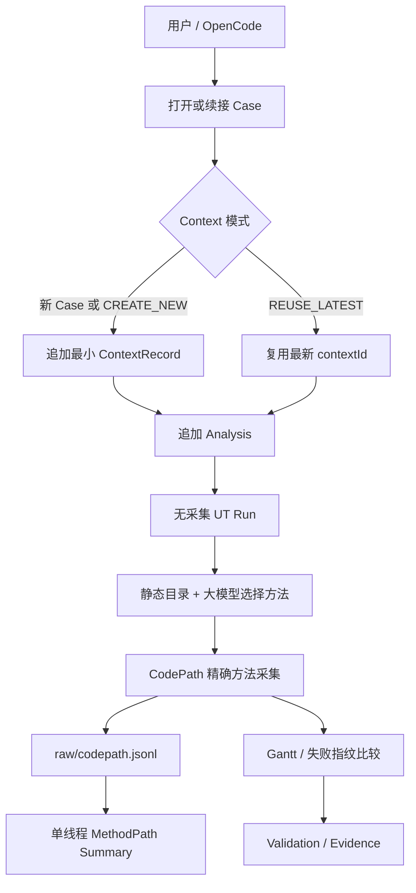
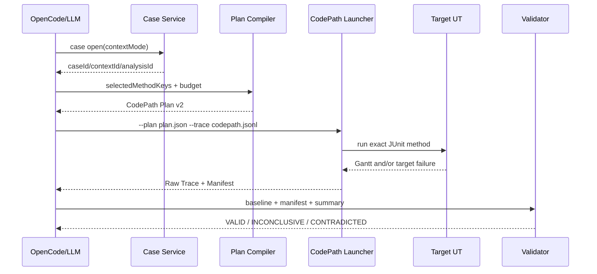

# Context 与 CodePath 精简可实施详细设计

- 文档状态：Approved for Implementation
- 设计版本：0.2
- 创建日期：2026-08-18
- 负责人：Codex / mh90901119-oss
- 目标里程碑：P2/P4 核心链路收敛
- 关联需求：显式 Context、单线程 UT、CodePath 精确方法计划、开发期删除旧兼容
- 关联架构与 ADR：[ADR-006](../decisions/ADR-006-case-as-analysis-dossier.md)、[通用运行时证据 ADR](../decisions/ADR-009-generic-runtime-evidence-before-domain-mapping.md)

## 1. 背景与问题

目标使用方式是：用户在一个 Maven 算法模块中指定单线程 JUnit 5 UT，通过 OpenCode 多轮提问；同一问题可以多次运行 UT、生成多个 CodePath/JDWP 计划并复用历史证据。分析期间默认不修改目标源码、UT 或输入；需要修改时由用户或大模型显式创建新 Context。

当前实现偏离该场景：

- `ContextSnapshotBuilder` 在打开每轮 Analysis 时扫描 `src/main/java`、`src/test/java`、输入和 POM，并用综合 Hash 自动决定是否创建 Context；
- CodePath Plan 又复制模块源码 Hash、package 范围、package 事件估算和源码文件 Hash；
- Launcher 先按 package 记录全部事件，再由 Adapter 二次过滤计划方法，导致大型单线程算法仍产生庞大 Raw Trace；
- Manifest、Normalizer 和 Validator 为 package 超集、descriptor 缺失和多线程维护多套字段与分支。

这些机制增加了常见路径的扫描成本、误判、契约字段和测试矩阵，却没有改善用户最需要的“按计划采集当前实际 UT 调用事实”。

## 2. 目标与非目标

### 2.1 目标

- Context 只作为同一 Case 下一段分析版本的显式分组，不再自动扫描或识别 Workspace 变化；
- 新 Case 自动创建第一个 Context，已有 Case 默认复用最新 Context，只有显式 `CREATE_NEW` 才新增 Context；
- CodePath Plan 只包含身份、目标 UT、精确方法 selector、硬预算、理由和时间；
- Launcher 根据 `className + methodName + descriptor` 在事件写盘前筛选，Raw Trace 只包含计划方法；
- 单线程 Trace 使用一个栈归一化，输出方法统计与最近选中祖先关系；
- 所有 Plan、Raw、Manifest、日志、Summary 继续按 `caseId/contextId/analysisId/runId/collectionId` 追加归档；
- 动态采集仍必须与当前 Context 的无采集 Gantt 内容 Hash 或失败指纹比较；
- 旧开发期 Schema 不兼容、不迁移、不保留双分支，旧测试 Workspace 重新创建。

### 2.2 非目标

- 不自动创建、切换或管理 Git Worktree；
- 不监控分析期间的源码、UT、输入、POM 或 Git revision 变化；
- 不根据 Gantt 变化自动拆分 Context；
- 不支持多线程目标算法的 CodePath 调用链；
- 不修改或 fork 上游 CodePathTracer；
- 不在本轮增加 Byte Buddy 类/方法级插桩 matcher；
- 不为 v1 Context、CodePath Plan、Manifest 或 Trace 提供读取兼容与迁移器；
- 不重新设计 JDWP 采集内容；只删除 JDWP Plan 的全模块源码指纹及其前后扫描。具体采集点已有的
  `SourceAnchor`（文件、行号、类、方法）继续保留并由 JDWP 自身校验。

## 3. 现状与约束

- Case 仍绑定一个 Project、一个目标 UT 和一个用户问题；用户切换目标 UT 时创建新 Case；
- Context/Analysis/Run/Collection/Evidence 仍为追加式身份，历史产物禁止覆盖；
- 目标 UT 为单线程，但关键方法可能在求解循环中被调用数十万次；事件数、文件字节和进程超时仍是必需硬预算；
- 上游 CodePathTracer `f8be120` 的 `AdviceData` 已提供类名、方法名、descriptor、进入/退出和真实深度；
- 上游当前仍对所有非忽略的具体类和方法安装 Advice。精确 selector 能减少事件生成、格式化、写盘和后处理，但不能宣称已经消除全部插桩开销；
- 目标代码、原 UT 和目标 POM 保持零侵入；
- 当前阶段以 Maven + JUnit 5 + 单测试方法为边界。

## 4. 用例与验收标准

| 用例 | 输入/前置条件 | 预期结果 | 验证层级 |
|---|---|---|---|
| 首次提问 | 新 Case | 创建 Case、Context、Analysis，不扫描源码或输入 | Unit/Integration |
| 同一问题追问 | 已有 Case，默认模式 | 复用最新 Context，仅新增 Analysis | Unit |
| 修改后继续分析 | 已有 Case，`CREATE_NEW` | 新增 Context 和 Analysis，历史不变 | Unit/CLI |
| 运行结果变化 | 普通 Run 得到不同 Gantt/失败指纹 | 输出 `CHANGED`，不自动创建 Context | Integration |
| 采集干扰 | CodePath Run 与当前无采集参考不同 | 归档产物，`evidenceUsable=false`，不创建 Context | Integration |
| 跨包方法计划 | selector 来自多个 package | 编译成功并稳定排序 | Contract/Unit |
| 重载方法计划 | 同类同名不同 descriptor | 只采集计划 descriptor | Launcher Integration |
| 高频单线程调用 | 计划方法大量重复调用 | 达预算后停止记录、UT 继续、Manifest 为 `TRUNCATED` | Integration/Performance |
| 目标异常 | 计划方法进入后 UT 抛异常 | 保留异常前 Raw，Summary 标注开放 Enter，目标失败独立归档 | Integration |
| 意外多线程命中 | 第二线程命中计划方法 | 报告 `CODEPATH_MULTIPLE_THREADS_UNSUPPORTED`，证据不可确认 | Unit/Integration |
| 零命中 | UT 完成但无计划方法事件 | Manifest 记录 0，Summary 为证据不足，不证明方法未执行 | Unit |

## 5. 总体方案



Context 不再判断 Workspace 是否变化；它只表达调用方的显式分组决定。运行变化由 `RunResultFingerprint` 和 `ReproductionComparator` 报告给大模型。CodePath 不再承担源码版本管理，只执行当前计划并记录当前实际 UT 的方法事件。

## 6. 模块与类设计

| 模块/类 | 职责 | 输入 | 输出 | 依赖 |
|---|---|---|---|---|
| `ada-contracts/ContextRecord` | 最小 Context 身份 | Case/Context/时间 | immutable DTO | contracts |
| `case-management/ContextMode` | 显式复用或新建 | `REUSE_LATEST/CREATE_NEW` | enum | JDK |
| `case-management/CaseSessionService` | 按显式模式选择 Context | CaseSessionRequest | CaseOpenResult | repository |
| `ada-contracts/CaseManifest` | 冻结目标 UT 与 Adapter | project/test/adapter/question | immutable DTO | contracts |
| `ada-contracts/CodePathCollectionPlan` | 精确方法采集契约 | selectors/budget | JSON Plan | contracts |
| `debug-plan-engine/CodePathPlanCompiler` | 验证方法属于当前目录并稳定排序 | MethodCatalog/request | Plan | contracts |
| `codepath-launcher/PlannedTraceEventGenerator` | 在写盘前精确匹配 AdviceData | plan selectors | JSONL event | CodePathTracer API |
| `codepath-launcher/ExternalJUnitTraceLauncher` | 安装 Agent、运行一个 UT、归档摘要 | plan path/trace path | Raw/Summary | JUnit Platform |
| `method-path-codepathtracer/CodePathProcessCollector` | 监管子 JVM 和生成 Manifest | collection request | raw/logs/manifest | harness/SPI |
| `trace-normalizer/MethodPathNormalizer` | 单栈流式摘要 | Raw Trace | MethodPathSummary | contracts |
| `trace-validator/CollectionEvidenceValidator` | 校验身份、Hash、截断和 Baseline | manifest/summary/baseline | validation | contracts |

`ContextSnapshotBuilder`、`ContextSnapshotRequest`、`ContextInputProbe`、`SourceSnapshotReader`、`MethodPathJsonlFilter` 和 `MethodPathFilterResult` 删除，不保留空壳或兼容代理。

Run、静态分析、CodePath 和 JDWP 需要 Adapter 时，从 `CaseManifest.adapterId` 和当前 `ProjectRegistration.moduleRoot` 选择，不再从 Context BuildSnapshot 读取。

`MethodCatalog` 删除全模块 `sourceFingerprintSha256`、仅为 package 超集采集服务的
`packageCensus/packageCensusCompleteness`；方法条目中的精确 `SourceAnchor` 继续保留，供大模型选点和
JDWP 行级采集使用。`JdwpCollectionPlan` 删除全模块 `sourceFingerprintSha256`，但不删除每个
`JdwpTracepointSpec` 的 `SourceAnchor`。

## 7. 数据与契约设计

### 7.1 Context v2

```json
{
  "schemaVersion": "2.0",
  "caseId": "case-001",
  "contextId": "context-001",
  "createdAt": "2026-08-18T00:00:00Z"
}
```

`CaseOpenResult.contextChanged` 重命名为 `contextCreated`。`CaseSessionRequest` 增加 `ContextMode`，删除 module/repository/revision/java/adapterVersion/input probe 等快照输入。`CaseManifest` 增加必填 `adapterId`，避免运行阶段依赖 Context BuildSnapshot。

### 7.2 CodePath Plan v2

```json
{
  "schemaVersion": "2.0",
  "planId": "plan-001",
  "caseId": "case-001",
  "contextId": "context-001",
  "analysisId": "analysis-001",
  "targetTest": {"className": "example.AlgorithmTest", "methodName": "runs"},
  "selectors": [
    {
      "methodKey": "example.Algorithm#solve()V",
      "className": "example.Algorithm",
      "methodName": "solve",
      "descriptor": "()V"
    }
  ],
  "budget": {"maxEvents": 100000, "maxBytes": 16777216, "timeoutMillis": 300000},
  "rationale": "确认求解主循环的实际执行路径",
  "createdAt": "2026-08-18T00:00:00Z"
}
```

删除 `sourceFingerprintSha256`、`sourceSha256`、`packagePrefixes`、`captureScope`、`estimatedPackageEvents` 和 `maxCallDepth`。selector 数量为 1～50；多轮分析通过多个 Plan 扩展范围。

### 7.3 Raw Trace v2

```json
{"eventId":1,"eventType":"METHOD_ENTER","depth":7,"className":"example.Algorithm","methodName":"solve","descriptor":"()V"}
```

descriptor 必填；不保存参数、返回对象或每行重复的线程名。Launcher 记录首个命中线程，第二线程命中即结构化失败。

Launcher 只接收归档目录内的 Plan 文件路径。读取时执行文件大小上限、Schema v2、身份、selector
数量和预算校验；未知字段、v1 Plan、路径越界或超大 Plan 均在启动目标 UT 前失败。Plan 解析不得将
任意命令、类名或路径拼接为 shell 字符串。

### 7.4 Manifest v2

Manifest 保留身份、工具版本/Hash、Plan Hash、完成状态、阶段、进程事实、`capturedEventCount`、`capturedBytes`、`rawSha256`、截断原因、目标/Agent 失败、日志路径和时间。删除 package/capture/evidence scope、匹配精度、raw/filtered 双计数和双 Hash。

### 7.5 兼容策略

这是开发期主动破坏性清理：Schema 主版本升级为 v2，代码只读取 v2；删除 v1 Schema 和执行分支。现有开发 Workspace 不迁移，重新初始化并重新建立 Case。

## 8. 核心流程



- 新 Case 无论 ContextMode 都创建初始 Context；
- 已有 Case 默认 `REUSE_LATEST`，`CREATE_NEW` 追加新 Context；
- 普通 Run 的 `CHANGED` 只是一项事实，不隐式修改 Context；
- 同 Context 动态采集与无采集参考 `CHANGED` 时证据不可确认；
- 目标异常、断言失败、输入缺失仍属于 UT 结果，不属于 Context 或 Agent 崩溃。

## 9. 错误处理与可观测性

- `CONTEXT_MODE_INVALID`：非法显式模式；
- `CONTEXT_NOT_FOUND`：复用已有 Case 但没有已归档 Context；
- `CODEPATH_PLAN_METHOD_NOT_FOUND`：选择器不属于当前 MethodCatalog；
- `CODEPATH_PLAN_TOO_LARGE`：超过 50 个 selector；
- `CODEPATH_MULTIPLE_THREADS_UNSUPPORTED`：第二线程命中计划方法；
- `CODEPATH_TRACE_INVALID`：Raw 事件缺 descriptor、顺序或 JSON 非法；
- 超预算保持 `TRUNCATED`，超时保持 `TIMED_OUT`；
- 目标测试失败与工具失败正交保存；
- 任何失败都尽力保留 request、plan、manifest、stdout、stderr 和已写 Raw。

## 10. 性能与容量预算

| 指标 | 默认值 | 硬上限 | 超限行为 | 验证方法 |
|---|---:|---:|---|---|
| selector 数 | 20 | 50 | 拒绝计划 | Contract |
| CodePath 事件 | 100,000 | 1,000,000 | 停止记录，UT 继续 | Integration |
| Raw Trace | 16 MiB | 50 MiB | 停止记录，UT 继续 | Integration |
| UT/采集进程 | 5 分钟 | 20 分钟 | 终止进程树并归档超时 | Integration |
| Raw 单行 | < 4 KiB 预期 | 1 MiB | Normalizer 拒绝 | Unit |

不设置 `maxCallDepth`：深度只是一个整数事实，事件数预算已经限制单栈大小。必须记录无采集、旧 package 方案和精确方法方案的实际耗时、事件数与字节数；在真实数据前不声明固定性能提升比例。

## 11. 安全、隐私与无侵入性

- 不修改目标算法源码、UT 或 POM；
- 分析期间禁止修改目标源码、UT 和输入，该约束写入 Skill 与使用文档；
- 不采集方法参数、返回值、局部变量或对象图；
- 子 JVM 不开放网络端口；
- 外部进程仍使用 argv 列表、超时、日志排空和进程树清理；
- CodePathTracer 版本、许可证和 Bundle SHA 锁定规则不变。

## 12. 测试设计

### 12.1 单元测试

- `CaseSessionServiceTest`: 新 Case 创建 Context、默认复用、显式新建、Run 变化不自动建 Context；
- `CodePathPlanCompilerTest`: 跨 package、重载 descriptor、稳定排序、重复/未知/超过 50 个 selector；
- `PlannedTraceEventGeneratorTest`: 精确 descriptor、非计划方法不写、单线程、第二线程失败；
- `MethodPathNormalizerTest`: 单栈平衡、递归、最近选中祖先、异常开放 Enter、零事件、非法 descriptor；
- `CollectionEvidenceValidatorTest`: 成功、截断、零事件、Baseline 改变、Hash 不一致。

### 12.2 契约测试

- Context、CaseManifest、CodePath Plan、Manifest、Raw Event、MethodPathSummary 的 Java/JSON Schema 等价；
- v1 示例必须被 v2 Reader 拒绝，不提供兼容执行；
- Manifest 不能出现 package、filtered、matchPrecision 或源码指纹字段。

### 12.3 集成测试

- Case open CLI 默认复用与 `--context-mode new`；
- 临时 Maven/JUnit Fixture 完成 Plan -> Launcher -> Raw -> Manifest -> Summary；
- 正常、断言失败、算法异常、超时和截断均保留产物；
- 动态采集 Gantt/失败指纹与当前无采集参考一致才可用；
- 真实 Wafer Demo UT 只产生计划方法事件并保持 Gantt Hash。

### 12.4 性能与 Eval

- 生成 1,000,000 次单线程计划方法调用，验证有界写盘和内存；
- 比较 package 旧基线与精确方法方案的耗时、Raw 事件和字节；
- Eval 覆盖：复用 Context、用户声明修改后新建 Context、意外 `CHANGED` 不自动拆分、证据不足时追加计划。

## 13. 实施步骤

1. 更新 ADR、架构和本设计，冻结显式 Context 与精确 CodePath 契约；
2. TDD 替换 Context 契约、Repository、Case Service 和 CLI；
3. 解除 Run/Static/JDWP/Evidence 对旧 Context Snapshot 的读取；
4. TDD 简化 MethodCatalog 和 CodePath Plan；
5. TDD 实现 Plan 驱动 Launcher 和单线程 Raw v2；
6. 删除事后二次过滤，简化 SPI/Manifest/Core 归档；
7. TDD 简化 Normalizer、Validator 和 Evidence；
8. 更新 Skill、README、Schema、示例和完整架构图；
9. 执行模块、根构建、真实 Smoke、性能基线和代码审计。

## 14. 兼容、迁移与回滚

- 不读取 v1 Context/Plan/Manifest/Trace；
- 删除现有开发 Workspace 后重新 `workspace init`、`project register`、`case open`；
- 不删除 Git 历史中的 v1 代码与文档，可通过 Git 回滚整个提交；
- 不同时维护 v1/v2 分支，避免长期双重行为。

## 15. 风险与已决事项

| 风险/问题 | 影响 | 缓解措施 | 状态 |
|---|---|---|---|
| 分析期间用户实际修改代码 | 旧计划可能零命中或含义变化 | 文档/Skill 禁止；显式新 Context 和新 Plan | Accepted |
| 上游仍全局安装 Advice | 大型算法仍有运行时开销 | 先实测；超标后单独设计上游 matcher | Accepted |
| 多线程意外出现 | 单栈关系错误 | 第二线程结构化失败，不猜测合并 | Resolved |
| 自动 Context 拆分被删除 | Agent 不会自行猜测修改 | 大模型读取 `CHANGED` 后显式决定 | Accepted |
| v1 Workspace 不可读 | 开发数据需重建 | 当前未发布，记录一次性重建命令 | Accepted |
| 删除全模块源码指纹后 JDWP 失去保护 | 断点可能落到错误位置 | 保留并校验每个 tracepoint 的 `SourceAnchor`，只删除全模块扫描 | Resolved |

## 16. 文档同步清单

- [x] ADR-006 与 ADR-010
- [x] 架构总览与模块详细设计
- [x] P1/P2/P4 设计的替代说明
- [x] Schema README 与 v2 Schema
- [x] 根 README、case-management、method-path 模块 README
- [x] OpenCode Skill 和 CLI 参数
- [ ] 独立模型 Eval Case（后续 Agent 评测阶段）

## 17. 实现与验证记录

- 实际变更：已实现显式最小 Context、冻结 Adapter、MethodCatalog/CodePath/JDWP v2、Plan 驱动精确方法 Launcher、单一 Raw 流、单栈 Normalizer、Validator/Evidence 去全模块指纹，以及 CLI/Skill/文档同步。
- 审计修复：v2 Schema 的 ID、tracepoint、catalog/summary 数组改为真实结构，并用 Apache-2.0 的 `json-schema-validator 3.0.0` 作为纯测试依赖校验真实 JSON；控制文档统一输出 ISO-8601 时间。MethodPath Manifest 新增独立 `targetOutcome` 和 JUnit 计数，工具失败不再遮蔽同时发生的 UT 失败；采集完成后的 Agent 失败沿用已观察到的进程、退出码和 Raw 计数。
- 预算修复：命中事件数或字节预算后，Launcher 停止后续 TraceEvent 生成、JSON 格式化和 Sink 调用，但不终止目标 UT；上游全局 Advice 回调仍是已知限制。
- 回归覆盖：`CodePathProcessCollectorTest` 已覆盖启动失败、超时、成功、零命中、截断、目标失败、工具与目标同时失败、非法 Summary；Launcher 另覆盖精确 descriptor、第二线程和百万事件预算。
- 相对设计的偏差：未修改上游 CodePathTracer；因此只保证未选方法不格式化、不写盘，不保证消除其 Advice 回调。独立模型 Eval Case 留到 OpenCode 端到端适配阶段。
- 测试与命令：审计修复后 `mvn -o -Dmaven.repo.local=C:\Users\zhao1k\.m2\repository -Pcodepath-launcher clean test` 通过全部 22 个 Reactor 模块（总耗时 1:03）；真实临时 Maven 集成测试 9 个场景通过；两个需要外部配置的常规 smoke 在全量构建中按设计跳过。
- 性能结果：`D:\javacode\hellomvn` 精确 `SimpleWaferScheduler#schedule` smoke 历史三次测试体耗时 4.376 s、4.481 s、4.411 s，中位数 4.411 s；审计修复后再次为 4.432 s、2 个事件、509 bytes，所有事件 class/method/descriptor 均与 Plan 相等。历史包级样本为 41,436 个事件、7,010,648 bytes；因测试选择器和实现版本不同，不计算或宣称性能提升百分比。
- 已知限制：上游全局 Advice、仅单线程 UT；A～G 尚未全部集中为集成模块端到端测试，三组同条件性能基线尚未完成；OpenCode 一次性安装器及模型 Eval 尚未完成。
- 提交/版本：尚未提交

## 18. 变更记录

| 日期 | 版本 | 变更内容 | 作者 |
|---|---|---|---|
| 2026-08-18 | 0.1 | 显式最小 Context 与精确方法 CodePath 设计初稿 | Codex / mh90901119-oss |
| 2026-08-18 | 0.2 | 批准实施；明确 JDWP 保留行级 SourceAnchor，并补充 Plan 严格读取边界 | Codex / mh90901119-oss |
| 2026-08-19 | 0.3 | 完成 v2 实现、全 Reactor 回归和真实算法精确方法 smoke；记录上游 Advice 与 Eval 限制 | Codex / mh90901119-oss |
| 2026-08-19 | 0.4 | 修复最终审计发现的 Schema、目标结果保留与预算停止问题；明确 Task 10 剩余门禁 | Codex / mh90901119-oss |
