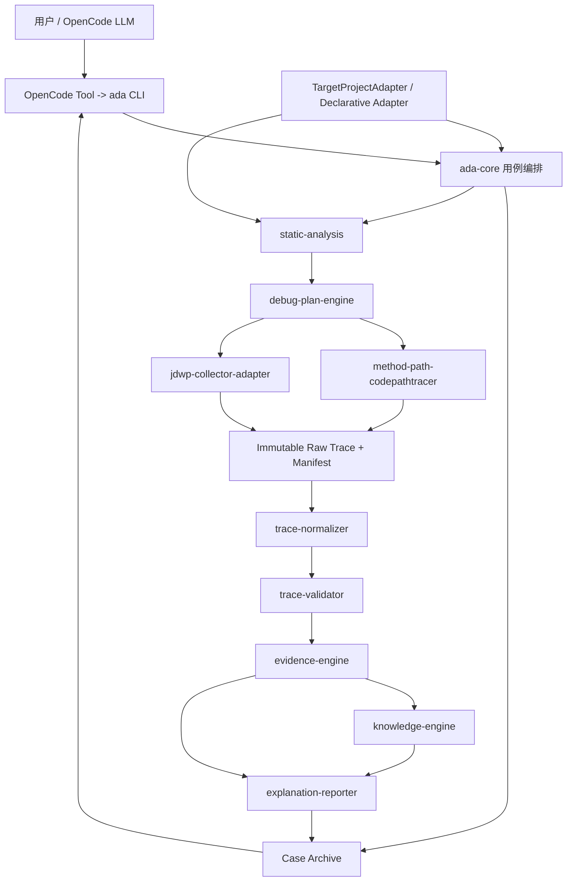
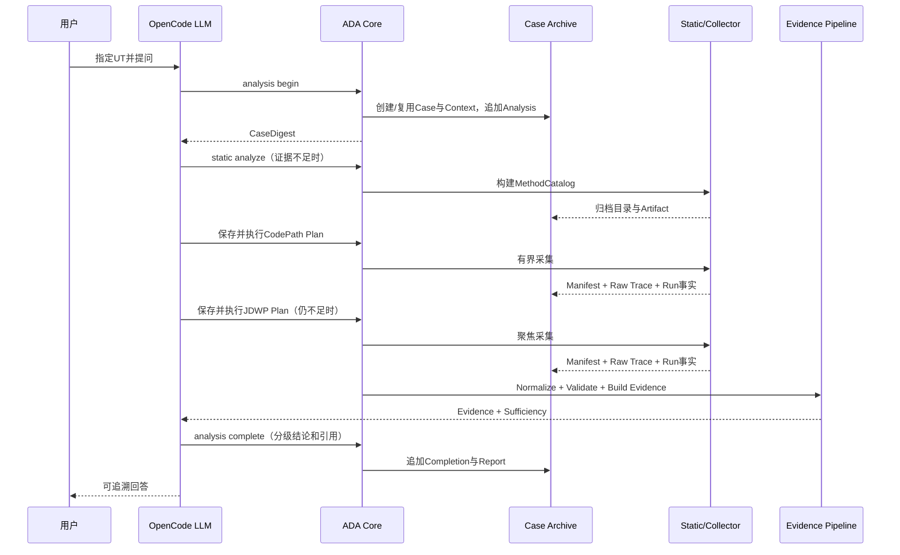

# P1～P8 Algorithm Debug Agent 完整能力可实施设计

- 文档状态：Approved for Continuous Implementation
- 设计版本：0.4
- 创建日期：2026-08-18
- 负责人：Codex / mh90901119-oss
- 目标里程碑：Phase 2～8 - 可由 OpenCode 日常使用的证据驱动算法调试 Agent
- 关联需求：连续完成静态分析、CodePath、JDWP、Evidence、多轮分析、OpenCode、通用 Adapter 与评测
- 关联架构与 ADR：`docs/architecture/algorithm-debug-agent-module-detailed-design-v1.md`、
  `docs/architecture/tool-validation-baseline.md`、ADR-006、ADR-007、ADR-008

## 1. 背景与问题

仓库已经完成无采集目标 UT 的 Case/Context/Analysis/Run 归档、Gantt/异常捕获、JSON 内容指纹、
失败指纹和简单复现比较。当前缺口不再是“能否运行 UT”，而是如何围绕用户问题形成以下闭环：

```text
目标 UT与问题
  -> 静态调用关系和候选方法
  -> 大模型选择最小采集计划
  -> CodePath实际调用链
  -> JDWP方法内部状态
  -> 标准化、校验和证据充分性
  -> 多轮可恢复结论
  -> OpenCode内直接使用
```

CodePathTracer 外部 JUnit Launcher 已验证无需修改目标源码或 POM，但当前底层原型只承诺 package
范围捕获且在内存聚合事件。JDWP Batch Collector 已验证 JSON Plan、断点、locals、stack 和有界对象读取，
但 Agent 侧尚未实现端口、进程和一致性监管。两个工具都不能绕过计划直接采集，所有计划、日志、Manifest、
Raw Trace、派生 Trace、Evidence 和报告必须追加归档到同一 Case。

用户已经明确批准 P1～P8 连续实施，不设置阶段性人工确认门。本设计采用每个垂直切片完成后自动执行代码
审计、缺陷修复、受影响测试和根构建，审计通过后继续下一切片。

## 2. 目标与非目标

### 2.1 目标

- 从目标 UT 构建有界静态方法目录和 best-effort 调用关系；
- 持久化大模型可读、代码可严格校验的 CodePath/JDWP JSON 计划；
- 通过锁定版本外部工具执行 CodePath 和 JDWP，不侵入目标生产源码；
- 所有动态采集均有硬预算、Manifest、退出事实、截断原因和目标结果一致性校验；
- 将 Raw Trace 确定性转换为有界 Domain Trace 和 Evidence Bundle；
- 每轮 Analysis 追加保存计划、运行、证据、分级结论与最终回答；
- 提供稳定 CLI 和一次性 OpenCode 安装/检查/卸载，使用户在算法模块中直接启动 `opencode`；
- 通过声明式 JSON Adapter 支持 Wafer Demo 之外、能输出 JSON 结果的 Maven/JUnit 算法模块；
- 提供知识条目、报告、离线 Eval、性能和发布门禁。

### 2.2 非目标

- 不实现 Algorithm Debug MCP Server 或其他 CLI Runtime；
- 不自动修改目标算法源码、UT 或 POM；
- 不让确定性代码推断业务根因，LLM 负责解释；
- 不实现字段级 Gantt Diff，变化位置由大模型按需读取 Artifact；
- 不穷举 Java/业务异常；
- 不复制或 fork CodePathTracer/JDWP Collector 核心源码到本仓库；CodePath 的受控 JUnit Launcher
  作为 Agent 自有集成边界放在 `tools/code-path-tracer-junit-launcher`，只依赖锁定的上游公开 API；
- 不接管生产调度或访问生产系统；
- 不承诺任意 Java 语法和任意构建工具，首版静态分析与通用 Adapter 限定 Java 21 Maven/JUnit 5。

## 3. 现状、外部工具与约束

### 3.1 已实现基础

- `ada-contracts`：Case、Context、AnalysisRequest、Run、Artifact、失败诊断和结果指纹；
- `case-management`：外部 Workspace、项目登记、追加式 Case Archive、Digest 和 reproduction reference；
- `debug-harness`：Maven/JUnit 进程、日志、超时清理、Surefire、Gantt 捕获和 Hash；
- `ada-core`/CLI：Workspace、Project、Doctor、Case open/inspect、Run execute；
- `wafer-demo-adapter`：真实 Demo 输入、启动规格、结果定位和解析；
- OpenCode：规范 Skill 和尚未接线的 Agent/Command/Tool 资产。

### 3.2 锁定工具边界

| 工具 | 已验证版本 | 许可证 | Agent 接入策略 |
|---|---|---|---|
| CodePathTracer | commit `f8be120694a5d5bb1405c0f3e1a4396e89b6dfa1` | Apache-2.0 | Agent 自有 Launcher Bundle + 锁定的上游 API；执行期流式硬预算，先 package 超集采集，再按计划方法过滤 |
| JDWP Batch Collector | commit `1ef7d22`，JAR SHA-256 `E75C...7B` | MIT | 外部 JAR；Agent 编译受限 Plan、动态 localhost 端口并监管进程 |

工具路径来自 Workspace 配置或环境变量，不进入 Case 身份，不写死开发机路径。`toolchain-lock.json` 保存版本、
commit、SHA、许可证和兼容的计划 Schema。

### 3.3 通用约束

- Java 21、Maven、JUnit 5，保持离线；
- 跨模块数据必须是不可变 DTO 与版本化 JSON Schema；
- 原始产物 write-once，派生产物不能覆盖 Raw Trace；
- 所有文本、列表、事件、文件、时间、对象深度和进程都有显式预算；
- 采集 Run 与本 Context reproduction 指纹不一致时，Evidence Validator 必须拒绝确认性使用；
- 当前 Case 数据按 `caseId/contextId/analysisId/runId/planId/collectionId/evidenceId/reportId` 关联。

## 4. 用例与验收标准

| 用例 | 前置条件 | 预期结果 | 验证层级 |
|---|---|---|---|
| 静态分析目标 UT | Java/Maven 模块与指定方法 | 输出可达方法、调用边、源码锚点、警告和截断事实 | Unit/Integration |
| CodePath 计划 | 方法目录与用户问题 | 计划包含方法 allowlist、package 超集、理由和硬预算 | Contract |
| CodePath 执行 | 锁定 Bundle 可用 | 保存 plan/manifest/raw/filtered trace；目标结果可比较 | Integration |
| CodePath 超预算 | package 超集过大或输出超限 | 预览拒绝或结构化截断，不耗尽内存 | Unit/Performance |
| JDWP 计划 | CodePath 已定位方法 | Source Anchor 编译为 tracepoint，变量和投影显式 allowlist | Contract |
| JDWP 执行 | Collector 和目标 JVM 可用 | 动态端口、可靠 resume/退出、Raw Trace 和 Manifest 完整 | Integration |
| Collector 失败 | attach/超时/计划错误 | 目标 UT/Agent 失败正交归档，Case 可继续 | Fault Injection |
| Evidence 构建 | Raw Trace 与目标结果 | 输出有 provenance、预算和一致性状态的 Evidence Bundle | Unit/Contract |
| 证据不足 | 缺输入/源码/运行时任一链路 | 返回 `INSUFFICIENT` 与最小缺口，不确认根因 | Eval |
| Analysis 完成 | 多轮运行和证据存在 | 追加完成记录、引用历史，不覆盖上一轮 | Integration |
| OpenCode 日常使用 | 一次性安装完成 | 进入目标模块运行 `opencode`，可创建/续接 Case 并按需采集 | E2E |
| 通用 JSON 算法 | 声明式 Adapter 配置 | 无 Java 插件代码即可运行 UT、发现输入和 JSON 结果 | Integration |
| 报告与 Eval | Golden Case | 报告引用可校验，错误假设被拒绝，回归结果可比较 | Eval |

## 5. 总体架构



LLM 只选择问题范围、计划候选和解释。代码负责静态解析、计划校验、进程、预算、Hash、过滤、关联、
一致性与引用校验。`ada-core` 只依赖端口，不包含 Collector 或算法业务逻辑。

### 5.1 方案比较

1. **推荐：外部工具进程 + 版本化计划与适配器。** 保持无侵入、许可证和升级边界清楚，测试可替换进程端口。
2. 把两个 Collector 源码复制进仓库。能统一构建，但形成维护 fork、二进制膨胀和许可证同步负担，拒绝。
3. 通过 MCP 调用工具。增加服务生命周期和协议，不符合当前 OpenCode + CLI 决策，拒绝。

## 6. P1～P8 模块与类设计

### 6.1 P1 静态分析与计划基础

| 模块/类 | 职责 | 输入 | 输出 |
|---|---|---|---|
| `ada-contracts/PlanId` | 不透明计划 ID | string | stable ID |
| `ada-contracts/SourceAnchor` | 稳定源码位置 | 类、方法、相对路径、行、源码 Hash | immutable DTO |
| `ada-contracts/MethodCatalog` | 有界方法和调用边目录 | target/context/analysis | JSON document |
| `ada-contracts/CodePathCollectionPlan` | 版本化 CodePath 计划 | 方法 selector、package、预算、理由 | JSON document |
| `static-analysis/JavaSourceCallGraphAnalyzer` | 使用 JDK Compiler Tree API 分析源码 | 模块根、TargetTest、预算 | MethodCatalog |
| `debug-plan-engine/CodePathPlanCompiler` | 校验 LLM 选择并计算 package 超集 | catalog、request | executable plan |

静态解析允许 `PARTIAL`：无法解析依赖类型时保留语法级调用和警告。任何截断必须进入报告，不能静默漏边。

P1 静态分析预算按以下边界实现：源码发现只保留有界路径集合，源码字节通过有界流读入，`javac`
只消费这些已受 file/byte 预算约束的输入；方法与调用边在 AST visitor 中达到预算后立即停止，不允许先无界
累计再裁剪。`JavacTask.parse/analyze` 是 JDK 提供的进程内不可中断阶段，因此这里的 `timeoutMillis`
仅表示调用前后及可中断扫描阶段检查的协作式 deadline，不是 hard wall-clock timeout。若 `javac` 返回时已经
超过 deadline，本次静态分析以 `STATIC_*` 错误失败，不归档伪装成按时完成的目录。真正的墙钟硬超时需要
未来把编译器放入受监管 worker process，不属于 P1 修复范围。

`MethodCatalog` 同时保存有上限、稳定排序的 exact package census 及其完整性。census 来自实际扫描到的
方法声明，而不是目标 UT 可达子图；file/byte/method/deadline 任一截断都会使 census 不完整。当前锁定的
CodePath 工具单次只支持一个 package include，因此 Plan Compiler 只接受同一 exact package 的 selector。
该 include 的唯一契约是 package 边界树：`candidate.equals(selectedPackage)` 或
`candidate.startsWith(selectedPackage + ".")`；例如选择 `com.foo` 时包含 `com.foo` 与 `com.foo.sub`，
但不包含 `com.foobar`。Plan 成本必须用同一谓词对 exact census 求和；census 不完整或树内成本超限时
fail closed。P2 Launcher 和后续 Collector 只能复用这一边界语义，禁止使用裸 `startsWith(selectedPackage)`。

`StaticAnalysisBudget.maxCatalogBytes` 默认 64 MiB、最小 16 MiB、硬上限 128 MiB，且不得高于归档 writer
的 128 MiB 防御上限。分析器维护保守 JSON UTF-8 上界账本：每个动态字符串按
`2 + 6 * UTF-16 code units` 计费，以覆盖引号和最坏 `\uXXXX` 转义；顶层动态字段逐字段计费，并为最多
1,000 条、每条最多 2,048 字符的 warning/diagnostic 一次性预留最坏上界。每个已接受方法声明计入完整
entry 上界和一份 package census 上界，每条调用边计入完整 edge 上界；结构字符、字段名、数字和布尔值使用
固定保守余量。第一个使累计上界超过预算的方法或调用边计入 discovered 的 `max+1` 观察值后立即停止，
结果标记 `INCOMPLETE`，且方法阶段停止会同时把 census 标记为 `INCOMPLETE`。因此任何成功返回的 analyzer
产物都满足 `actual Jackson UTF-8 bytes <= maxCatalogBytes <= 128 MiB`；writer 的 128 MiB 检查仍是最终防御。

1 MiB 仍是 Workspace 控制文档和面向 LLM 单次读取的上限。完整 `MethodCatalog` 是大型 JSON Artifact，
使用独立硬字节上限的 Jackson 流式读写通道，并保持同目录临时文件、flush/fsync、原子 move 和 create-new
语义；不得先序列化为单个 `byte[]`。LLM 读取该 Artifact 时仍使用 1 MiB 有界窗口或后续分段读取接口。

### 6.2 P2 CodePathTracer 正式接入

| 模块/类 | 职责 |
|---|---|
| `method-path-spi/MethodPathCollector` | Collector 端口，执行计划并返回 Manifest/Artifact paths |
| `method-path-spi/MethodPathManifest` | 工具版本、计划 Hash、事件、字节、截断、测试结果和退出事实 |
| `method-path-codepathtracer/CodePathProcessCollector` | 组装无 shell argv、监管外部 Bundle、归档日志 |
| `method-path-codepathtracer/MethodPathJsonlFilter` | 流式保留方法 allowlist，检查 event/byte/depth 预算 |
| `ada-core/CollectionApplicationService` | 创建采集 Run、保存 Plan、调用 Collector、比较目标指纹 |
| `tools/code-path-tracer-junit-launcher` | 受控 JUnit Launcher Bundle；流式 JSONL、硬预算和结构化完成摘要 |

受控 Launcher 只复用锁定的上游 CodePathTracer API，不复制或修改上游核心。该工具模块通过父 POM 的
`codepath-launcher` profile 可选加入 reactor，避免默认离线构建依赖开发机本地 snapshot；发行构建必须显式
激活 profile 并校验上游 JAR SHA。Launcher 和 Plan Compiler 共享 `JavaPackageScope`，只捕获 exact package
或 `prefix + '.'` 子包，不能把 `com.foobar` 误纳入 `com.foo`。

`TraceJsonlSink` 同步逐行写入完整 UTF-8 JSONL；每行写入前精确计算字节数，使用有界缓冲并只在关闭时刷新，
禁止每个回调都触发磁盘 flush。执行期间强制
`maxOutputBytes <= 50 MiB`、`maxEvents <= 1,000,000`。命中任一上限后只停止记录，目标 UT 继续运行并输出
结构化单行 Launcher Summary。Launcher 不保留全量事件列表。父 Collector 仍在退出后校验 Raw 文件字节数，
用于发现旧版、错误配置或失控 Launcher；越界时报告 `CODEPATH_RAW_LIMIT_BREACH`，不生成派生 Trace。

Manifest 由 Core 统一使用同目录临时文件、flush/fsync、原子 move 和 create-new 语义归档。一次 request 创建后，
无论配置校验、进程启动、目标执行、过滤或一致性检查在哪个阶段失败，都尽力保留终态 Manifest。Manifest 至少记录
stage、processStarted、exitCode、AgentFailure、raw/filtered Hash 与 bytes、stdout/stderr 引用、capture/evidence
scope、matchPrecision 和截断原因。`TARGET_FAILED` 只能来自 Launcher 的结构化 Summary，不能把任意退出码 2
解释为目标失败；目标结果与 AgentFailure 正交。Core 自身的源码校验、Maven 定位、classpath 或归档前置失败使用
`AGENT_FAILED`，不能伪装成目标 UT 或外部工具失败；该状态必须携带结构化 `AgentFailureDiagnostic`，且未启动
进程时 `exitCode=-1`。

过滤器有 descriptor 时精确匹配；上游事件不携带 descriptor 时按 class+method 保留同名重载，并在 Manifest
记录降级计数和 `matchPrecision=CLASS_METHOD_SUPERSET`。JSONL 输入使用有界字节/块读取，禁止先由
`BufferedReader.readLine()` 为超大无换行内容分配无界字符串。未保留任何计划方法事件时必须记录
`matchPrecision=NONE`，不能把“没有运行时命中”描述成 descriptor 精确证据。

Core 只依赖 `method-path-spi`，通过构造器注入 `MethodPathCollector` 与 `TargetClasspathResolver`；CLI 组合根负责
装配 CodePath 实现和配置。采集 request 归档后、Collector 启动前重新计算 SourceSnapshot，并与 Context/Plan
严格比较；Context 和本轮观察都必须为 `COMPLETE`，不完整快照即使 Hash 相同也禁止动态采集。不一致时
Collector 调用次数必须为零。采集完成后再次计算，发生漂移或变为不完整时保留 Raw，但
`evidenceUsable=false`。`CollectionExecutionSummary` 只允许 `evidenceUsable=true` 时 baseline 为 `MATCHED`，
反向不强制；截断、零保留事件、源码后漂移、工具/Agent 失败仍会阻止证据用于确认性结论。

CLI 组合根同时向 Doctor 注入 CodePath 工具探针。`doctor` 必须区分未配置、Java 不可用、Launcher 不存在、
Launcher SHA 不一致和校验通过；消息不得回显本机绝对路径。当前受控 Launcher 的可重复发行 JAR SHA-256 为
`669a2cc634e5238db8abd35f924f9ad1cc4e9403fb84d7dcb650b612641c6590`，与
`config/toolchain-lock.json` 一致。2026-08-18 已使用该 JAR 对 `D:\javacode\hellomvn` 的
`SimpleWaferSchedulerTest#parallelModeAllowsJobsToAlternateOnSharedChamber` 完成非跳过真实 Smoke；模块路径仅为
本机验证示例，正式运行通过配置传入。Launcher 的 Jar 插件强制每次 `package` 重建薄 JAR，避免把上一轮胖
JAR 再次 Shade；连续两次不清理构建必须得到相同字节数和 SHA。工具内置 `META-INF/THIRD-PARTY-NOTICES.md`，
发行级 SBOM 与许可证聚合仍是 P8 门禁。

#### 6.2.1 P2 收尾审计与修复

2026-08-18 的 P2 收尾审计额外确认并修复了三个会影响 Case 证据可信度的问题：

1. `MethodPathCollectionResult` 除 `runId/planId/collectionId` 外，必须同时校验
   `caseId/contextId/analysisId`，阻止 Collector 返回的 Manifest 串入其他 Case 或分析轮次；
2. `CollectionExecutionSummary.artifactRelativePaths` 必须直接由实际返回的 Case 相对
   `ArtifactReference` 派生，不能维护第二份 collection 相对路径；`collection-request.json` 与存在时的
   `raw/gantt.json` 也必须进入 Artifact 引用，保证大模型能够从结构化摘要定位完整原始产物；
3. 超时子进程的退出码是平台事实：Windows 在强制终止后可能返回 `1`，其他平台可能无法取得而记录 `-1`。
   判定只依赖 `timedOut=true/completion=TIMED_OUT`，退出码只能要求“不伪装为成功 0”。

新增应用流回归覆盖：成功且 Baseline 匹配、目标 UT 失败但仍产生 Gantt、采集后源码漂移、Gantt 变化；新增真实
进程边界回归覆盖：Java 启动失败与实际阻塞子进程超时。目标失败、源码漂移和 Baseline 变化都保留产物但
`evidenceUsable=false`；只有成功、保留事件非零且 Baseline 匹配时才能进入后续确认性证据链。

### 6.3 P3 JDWP 正式接入

| 模块/类 | 职责 |
|---|---|
| `ada-contracts/JdwpCollectionPlan` | Source Anchor、变量 allowlist、字段投影、采样和预算 |
| `debug-plan-engine/JdwpPlanCompiler` | 校验源码 Hash/行号并生成 Collector debug-plan JSON |
| `jdwp-collector-adapter/LoopbackPortAllocator` | 只分配 localhost 临时端口，不暴露远程调试 |
| `jdwp-collector-adapter/JdwpTargetLauncher` | 用 `suspend=y,server=y` 启动目标测试 JVM |
| `jdwp-collector-adapter/JdwpCollectorProcess` | 启动 Collector、监管 attach/退出/日志/Manifest |
| `jdwp-collector-adapter/JdwpCollectionCoordinator` | 确保 Collector attach 后 resume，失败时有界终止整个进程树 |

首版只使用 Collector 已支持的 locals/stack/对象限制。尚未被底层支持的字段路径 projection 和采样在计划
编译阶段拒绝，而不是静默忽略。

### 6.4 P4 Normalizer、Validator 与 Evidence

| 模块/类 | 职责 |
|---|---|
| `trace-normalizer/MethodPathNormalizer` | Raw enter/exit JSONL -> 调用树摘要和关键路径 |
| `trace-normalizer/JdwpSnapshotNormalizer` | JDWP JSONL -> tracepoint 命中与有界变量投影 |
| `trace-validator/CollectionEvidenceValidator` | Schema、Hash、预算、截断和 reproduction 一致性 |
| `evidence-engine/EvidenceBundleBuilder` | 关联输入、源码、运行时和 Gantt 引用 |
| `evidence-engine/EvidenceSufficiencyEvaluator` | 输出 `SUFFICIENT/INSUFFICIENT/CONTRADICTED` 与缺口 |

Evidence Claim 类型固定为 `CONFIRMED_FACT`、`VALIDATOR_CONCLUSION`、`SOURCE_INFERENCE`、
`LLM_HYPOTHESIS`、`MISSING_EVIDENCE`。Validator 不调用 LLM。

### 6.5 P5 多轮 Analysis 完整归档

| 模块/类 | 职责 |
|---|---|
| `ada-contracts/AnalysisCompletion` | 计划、Run、Evidence、Claim、回答 Artifact 引用和完成时间 |
| `case-management/AnalysisArchiveRepository` | create-new 保存完成记录与引用校验 |
| `case-management/CaseDigestReader` | 增加最近完成 Analysis、Evidence 和待补缺口摘要 |
| `ada-core/AnalysisApplicationService` | begin/complete/read artifact 用例 |
| CLI `analysis begin/complete`、`artifact read` | 稳定 ToolResponse 2.0 高层入口 |

回答正文作为有界 UTF-8 Artifact 保存，完成记录只保存 Hash 与引用。历史 Analysis 不可修改或自动升级 Claim。

### 6.6 P6 OpenCode 日常集成

| 组件 | 职责 |
|---|---|
| `integrations/opencode/install.mjs` | install/upgrade/check/uninstall，生成只引用仓库资产的薄入口 |
| `integrations/opencode/tools/algorithm-debug.ts` | 映射稳定 CLI，注入 workspace/projectId，不重写事实 |
| `integrations/opencode/lib/project-map.mjs` | 当前模块真实路径 -> 已登记项目，拒绝模糊匹配 |
| `integrations/opencode/test/*` | 临时 HOME/配置目录下验证幂等、回滚和协议 |

安装器必须先锁定并验证本机 OpenCode 版本及其外部 Agent/Command/Tool 发现格式。不能复制规范 Skill 正文，
不能改目标算法仓库，失败时原子恢复用户配置。

### 6.7 P7 通用算法 Adapter

| 模块/类 | 职责 |
|---|---|
| `adapter-sdk/DeclarativeAdapterDefinition` | Maven module、UT 属性、输入 glob、结果目录/JSON 规则 |
| `adapter-sdk/JsonDocumentSnapshot` | 通用 JSON 结果的有界解析快照 |
| `adapter-sdk/DeclarativeJsonAdapter` | 从已校验定义创建 TestLaunchSpec/InputLocator/ResultSource/Parser |
| `case-management/ProjectRegistration` 扩展 | 保存 Adapter 类型和定义 Artifact 引用 |
| CLI `project register --adapter-config` | 注册通用算法模块 |

声明式配置不能执行任意 shell，只允许 Maven 参数列表、相对路径和 JSON 根类型/必需 JSON Pointer。复杂业务
结果仍通过 Java `TargetProjectAdapter` 插件实现。

### 6.8 P8 Knowledge、Reporter、Evaluation 与发布门禁

| 模块/类 | 职责 |
|---|---|
| `knowledge-engine/KnowledgeCatalog` | 读取版本化知识条目、来源、适用/失效条件 |
| `explanation-reporter/EvidenceReportBuilder` | 生成分级结论和可校验引用的 JSON/Markdown 报告 |
| `agent-evaluation/EvalRunner` | 离线 Golden ToolResponse/Artifact 驱动能力回归 |
| `agent-evaluation/EvalResult` | 代码/Skill/工具/Schema 版本与通过项 |
| Maven 发布门禁 | Enforcer、依赖收敛、许可证/SBOM、Schema、测试和性能报告 |

Eval 不伪造在线模型分数。没有配置模型运行器时执行确定性 Fixture Eval；真实 OpenCode E2E 单独标注环境和版本。

## 7. 数据、Schema 与目录

新增 Schema 采用 1.0：

- `analysis/method-catalog-v1.schema.json`
- `collection/codepath-plan-v1.schema.json`
- `collection/method-path-manifest-v1.schema.json`
- `collection/jdwp-plan-v1.schema.json`
- `collection/jdwp-manifest-v1.schema.json`
- `trace/method-path-summary-v1.schema.json`
- `trace/jdwp-snapshot-summary-v1.schema.json`
- `evidence/evidence-bundle-v1.schema.json`
- `evidence/sufficiency-evaluation-v1.schema.json`
- `analysis/analysis-completion-v1.schema.json`
- `adapter/declarative-adapter-v1.schema.json`
- `knowledge/knowledge-entry-v1.schema.json`
- `report/evidence-report-v1.schema.json`
- `evaluation/eval-result-v1.schema.json`

目录固定为：

```text
cases/<caseId>/
  analyses/<analysisId>/
    analysis-request.json
    analysis-completion.json
    plans/<planId>.json
    reports/<reportId>.json
  runs/<runId>/
    run-request.json
    run-outcome.json
    run-result-fingerprint.json
    collections/<collectionId>/
      collection-request.json
      tool-plan.json
      manifest.json
      raw/
      derived/
  evidence/<evidenceId>/evidence-bundle.json
```

所有引用使用 Case 相对路径、SHA-256、mediaType 和 size。Schema 新增向后兼容；旧 Case 缺少这些目录时正常读取。

## 8. 核心协作流程



如果历史 Evidence 已足够，大模型可以跳过任何运行或采集步骤。每次采集都是新的 Run/Collection，不覆盖历史。

## 9. 错误处理与可观测性

错误码按阶段前缀：`STATIC_*`、`PLAN_*`、`CODEPATH_*`、`JDWP_*`、`NORMALIZE_*`、`VALIDATE_*`、
`EVIDENCE_*`、`ANALYSIS_*`、`OPENCODE_*`、`ADAPTER_*`、`EVAL_*`。

- 工具启动前失败：保存 Collection request/plan 和 AgentFailure，不伪造目标 Run；
- 已取得目标进程结果后失败：保留目标事实，Manifest 标记失败阶段；
- 超时：终止 Agent 启动的进程树，保存退出码、survivor PID 和截断原因；
- JDWP：只监听 loopback；attach 后任何 Agent 异常都必须尝试 resume，再有界终止；
- Raw Trace 非法：原文件保留，Normalizer 不生成伪造派生数据；
- Artifact/Schema/Hash 不一致：Validator 输出 `CONTRADICTED`；
- OpenCode Adapter：不向模型回显无界 stdout/stderr 或本机敏感路径。

## 10. 性能与容量预算

| 指标 | 默认值 | 硬上限 | 超限行为 |
|---|---:|---:|---|
| 静态源码文件 | 5,000 | 10,000 | PARTIAL + warning |
| 静态源码字节 | 32 MiB | 64 MiB | PARTIAL + warning |
| 静态方法/调用边 | 20k/100k | 50k/250k | 截断并禁止自动全量计划 |
| MethodCatalog package census | 20k exact packages | 50k exact packages | INCOMPLETE；计划 fail closed |
| MethodCatalog JSON Artifact | analyzer 默认 64 MiB | 128 MiB | 分析时保守截断；writer 写入/读取最终拒绝 |
| 静态分析协作式 deadline | 60 s | 10 min | 可中断阶段停止；javac 返回后超时则失败 |
| CodePath 原始事件 | 100,000 | 1,000,000 | 预览拒绝或工具截断 |
| CodePath/JDWP 单次 Raw | 16 MiB | 50 MiB | TRUNCATED；不用于确认性结论 |
| CodePath 方法 allowlist | 50 | 200 | 拒绝计划 |
| JDWP tracepoint | 5 | 20 | 拒绝计划 |
| 每点命中 | 100 | 10,000 | Collector 截断 |
| JDWP frames/depth/items/string | 8/3/50/512 | 64/8/500/4096 | 拒绝计划 |
| 目标线程单次暂停 | 50 ms目标 | 500 ms告警 | Manifest 告警并降级证据 |
| Analysis Artifact 总量 | 64 MiB | 256 MiB | 拒绝新增采集 |
| Case Digest | 256 KiB | 1 MiB | 相关性截断 |
| 单次采集墙钟 | 5 min | 20 min | 超时清理 |

性能测试使用生成式 Fixture，不提交大型 Trace。

## 11. 安全、隐私与无侵入性

- 目标源码、UT、POM 只读；所有临时启动参数由 Agent 外部进程注入；
- 仅允许登记项目根内的源码、输入和结果；Workspace 位于目标模块之外；
- 禁止 shell 字符串拼接，所有外部命令使用 argv；
- JDWP 固定 `127.0.0.1` 和临时端口；不支持远程 host；
- 计划中的类、方法、变量、JSON Pointer 和路径执行白名单校验；
- 日志保存前应用路径/凭据/环境变量值脱敏；Raw 业务值默认本地保存，不自动送入模型；
- CodePath Apache-2.0、JDWP MIT 的版本和 NOTICE 进入发行 SBOM；
- 安装器原子备份并恢复 OpenCode 配置，不修改目标算法仓。

## 12. 测试设计

### 12.1 单元与契约

- 每个 DTO/Schema round-trip、非法组合、预算边界和不可变集合；
- JDK AST 调用边、重载、构造器、内部类、无法解析依赖和预算截断；
- 两类 Plan Compiler 的 allowlist、Source Hash、路径和成本拒绝；
- JSONL 流式过滤、损坏行、事件/字节/深度截断；
- JDWP 动态端口仅 loopback、进程失败和 resume 清理；
- Normalizer 调用栈平衡、未配对 exit、线程隔离和有界投影；
- Validator Hash、Schema、Manifest、reproduction 一致性和矛盾；
- Sufficiency 的充分、不足、冲突、截断四类结论；
- Analysis write-once、Artifact 边界和 Digest 截断；
- OpenCode install/check/upgrade/uninstall 幂等与回滚；
- 声明式 Adapter 禁止绝对路径、shell 和越界 glob；
- Reporter 引用存在且 Hash 一致；Eval 结果关联全部版本。

### 12.2 集成与故障注入

- 临时 Maven Fixture 完成 static -> CodePath fake process -> normalize -> evidence；
- 锁定 CodePath Bundle 的真实 Wafer UT 冒烟；
- 锁定 JDWP Collector 的真实 Wafer 单点冒烟；
- Collector 不存在、非法 JAR、attach 失败、超时、无输出、损坏 Manifest；
- 断言失败仍有 Gantt、业务异常无 Gantt、编译/发现失败继续形成可分析 Run；
- 同 Context 采集 Hash 改变时 Validator 拒绝确认；跨 Context 变化保留分析事实；
- 通用 JSON Adapter 对独立 Maven 模块运行成功和失败场景；
- 锁定 OpenCode 版本的临时配置目录加载与 ToolResponse E2E。

### 12.3 Eval 与性能

- Golden：进腔顺序、Chamber 空闲、SERIAL 隔离、防超车、Running Recipe 等待；
- 证据不足、工具失败、错误假设拒绝；
- 1,000,000 CodePath 事件、100,000 JDWP 事件和 1,000 Evidence 索引的有界测试；
- 报告实际事件、字节、耗时、峰值堆和截断，不只写 PASS。

## 13. 连续实施与审计步骤

1. P1：先新增契约/Schema RED 测试，再实现 AST MethodCatalog、计划编译、归档和 CLI；模块审计后根测试。
2. P2：先定义 MethodPath SPI/Manifest，再实现外部进程、流过滤、Core 编排和真实 Bundle Smoke；审计预算与进程清理。
3. P3：先定义 JDWP Plan/Manifest，再实现 Compiler、端口、目标/Collector 协调和 Smoke；审计 resume 与安全。
4. P4：逐个实现 Normalizer、Validator、Evidence/Sufficiency；审计 provenance、矛盾和有界性。
5. P5：实现 AnalysisCompletion、Repository、Digest、Artifact read 和 CLI；审计 write-once 与多轮复用。
6. P6：按本机锁定 OpenCode 版本实现安装器、项目映射和 Tool；审计用户配置回滚和端到端流程。
7. P7：实现声明式 Adapter 契约、运行时和注册；审计命令/路径注入与通用 Fixture。
8. P8：实现 Knowledge、Reporter、Eval、脱敏、依赖/许可证/SBOM 与性能门禁；执行完整架构审计。

每一步审计固定检查：契约边界、异常正交、路径/进程安全、预算、不可变归档、测试真实性、文档一致性和
空模块/推测 API。发现问题先写回归测试再修复，然后才进入下一阶段。

## 14. 兼容、迁移与回滚

- 旧 Case/Run 不迁移，Digest 对缺失的新目录返回空集合；
- 新 Schema 均为独立 1.0，不修改既有 1.0 文档语义；
- 新 CLI 命令追加，不破坏现有命令；
- 外部工具版本不兼容时 Doctor 阻止采集，无采集 Run 继续可用；
- 每个 P 阶段可通过不调用新命令回滚，历史 Artifact 保留；
- OpenCode 安装器卸载只删除其拥有的薄入口并恢复备份，不删除仓库 Skill 或 Case 数据；
- 声明式 Adapter 失败时仍可使用 Java Adapter。

## 15. 风险与决策

| 风险 | 影响 | 缓解 | 状态 |
|---|---|---|---|
| 八个子系统范围过大 | 一次大改不可审计 | 八个垂直切片、每片独立测试审计 | Resolved |
| CodePath 底层仅 package 范围 | 大包事件爆炸 | 静态预览、package 超集事实、方法过滤、硬拒绝阈值 | Accepted |
| 外部工具接口变化 | 运行时失败 | commit/JAR SHA/Schema 锁定和 Doctor | Resolved by design |
| JDK AST 无法完整解析复杂 classpath | 调用图缺边 | PARTIAL/警告、保留源码锚点、动态 CodePath 验证 | Accepted |
| 进程内 javac 不响应 interrupt | 无法提供 hard wall-clock timeout | 有界源码输入、协作式 deadline；未来 worker process 提供硬超时 | Accepted for P1 |
| JDWP kill 时目标线程暂停 | UT 卡死 | Collector 协调、resume 优先、进程树最终清理、故障测试 | Open until P3 audit |
| LLM 选择过宽计划 | 成本失控 | 确定性 Plan Compiler 和 Preview 拒绝 | Resolved by design |
| OpenCode 配置格式变化 | 安装失败 | 锁定版本、check、原子回滚、真实加载测试 | Open until P6 |
| 通用 Adapter 变成任意命令执行器 | 安全边界失守 | 只生成 Maven argv、相对路径、严格 Schema | Resolved by design |
| Eval 没有在线模型 | 无法声称模型质量 | 区分确定性 Fixture Eval 与锁定环境 E2E | Accepted |

## 16. 文档同步清单

- [x] 总体可实施设计和 Mermaid 流程
- [x] P1～P8 详细实施计划
- [ ] 新 Schema 与示例
- [ ] 模块 README、根 README、架构和开发计划
- [ ] Toolchain lock、许可证和 SBOM
- [ ] Skill/Prompt 版本与 OpenCode 使用说明
- [ ] Eval Case 与性能结果

## 17. 实现完成记录

- 实际变更：P1 已实现静态 MethodCatalog、精确 package census、CodePath 计划、追加式归档和 CLI；两轮审查修复已补齐 package 边界树成本、analyzer Catalog 字节预算、128 MiB writer 防御、Schema 等价约束、有界源码输入和协作式 deadline。P2 已实现版本化 MethodPath SPI/Manifest、受控 Launcher、流式过滤、外部进程采集、Core 采集编排、Doctor 探针、双 SourceSnapshot 和 Baseline 证据门禁；P3～P8 等待后续阶段实施。
- 相对设计的偏差：进程内 `javac` 只能在调用前后执行协作式 deadline 检查，不能提供 hard wall-clock timeout；已按 6.1 节记录为 P1 接受限制。CodePath 上游不提供 descriptor 时按 class+method 降级并显式记录，不能宣称重载精确匹配。
- 测试与命令：2026-08-18 最终执行 `mvn -Pcodepath-launcher clean test`，22 个模块全部成功；97 份 Surefire 报告合计 356 个测试，0 failure、0 error、3 个需显式真实环境参数的条件性跳过，Launcher 12 个测试全部通过。重新打包后使用锁定 JAR 对 `hellomvn` 指定 UT 执行非跳过 CodePath Smoke，1 个测试通过、0 跳过。19 个 Schema 全部可解析，Core 依赖边界、锁定 SHA、NOTICE、生产代码绝对路径扫描和 `git diff --check` 均通过。
- 性能结果：大型 Catalog 回归覆盖约 2 MiB JSON 的流式归档；新增长 key/path 与 4,000 源调用边的预算回归，截断后实际 Jackson JSON 为 764,293 bytes，小于 16 MiB 分析预算；Artifact 读取在 128 MiB + 1 byte 时于解析前拒绝。Launcher 的 1,000,000 次有界回调回归通过，确认不逐事件 flush，事件和字节计数精确；未据此宣称真实磁盘吞吐提升。
- 已知限制：CodePath 仅支持单一 package 边界树超集；JDK AST 为 best-effort；MethodCatalog 超过分析预算时截断并在 128 MiB writer 上限处 fail-closed；`javac` hard timeout 需要未来 worker process；发行级 SBOM/许可证聚合在 P8 完成；OpenCode 版本待 P6 锁定。
- 提交/版本：P1/P2 实现与审计修复已由提交 `6895212` 归档；设计版本 0.6。

## 18. 变更记录

| 日期 | 版本 | 变更内容 | 作者 |
|---|---|---|---|
| 2026-08-18 | 0.6 | P2 收尾审计：补齐 Manifest 全身份校验、实际 Artifact 路径派生、request/Gantt 引用和真实进程失败/超时回归 | Codex / mh90901119-oss |
| 2026-08-18 | 0.5 | P2 完成：MethodPath SPI、受控 Launcher、流式过滤、采集编排、真实 Smoke、百万回调和可重复打包审计修复 | Codex / mh90901119-oss |
| 2026-08-18 | 0.3 | P1 二轮审查修正：package 边界树、analyzer Catalog 字节预算闭环、CodePath Plan Schema 等价约束 | Codex / mh90901119-oss |
| 2026-08-18 | 0.4 | P2 实施前审计修正：Agent-owned 受控 Launcher、Raw 执行期硬预算、SPI 注入、双 SourceSnapshot、终态 Manifest 与 descriptor 降级事实 | Codex / mh90901119-oss |
| 2026-08-18 | 0.2 | P1 审查修正：有界 javac 输入与协作式 deadline、大型 Catalog 流式 Artifact、exact package census fail-closed | Codex / mh90901119-oss |
| 2026-08-18 | 0.1 | P1～P8 连续实施总设计 | Codex / mh90901119-oss |
