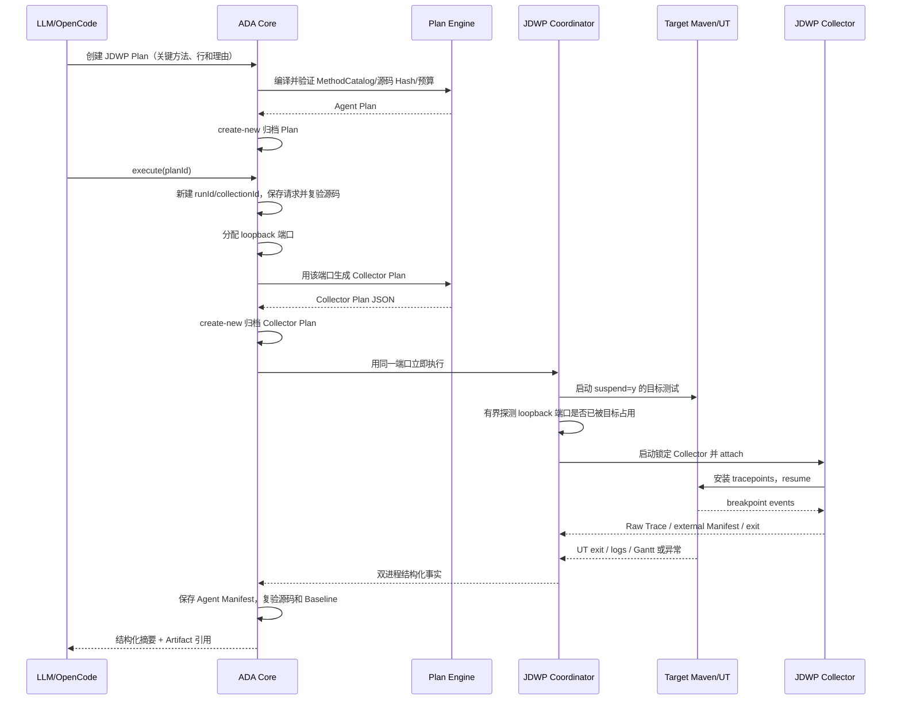

# P3 JDWP 动态采集集成可实施详细设计

> **修订说明（2026-08-18）：** JDWP 采集流程和每个 tracepoint 的 `SourceAnchor` 继续有效；全模块
> `sourceFingerprintSha256` 与采集前后源码扫描由 ADR-010 删除，详见 Context/CodePath 精简设计。
>
> **修订说明（2026-08-19）：** 当前开发阶段将 JDWP Collector 作为通过
> `ADA_JDWP_COLLECTOR_JAR` 配置的本地 JAR 使用。Agent 仍验证文件存在、监管进程并保留结构化失败，
> 但不再锁定或校验 JAR SHA-256；Manifest v2 已删除 `toolSha256`。本文后续“锁定 Collector”均只表示
> 已验证的 CLI/Plan 能力边界，不表示 JAR 数字指纹锁定。

- 文档状态：Implemented（P3 release audit complete）
- 设计版本：1.7
- 创建日期：2026-08-18
- 负责人：Codex / 项目维护者
- 目标里程碑：P3 — JDWP Integration
- 关联需求：在 CodePath 已定位关键方法后，按计划采集方法内部运行时状态，并归档到同一 Case
- 关联架构与决策：
  - `docs/architecture/algorithm-debug-agent-module-detailed-design-v1.md`
  - `docs/architecture/jdwp-mcp-collector-refactoring-design-and-usage.md`
  - `docs/architecture/jdwp-collector-p0-performance-hardening-design.md`
  - `docs/architecture/tool-validation-baseline.md`

## 1. 背景与问题

P1 已能从目标 UT 建立带源码 Hash 的静态方法目录，P2 已能按照 CodePath 计划采集实际方法路径。下一步需要在
大模型认为路径证据仍不足时，对一个或少量关键方法内部的调用栈和局部变量进行 JDWP 动态采集。

外部 `mcp-jdwp-java` Batch Collector 在 commit `1ef7d22` 已验证可用，但当前能力边界是：

- 支持断点行、可选方法名、每点最大命中、调用栈、全部可见局部变量和有界对象展开；
- 支持 `maxEvents`、`idleTimeoutMillis`、`maxFrames/maxDepth/maxItems/maxStringLength`；
- 不支持局部变量白名单、字段路径投影、命中采样、Raw Trace 总字节硬限制和异步 Writer；
- attach 失败不会自动重试，成功运行结束后才写外部 Manifest，且其中包含绝对路径。

因此 P3 不能把 Collector P0 目标能力伪装成当前能力，也不能让大模型直接拼接进程命令。首版采用“能力如实、
预算保守、失败保留、Baseline 门禁”的适配方案，先完成 Agent 内的可用闭环；Collector P0 是后续独立里程碑。

## 2. 目标与非目标

### 2.1 目标

- 大模型可以基于 CodePath、静态目录和问题提出 1～5 个 JDWP tracepoint，并说明采集理由。
- Agent 确定性验证 `caseId/contextId/analysisId`、目标 UT、方法身份、源码文件 Hash 和断点行。
- Agent 只生成锁定 Collector 当前支持的 JSON Plan；不支持字段必须明确拒绝。
- 目标 Maven/UT JVM 与 Collector 由 Agent 双进程协调，JDWP 只绑定 `127.0.0.1` 临时端口。
- 无论成功、目标失败、attach 失败、超时还是 Agent 失败，都追加保存请求、计划、日志和 Manifest。
- 采集后执行与 P2 相同的源码漂移和无采集 Baseline 一致性门禁。
- 真实 Wafer Demo 单点采集 Smoke 通过，且根项目测试保持通过。

### 2.2 非目标

- 本阶段不修改或 fork 外部 `mcp-jdwp-java` 源码。
- 本阶段不支持局部变量白名单、字段路径投影、采样、条件表达式或远程 JDWP。
- 本阶段不对 Raw JDWP JSONL 做领域解释；流式规范化和证据充分性属于 P4。
- 本阶段不自动决定根因；LLM 继续负责选择是否采集、采集哪些位置和解释证据。
- 本阶段不接管目标生产调度，不修改目标算法生产源码。

## 3. 现状与约束

- 外部 Collector：已验证 commit `1ef7d2248420189f45321bbbcf113e019fd30ab7`，MIT；当前执行从
  `ADA_JDWP_COLLECTOR_JAR` 读取本地 JAR，不把其 SHA-256 写入 `config/toolchain-lock.json`。
- 现有 `debug-harness/ExternalProcessRunner` 是阻塞式单进程接口，不能协调 suspended UT 和 Collector。
- Maven/Surefire 通过结构化 `TestLaunchSpec.jvmArguments` 注入 `-agentlib:jdwp`，不得拼接 shell 命令。
- Collector 的 `locals=true` 表示全部可见局部变量，不是 allowlist；默认必须使用更小命中和对象预算。
- Collector 当前没有 Raw Trace 字节硬截止。Agent 在执行前用最坏情况成本拒绝高风险计划，执行中保存文件大小
  和超限事实；超出 Agent 上限时终止进程并标记 `TRUNCATED/UNUSABLE`，不得用于确认性结论。
- 每次执行新建 `runId/collectionId`，历史计划和采集结果不可覆盖。

## 4. 用例与验收标准

| 用例 | 输入/前置条件 | 预期结果 | 验证层级 |
|---|---|---|---|
| 栈采集 | CodePath 已定位一个方法 | 生成单点计划，采集 stack，不采 locals | Unit/Integration |
| 有界局部变量 | 明确需要方法内部值 | `locals=true`，严格限制 hits/frames/depth/items/string | Contract/Smoke |
| 源码发生变化 | Plan 保存后用户修改目标源码 | 执行前拒绝，保存失败 Manifest，不启动 Collector | Integration |
| 非法断点行 | 行号不在方法 SourceAnchor 范围 | Plan 编译失败 | Unit |
| 不支持能力 | 请求变量白名单、projection 或 sampling | 明确 `JDWP_UNSUPPORTED_CAPABILITY`，不静默降级 | Contract |
| attach 前目标失败 | Maven 编译或测试 JVM 启动失败 | 保存目标日志和失败 Manifest，无遗留进程 | Integration |
| Collector attach/运行失败 | Collector 非零退出 | 终止 suspended 目标进程树，保留全部日志 | Fault injection |
| 采集后目标异常 | UT 抛业务异常或断言失败 | 保存异常、Trace、Gantt（如有），不导致 Agent 崩溃 | Integration |
| Baseline 变化 | 采集运行的 Gantt 语义 Hash 不同 | `evidenceUsable=false` | Integration |
| 正常闭环 | Collector 和 UT 都正常退出 | Raw Trace、Agent Manifest、Baseline Check 和摘要完整 | E2E/Smoke |

## 5. 总体方案

```mermaid
flowchart LR
    LLM["OpenCode 大模型"] --> REQ["JDWP 采集意图"]
    REQ --> COMP["JdwpPlanCompiler\n源码和能力校验"]
    COMP --> APLAN["归档 Agent Plan"]
    APLAN --> PORT["分配 loopback 临时端口"]
    PORT --> CPLAN["生成并归档 Collector Plan"]
    CPLAN --> COORD["同一端口创建 ExecutionRequest\n并立即执行"]
    COORD --> TARGET["Maven / Surefire 目标 UT\nsuspend=y, loopback"]
    COORD --> COLLECTOR["锁定 JDWP Batch Collector"]
    TARGET --> COLLECTOR
    COLLECTOR --> RAW["raw/jdwp.jsonl"]
    TARGET --> RESULT["UT 日志 / Gantt / 异常"]
    RAW --> MANIFEST["Agent JdwpManifest"]
    RESULT --> BASELINE["源码与 Baseline 门禁"]
    MANIFEST --> SUMMARY["CollectionExecutionSummary"]
    BASELINE --> SUMMARY
```



采用该方案的原因：它不要求先修改外部仓库，能够尽快验证 Agent 的真实 JDWP 闭环，同时不虚构尚未实现的精细
采集能力。采集端限制不足由保守计划、运行时监管和证据不可用门禁共同控制，但它们不替代后续 Collector P0。

## 6. 模块与类设计

| 模块/类 | 职责 | 输入 | 输出 | 依赖 |
|---|---|---|---|---|
| `ada-contracts/JdwpCollectionPlan` | 版本化 Agent 计划和身份 | Tracepoints、预算、理由 | 不可变计划 | contracts |
| `ada-contracts/JdwpTracepointSpec` | 方法 SourceAnchor、断点行、maxHits | 静态目录条目 | 单点规格 | contracts |
| `ada-contracts/JdwpCaptureSpec` | 当前真实支持的 capture 参数 | locals/stack/limits | 有界捕获规格 | contracts |
| `ada-contracts/JdwpCollectionRecord` | 执行前保存 run/collection 身份 | Case/Plan IDs | 追加式请求 | contracts |
| `ada-contracts/JdwpCollectionManifest` | Agent 可信 Manifest | 进程事实、计数、相对路径 | 版本化 Manifest | contracts |
| `debug-plan-engine/JdwpPlanRequest` | LLM 意图输入 | 方法 key、行、capture、理由 | 编译请求 | contracts |
| `debug-plan-engine/JdwpPlanCompiler` | 校验源码锚点、能力和成本 | MethodCatalog + request | Agent Plan | contracts |
| `debug-plan-engine/CollectorDebugPlanWriter` | 生成外部精确 JSON | Agent Plan + port | `collector-plan.json` | Jackson |
| `debug-harness/ManagedProcessRunner` | 启动、异步排日志、等待和终止一个进程树 | argv/目录/预算 | ManagedProcess | JDK |
| `debug-harness/ManagedProcess` | 表达唯一进程所有权和幂等关闭 | Process + log pumps | 完成事实 | JDK |
| `jdwp-collector-adapter/LoopbackPortAllocator` | 在应用服务生成 Collector Plan 前，仅从 loopback 临时分配端口 | 无 | port | JDK |
| `jdwp-collector-adapter/JdwpTargetCommandFactory` | 向 Adapter 启动规格注入 JDWP JVM 参数 | TestLaunchSpec + port | argv/spec | harness/adapter-sdk |
| `jdwp-collector-adapter/JdwpCollectorCommandFactory` | 构造锁定 Collector argv | JAR/plan/output | argv | JDK |
| `jdwp-collector-adapter/JdwpCollectionCoordinator` | 使用请求中已归档的同一端口，协调目标、就绪、Collector、退出和清理 | execution request（含 port） | collection result | harness |
| `case-management/CaseArchiveRepository` | 新增 JDWP plan/request/manifest 追加读写 | contracts | Case 路径 | contracts |
| `ada-core/JdwpCollectionApplicationService` | 源码、执行、Gantt、Baseline 和摘要编排 | Case + plan | ToolResponse facts | 上述模块 |
| `algorithm-debug-cli` | `plan jdwp create`、`collection jdwp execute` | JSON/参数 | ToolResponse 2.0 | core |

`ManagedProcess` 的资源所有权必须单一：创建者负责在成功、失败、中断和超时路径关闭日志泵并清理完整后代树。
该抽象只解决外部进程生命周期，不包含 JDWP 语义。

## 7. 数据与契约设计

### 7.1 Agent JDWP Plan v2

必填身份：`schemaVersion/planId/caseId/contextId/analysisId/targetTest/createdAt`。不再保存全模块源码指纹；
每个 tracepoint 仍必须携带并校验精确 `SourceAnchor`。

每个 tracepoint 必须包含：

- `tracepointId`：计划内唯一；
- `methodKey` 和完整 `SourceAnchor`；
- `line`：必须在 `startLine..endLine` 内；
- `maxHits`：默认 3，硬上限 20；
- `capture.locals/stack/maxFrames/maxDepth/maxItems/maxStringLength`。

首版 Plan 不定义 `localVariables/projection/sampling` 可执行字段。CLI 收到这些未知字段时使用严格 JSON 解析并拒绝，
错误码为 `JDWP_UNSUPPORTED_CAPABILITY`。这样以后新增字段需要 Schema 次版本演进，而不是改变旧字段含义。

### 7.2 Collector Plan

`CollectorDebugPlanWriter` 生成私有 DTO，字段与 commit `1ef7d22` 的 `DebugPlan` 精确一致：

```text
sessionId, target.host, target.port, resumeOnAttach,
idleTimeoutMillis, maxEvents,
tracepoints[id,className,line,methodName,maxHits,capture]
```

`target.host` 固定 `127.0.0.1`，`resumeOnAttach=true`。Collector Plan 也归档，Agent Manifest 保存其 SHA-256。

### 7.3 归档布局

```text
cases/<caseId>/collections/<collectionId>/
├── collection-request.json
├── collector-plan.json
├── manifest.json
├── raw/
│   ├── jdwp.jsonl
│   ├── collector-manifest.json
│   └── gantt.json                 # 若目标产生
├── validation/
│   └── baseline-check.json
└── logs/
    ├── target-stdout.log
    ├── target-stderr.log
    ├── collector-stdout.log
    └── collector-stderr.log
```

外部 Manifest 原样只读保存为 Raw Artifact；面向 Agent/LLM 的 `manifest.json` 不复制绝对路径，只保存 Case 相对路径、
Hash、大小、工具身份、阶段、退出事实、完成原因、tracepoint 命中和截断/失败诊断。
Agent 按 Collector 1.0 的完整 Manifest 契约严格读取 `target/plan/trace/startedAt/finishedAt` 等字段，并校验
`schemaVersion/sessionId/loopback host/本次 port/tracepoint key/计数/时间顺序`；外部绝对路径只保留在隔离 Raw 中。

## 8. 核心流程



目标就绪不使用主动 TCP 连接，避免探测连接干扰 JDWP 握手。真实 Surefire 验证表明：测试 JVM 在
`suspend=y` 阶段已经监听 loopback 端口，但 JDK listening 提示不会稳定转发到 Maven stdout/stderr；Windows 的
`ProcessHandle.Info` 也不保证提供后代命令行。因此 Coordinator 有界尝试把临时 `ServerSocket` 绑定到本次已分配的
`127.0.0.1:<port>`：仍可绑定表示目标尚未监听；出现 `BindException` 表示端口已被占用，随后才启动 Collector。
该探测不建立连接、不发送 JDWP 握手，也不扫描无关系统进程。目标存活但端口被其他进程抢占的极短竞态仍会由
Collector attach 失败结构化暴露。就绪超时或目标提前退出时不启动 Collector。Collector 一旦启动失败或非零退出，Coordinator 立即清理目标
Maven 进程及其完整子进程树，防止 suspended JVM 遗留。正常情况下同时等待 Collector 和目标完成，任何一侧超过
独立预算都进入有界终止。

端口分配必须发生在 Collector Plan 写出之前。`JdwpCollectionApplicationService` 分配端口后立即用该端口生成并
create-new 归档 Collector Plan，再把同一端口放入 `JdwpExecutionRequest`。Coordinator 不得重新分配或替换端口；
Collector CLI 的 `--port` 仅用于与已归档 Plan 显式保持一致，不能用来掩盖 Plan 中的不同端口。临时端口关闭与目标
JVM 实际绑定之间仍存在很短的竞争窗口，启动失败必须结构化报告且不得无界重试。

## 9. 错误处理与可观测性

- `JDWP_PLAN_SOURCE_DRIFT`：源码 Hash 或目录身份变化；
- `JDWP_UNSUPPORTED_CAPABILITY`：请求当前 Collector 不支持的字段；
- `JDWP_TARGET_START_FAILED/JDWP_TARGET_NOT_READY`：目标未启动或未出现监听标记；
- `JDWP_COLLECTOR_START_FAILED/JDWP_ATTACH_FAILED/JDWP_COLLECTOR_FAILED`；
- `JDWP_COLLECTION_TIMED_OUT/JDWP_PROCESS_TREE_CLEANUP_FAILED`；
- `JDWP_RAW_LIMIT_EXCEEDED/JDWP_MANIFEST_INVALID`；
- `JDWP_ARCHIVE_FAILED`：Agent 捕获或持久化失败，保留 cause。

Manifest 的 `stage` 至少区分：`REQUEST_ARCHIVED/SOURCE_VALIDATED/TARGET_STARTED/TARGET_READY/
COLLECTOR_STARTED/ATTACHED_OR_RESUMED/PROCESS_COMPLETED/BASELINE_CHECKED`。不能仅凭 Collector stdout 推断 attach 已成功；
`collector_started` Raw 生命周期事件或有效外部 Manifest才可证明 Collector 已进入执行阶段。

## 10. 性能与容量预算

| 指标 | 默认值 | 硬上限 | 超限行为 | 验证方法 |
|---|---:|---:|---|---|
| tracepoint 数 | 1～5 | 20 | 拒绝计划 | Contract |
| 每点 maxHits | 3 | 20 | 拒绝计划 | Contract |
| Collector maxEvents | 100 | 1,000 | 拒绝计划 | Contract |
| maxFrames | 8 | 64 | 拒绝计划 | Unit |
| maxDepth | 1 | 2（P0 前） | 拒绝计划 | Unit/Smoke |
| maxItems | 20 | 100 | 拒绝计划 | Unit |
| maxStringLength | 256 | 1,024 | 拒绝计划 | Unit |
| Raw Trace | 16 MiB | 50 MiB | 终止并标记不可用 | Integration |
| target ready | 30 s | 120 s | 清理目标 | Fault injection |
| 总采集时间 | 5 min | 20 min | 清理两进程树 | Integration |

`locals=true` 时编译器进一步限制：tracepoint 不超过 5、每点 `maxHits<=5`、`maxDepth<=2`、预算估算不得超过
Agent 阈值。估算只用于拒绝明显危险计划，不能声明为实际字节保证。

## 11. 安全、隐私与无侵入性

- 不修改目标源码；仅对本次 Surefire fork 注入 JDWP 参数。
- host 固定为 `127.0.0.1`，拒绝调用方提供 host；端口只在本次运行存活。
- 所有 argv 使用 `ProcessBuilder(List<String>)`，不经过 Shell。
- Raw locals 可能包含敏感业务数据，只保存在本地 Case，摘要不内联无界对象或原始绝对路径。
- 失败路径优先清理目标进程，不能让 suspended JVM 长期存活。
- 记录 Collector 版本、commit 和 MIT 许可证；Doctor 在执行前检查配置路径是否为普通文件。

## 12. 测试设计

### 12.1 单元测试

- `JdwpCollectionPlanTest`：身份、数量、行、预算、不可变集合和严格能力边界。
- `JdwpPlanCompilerTest`：源码漂移、未知方法、重复点、越界行、locals 保守预算。
- `CollectorDebugPlanWriterTest`：确定性 JSON、loopback、字段与外部示例等价。
- `JdwpCommandFactoryTest`：无 shell、JDWP 参数、JAR/plan/output 参数。
- `ManagedProcessRunnerTest`：异步日志、超时、中断、幂等关闭和后代清理。
- `LoopbackPortReadinessProbeTest`：区分端口仍可绑定、已被占用、目标提前退出和等待超时。
- `JdwpCollectionCoordinatorTest`：目标提前退出、真实 JDWP loopback 端口就绪、就绪超时、Collector 失败和双成功。

### 12.2 契约与兼容性测试

- `jdwp-plan-v2.schema.json` 和 `jdwp-manifest-v2.schema.json` 的正反例。
- Agent Plan 编译所得 JSON 由锁定 Collector 的 `DebugPlan.validate()` 验证。
- 未知 `projection/sampling/localVariables` 字段严格拒绝。

### 12.3 集成与端到端测试

- 本地最小 Java Fixture：成功、业务异常、断言失败、attach 失败、超时和无监听标记。
- Wafer Demo 真实单 tracepoint Smoke：Raw 命中、局部变量有界、无进程遗留。
- 有无采集 Gantt normalized JSON SHA-256 一致；源码修改和结果变化均令证据不可用。

### 12.4 性能测试与 Agent Eval

- 先记录当前 Collector MVP 的小计划耗时、Raw 字节和目标暂停影响，不宣称支持 100k 事件。
- 大型/100k 事件测试延后到 Collector P0 完成后；P3 门禁只验证保守预算不会失控。
- Eval 覆盖模型能区分“需要 JDWP”“已有证据足够”和“Collector 能力不支持”。

## 13. 实施步骤

1. TDD 定义 JDWP Plan/Record/Manifest 契约、Schema、严格能力边界和工具锁。
2. TDD 实现 SourceAnchor 到 Collector JSON 的确定性编译，并用外部 `DebugPlan.validate()` 做兼容测试。
3. TDD 增加 `debug-harness` 异步受管进程能力；审计所有超时、中断和清理路径。
4. TDD 实现 loopback 端口、目标命令、Collector 命令和双进程 Coordinator。
5. TDD 扩展 Case/Core/CLI，归档全部产物并复用源码/Baseline 门禁。
6. 执行真实 Smoke、受影响模块测试、根项目测试、代码审计和修复；确认后分阶段提交。

每一步先写失败测试，生产实现只做到当前验收条件，不提前实现 P4 Normalizer 或 Collector P0。

## 14. 兼容、迁移与回滚

- 新增 Schema，不改变 CodePath v1 和现有 Case 目录含义。
- `CollectionExecutionSummary` 优先复用；若现有字段不能准确表达 JDWP，只做向后兼容新增版本，不偷换语义。
- 新命令是增量入口，旧 CLI 不变。
- 回滚 Agent P3 不会破坏已有 Case；未识别的 JDWP Artifact 仍作为不可变文件保留。

## 15. 风险与待确认事项

| 风险/问题 | 影响 | 缓解措施 | 状态 |
|---|---|---|---|
| 当前 Collector 采集全部 locals | 输出和暂停可能较大 | 默认 stack-only；locals 使用小 hits/depth/items | Accepted for P3 |
| Collector 无字节硬截止 | Raw 可能超过预算 | 保守编译、文件监控、超限终止、证据不可用 | Open until P0 |
| 临时端口关闭后存在竞争窗口 | 其他进程可能抢占 | loopback、短窗口、启动失败结构化报告 | Accepted |
| Collector 失败时目标仍 suspended | UT/子进程残留 | Coordinator finally 清理完整目标进程树 | Must close in audit |
| Surefire 不转发 suspended JVM 的 listening 日志 | 旧就绪检测必然超时 | 不连接目标；有界检查本次 loopback 端口是否仍可绑定 | Resolved in 1.4 |
| 外部 Manifest 含绝对路径 | LLM 泄漏本机路径 | Raw 隔离；Agent Manifest 仅相对路径 | Resolved by design |

## 16. 文档同步清单

- [x] P3 详细设计与 Mermaid 流程
- [x] JDWP Schema 与示例
- [x] `config/toolchain-lock.json` 和 `config/collection-limits.yaml`
- [x] 架构模块详细设计与工具验证基线
- [x] README/CLI 使用说明
- [x] OpenCode Skill 的 JDWP 采集决策指引
- [x] Eval Case（P3 Golden fixture；P8 EvalRunner 尚未实现）

## 17. 实现完成记录

- 实际变更：P3 Task 1～5 已实施，包括版本化契约/Schema、SourceAnchor 计划编译、异步受管进程、loopback
  端口、目标/Collector 双进程协调、工具 Hash/Plan 端口预检、Raw 字节监控，以及 Case/Core/CLI
  的追加式 Plan/Collection 归档流。Task 6 的 Wafer 真实 Smoke、最终文档/Eval 和发布审计仍待完成。
- 相对设计的偏差：实现中发现 Collector Plan 在端口分配前归档会造成计划与实际 argv 不一致，已按 1.1 版改为
  应用服务先分配端口、再生成/归档 Plan，并由 Coordinator 校验同一端口后立即执行。
- 测试与命令：`mvn test` 全部 21 个模块通过（原有条件式 Wafer Smoke 跳过）；显式指定锁定 Collector JAR 的
  `mvn -pl jdwp-collector-adapter -am -Djdwp.collector.jar=... test` 通过 17 个 Adapter 测试和全部上游测试。
- 性能结果：最小真实 Smoke 命中 1 个 tracepoint，写出 3 个生命周期/命中事件、Raw 963 字节；仅作为功能基线，
  不代表大型算法性能结论。
- Task 5 行为：`plan jdwp create` 只接受严格、有限的 JSON 请求；`collection jdwp execute` 在任何进程
  副作用前保存请求，再保存带本次 loopback 端口的 Collector Plan。成功、UT 断言/业务失败、attach
  失败和源码漂移均保留结构化 Manifest/Baseline；Gantt 变化或源码漂移会令证据不可用于确认根因。
- Task 5 产物：完整 Agent Plan、Collector Plan、Raw JDWP JSONL、外部/Agent Manifest、目标/Collector
  四份日志、可选 Gantt 和 Baseline 检查均通过 Case 相对 Artifact 引用暴露，Raw 内容不内联到 ToolResponse。
- 已知限制：无变量白名单、字段投影、采样和 Collector 内部字节硬限制；这些能力仍属于后续 Collector P0。
- 真实 Wafer Smoke：无采集参考 Run `run-4e74e36c-4353-45dc-a352-1187b5040205`；JDWP Run
  `run-63fde929-5006-48b0-a5bf-1c84e87b7d96`、Collection
  `collection-1068791c-3cbc-49ff-a579-be63be5cc6dc`。单点 `scheduleWafer:81` 命中 3 次，5 个总事件，
  Raw 4,610 bytes，目标/Collector 退出码均为 0，Baseline `MATCHED`，`evidenceUsable=true`，无遗留进程。
- Task 6 门禁：根项目 21 模块 `mvn test` 成功；显式锁定 JAR 的 JDWP Adapter 测试 19 项通过且真实
  Collector Smoke 零跳过；22 个 JSON Schema、5 个 P3 Golden Eval Case 和 11 个 OpenCode Adapter
  测试通过。Golden fixture 只验证决策契约，不宣称当前已完成模型质量评测。
- 提交/版本：Task 1 `8a46f93`、Task 2 `7b36b40`、Task 3 `5472d8f`、Task 4 `ce6b30c`、
  Task 5 `6cb934a`；Task 6 审计修复与完成记录单独提交。

## 18. 变更记录

| 日期 | 版本 | 变更内容 | 作者 |
|---|---|---|---|
| 2026-08-18 | 1.0 | 明确以能力如实、保守预算方式集成当前 Collector MVP | Codex |
| 2026-08-18 | 1.1 | 明确端口先于 Collector Plan 分配和归档，Plan、argv 与 Manifest 必须使用同一端口 | Codex |
| 2026-08-18 | 1.2 | 记录 Case/Core/CLI 追加式执行流、外部 Manifest 校验和 Baseline 证据门禁实现 | Codex |
| 2026-08-18 | 1.3 | 真实 Wafer Smoke 发现 Surefire 不转发 suspended JVM listening 提示；就绪判定改为受管后代命令行精确匹配 | Codex |
| 2026-08-18 | 1.4 | Windows 验证发现 ProcessHandle 不保证暴露后代参数；改用不建立连接的 loopback 端口绑定探测 | Codex |
| 2026-08-18 | 1.5 | 真实 Collector Manifest 契约补齐 target、路径和时间字段，并增加本次 loopback endpoint 校验 | Codex |
| 2026-08-18 | 1.6 | 后处理或外部 Manifest 校验失败时，失败归档继续保留已观察到的目标/Collector 启动与退出事实 | Codex |
| 2026-08-18 | 1.7 | 外部 Manifest 即使无效，也先把 Raw Trace/Manifest 移入规范只读路径，再执行严格校验并报告 Agent 失败 | Codex |
| 2026-08-19 | 2.0 | 删除 JDWP Collector JAR 数字指纹门禁，Manifest v2 删除 `toolSha256`；保留文件预检、版本记录、进程监管与结构化失败 | Codex |
