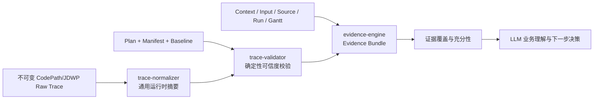
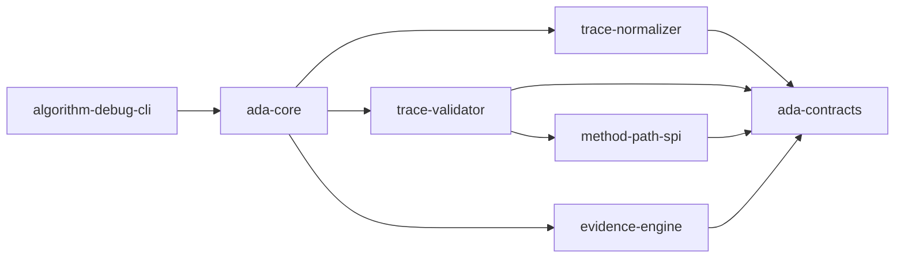
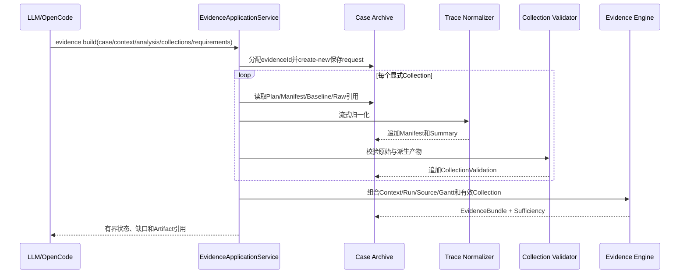

# P4 通用运行时证据管线可实施详细设计

- 文档状态：Approved for Implementation
- 设计版本：0.2
- 创建日期：2026-08-18
- 负责人：Codex / mh90901119-oss
- 目标里程碑：P4 — Normalize, Validate and Build Evidence
- 关联需求：将 CodePathTracer 与 JDWP Raw Trace 转换成大型算法可用、可校验、可供大模型按需读取的通用证据
- 关联架构与 ADR：
  - `docs/architecture/algorithm-debug-agent-module-detailed-design-v1.md`
  - `docs/designs/2026-08-18-p1-p8-debug-agent-completion-design.md`
  - `docs/designs/2026-08-18-p3-jdwp-integration-design.md`
  - `docs/decisions/ADR-009-generic-runtime-evidence-before-domain-mapping.md`

## 1. 背景与问题

P2 已经能够按计划运行 CodePathTracer，并追加保存包级采集超集、关键方法过滤结果、Manifest、日志、
目标结果和 Baseline 检查。P3 已经能够按 Source Anchor 计划协调目标 Maven/UT 与 JDWP Collector，保存
调用栈、可见局部变量、Raw JSONL、双进程事实、Manifest、日志和 Baseline 检查。

这两条链路目前仍只输出工具事实。大模型如果直接读取 Raw JSONL，会遇到三个问题：

1. 大型算法 Trace 可能达到数十 MiB 或数十万事件，不能整体进入模型上下文；
2. Raw 工具格式缺少统一的 Case 身份、来源定位、完整性结论和证据覆盖信息；
3. 早期设计把 `candidate_selected`、`schedule_committed` 等 Wafer 领域概念写入通用 Normalizer，
   无法适配业务模型完全不同的公司算法。

P4 必须把 Raw Trace 确定性整理成通用运行时事实，同时保留原始数据、精度限制、截断、失败和 Baseline
状态。P4 不替代大模型理解算法业务，也不把工具成功错误地提升为根因已经确认。

## 2. 目标与非目标

### 2.1 目标

- 流式读取 CodePathTracer 与 JDWP JSONL，不把完整 Raw Trace 或无界单行载入内存；
- 输出通用的方法路径摘要、JDWP 命中/栈/局部值摘要和精确 Raw Provenance；
- 确定性校验 Artifact、Schema、身份、Hash、计划、Manifest、源码、截断和 Baseline 一致性；
- 将输入、源码、目标结果、方法路径、运行时状态和校验结论组织为有界 Evidence Bundle；
- 根据调用方声明的证据维度输出 `SUFFICIENT/INSUFFICIENT/CONTRADICTED`，并列出缺口；
- 支持同一 Case、同一 Context 下跨 Analysis 显式复用历史 Collection；
- 支持 Normalizer/Validator 版本升级后从不可变 Raw Trace 重新派生，不覆盖旧结果；
- 为大型算法提供记录数、单记录字节、摘要条目和输出字节预算；
- 通过稳定 CLI 返回小型结构化摘要和 Case 相对 Artifact 引用，不内联 Raw Trace。

### 2.2 非目标

- 不生成 Wafer、Candidate、Chamber、Resource 等固定领域事件；
- 不自动判断业务根因、算法正确性或调度策略含义；
- 不实现字段级 Gantt Diff；Gantt 仍使用 JSON 内容指纹和原始 Artifact；
- 不修改目标算法源码、UT、POM 或生产配置；
- 不修改或 fork CodePathTracer、JDWP Collector；
- 不在 P4 补齐 JDWP local allowlist、字段投影、采样或 Collector 内部字节硬截止；
- 不建设通用领域规则引擎、图数据库、向量数据库或复杂 Case 状态机；
- 不让 `LLM_HYPOTHESIS` 满足任何确定性证据维度。

## 3. 现状与约束

- `trace-normalizer`、`trace-validator`、`evidence-engine` 当前只有 Maven 模块骨架；
- CodePath Raw 事件包含 `eventId/eventType/depth/threadName/className/methodName`，descriptor 可能缺失；
- P2 过滤结果只保留计划方法，因而只能形成“最近保留祖先”，不能宣称完整直接调用边；
- JDWP Raw v1 生命周期事件与 `tracepoint_hit` 均包含 `sequence/timestamp/eventType`；命中事件包含
  `thread/location/frames`，顶层 frame 可以包含 `locals` 和 `this`；
- JDWP 值可能包含 `$type/$id/$cycle/$truncated/$remaining/$remainingFields/$collected/$error`；
- 当前 JDWP `locals=true` 表示全部可见局部变量，P4 的后处理不能降低采集发生时的暂停和读取成本；
- P2/P3 单次 Raw 硬上限均为 50 MiB，P4 不接受更大的输入；
- 当前目标范围为 Java 21、Maven、JUnit 5 和已登记的独立算法模块；
- 原始 Artifact write-once；派生产物也必须以新的 `evidenceId` 追加，禁止覆盖；
- `MethodPathManifest` 属于稳定 `method-path-spi`，JDWP Agent Manifest 属于 `ada-contracts`；
  P4 可以依赖 SPI/契约，但不能依赖两个 Collector 的实现模块或外部工具 DTO。

## 4. 用例与验收标准

| 用例 | 输入/前置条件 | 预期结果 | 验证层级 |
|---|---|---|---|
| CodePath 正常归一化 | 平衡 enter/exit、多个线程 | 输出方法统计、最近保留祖先路径、精度与 Raw 行引用 | Unit/Contract |
| CodePath 不完整 | 未配对 exit、EOF 时仍有 enter | 保留可观察事实并输出 anomaly；不得伪造平衡调用树 | Unit |
| descriptor 缺失 | Manifest 为 `CLASS_METHOD_SUPERSET` | 摘要继续披露降级精度 | Unit |
| JDWP 栈采集 | stack-only 命中 | 输出 tracepoint、thread、location、frames 和 sequence 引用 | Unit/Contract |
| JDWP locals 采集 | primitive/String/object/array/cycle | 输出有界通用值路径、类型、预览和 Collector 限制标记 | Unit |
| 单行过大或非法 JSON | 超过记录上限或解析失败 | Raw 保留；写失败 Manifest，不生成伪造 Summary | Fault injection |
| Artifact 被修改 | 文件 SHA/size 与引用不一致 | Validation=`INVALID`，禁止确认性使用 | Unit/Integration |
| 采集被截断 | Manifest 或派生摘要截断 | Validation=`INCONCLUSIVE`，仍可供诊断 | Unit |
| 同 Context Baseline 改变 | baseline-check=`CHANGED` | Validation=`CONTRADICTED` | Integration |
| 跨 Context 结果改变 | 引用旧 Context 作为比较证据 | 保留历史变化事实，但不能覆盖当前 Context 动态证据 | Unit/Integration |
| 多轮复用 | 当前 Analysis 引用同 Context 旧 Collection | Bundle 合法引用，不重新运行 UT | Integration |
| 证据不足 | 要求 `RUNTIME_STATE` 但无有效 JDWP | `INSUFFICIENT` 并返回该缺口 | Unit/Eval |
| 大型 Trace | 1,000,000 CodePath 事件或 50 MiB 边界输入 | 有界内存、输出受限、超限行为确定 | Performance |

## 5. 总体方案



P4 采用“通用结构化摘要 + 原始产物引用 + 确定性门禁”。Normalizer 只解释工具结构，不解释算法业务；
Validator 只判断证据技术可信度；Evidence Engine 只组织证据和覆盖维度。大模型根据源码、知识、用户问题和
这些事实解释业务原因，并决定是否生成下一轮采集计划。

被否决方案：

1. **通用核心内生成 Wafer 领域事件**：当前 Demo 更直观，但耦合业务字段，无法复用到其他算法；
2. **只校验 Manifest，Raw Trace 直接交给模型**：实现少，但上下文、稳定性和审计性不满足产品要求；
3. **首版建设可配置任意领域 Mapping DSL**：灵活但规则、Schema 和安全面过大，当前没有真实第二算法验证。

## 6. 模块与类设计

| 模块/类 | 职责 | 输入 | 输出 | 依赖 |
|---|---|---|---|---|
| `ada-contracts/EvidenceId`（已存在） | Case 内不可变 Evidence 构建身份 | opaque string | ID | contracts |
| `ada-contracts/TraceProvenance` | 定位 Raw Artifact 与事件 | Artifact ref、line、sequence/eventId | provenance | contracts |
| `ada-contracts/NormalizationManifest` | 记录输入、版本、预算、状态和失败 | Raw/Plan refs | manifest | contracts |
| `ada-contracts/MethodPathSummary` | 通用方法统计、保留路径和异常 | CodePath Raw | summary | contracts |
| `ada-contracts/JdwpSnapshotSummary` | 通用命中、栈和有界值事实 | JDWP Raw | summary | contracts |
| `ada-contracts/CollectionValidation` | 统一可信度和 Findings | collection artifacts | validation | contracts |
| `ada-contracts/EvidenceBuildRequest` | 声明 Context、Collections 和要求维度 | IDs、budgets、allowlist | request | contracts |
| `ada-contracts/EvidenceBundle` | 有界证据目录和覆盖 | validated sources | bundle | contracts |
| `ada-contracts/SufficiencyEvaluation` | 充分、不足、矛盾与缺口 | bundle、requirements | evaluation | contracts |
| `trace-normalizer/BoundedJsonlReader` | 字节有界逐记录读取并跟踪行号 | Path、record limit | record stream | JDK/Jackson core |
| `trace-normalizer/MethodPathNormalizer` | 流式聚合方法与保留路径 | plan、manifest、Raw | summary | contracts |
| `trace-normalizer/JdwpSnapshotNormalizer` | 流式提取命中、frames 和通用值路径 | plan、manifest、Raw | summary | contracts |
| `trace-normalizer/DerivedArtifactWriter` | 同目录临时文件、fsync、原子 create-new | DTO/event stream | ArtifactReference | contracts/JDK |
| `trace-validator/ArtifactIntegrityVerifier` | size/SHA/path 边界校验 | Artifact refs | findings | contracts |
| `trace-validator/CollectionEvidenceValidator` | 身份、Schema、计划、截断、源码与 Baseline 规则 | collection + summary | validation | contracts/method-path-spi |
| `trace-validator/ProvenanceVerifier` | 检查 summary 引用的 Raw 行/sequence/eventId | summary + Raw | findings | contracts |
| `evidence-engine/EvidenceBundleBuilder` | 组合同 Context 多轮证据 | request + validations | bundle | contracts |
| `evidence-engine/EvidenceSufficiencyEvaluator` | 确定性检查要求维度 | bundle | evaluation | contracts |
| `ada-core/EvidenceApplicationService` | 分配 Evidence、编排派生/校验/归档 | CLI request | ToolResponse | ports/modules |

模块依赖固定为：



`trace-normalizer` 不依赖 Adapter、Core 或 Collector 实现。P4 首版不新增 `DomainMappingProvider`。

## 7. 数据与契约设计

### 7.1 Schema

新增独立 1.0 Schema：

- `trace/normalization-manifest-v1.schema.json`
- `trace/method-path-summary-v1.schema.json`
- `trace/jdwp-snapshot-summary-v1.schema.json`
- `evidence/collection-validation-v1.schema.json`
- `evidence/evidence-build-request-v1.schema.json`
- `evidence/evidence-bundle-v1.schema.json`
- `evidence/sufficiency-evaluation-v1.schema.json`

所有 Schema 与 Java DTO 做正例、反例、round-trip 和等价约束测试。新增可选字段保持 1.x 兼容；破坏性
结构使用新主版本文件，不覆盖历史 Schema。

### 7.2 通用状态

```text
NormalizationStatus = COMPLETE | PARTIAL | FAILED
EvidenceValidationStatus = VALID | INCONCLUSIVE | CONTRADICTED | INVALID
SufficiencyStatus = SUFFICIENT | INSUFFICIENT | CONTRADICTED
EvidenceDimension = TARGET_OUTCOME | INPUT | SOURCE | METHOD_PATH |
                    RUNTIME_STATE | SCHEDULE_RESULT | VALIDATION
ClaimClassification = CONFIRMED_FACT | VALIDATOR_CONCLUSION | SOURCE_INFERENCE |
                      LLM_HYPOTHESIS | MISSING_EVIDENCE
```

P4 确定性构建器只能生成 `CONFIRMED_FACT`、`VALIDATOR_CONCLUSION` 和 `MISSING_EVIDENCE`。
`SOURCE_INFERENCE` 与 `LLM_HYPOTHESIS` 由后续 Analysis/Reporter 保存，不能反向写入 P4 确定性产物。

### 7.3 Evidence Build Request

应用服务先分配 `evidenceId`，再以 create-new 方式保存请求。请求固定包含：

- `schemaVersion/evidenceId/caseId/contextId/analysisId/createdAt`；
- `collectionIds`：0～16 个用于当前 Context 证据的显式 Collection；
- `comparisonCollectionIds`：0～16 个仅用于历史比较、不能满足当前动态维度的 Collection；
- `requiredDimensions`：1～7 个允许的证据维度；应用服务自动加入 `VALIDATION`；
- `maxSummaryBytes/maxEvidenceBundleBytes`：不得超过本设计第 10 节硬上限。

`collectionIds` 可以引用同 Context 的旧 Analysis，以支持多轮复用；不同 Context 只能进入
`comparisonCollectionIds`。调用方不能通过把动态 Collection 放入 comparison 列表来绕过当前 Context 校验。

目标 UT、输入和本轮 JDWP 已采集运行时值属于用户明确授权的分析范围。P4 不建立敏感字段分类、路径 allowlist、
deny 或自动脱敏规则；它在结构和输出预算内忠实生成 scalar preview、对象字段路径、类型及 Collector 限制标记。
ToolResponse 不内联这些值，只返回 Summary Artifact 引用。

### 7.4 Provenance

每个可引用事实至少包含：

- `caseId/contextId/runId/collectionId`；
- Raw `ArtifactReference` 的 Case 相对路径、SHA-256 和字节数；
- `jsonlLine`；存在时保存 `eventId` 或 `sequence`；
- Normalizer 名称、版本和规则版本；
- 值是否由 Raw 直接观察或由确定性聚合得到。

Normalizer 不复制或修改 Raw 文件。Artifact Hash 不匹配时，Provenance 无效。

### 7.5 MethodPath 摘要语义

- `methods` 保存计划 allowlist 内方法的 enter/exit/count/minDepth/maxDepth；
- `observedPaths` 按线程保存最近保留祖先关系，关系类型固定为 `NEAREST_RETAINED_ANCESTOR`；
- descriptor 缺失时继承 Manifest 的 `CLASS_METHOD_SUPERSET`，不伪装精确重载；
- anomalies 至少覆盖 eventId 逆序/重复、未配对 exit、EOF 未关闭 enter 和非法 depth；
- 过滤后无事件是合法事实，但 Validation 为 `INCONCLUSIVE`，不能证明方法从未执行。

### 7.6 JDWP 摘要语义

- 生命周期事件只用于完整性，不作为算法业务事实；
- 每次命中保留 tracepoint、hit、thread、location、frames 和 Raw sequence；
- 局部值使用通用扁平路径，如 `locals.context.fields.job.fields.jobId`；
- 值事实保存 kind、可选类型、受限 scalar preview 和 Collector 标记；
- `$cycle/$truncated/$remaining/$remainingFields/$collected/$error` 必须原样转成限制事实；
- 不通过字段名猜测 wafer、candidate、resource、score 或其他业务概念。

### 7.7 Evidence 维度来源

- `TARGET_OUTCOME`：身份和 Hash 已校验的 `RunOutcomeSummary`；
- `INPUT`：当前 Context 的完整 `InputSnapshot`、Hash 和可用 Artifact 引用；
- `SOURCE`：完整 Source Snapshot、MethodCatalog 或 Source Anchor Artifact；
- `METHOD_PATH`：`VALID` 的 MethodPath Summary；
- `RUNTIME_STATE`：`VALID` 的 JDWP Snapshot Summary；
- `SCHEDULE_RESULT`：存在 Gantt Artifact 且 Run Result Fingerprint 可校验；
- `VALIDATION`：Bundle 中所有被采用 Artifact 的完整性校验以及所有动态 Collection Validation。

目标 UT 失败时，`TARGET_OUTCOME` 可以由可信失败诊断满足；没有 Gantt 时不能满足 `SCHEDULE_RESULT`，但这不阻止
输入缺失、业务异常或断言失败等问题形成合法 Evidence Bundle。

### 7.8 充分性语义

`SUFFICIENT` 仅表示 `EvidenceBuildRequest.requiredDimensions` 均由同 Context、`VALID` 状态 Evidence 覆盖，
且 Bundle 没有 blocking contradiction。它不表示业务根因已经确认。

- `LLM_HYPOTHESIS` 永远不能满足维度；
- `INCONCLUSIVE/INVALID` Collection 可以进入诊断目录，但不能满足要求维度；
- 旧 Context Evidence 只能标记为历史/比较，不满足当前 Context 的动态维度；
- 同 Context 的旧 Analysis Collection 可以显式复用；
- 调用方不能省略 `VALIDATION` 以绕过 Hash、Baseline 或截断门禁。

### 7.9 归档布局

一次 Evidence 构建先分配 `evidenceId`。重新派生相同 Raw Trace 必须使用新的 Evidence ID：

```text
cases/<caseId>/
  collections/<collectionId>/
    raw/...
    derived/<evidenceId>/
      normalization-manifest.json
      method-path-summary.json       # CodePath 时存在
      jdwp-snapshot-summary.json     # JDWP 时存在
      collection-validation.json
  evidence/<evidenceId>/
    evidence-build-request.json
    evidence-bundle.json
    sufficiency-evaluation.json
```

所有路径使用 create-new 和 Case 相对引用。失败时至少保存 `evidence-build-request.json` 与对应
`normalization-manifest.json`；非法 Raw 不生成 Summary。

## 8. 核心流程



若历史 Evidence 已足够，大模型可以直接读取它，不调用 `evidence build`。若用户修改代码但仍讨论旧数据，
旧 Evidence 继续可读并明确标注旧 `contextId`；若结论需要代表当前代码，必须建立新 Context 并重新取得相应证据。

## 9. 错误处理与可观测性

错误码按阶段分类：

```text
NORMALIZE_INPUT_TOO_LARGE
NORMALIZE_RECORD_TOO_LARGE
NORMALIZE_JSON_INVALID
NORMALIZE_SCHEMA_UNSUPPORTED
NORMALIZE_OUTPUT_BUDGET_EXCEEDED
VALIDATE_ARTIFACT_MISSING
VALIDATE_ARTIFACT_HASH_MISMATCH
VALIDATE_IDENTITY_MISMATCH
VALIDATE_PLAN_HASH_MISMATCH
VALIDATE_SOURCE_DRIFT
VALIDATE_BASELINE_CHANGED
VALIDATE_TRACE_TRUNCATED
VALIDATE_PROVENANCE_INVALID
EVIDENCE_CONTEXT_MISMATCH
EVIDENCE_REQUIREMENT_INVALID
EVIDENCE_ARCHIVE_FAILED
```

- 输入或 Schema 错误不重试；升级 Normalizer 时由新 Evidence ID 显式重放；
- Raw Trace 损坏时保存失败 Manifest，不生成空 Summary 冒充成功；
- Hash/身份/计划矛盾为 `INVALID` 或 `CONTRADICTED`，不能降级成普通 warning；
- 截断、零命中、目标失败或摘要预算截断为 `INCONCLUSIVE`；
- 任何 Agent 归档失败保留 cause，并不改变已存在 Raw Artifact；
- CLI stdout 只返回 ToolResponse；日志不包含 Raw locals、凭据或绝对目标路径。

## 10. 性能与容量预算

| 指标 | 默认值 | 硬上限 | 超限行为 | 验证方法 |
|---|---:|---:|---|---|
| 单个 Raw Trace | 16 MiB | 50 MiB | 读取前拒绝；不生成 Summary | Integration |
| JSONL 单记录 | 1 MiB | 4 MiB | 终止归一化，记录 `RECORD_TOO_LARGE` | Unit/Fault |
| CodePath 事件 | 100,000 | 1,000,000 | 继承采集截断；摘要不可确认 | Performance |
| 方法统计 | 200 | 200 | 超出计划本身非法 | Contract |
| 保留路径关系 | 2,000 | 10,000 | 摘要 PARTIAL | Performance |
| JDWP 命中 | 100 | 1,000 | 超出 Manifest/计划非法或 PARTIAL | Contract |
| 每次命中 frames | 8 | 64 | 超出计划非法 | Contract |
| 通用值事实 | 2,000 | 20,000 | 摘要 PARTIAL | Performance |
| scalar preview | 256 chars | 1,024 chars | 截断并标记 | Unit |
| 单个 Summary | 512 KiB | 4 MiB | PARTIAL，不用于满足相应维度 | Integration |
| Evidence Bundle | 256 KiB | 1 MiB | 相关性截断或构建失败 | Integration |
| ToolResponse | 64 KiB | 256 KiB | 只返回更小摘要和引用 | Contract |

`BoundedJsonlReader` 使用固定字节缓冲与每记录计数；Normalizer 只保留受预算约束的聚合器和当前记录。
性能测试记录事件数、输入/输出字节、耗时和峰值堆，不以单次耗时宣称普遍性能。

## 11. 安全、隐私与无侵入性

- P4 不启动目标进程、不 attach JVM、不修改目标仓库；只读取 Case 内不可变 Artifact；
- Raw locals 默认只保存在本地 Case，不进入 ToolResponse；
- 目标算法 UT、输入和运行时值按产品边界视为本次授权分析数据；P4 不实现内容分类或自动脱敏；
- 值路径只用于说明变量在 JDWP 对象结构中的位置和关联 Raw Provenance，不具有权限或敏感级别语义；
- 所有 Artifact 路径必须是 Case 相对路径，拒绝符号链接逃逸和绝对路径；
- Raw 与派生 Summary 保存在本地 Case；是否允许 OpenCode 使用的模型读取这些已授权分析数据，属于部署环境策略，
  不由 P4 猜测或实现；
- P4 不新增外部运行依赖；Jackson/JUnit 使用父 POM 现有锁定版本和许可证。

## 12. 测试设计

### 12.1 单元测试

- `BoundedJsonlReaderTest`：CRLF/LF、无末尾换行、UTF-8、多字节边界、超大单行、非法编码；
- `MethodPathNormalizerTest`：平衡、未配对、多线程、depth gap、eventId 异常、descriptor 降级和预算；
- `JdwpSnapshotNormalizerTest`：生命周期、命中、stack-only、locals、this、数组、cycle、error 和预算；
- `CollectionEvidenceValidatorTest`：成功、缺文件、Hash、身份、Plan、截断、源码和 Baseline；
- `ProvenanceVerifierTest`：正确行/sequence、越界行、事件不一致和 Raw 修改；
- `EvidenceBundleBuilderTest`：同 Context 多 Collection、跨 Analysis 复用、旧 Context 比较和有界输出；
- `EvidenceSufficiencyEvaluatorTest`：充分、不足、矛盾、无效 Evidence 和 hypothesis 拒绝。

### 12.2 契约与兼容性测试

- 七个 Schema 的正反例、Java round-trip、未知枚举和必填字段；
- Summary 中的 Provenance 必须引用已存在、Hash 一致的 Raw Artifact；
- 旧 Case 没有 `derived/` 或 `evidence/` 子文档时仍可读取；
- P2/P3 v1 Manifest fixture 与 P4 读取器兼容。

### 12.3 集成与端到端测试

- 临时 Case：CodePath Raw -> Summary -> Validation -> Bundle -> Sufficiency；
- 临时 Case：JDWP Raw -> Summary -> Validation -> Bundle -> Sufficiency；
- 组合 CodePath + JDWP + Gantt + Source 的同 Context Evidence；
- 目标断言失败但存在 Gantt、业务异常无 Gantt、Collector 失败和 Baseline 改变；
- CLI `evidence build/inspect` 的 stdout 单 JSON、Artifact 引用和退出码；
- 配置锁定工具时，使用 P2/P3 真实 Wafer 小型 Smoke 产物做非跳过派生验证。

### 12.4 性能测试与 Agent Eval

- 生成 1,000,000 条 CodePath JSONL，验证流式读取、预算和输出上限；
- 生成 1,000 次 JDWP 命中及嵌套值，验证单记录、值事实和 Summary 上限；
- Eval 覆盖 `VALID`、截断、Hash 矛盾、缺 Runtime 和错误假设拒绝；
- P4 Eval 只验证确定性 ToolResponse/Artifact，不宣称在线模型根因正确率。

### 12.5 测试夹具与 Golden 数据

- 使用脱敏、最小化的 P2/P3 Raw JSONL 形状；
- Fixture 不包含真实公司输入、绝对路径或大型 Trace；
- Golden 变更必须说明 Schema/规则版本和行为原因，禁止为通过测试随意更新。

## 13. 实施步骤

1. TDD 新增 P4 DTO、枚举、Schema、正反 fixture 和 Case 路径；
2. TDD 实现有界 JSONL Reader 与 CodePath Normalizer；
3. TDD 实现 JDWP Snapshot Normalizer 和值披露策略；
4. TDD 实现 Artifact/身份/计划/源码/Baseline/Provenance Validator；
5. TDD 实现 Evidence Bundle 与 Sufficiency；
6. TDD 接入 Case Repository、Core 和 `evidence build/inspect` CLI；
7. 执行性能 fixture、可用工具条件下的真实 Smoke、受影响模块测试和根 `mvn test`；
8. 按模块审计并先补回归测试再修复，最终同步架构、Schema、README、Skill 和阶段完成记录。

每个步骤形成可独立审查的提交，不提前实现 P5 AnalysisCompletion 或业务 Mapping。

## 14. 兼容、迁移与回滚

- 新增 Schema 和目录，不改变 P2/P3 Plan、Manifest、Raw 或现有 CLI 语义；
- 旧 Case 无需迁移；缺少 P4 目录时返回“尚未构建 Evidence”；
- 重新归一化使用新 `evidenceId`，旧派生结果保持可复现；
- P4 回滚后 P2/P3 采集仍可独立使用，Raw Trace 不丢失；
- 未来增加 Adapter 业务投影时，以 P4 通用 Summary 为输入并生成独立派生产物，不修改 v1 Summary；
- 未来 Collector P0 增加 allowlist/projection 后，通过新 Plan/Manifest 能力字段演进，不偷换 P3 v1 含义。

## 15. 风险与已知约束

| 风险/问题 | 影响 | 缓解措施 | 状态 |
|---|---|---|---|
| CodePath 大包先产生采集超集 | 目标运行开销仍可能较大 | P1 成本预览、P2 硬预算、真实大型包压力测试；必要时增强上游源头过滤 | Accepted |
| JDWP 全 locals 采集过宽 | 暂停、Raw 体积和敏感值风险 | stack-first、小 hits/depth、P4 披露策略；Collector P0 后续完成 | Accepted for P4 |
| 通用摘要缺少直接业务语义 | 大模型需要结合源码/知识 | 保留精确 Source/Raw 引用；业务 Mapping 作为可选后续层 | Resolved by design |
| 复杂值扁平化丢失关系 | 解释可能不充分 | 保存路径、类型、结构标记和 Raw 引用；不足时请求聚焦采集 | Accepted |
| 摘要预算导致 PARTIAL | 不能确认完整事实 | 明确 INCONCLUSIVE 和缺口，不静默裁剪 | Resolved by design |
| 无 LocalVariableTable | JDWP locals 不可用 | 记录 `$error` 与 MISSING_EVIDENCE；不伪造值 | Accepted |

## 16. 文档同步清单

- [x] P4 可实施详细设计与 Mermaid 流程
- [x] ADR-009 通用运行时证据边界
- [ ] P4 Schema、示例和 Schema README
- [ ] 模块 README、根 README 和架构模块详细设计
- [ ] P1～P8 总设计完成记录
- [ ] Skill 的 Evidence 阅读与继续采集指引
- [ ] P4 Eval Fixture 与性能结果

## 17. 实现完成记录

本节在 P4 实现、审计和验证完成后填写。设计评审阶段不声明任何生产能力已经实现。

## 18. 变更记录

| 日期 | 版本 | 变更内容 | 作者 |
|---|---|---|---|
| 2026-08-18 | 0.2 | 按产品边界删除无真实需求的敏感值路径 allowlist/deny；P4 忠实、有界整理授权的目标 UT 运行时值 | Codex / mh90901119-oss |
| 2026-08-18 | 0.1 | 首版：采用通用运行时摘要、确定性校验和有界 Evidence Bundle，排除 Wafer 领域硬编码 | Codex / mh90901119-oss |
