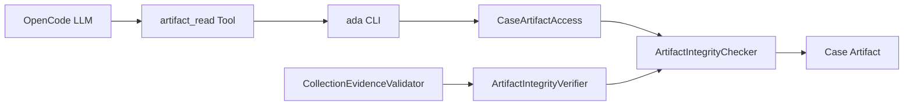
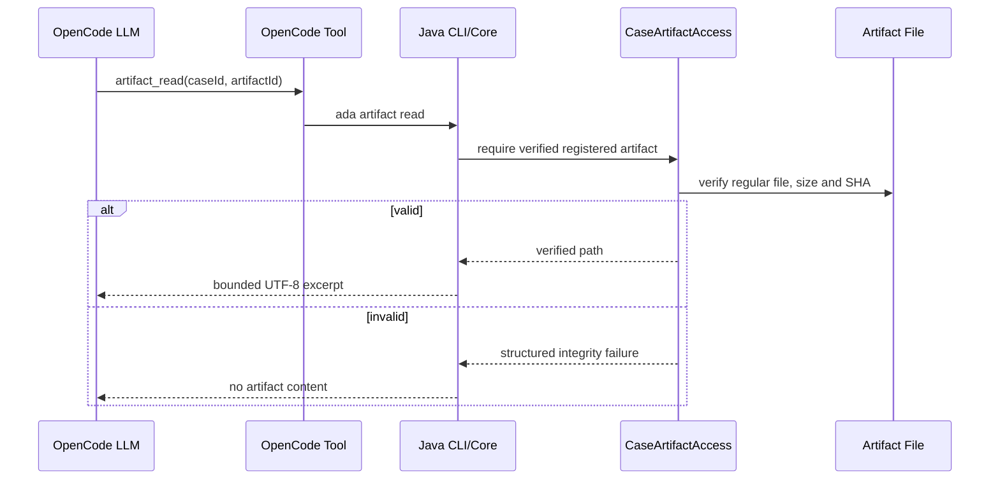

# Algorithm Debug Agent 核心简化可实施详细设计

- 文档状态：Approved
- 设计版本：1.0
- 创建日期：2026-08-19
- 负责人：Codex / mh90901119-oss
- 目标里程碑：本地 OpenCode 常用算法调试链路精简
- 关联需求：删除无运行价值的模块和门禁，同时保留动态证据可信性
- 关联架构与 ADR：[架构索引](../architecture/README.md)、[JSON 内容指纹 ADR](../decisions/ADR-008-json-content-fingerprint-baseline.md)

## 1. 背景与问题

当前静态分析、CodePath、JDWP、Normalizer、Validator、Evidence、多轮 Analysis 和 OpenCode
纵向链路已经可用，但仓库仍包含四个空 Maven 模块、OpenCode 精确版本硬门禁、CodePath Launcher
二进制 SHA 配置，以及两套 Artifact 文件完整性校验实现。这些内容增加使用和维护成本，却不提升常用
场景的定位能力。

本次简化不能删除 Plan SHA、JSON 结果内容指纹、Artifact SHA、Provenance、Baseline 和进程监管。
这些机制分别证明“按正确计划采集”“采集没有改变算法结果”和“读取的仍是归档证据”。

## 2. 目标与非目标

### 2.1 目标

- 删除 `gantt-analysis`、`knowledge-engine`、`explanation-reporter` 和 `agent-evaluation` 空模块。
- 把现有 Agent Golden Case 转为人工验收清单，不建设自动 Eval 平台。
- 使用一套中立 Artifact 完整性校验规则服务 Collection 验证和 `artifact read`。
- 取消 CodePath Launcher 二进制 SHA 的用户配置和硬门禁。
- 删除 OpenCode 版本策略，只保留版本诊断和真实能力发现检查。
- 建立唯一当前能力文档，清除过期“尚未实现”描述。

### 2.2 非目标

- 不删除 Plan SHA、Gantt normalized SHA、Artifact SHA、SourceAnchor SHA 或 Provenance。
- 不重写 Baseline 状态机，不拆分 `RunApplicationService`。
- 不创建通用 Hash 模块、Hash SPI、数字签名或证书体系。
- 不实现 Gantt 字段 Diff、Knowledge、Reporter、自动 Eval、回答后二次 LLM 审计。
- 不改变 OpenCode Tool 参数、Case 目录、Artifact ID 或 Evidence 可用性语义。

## 3. 现状与约束

- `CaseArtifactAccess` 在登记和读取 Artifact 时计算 SHA；`ArtifactIntegrityVerifier` 在 Collection
  验证时另有一套同义实现。
- `JsonTokenContentHasher` 已是单一流式 JSON Token Hash，不存在投影、Diff 或策略层。
- Plan SHA 当前仅作为 Manifest 字段并在 Validator 中执行一次内容比较，功能本身没有过度实现。
- `MethodPathManifest.toolSha256` 属于 v2 兼容字段；本次取消门禁但保留 nullable 字段，避免 Schema 升级。
- OpenCode 真实发现检查已经覆盖 Skill、Agent、Command 和十个 Tool，比精确版本字符串更直接。

## 4. 用例与验收标准

| 用例 | 输入/前置条件 | 预期结果 | 验证层级 |
|---|---|---|---|
| Artifact 正常读取 | 登记引用与文件一致 | 返回有界 UTF-8 片段 | Unit |
| Artifact 被同大小改写 | SHA 与登记引用不同 | 拒绝读取并报告完整性不一致 | Unit |
| Collection Artifact 被改写 | Validator 收到不匹配引用 | `ARTIFACT_HASH_MISMATCH` 且证据不可用 | Unit |
| Plan 内容不匹配 | Manifest SHA 与归档 Plan 不同 | `PLAN_HASH_MISMATCH` | Unit |
| Gantt 仅格式空白不同 | JSON Token和值一致 | Baseline `MATCHED` | Unit |
| Gantt 值改变 | 任一 Token 值改变 | Baseline `CHANGED`、证据不可确认根因 | Unit/Integration |
| CodePath 未配置 SHA | Launcher 路径有效 | Doctor 不要求 SHA | Unit/Smoke |
| 任意 OpenCode 版本 | 真实发现检查通过 | 允许使用 | Manual/Integration |

## 5. 总体方案

`ArtifactIntegrityChecker` 位于 `case-management`，只返回中立状态并提供流式 SHA-256。Case 读取把
失败映射为 `WorkspaceException`；Trace Validator 保留现有 `ValidationFinding` API，只把实现委托给
同一 Checker。大模型和 OpenCode TypeScript 不计算 SHA，也不能提供任意文件路径。

## 6. 模块与类设计

| 模块/类 | 职责 | 输入 | 输出 | 依赖 |
|---|---|---|---|---|
| `case-management/ArtifactIntegrityChecker` | 普通文件、大小和 SHA 校验 | `ArtifactReference`, `Path` | 中立 `Result` | JDK、contracts |
| `CaseArtifactAccess` | Case 路径边界和已验证文件访问 | Case ID、引用 | 安全 `Path`/引用 | Checker |
| `RegisteredArtifactReader` | 按 ID 有界读取 UTF-8 | Case ID、Artifact ID、预算 | `ArtifactTextExcerpt` | CaseArtifactAccess |
| `trace-validator/ArtifactIntegrityVerifier` | 把中立结果映射为 Finding | 引用、路径 | `ValidationFinding` | Checker |
| `JsonTokenContentHasher` | JSON Token 内容指纹 | JSON Path | SHA-256 | Jackson Core |

不新增 Artifact Service、Repository 层或策略接口。

## 7. 数据与契约设计

- `ArtifactReference` 字段和 Schema 不变。
- `planSha256` 字段和 Schema 不变。
- `RunResultFingerprint` 和 `ganttNormalizedJsonSha256` 不变。
- `MethodPathManifest.toolSha256` 暂时保留为 nullable 兼容字段，运行时不再要求或校验。
- OpenCode ToolResponse 和 Artifact Read 参数不变。

## 8. 核心流程

Collection 后处理使用同一 Checker，但由 Validator 映射为稳定 Finding。Plan SHA 继续比较 Manifest
声明与归档 Plan 内容；Gantt normalized SHA 继续只输出 `MATCHED/CHANGED`，不解释字段差异。

## 9. 错误处理与可观测性

- 保持 `ARTIFACT_MISSING`、`ARTIFACT_NOT_REGULAR`、`ARTIFACT_SIZE_MISMATCH`、
  `ARTIFACT_HASH_MISMATCH`、`ARTIFACT_READ_FAILED`。
- 保持 `CASE_ARTIFACT_INTEGRITY_MISMATCH`，校验失败不返回内容。
- 保持 `PLAN_HASH_MISMATCH` 和 `BASELINE_CHANGED`。
- OpenCode 非已验证版本只警告；真实发现失败仍终止安装或检查。

## 10. 性能与容量预算

| 指标 | 默认值 | 上限 | 超限行为 | 验证方法 |
|---|---:|---:|---|---|
| Artifact 单次返回 | 16 KiB | 64 KiB | 拒绝参数 | Unit |
| Artifact 校验 | 一次流式读取 | Artifact 登记大小 | 大小先失败，不 Hash 大文件 | Unit |
| JSON 内容 Hash | 流式 Token | 已有 Gantt 64 MiB 上限 | Harness 失败 | Unit |

本次不引入额外文件扫描或重复 Hash 轮次。

## 11. 安全、隐私与无侵入性

- 不修改目标算法源码。
- Artifact 只允许 Case 相对路径，拒绝路径逃逸和符号链接。
- OpenCode 只持有 Artifact ID 和有界片段，不暴露绝对路径或无界 Raw Trace。
- 删除工具二进制 SHA 不影响 Plan、Artifact、SourceAnchor 和 Baseline 证据门禁。

## 12. 测试设计

### 12.1 单元测试

- `ArtifactIntegrityCheckerTest`: 有效、缺失、非普通文件、大小不符、同大小内容不符。
- `RegisteredArtifactReaderTest`: 被改写的已登记 Artifact 不返回内容。
- `ArtifactIntegrityVerifierTest`: 原稳定 Finding code 不变。
- 现有 Plan Hash 和 JSON Token Hash 测试保持通过。

### 12.2 契约与兼容性测试

- Artifact、Plan、RunResultFingerprint Schema 不变。
- MethodPath v2 继续接受 nullable `toolSha256`。

### 12.3 集成与端到端测试

- 根 Maven 测试。
- OpenCode Node 测试和真实 `Install/Check`。
- 一个 Baseline、CodePath、JDWP、Artifact Read 最小链路。

### 12.4 性能测试与 Agent Eval

- 不新增性能平台或自动 Eval；保留人工 Agent 验收清单。

## 13. 实施步骤

1. 先增加统一 Checker 和 Reader 的失败测试。
2. 最小实现 Checker 并迁移 Case 读取。
3. 让 Validator 委托 Checker，保持 Finding API。
4. 迁移 Evaluation 清单并删除四个空模块。
5. 删除 CodePath Launcher SHA 门禁，放宽 OpenCode 版本。
6. 同步当前能力文档并执行全量验证。

## 14. 兼容、迁移与回滚

- 不迁移 Case 数据、ArtifactReference、Plan 或 RunResultFingerprint。
- MethodPath v2 的 `toolSha256` 保留 nullable，旧 Manifest 可继续读取。
- 回滚可恢复 Maven 模块和门禁，不影响已有 Case 数据。

## 15. 风险与待确认事项

| 风险/问题 | 影响 | 缓解措施 | 状态 |
|---|---|---|---|
| 为统一 Hash 新增反向依赖 | 模块耦合 | Checker 放在拥有 Artifact 的 case-management；validator 单向依赖 | Resolved |
| 过度重构 Baseline | 引入运行回归 | 本次不拆服务、不改状态和 Schema | Resolved |
| 新 OpenCode 版本输出格式变化 | 发现测试失败 | 保留真实 debug 发现硬门禁 | Accepted |

## 16. 文档同步清单

- [ ] 架构索引和当前能力
- [ ] README/CLI/OpenCode 使用说明
- [x] Mermaid 流程
- [ ] Agent 人工验收清单

## 17. 实现完成记录

- 实际变更：实施完成后填写。
- 相对设计的偏差：实施完成后填写。
- 测试与命令：实施完成后填写。
- 已知限制：实施完成后填写。

## 18. 变更记录

| 日期 | 版本 | 变更内容 | 作者 |
|---|---|---|---|
| 2026-08-19 | 1.0 | 用户批准核心简化、统一 Artifact 校验并保留 Plan/Gantt Hash | Codex / mh90901119-oss |
