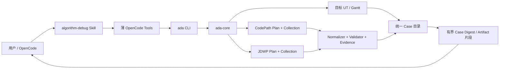
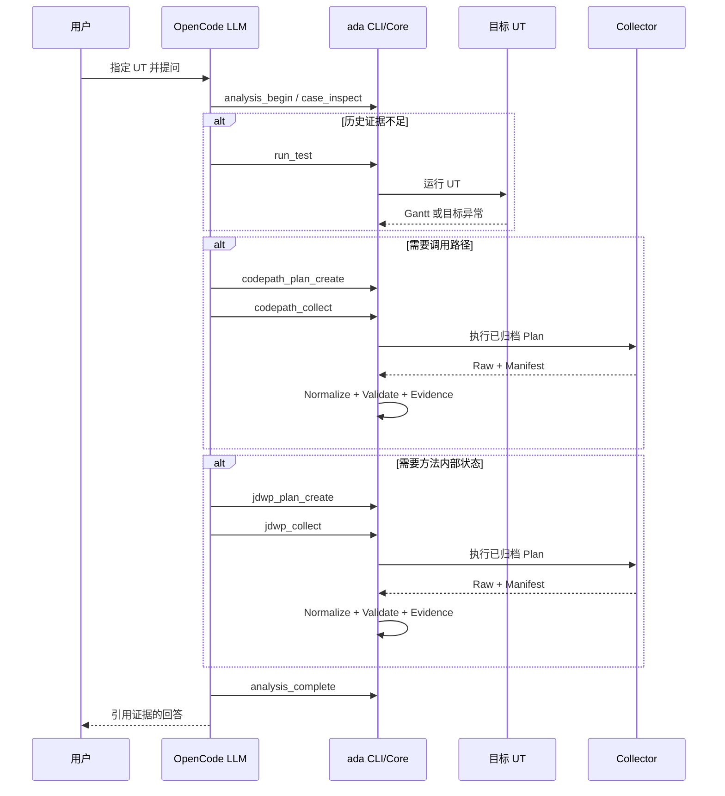

# 本地 OpenCode Demo 必要链路可实施详细设计

- 文档状态：Approved
- 设计版本：1.0
- 创建日期：2026-08-19
- 负责人：Codex / mh90901119-oss
- 目标里程碑：本地 `hellomvn` 可用验证
- 关联需求：用户进入算法模块启动 OpenCode，围绕指定 UT 进行多轮证据驱动分析
- 关联架构与 ADR：`docs/decisions/ADR-010-explicit-context-and-exact-codepath.md`

## 1. 背景与问题

Case、目标 UT 运行、Gantt 基线、精确方法级 CodePath 和 JDWP 采集已经存在，但当前仍有四个断点：

1. JDWP Collector 仍要求硬编码 JAR SHA-256，增加本地重编译维护成本；
2. Collection 完成后，Normalizer、Validator、Evidence 尚未由 Core 自动串联；
3. Case Digest 尚未索引 Collection、Evidence 和本轮模型结论，Artifact 也缺少有界读取命令；
4. OpenCode Tool 与 Java CLI 命令不一致，仓库内 Skill/Agent/Tool 尚未安装到本机 OpenCode。

## 2. 目标与非目标

### 2.1 目标

- 在 `D:\javacode\hellomvn` 中启动 OpenCode 后，可指定现有 UT 创建或续接 Case；
- 大模型自行判断复用证据、运行 UT、采集 CodePath 或采集 JDWP；
- 每次采集均先归档 Plan，再归档 Raw、Manifest、摘要、校验和 Evidence；
- 多轮分析通过同一 Case 复用不可变历史证据；
- 所有工具失败和目标 UT 失败均返回结构化事实，不使 Agent 崩溃。

### 2.2 非目标

- 不实现 MCP、其他 CLI 客户端、Debug Viewer、完整 Knowledge Engine 或通用公司算法 Adapter；
- 不修改目标算法源码、POM 或 UT；
- 不实现业务字段级 Gantt Diff；
- 不修改外部 CodePathTracer 源码；
- 不实现自动 Context 切换或复杂工作流状态机。

## 3. 现状与约束

- 目标 Demo：`D:\javacode\hellomvn`；
- 目标 UT：`WaferSchedulingReproductionTest#reproduceComplexSchedulingFromTimestampedInput`；
- OpenCode：本机 `1.18.15`；
- Java 21、Maven 3.9.x；
- JDWP Collector 作为普通外部 JAR，由路径配置和实际启动结果确认可用性；
- Gantt、Plan、Raw Trace 和 Artifact 的内容 Hash 继续保留；只删除 JDWP 工具 JAR 指纹；
- OpenCode 只负责规划和解释，确定性解析、规范化、校验和证据充分性判断由 Java 实现。

## 4. 用例与验收标准

| 用例 | 输入/前置条件 | 预期结果 | 验证层级 |
|---|---|---|---|
| 正常 UT | Demo 指定 UT | 归档 Run、Surefire、Gantt、Baseline | E2E |
| CodePath | 需要实际调用关系 | 精确 Plan、Raw、摘要、校验、Evidence | E2E |
| JDWP | 需要关键方法内部状态 | 有界 Tracepoint、Raw、摘要、校验、Evidence | E2E |
| 多轮复用 | 同一 OpenCode 会话继续追问 | 新 Analysis 复用同一 Case/Context 历史 | E2E |
| 失败 UT | 输入、断言或算法异常 Fixture | 目标失败可分析，Agent 保持可用 | Integration |
| 工具失败 | Collector 不存在或退出非零 | 结构化工具失败并保留目标运行事实 | Integration |

## 5. 总体方案

不新增自治编排引擎。大模型依据 Skill 和每轮结构化结果选择下一 Tool；Java Core 只执行请求并产生确定性事实。

## 6. 模块与类设计

| 模块 | 变更职责 |
|---|---|
| `ada-contracts` | 删除 JDWP `toolSha256`；增加 Analysis 结果和扩展 Case Digest 契约 |
| `jdwp-collector-adapter` | 删除 Collector JAR Hash 校验，保留路径、启动、超时和清理 |
| `trace-normalizer` / `trace-validator` / `evidence-engine` | 复用现有确定性实现，不新增 LLM 调用 |
| `ada-core` | Collection 后自动执行规范化、校验、Evidence；提供 Analysis 完成与 Artifact 读取用例 |
| `case-management` | 追加保存 Analysis 结果，重建有界多轮 Digest，安全读取 Artifact |
| `algorithm-debug-cli` | 暴露现有用例及 `artifact read`、`analysis complete` |
| `integrations/opencode` | 对齐真实 CLI，提供一次性 install/check |
| `skills/algorithm-debug` | 指引模型先读摘要、再按证据缺口调用工具 |

## 7. 数据与契约设计

- JDWP Manifest 升级为当前开发期新版本，直接删除 `toolSha256`，不保留兼容字段；
- `AnalysisResult` 保存最终回答、分级结论、引用 Run/Collection/Evidence/Artifact ID 和缺失证据，
  不提供、也不保存模型思维过程字段；同一 `analysisId` 只能 create-new 完成一次；
- `AnalysisConclusion` 只包含结论分类、面向用户的陈述和证据引用 ID，不包含隐藏推理；
- 每次 Collection 完成时追加 `collection-summary.json`，作为本次 ToolResponse 的可恢复副本；
- `CaseDigest` v2 最多返回最近 20 个 Run、Collection、Evidence 和 Analysis Result 摘要；Analysis Result
  摘要只保留回答摘录、最多 5 条分级结论和最多 10 条证据缺口，完整内容由 Artifact 读取；
- Digest 通过请求时间和完成时间排序；损坏或缺失的 Collection、Evidence、Analysis Result 子文档只产生
  有界告警，不导致整个 Case 无法恢复；
- `artifact read` 只接受 Case 内已登记 Artifact ID，并返回最多 64 KiB 的严格 UTF-8 文本片段、
  字节续读位置和截断状态；每次读取重新校验 Case 相对路径、符号链接、大小与 SHA-256；
- Raw Trace、Plan、Gantt 与 Artifact 内容 Hash 继续作为证据 provenance。

## 8. 核心流程

## 9. 错误处理与可观测性

- Collector JAR 不存在：Doctor 和执行返回 `JDWP_TOOL_MISSING`；
- Collector 不能启动：返回 `JDWP_COLLECTOR_START_FAILED`；
- UT 失败与工具失败分别记录；
- Baseline `CHANGED` 或 Trace 截断时，Evidence 不可用于确认根因；
- 后处理失败保留 Raw 和 Manifest，返回独立 Agent Failure；
- OpenCode Tool 不回显无界 stderr 或本机绝对路径。

## 10. 性能与容量预算

沿用现有 CodePath/JDWP 计划预算。本阶段只验证 Demo 不失控，不新增大型算法性能优化或全量 Benchmark。

## 11. 安全、隐私与无侵入性

- 不修改目标仓库源码、UT 或 POM；
- Runtime Case 数据写入 Agent 的忽略目录或显式外部 Workspace；
- Artifact Reader 防止绝对路径、父目录和符号链接越界；
- OpenCode 安装器备份并保留用户现有配置。

## 12. 测试设计

- 单元：JDWP 普通 JAR 配置、后处理编排、Digest、Analysis Result、Artifact Reader、Tool 参数映射；
- 契约：JDWP Manifest、Case Digest、Analysis Result JSON Schema；
- 集成：CodePath/JDWP Collection 到 Evidence 的完整派生；
- E2E：OpenCode 1.18.15 发现 Skill/Tool，并在 `hellomvn` 完成多轮验证；
- 失败 Fixture：输入缺失、断言失败、算法异常和 Collector 失败。

## 13. 实施步骤

1. 删除 JDWP Collector JAR 指纹及契约字段；
2. 串联 Collection 后处理；
3. 增加 Analysis Result、扩展 Digest 和 Artifact Reader；
4. 增加本地 `ada.cmd`；
5. 对齐 OpenCode Tool；
6. 实现 OpenCode install/check；
7. 运行 `hellomvn` 真实验收和全仓审计。

## 14. 兼容、迁移与回滚

项目仍处开发阶段。JDWP Manifest 破坏性变更直接升级当前 Schema 并删除旧字段，不实现迁移器。每个阶段独立提交，可按阶段 revert。

## 15. 风险与待确认事项

| 风险 | 影响 | 缓解措施 | 状态 |
|---|---|---|---|
| OpenCode Tool 发现格式与草稿不一致 | Tool 不加载 | 锁定本机 1.18.15 并执行真实发现测试 | Resolved by test |
| 后处理失败掩盖 Raw | 证据丢失 | Raw 先归档，派生失败单独记录 | Approved |
| 模型过度采集 | 性能开销 | Skill 要求先复用证据并使用最小 Plan | Approved |

## 16. 文档同步清单

- [ ] JDWP 设计与工具验证基线
- [ ] Schema 与 CLI README
- [ ] OpenCode README 与 Skill
- [ ] 根 README 使用说明

## 17. 实现完成记录

- 实际变更：实施完成后填写
- 相对设计的偏差：实施完成后填写
- 测试与命令：实施完成后填写
- 已知限制：实施完成后填写

### Task 6：OpenCode Tool 与真实 CLI 对齐

- 实际变更：实现 10 个 Tool；每次调用幂等执行 `workspace init` 与 `project register`，自动取得
  `projectId`；问题、Plan 和 Analysis 结果使用有界 UTF-8 临时文件传递并在成功或失败后清理；
- 相对设计的偏差：未引入项目注册表或客户端缓存。注册由现有 Java CLI 确定性完成，适配层保持无状态；
- 测试与命令：先确认旧启动器和缺失 Runtime 的 RED，再执行
  `node --test integrations/opencode/test/*.test.mjs`，17 个测试通过；
- 已知限制：Tool 源码尚未通过 OpenCode 1.18.15 一次性安装和真实发现验证，该项属于 Task 7。

## 18. 变更记录

| 日期 | 版本 | 变更内容 | 作者 |
|---|---|---|---|
| 2026-08-19 | 1.0 | 用户批准本地 OpenCode Demo 必要链路 | Codex / mh90901119-oss |
| 2026-08-19 | 1.1 | Task 4 实现 Case 内 Artifact 登记/有界读取与 Analysis 完成 CLI；审计修复 Run Artifact 原先错误的 Run 相对路径和跨 Run ID 冲突 | Codex / mh90901119-oss |
| 2026-08-19 | 1.2 | Task 5 增加仓库内 `ada.cmd`、被 Git 忽略的本机配置入口和 `hellomvn doctor` 进程级验证 | Codex / mh90901119-oss |
| 2026-08-19 | 1.3 | Task 6 将 10 个 OpenCode Tool 对齐真实 CLI，并增加自动项目准备、有界临时文件和失败清理 | Codex / mh90901119-oss |
