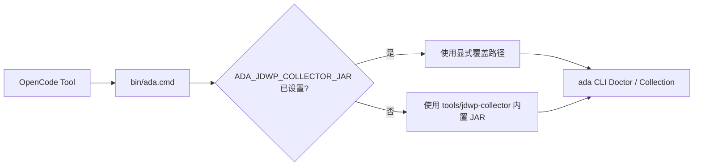

> SUPERSEDED (2026-08-23): ADR-014 replaces the binary-only self-contained design with Agent-owned JDWP Core and Batch Collector source. Runtime repository-relative JAR resolution remains unchanged.

# 自包含 JDWP Collector 运行时设计

- 状态：Approved
- 版本：1.0
- 日期：2026-08-19

## 1. 背景

当前 Agent 的 JDWP Adapter 已实现，但默认要求通过 `ADA_JDWP_COLLECTOR_JAR` 指向另一个本地
仓库的构建产物。这使 Agent 仓库在上传 GitHub 后无法独立迁移到另一台电脑，与“克隆、构建、安装后
即可使用”的交付目标冲突。

## 2. 目标与非目标

### 2.1 目标

- 将已验证的 JDWP Batch Collector fat JAR 作为仓库拥有的 vendored runtime 归档。
- `bin/ada.cmd` 默认通过仓库相对路径自动发现 Collector。
- 保留环境变量作为显式开发覆盖，但普通用户不需要本机配置文件。
- 保留版本、来源和许可证信息，不恢复 JAR SHA 运行门禁。

### 2.2 非目标

- 不合并外部 Collector 的完整源码仓库。
- 不引入 Git Submodule、运行时下载器或远程依赖解析。
- 不改变 JDWP Plan、Manifest、Normalizer、Validator 或 Evidence 契约。

## 3. 目录与启动规则

```text
tools/jdwp-collector/
├── jdwp-batch-collector.jar
├── LICENSE
└── README.md
```



默认路径由启动脚本基于自身位置解析，不保存开发机绝对路径。显式覆盖用于 Collector 开发调试，
不是普通安装步骤。

## 4. 完整性与 provenance

- JAR 由 Git 版本控制提供内容身份，不增加运行时 SHA 比较。
- Doctor 继续检查路径是否为可用普通文件；实际采集继续以启动、协议、退出码和 Manifest 验证能力。
- `config/toolchain-lock.json` 继续记录 Collector 版本、来源提交和许可证。
- vendored 目录保存上游许可证副本和来源说明。

## 5. 兼容性

- 已配置 `ADA_JDWP_COLLECTOR_JAR` 的开发环境继续优先使用显式路径。
- 未配置环境变量的环境自动使用内置 JAR。
- JDWP Schema、Case 产物和已有 Workspace 无需迁移。

## 6. 验收

1. 清除进程级 `ADA_JDWP_COLLECTOR_JAR`，且不存在 `bin/ada.local.cmd`。
2. 使用仓库 `bin/ada.cmd` 初始化临时 Workspace 并注册 `hellomvn`。
3. `doctor` 的 JDWP 检查返回 `PASS / JDWP_TOOL_OK`。
4. Maven、OpenCode Adapter 和安装发现检查继续通过。

## 7. 风险

- 二进制更新不可直接文本审查：通过固定上游版本、来源说明、许可证和真实协议测试控制。
- JAR 与上游源码可能漂移：升级必须替换 JAR并同步来源版本，不允许静默替换。
- Git 忽略规则误伤：当前仓库没有全局 `*.jar` 忽略，vendored 文件可直接纳入版本控制。
