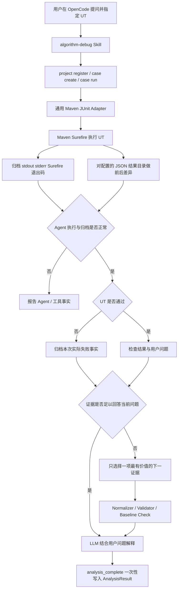
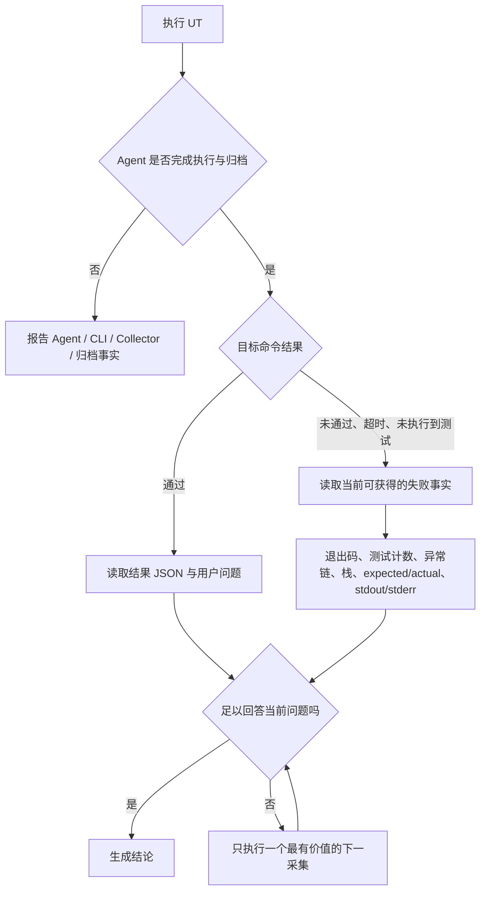

# 通用 UT、JSON 结果归档与失败优先分析设计

- 状态：Implemented and Verified
- 日期：2026-08-20
- 适用范围：OpenCode 集成、Adapter SPI、Case/Run、CodePath、JDWP、Evidence、Skill
- 兼容目标：保留现有 Case/Run/Analysis 产物读取能力，不修改被分析项目的生产源码

## 1. 背景与当前问题

当前端到端链路已经能够运行固定的晶圆调度 UT，归档控制台、Surefire、算法 JSON 结果，执行静态分析、CodePath 和 JDWP，并由 OpenCode 输出带证据引用的结论。真实失败 UT 试验也证明：当断言期望值错误时，现有动态采集能够保留失败指纹并支持根因判断。

现有实现仍把演示项目约束误写成了产品约束：

1. `WaferDemoCaseCatalog` 只允许一个固定测试类和测试方法。
2. `WaferDemoAdapter` 固定输入文件和算法结果目录。
3. Adapter SPI 要求 `InputLocator`、Wafer 结果 DTO 和 Parser，导致任意 UT 无法直接成为分析目标。
4. OpenCode 的流程倾向于依次执行全部工具，没有先根据 UT 结果判断是否已有充分证据。
5. `analysis_complete` 参数错误只返回笼统错误，模型可能新建 Analysis 或提交占位结论，造成一次问题产生多个无效分析结果。

这些约束不是核心能力。核心能力应当是：运行用户指定的 UT，可靠归档确定性证据，在证据不足时选择性采集，再由大模型结合用户问题完成分析。

## 2. 已确认的产品契约

### 2.1 UT 契约

1. 分析目标是可由 Maven Surefire 选择器独立运行的 JUnit UT。
2. Agent 接受任意合法的测试类或测试方法，不维护 Java 类名白名单。
3. UT 是完整执行单元。输入可以由 UT 内联构造、读取文件、调用 Fixture 或通过测试代码赋值。
4. Agent 不要求单独配置输入路径，也不以输入文件是否可定位作为运行前置条件。
5. UT 的直接执行事实来自退出码、stdout、stderr、Surefire 报告和结构化失败摘要。

### 2.2 算法结果契约

1. 算法业务结果目录必须可配置，配置保存在 Agent 外部 Workspace 的 `project.json`，不污染目标项目。
2. 配置值是相对 `moduleRoot` 的路径，禁止绝对路径和越界路径。
3. 算法结果文件必须是 UTF-8 JSON。
4. Agent 在 UT 前后对目录快照做差异比较，只归档本次新增或变化的 JSON。
5. 恰好一个候选时归档；没有候选时标记缺失；多个候选时标记歧义；JSON 无效时拒绝作为算法结果证据。
6. UT 失败时允许没有算法结果。不得因结果缺失覆盖真正的异常或断言失败。

### 2.3 分析契约

1. 总是先运行 UT，再决定是否需要静态或动态采集。
2. UT 成功时，根据用户问题检查结果 JSON、源码和已有证据；只补充回答所必需的证据。
3. Java 只确定性区分 Agent/工具是否正常工作，以及目标 UT 的客观执行结果；不预先把失败归类为输入异常、算法异常或断言失败。
4. UT 未通过时，归档当前实际存在的退出码、测试计数、异常链、栈、expected/actual、超时状态、控制台和结果 Artifact 状态。
5. 大模型结合用户问题、失败事实和源码判断当前证据是否充分；不足时才使用静态分析、CodePath 或 JDWP。
6. Java 不实现 Failure Classifier 或“异常根因规则引擎”。输入问题、算法问题和测试预期问题只是可能结论，不是封闭枚举。

## 3. 目标与非目标

### 3.1 目标

1. 去除固定 Demo UT 白名单，使常规 Maven/JUnit 项目可直接使用。
2. 通过项目注册配置一个算法 JSON 结果目录。
3. 保留现有控制台、Surefire、Raw Trace、Evidence、Artifact SHA、Plan SHA 和 Gantt normalized SHA。
4. 失败 UT 仍可形成基线，并在需要时运行 CodePath/JDWP。
5. 将“先看失败、证据够即停止”的策略固化在 Skill，而不是硬编码到 Java 业务规则。
6. 一次用户问题只生成一个最终 `AnalysisResult`。
7. 删除 Wafer 演示专用的运行时代码，把领域知识降为可选参考文档。

### 3.2 非目标

1. 不自动生成完整项目领域知识库。
2. 不要求复制 UT 输入文件到 Workspace。
3. 不解析任意 Java 对象或完整对象图。
4. 不自动猜测多个 JSON 文件中哪个是结果。
5. 不构建通用 Gantt 业务语义模型。
6. 不修改目标算法生产源码以增加 Trace。
7. 不绑定具体 OpenCode 版本；命令不兼容时返回清晰错误。
8. 不在本轮重命名历史 `gantt` 字段和产物，以避免无收益的 Schema 迁移。

## 4. 总体架构

该流程不把所有工具串成固定流水线。UT 运行是统一入口，后续工具由证据缺口驱动。动态采集只有在调度语义基线匹配时才能用于确认性结论。

## 5. 组件职责

### 5.1 OpenCode Skill 与大模型

负责：

1. 理解用户实际问题和目标 UT。
2. 先调用 `case_run` 并检查运行结果。
3. 根据本次 UT 的实际输出判断当前证据是否足够，以及下一项最小采集是什么；不得依赖封闭失败类型列表。
4. 区分 `CONFIRMED_FACT`、`VALIDATOR_CONCLUSION`、`SOURCE_INFERENCE`、`LLM_HYPOTHESIS` 和 `MISSING_EVIDENCE`。
5. 在同一个 Analysis 中提交一次最终结论。

不负责：

1. 自行计算或信任文件 SHA。
2. 手工解析 Surefire XML、Raw Trace 或大体积 JSON。
3. 把假设写成已确认事实。

### 5.2 通用 Maven/JUnit Adapter

负责：

1. 检查 Maven 项目是否可执行。
2. 把任意合法 `TargetTest` 编译为 Surefire 选择器。
3. 构造有超时、stdout/stderr 捕获和退出码的 `TestLaunchSpec`。

不负责：

1. 维护具体项目的测试类白名单。
2. 定位或复制算法输入。
3. 知道 Wafer、Gantt 或其他业务语义。
4. 决定算法 JSON 结果路径。

### 5.3 ProjectRegistration

在现有项目注册信息中增加可选字段 `resultJsonDirectory`：

1. 值为项目模块根目录下的相对路径。
2. 使用 `/` 作为持久化分隔符，读取时转换为当前平台路径。
3. 旧 `project.json` 缺少该字段时仍可读取。
4. `project register --result-directory <relative-path>` 对同一项目幂等更新该配置。
5. OpenCode 后续自动注册不能清空已有配置。

配置缺失不阻止 UT 执行，但算法结果证据记为缺失。这样异常分析仍可继续，同时成功场景会清晰提示尚未配置结果目录。

### 5.4 Run 与结果归档

`RunApplicationService` 从 `ProjectRegistration` 获取结果目录，不再从业务 Adapter 获取输入和结果定位器。复用现有前后快照、稳定等待、大小预算、JSON 内容哈希和原子归档能力。

为保持历史兼容，第一阶段继续使用以下已有命名：

1. Raw 结果保存为 `raw/gantt.json`。
2. Artifact 类型继续为 `GANTT`。
3. 继续计算 normalized Gantt SHA。
4. `RunOutcomeSummary.ganttOutcome` 继续表达结果是否可用。

这些名字只作为兼容字段，不表示 Agent 只能分析晶圆 Gantt。后续只有在真实消费者需要时才单独设计 Schema 重命名。

### 5.5 CodePath 与 JDWP

1. 两类采集都复用同一个 UT 启动规范。
2. 两类采集都使用 Run 的测试结果或失败指纹做基线比较。
3. UT 失败不等于采集证据不可用。若采集运行复现同一失败指纹且基线匹配，相关调用路径、断点和变量可以作为证据。
4. UT 在结果 JSON 生成前失败时，允许只使用 `targetFailureSha256` 建立基线。
5. JDWP Collector JAR 继续随 Agent 归档并自动发现，不要求用户配置绝对路径或 JAR SHA。
6. Plan SHA 继续标识实际执行的采集计划；Artifact SHA 继续校验归档文件；normalized Gantt SHA 继续比较业务结果内容。

### 5.6 `analysis_complete`

1. TypeScript 工具参数限制与 Java `AnalysisResult` 契约保持一致。
2. CLI 返回具体字段、错误码和 cause，不再统一折叠为 `CLI_INVALID_ARGUMENTS`。
3. 提交失败后保持当前 Analysis 活跃，允许修正参数后重试一次。
4. 禁止为绕过提交错误新建 Analysis。
5. 禁止提交占位结论、空 Evidence 或与当前问题无关的 dummy answer。
6. 成功后同一 Analysis 再提交应返回明确的 `ANALYSIS_ALREADY_COMPLETED`。

## 6. 失败优先决策流程

停止条件是“已经能回答用户当前问题”，不是“匹配到某个预定义失败类型”或“所有工具都运行过”。输入读取失败、算法空指针和断言 expected/actual 只是常见示例。超时、OOM、自定义断言、编译失败、进程崩溃及未来未列举的失败也走同一开放流程：保留事实、判断证据缺口、按需采集。

### 6.1 最小确定性状态

Java 只维护现有运行层面的最小状态：

1. Agent/工具执行成功或失败。
2. 目标命令通过、未通过、超时、被终止或未执行到目标测试。
3. 结果 Artifact 存在、缺失、歧义或无效。
4. 可选的失败事实字段是否存在。

异常类名、源码层级或 message 不用于硬编码根因。无法结构化提取的内容仍保存在 Surefire、stdout 和 stderr Artifact 中，由大模型读取；仍无法确认时使用 `MISSING_EVIDENCE` 或 `LLM_HYPOTHESIS`。

## 7. 结果状态与错误处理

| 场景 | UT 证据 | JSON 结果证据 | 后续策略 |
|---|---|---|---|
| 未配置结果目录 | 正常归档 | 缺失，说明未配置 | UT 仍执行；成功场景提示配置，失败场景优先分析失败 |
| UT 通过且一个 JSON 新增/变化 | 通过 | 校验并归档 | 根据用户问题决定是否继续 |
| UT 通过但没有 JSON | 通过 | `MISSING_EVIDENCE` | 不猜测旧文件；说明结果未产生 |
| 多个 JSON 新增/变化 | 正常归档 | 歧义，不归档任意一个 | 返回候选相对路径，要求收敛输出目录 |
| JSON 语法无效或超预算 | 正常归档 | 无效，不作为业务证据 | 报告确定性校验错误 |
| 输入/Fixture 阶段异常示例 | 原始失败与可提取字段 | 通常缺失 | 大模型结合栈和源码分析，证据已足够则停止 |
| NPE、越界或显式异常示例 | 原始失败与可提取字段 | 可有可无 | 不按异常类型预分类；证据不足时按需 CodePath/JDWP |
| 标准或自定义断言失败示例 | 原始失败；expected/actual 若可提取 | 可有可无 | 大模型判断算法、输入或测试预期哪一方不一致 |
| 未列举失败 | 原始 Surefire、stdout、stderr 与进程事实 | 可有可无 | 不拒绝；按同一证据充分性流程处理 |
| Collector 失败 | 基线 Run 不受影响 | 基线结果不受影响 | 标记工具失败，不伪造成算法失败 |

结果目录扫描沿用当前有界预算：最多 20,000 个目录项，单个结果最大 64 MiB。第一阶段只扫描配置目录直接包含的 `.json` 文件，不递归，以减少歧义和路径风险。

## 8. 需要保留与删除的能力

### 8.1 保留

1. 外部 Workspace 和追加式 `caseId/runId/analysisId` 产物。
2. Maven/JUnit 进程隔离、超时、退出码、stdout/stderr 和 Surefire 归档。
3. ArtifactReference 统一 SHA 校验。
4. Plan SHA、normalized Gantt SHA 和目标失败指纹。
5. Static、CodePath、JDWP、Normalizer、Validator、Evidence 和基线一致性检查。
6. JDWP JAR 内置发现。
7. Wafer 领域知识 Markdown，作为可选提示，不作为运行时依赖。

### 8.2 删除或退出生产链路

1. `WaferDemoCaseCatalog` 固定 UT 白名单。
2. `WaferInputLocator` 和强制输入快照。
3. `WaferScheduleSnapshot` 与 `WaferScheduleResultParser`。
4. Adapter SPI 中的 `InputLocator`、`ScheduleResultSource`、`ScheduleResultParser` 和泛型 `ScheduleResultSnapshot` 依赖。
5. Wafer Adapter 中固定测试源码、输入文件和输出目录常量。
6. Skill 中“每次都执行完整 Static/CodePath/JDWP 链”的隐式流程。
7. `analysis_complete` 失败后创建新 Analysis 或提交 dummy 结果的容错方式。

只有在所有调用方迁移并通过回归测试后才删除旧类，避免半迁移状态。

## 9. 测试与验收场景

必须使用仓库内临时 Maven Fixture，不修改外部 `hellomvn` 作为自动化测试手段。下列项目是常见行为样例，不是封闭失败分类或完整支持列表。至少覆盖：

1. 任意测试类和任意测试方法可执行，不命中白名单错误。
2. UT 内联输入并成功输出一个 JSON。
3. UT 从自身 Fixture 读取输入并成功输出一个 JSON。
4. UT 通过但未配置结果目录。
5. UT 通过但未生成 JSON。
6. UT 生成多个 JSON。
7. UT 生成无效 JSON或超预算 JSON。
8. 输入准备阶段抛异常且没有结果 JSON。
9. 算法抛 NPE、数组越界和显式业务异常。
10. 断言失败且存在 expected/actual。
11. 失败 UT 通过同一失败指纹完成 CodePath/JDWP 基线匹配。
12. Collector 失败与目标 UT 失败保持分离。
13. 一次 OpenCode 问题最终只有一个成功 `AnalysisResult`。
14. 旧 `project.json` 和旧 Run/Evidence Artifact 仍可读取。
15. 未识别异常仍归档原始证据并可继续分析，不返回“不支持的失败类型”。

## 10. 兼容、迁移与回滚

1. `project-registration-v1` 新字段为可选，保持旧文件兼容，不升级主版本。
2. 安装后对项目执行一次 `project register --result-directory output/algorithm-results` 即可持久化配置。
3. OpenCode 每次自动准备项目时读取并保留该配置，不需要重复传参。
4. 历史 `GANTT` Artifact、`ganttOutcome` 和 normalized Gantt SHA 不改名。
5. 通用 Adapter 完成前保留 Wafer Adapter；完成切换和回归后在同一实施任务中删除，避免双 Adapter 竞争。
6. 回滚时可恢复旧 Adapter 模块，新增的可选项目配置不会阻止旧版本读取。

## 11. 完成定义

满足以下全部条件才算完成：

1. OpenCode 能对任意合法 Maven/JUnit UT 建 Case 并运行。
2. Agent 不再要求输入路径，不再通过固定类名决定是否支持 UT。
3. 配置的算法 JSON 能被确定性识别、校验、归档和 SHA 引用。
4. 常见成功与失败场景有回归样例，未知失败不依赖类型枚举也能归档和继续分析。
5. 失败 UT 在需要时能使用失败指纹完成动态采集基线检查。
6. Skill 遵循失败优先、证据充分即停止。
7. 一次问题只产生一个最终 AnalysisResult。
8. Wafer 专用运行时代码已删除，领域知识参考仍保留。
9. 受影响模块测试和根 Maven 测试全部通过。
10. README、工作流文档、Schema 示例和 OpenCode 安装说明与实现一致。
