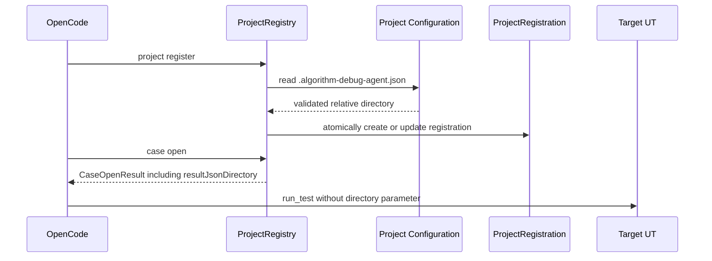

> 2026-08-22: 本设计中的目标项目 .algorithm-debug-agent.json 发现机制已被 ADR-012 和统一路径配置设计取代。目标算法仓不再保存或读取 Agent 配置。

# 项目结果目录自动配置设计

## 目标

结果 JSON 目录属于项目运行配置，不属于用户问题或 LLM 规划参数。目标项目通过根目录下固定的
`.algorithm-debug-agent.json` 声明相对目录，Agent 确定性读取、校验、注册并在 `analysis_begin`
返回配置状态。

## 配置契约

```json
{
  "schemaVersion": "1.0",
  "resultJsonDirectory": "output/algorithm-results"
}
```

配置必须是有界 UTF-8 JSON，不允许未知字段；目录必须满足 `ProjectRegistration` 已有的可移植相对
路径规则。对应 Schema 为 `schemas/workspace/project-configuration-v1.schema.json`。

## 确定性流程



配置优先级为显式 CLI `--result-directory`、项目配置文件、已有注册、未配置。显式 CLI 用于管理和
迁移；OpenCode 不传该参数。项目配置不存在时保留已有注册，保证向后兼容。

## 边界

- 不新增 Adapter SPI、配置查询 Tool、文件名正则或递归扫描。
- LLM 不解析配置，也不把路径传回 Run。
- 配置无效时在写注册前返回 `PROJECT_CONFIGURATION_INVALID`。
- Run/CodePath/JDWP 继续通过同一个 `ProjectRegistration` 读取结果目录。
- 时间戳文件仍由运行前后目录快照识别。

## 测试

- 自动发现、显式覆盖、缺失兼容、非法配置拒绝且不产生半注册。
- `CaseOpenResult` 返回已登记目录。
- OpenCode 不再暴露或传递 `resultDirectory`。
- 通用 Maven Fixture、Node 契约和根 Reactor 回归。
