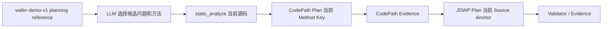

# Wafer Demo 计划知识设计

- 状态：Approved
- 版本：1.0
- 日期：2026-08-20

## 1. 目标

为 Wafer Demo 提供一个随 Skill 版本化的轻量参考文件，使模型在首次分析时知道领域不变量、候选方法和
保守采集策略，从而减少无关 CodePath/JDWP 采集。该文件不恢复 `knowledge-engine`，不增加 Java API、
CLI 命令或 OpenCode Tool。

## 2. 生效边界

- Knowledge 只能作为 `PLANNING_HINT`，不能引用为确认事实。
- Method Key、descriptor、源码行和源码 Hash 必须来自当次 `static_analyze`。
- 运行时值必须来自通过基线和 Validator 校验的 Collection/Evidence。
- 目标源码、UT 或输入被有意修改时，新建 Context 并重新验证知识提示。

## 3. 交付形式

- Canonical：`skills/algorithm-debug/references/wafer-demo-v1.md`。
- 安装副本：OpenCode 配置目录的同名 Skill reference。
- 非交互验收：通过 `opencode run -f <reference>` 显式附加。
- 普通 `/debug-case`：Skill 提醒模型在 Wafer Demo 场景使用该 reference；无法读取时仍可完全依赖
  `static_analyze`，不会阻塞核心流程。

## 4. 非目标

- 不自动扫描并生成通用知识库。
- 不把业务文档转换成证据。
- 不写死 JDWP 行号或 JVM descriptor。
- 不默认采集全部方法、全部局部变量命中或完整对象图。

## 5. 验收

1. 安装器复制并校验 reference。
2. OpenCode 能在任意版本通过能力发现。
3. 完整 UT 分析先使用知识缩小候选，再由静态目录生成合法 Plan。
4. Case 归档保留 Plan、Collection、Evidence，而不是把知识文件伪装成运行证据。
