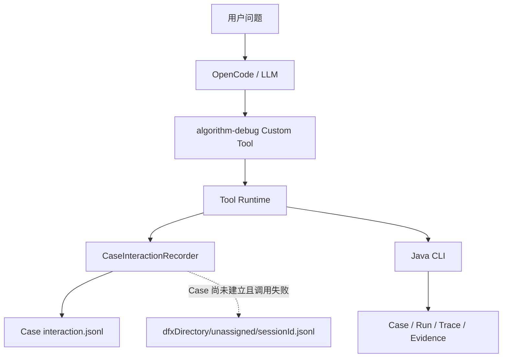
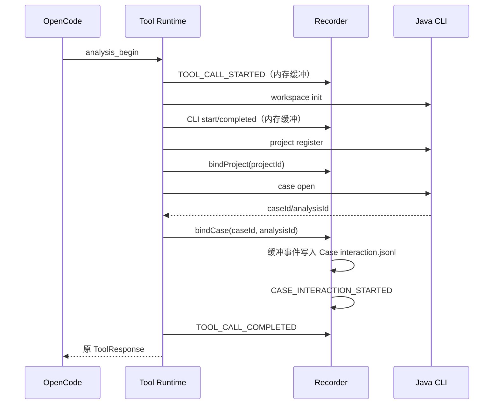

# Algorithm Debug Agent Case-local DFX 详细设计

## 1. 文档状态

- 日期：2026-08-22
- 状态：Implemented
- 范围：OpenCode Custom Tool Runtime 的本地执行诊断
- 不改变：Case、Run、Trace、Evidence、AnalysisResult 和 ToolResponse 契约

## 2. 目标

每个成功建立的 Case 自动生成一个可直接打开的 `interaction.jsonl`，按实际发生顺序记录
Custom Tool 和内部 Java CLI 调用。该文件用于回答“Agent 调了什么、调用顺序是什么、在哪一层失败”，
不用于证明算法根因。

本实现必须满足：

1. 正常日志与 Case 放在一起，不建立第二份 Session 日志。
2. 同一 Case 的多轮 Analysis 追加到同一文件，通过 `analysisId` 区分。
3. 同一 OpenCode Session 中的不同 Case 物理隔离。
4. 日志关闭、写入失败或达到预算均不改变原 ToolResponse。
5. 不增加 Plugin、查看脚本、后台线程、数据库、环境变量或路径参数。

## 3. 非目标

- 不记录或重建模型隐藏推理。
- 不声称能够检测 Skill 是否加载；OpenCode 没有提供稳定的 Skill-load 事件契约。
- 不记录完整问题、回答、Tool 参数、ToolResponse、stdout、stderr、算法 JSON 或 JDWP 值。
- 不替代 Run Manifest、ArtifactReference、Raw Trace、Evidence Bundle 或 Eval JSONL。
- 不实现实时 Viewer、Web UI、远程上传或后台清理。

## 4. 核心决策

MVP 在现有 `tool-runtime.mjs` 中注入可复用的 `CaseInteractionRecorder`，不增加 OpenCode Plugin。
Tool Runtime 已经持有项目注册结果、Case/Analysis 输入、CLI 命令名和经过校验的 ToolResponse，能够用
最少代码完成准确的 Case 路由。独立 Plugin 只能先得到 Session/Tool 事件，还要重新解决 Case 身份、
重复日志和 Hook 失败隔离，因此当前没有必要。

后续迁移到其他 CLI 时，可以复用 Case Interaction Event 和 Recorder，只替换产生事件的 Adapter。

## 5. 运行结构



Recorder 是 Tool 调用栈中的普通对象，不创建线程。Runtime 等待有序追加完成，但所有 Recorder 异常
都在 DFX 边界内捕获，不会替换业务响应。

## 6. 新 Case 时序



已有 Case 的 Tool 在项目注册后、业务 CLI 启动前绑定 Case。目标 UT 返回失败事实但 ToolResponse
本身成功时，记录 `TOOL_CALL_COMPLETED`；目标失败不是 Tool 崩溃。

## 7. 文件路由

正常 Case：

```text
<workspaceDirectory>/projects/<projectId>/cases/<caseId>/interaction.jsonl
```

无法建立 Case 的调用失败：

```text
<dfxDirectory>/unassigned/<sessionId>.jsonl
```

`dfxDirectory` 不是正常日志副本。`dfxEnabled=false` 时两处都不创建文件。目录值只来自安装器生成的
`installation.mjs`；用户只编辑仓库中的 `config/agent-settings.json`。

## 8. CaseInteractionEvent 1.0

Schema：`schemas/dfx/case-interaction-event-v1.schema.json`。

必填字段：

```text
schemaVersion, timestamp, level, eventType, source, outcome,
sessionId, invocationId
```

允许的可选字段：

```text
messageId, agent, projectId, caseId, analysisId, toolName,
commandName, durationMillis, code, targetTest, runId, planId,
collectionId, evidenceId, artifactIds
```

事件类型固定为：

```text
CASE_INTERACTION_STARTED
TOOL_CALL_STARTED
TOOL_CALL_COMPLETED
TOOL_CALL_FAILED
CLI_PROCESS_STARTED
CLI_PROCESS_COMPLETED
CLI_PROCESS_FAILED
LOG_TRUNCATED
```

Schema 使用 `additionalProperties=false`，不存在任意 `details`、`args`、`response` 或 `message` 字段。

## 9. 安全与预算

- 事件只由白名单字段构造，不序列化输入或响应对象。
- ID 最大 128 字符，`targetTest` 最大 512 字符，Artifact ID 最多 64 个。
- 单事件最大 8 KiB，超限时按固定顺序移除可选字段。
- 单 Case 文件最大 16 MiB，达到上限后最多写一个 `LOG_TRUNCATED`。
- 同一目标文件使用 Promise 队列串行追加，避免多 Tool 写入交叉。
- 文件路径只由已校验的配置根目录和安全 ID 段派生，拒绝越界。
- Recorder 首次错误可交给安全回调，后续错误静默降级。

禁止内容包括用户问题和回答正文、隐藏推理、完整 Tool 参数/返回、原始 stdout/stderr、算法输入或
输出 JSON、JDWP 变量、凭据、环境变量值和绝对业务路径。

## 10. 使用方式

用户直接打开 Case 根目录中的 `interaction.jsonl`，按行查看 Tool/CLI 顺序，并使用其中的 `runId`、
`planId`、`collectionId`、`evidenceId` 或 `artifactIds` 定位同一 Case 的正式产物。无需运行查看脚本。

DFX 日志不得注册为 ArtifactReference，不得进入 Evidence Bundle，也不得被 `analysis_complete` 引用为
`CONFIRMED_FACT`、`VALIDATOR_CONCLUSION` 或 `SOURCE_INFERENCE` 的依据。

## 11. 安装与兼容性

安装器复制：

```text
integrations/opencode/lib/case-interaction-recorder.mjs
  -> <openCodeConfigDirectory>/lib/case-interaction-recorder.mjs
```

安装仍使用能力发现，不绑定 OpenCode 版本号。重复安装内容一致时不产生备份；Check 模式校验安装副本。
本功能不修改 Java 模块、Maven 依赖、Tool 参数或 ToolResponse 2.0。

## 12. 验收标准

1. 新 Case 的准备事件在得到 Case 身份后写入正确 Case。
2. 多 Case 日志物理隔离，多 Analysis 在同一 Case 文件中追加。
3. Case 创建失败只写 `unassigned`。
4. Tool 和每个内部 CLI 调用都有成对开始/终止事件。
5. 失败 UT 与 Tool 失败能够分别表达。
6. 日志内容符合白名单和大小预算。
7. DFX 关闭或写入失败不改变 Agent 业务行为。

## 13. 参考

- OpenCode Plugins: https://opencode.ai/docs/plugins/
- OpenCode Custom Tools context: https://opencode.ai/docs/custom-tools/#context
