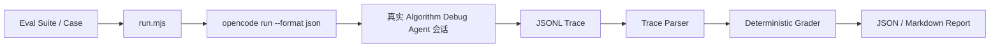

# Agent Eval Harness MVP 实施设计

- 状态：Approved for Implementation
- 日期：2026-08-21
- 范围：OpenCode 集成测试设施、Agent/Skill 配置质量、首批真实模型 Smoke Eval

## 1. 目标

实现一个轻量、仓库内可执行的 Agent Eval Harness，自动验证完整的
`OpenCode + 模型 + Custom Agent + Skill + Tools + Java Agent` 行为。Harness 只用于开发、升级和
发布验收，不进入普通用户分析链路，不新增 Java `agent-evaluation` 生产模块。

同时完成三个现有问题的收尾：

1. 修复 OpenCode Agent 中的非法控制字符，并允许 Skill 使用合法 UTF-8 中文。
2. 将已发现的外部程序校验错误改为英文。
3. 把已经落地的通用 Maven/JUnit 与 JSON 结果方案更新为已实施状态。

## 2. 核心概念

- `TargetModule`：包含可执行目标 UT 的 Maven 模块目录，不是 UT 本身。
- `TargetTest`：模块中的精确 `className + methodName`。
- `Eval Case`：一个用户式问题、一个 TargetTest 和一组事后验收规则。
- `Eval Suite`：多个 Eval Case 的版本化集合。
- `Runner`：启动完整 `opencode run` 会话，不直接运行 JUnit。
- `Trace Parser`：把 OpenCode JSONL 转换为结构化 Tool 轨迹，不判断对错。
- `Deterministic Grader`：用固定规则比较预期和实际行为，不调用另一个模型。
- `Report Writer`：输出每个 Case 的 JSON/Markdown 结果。

## 3. 目录与最小实现

```text
agent-evals/
├── README.md
├── schemas/eval-suite-v1.schema.json
├── suites/smoke.json
├── run.mjs
├── grade.mjs
└── test/
    ├── run.test.mjs
    └── grade.test.mjs
scripts/
└── run-agent-evals.ps1
```

`run.mjs` 合并 Suite 加载、OpenCode 进程执行、JSONL 解析和报告写入，避免第一版拆出过多模块。
`grade.mjs` 只保留无副作用的评分函数，便于单元测试。

## 4. 执行流程



Runner 使用 `--dir <TargetModule>` 让 OpenCode 从被测模块启动。Runner 设置现有
`ADA_WORKSPACE` 环境变量，将 Agent Workspace 隔离到本次 Eval 输出目录，不污染用户正式 Case。
Suite 不保存开发机绝对路径。

## 5. Suite v1 契约

Suite 根字段：

- `schemaVersion`：固定为 `1.0`。
- `suiteId`、`description`：有界非空字符串。
- `cases`：至少一个 Case，Case ID 唯一。

Case 字段：

- `id`、`question`。
- `targetTest.className`、`targetTest.methodName`。
- `requiredTools`、`forbiddenTools`。
- 可选 `expectedProcessOutcome`、`expectedTestOutcome`、`expectedExceptionClass`。
- `requiredAnswerPatterns`、`forbiddenAnswerPatterns` 使用不区分大小写的普通正则。
- `requireAnalysisComplete`、`requireEvidenceReferences`。
- `allowCodePath`、`allowJdwp`。
- 可选 `maxTargetTestExecutions`。

Case 只描述用户可见问题和验收事实，不在 Prompt 中泄露 required/forbidden 规则。

## 6. Trace Parser

Parser 逐行读取 OpenCode JSONL，忽略非 JSON 空行，遇到损坏 JSON 时将 Case 标记为 Harness 失败。
从 `part.type=tool` 事件提取：

- 标准化 Tool 名，移除 `algorithm-debug_` 前缀。
- Tool 输入、执行状态和输出字符串。
- 可解析的 ToolResponse。
- `analysis_begin` 身份、`run_test` 事实、Collection 摘要和 `analysis_complete` 结果。
- 最后一个模型文本作为最终回答。

Parser 不推断根因，也不把目标 UT 的失败 ToolResponse 当作 OpenCode 失败。

## 7. 确定性评分

硬失败检查：

- OpenCode 退出码为零，JSONL 可解析。
- 必须 Tool 已调用，禁止 Tool 未调用。
- `analysis_begin`、`run_test` 和 `analysis_complete` 按 Case 要求成功。
- 目标 process/test/exception 事实与 Case 一致。
- 确认性结论包含非空证据引用。
- CodePath/JDWP 未违反 Case 允许范围。
- TargetModule 受保护源码在执行前后 SHA 快照一致。
- 必要回答模式存在、禁止回答模式不存在。

效率问题第一版只作为 Warning：重复 `analysis_begin`、超过目标 UT 执行预算、成功完成后继续调用工具。

## 8. 首批 Smoke Case

1. 成功 UT。
2. 输入缺失导致空指针。
3. 算法循环超过最大迭代次数。
4. 故意断言 expected=164、actual=165。

Smoke Case 复用 `hellomvn` 中已有测试，不修改 Demo 生产算法。具体 TargetTest 在 Suite 中声明，
`TargetModule` 由运行命令提供。

## 9. 输出

```text
target/agent-evals/<timestamp>/
├── environment.json
├── summary.json
├── summary.md
├── agent-workspace/
└── cases/<case-id>/
    ├── request.json
    ├── stdout.jsonl
    ├── stderr.log
    ├── parsed-trace.json
    ├── final-answer.md
    └── grade.json
```

环境记录 OpenCode、模型、Java、Maven、Skill、Agent、Tool Runtime 和 Suite 身份。MVP 不锁定版本，
只记录实际值。

## 10. 安全与兼容性

- Runner 不删除用户 Case，不修改 TargetModule。
- 通过 `ADA_WORKSPACE` 隔离 Eval Case。
- 执行前后对 `src/main`、`src/test`、`pom.xml` 和 `.algorithm-debug-agent.json` 做文件内容 SHA 快照。
- TargetModule 必须存在、包含 `pom.xml`，并在启动前规范化。
- 所有子进程有超时、退出码、stdout/stderr 捕获和终止处理。
- 正常 OpenCode 用户流程、Tool 参数和 Case Schema 不变。

## 11. 测试与验收

- Node 单元测试覆盖 Suite 校验、JSONL 解析、Tool 名标准化、评分和报告。
- 配置资产测试覆盖 UTF-8、控制字符和 Frontmatter。
- Java 测试覆盖本轮英文错误变化。
- Demo 默认测试必须继续通过。
- 真实 OpenCode Smoke 以四个 Case 全部通过为最终验收。

## 12. 非目标

- 不实现 LLM Judge、Golden Answer 全文比较、综合百分比分数或 Web UI。
- 不实现自动 Prompt 优化、多模型并行或远程执行。
- 不恢复 Knowledge Engine、Explanation Reporter、Gantt Analysis 或多 Agent 编排。

## 13. 2026-08-22 路径配置修订

- Eval 的目标 Maven 模块固定为运行 
un-agent-evals.ps1 时的当前目录。
- Eval 输出固定写入统一配置的 evalDirectory。
- 用户入口不再提供 TargetModule 或 OutputRoot 路径参数。
- Harness 内部只通过 ADA_EVAL_WORKSPACE 隔离本次评测 Workspace；该变量不是用户配置入口。
- 目标源码保护快照只覆盖 src/main、src/test 和 pom.xml，不再包含已废弃的项目内 Agent 配置文件。