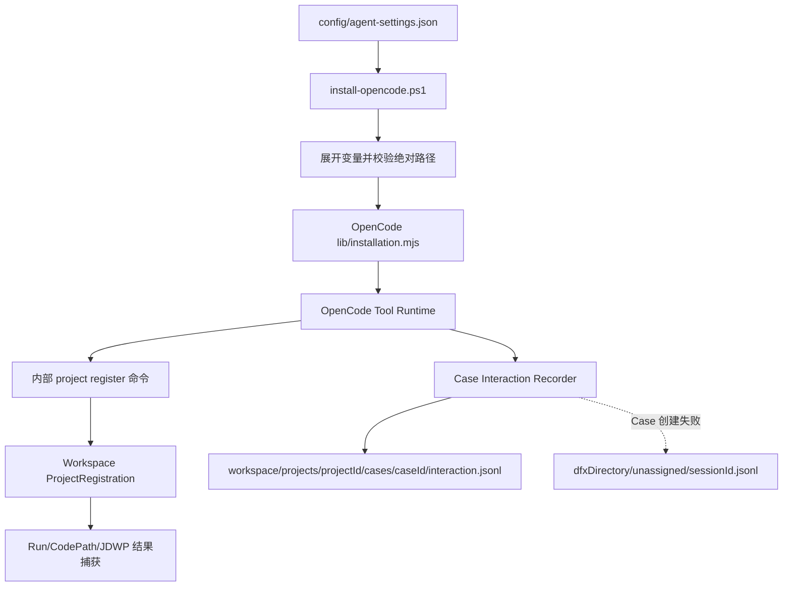

# 统一安装路径配置设计

状态：待用户审阅

日期：2026-08-22

## 1. 目标

将用户可配置路径收敛到 Agent 仓库中的一个配置文件，由 OpenCode 安装器解析并下发。目标算法仓库不再需要
`.algorithm-debug-agent.json`，用户命令不再接收安装目录、Workspace、DFX、Eval 或算法结果目录参数。

内部 JS Adapter、Java CLI、Maven、CodePath 和 JDWP 子进程仍可传递已经解析、规范化和校验的路径。

## 2. 已确认需求

1. Agent 仓库配置文件必须显式列出默认路径，不能依靠字段缺失表达默认值。
2. Workspace 提供默认路径，同时允许用户在同一个配置文件中改成自定义绝对路径。
3. DFX、Eval 和 OpenCode 配置目录遵循相同规则。
4. 算法 JSON 输出目录属于业务配置，允许使用绝对路径，并在 Agent 仓库统一配置。
5. 不增加 `agent-settings.local.json`、`runtime.json` 或目标项目级配置文件。
6. 不增加结果目录状态枚举；继续使用现有 `GanttOutcome.PRESENT`、`GanttOutcome.ABSENT` 和
   `AgentFailureDiagnostic`。
7. 配置修改后重新运行安装器并重启 OpenCode。安装器 `Check` 输出最终生效路径。
8. 程序错误和安装检查输出使用英文。

## 3. 当前实现审计

### 3.1 当前路径来源

| 路径 | 当前来源 | 问题 |
|---|---|---|
| OpenCode 配置目录 | `install-opencode.ps1 -ConfigRoot` 或 `$HOME/.config/opencode` | 存在用户路径参数 |
| Agent 仓库 | `-RepositoryRoot` 或脚本自身位置 | 参数没有必要 |
| Workspace | `ADA_WORKSPACE` 或 JS Adapter 按操作系统推导 | 未纳入安装配置 |
| Launcher | 安装器生成 `installation.mjs` | 机制可复用 |
| CodePath/JDWP JAR | `ada.cmd` 相对仓库定位后通过环境变量传给 Java | 内部传递有效，但仍保留用户覆盖入口 |
| 算法结果目录 | 目标模块 `.algorithm-debug-agent.json`、CLI `--result-directory` 或历史注册 | 配置分散且要求每个算法仓重复创建文件 |
| Eval 目标与输出 | `-TargetModule`、`-OutputRoot` | 用户命令需要传路径 |
| DFX 输出 | 设计依赖 `ADA_WORKSPACE` | 尚未实现，需改读安装配置 |

### 3.2 可直接保留的机制

- 安装器根据 `$PSScriptRoot` 推导 Agent 仓库。
- `ada.cmd` 根据自身位置定位 CLI、CodePath 和 JDWP JAR。
- JS Adapter 向 Java CLI 传递 `--workspace`、`--project`、临时请求文件和结果目录。
- Java Core 在 Workspace 内根据 `projectId/caseId/runId/analysisId/collectionId` 派生目录。
- Harness 对算法结果目录执行运行前后快照、唯一 JSON 捕获、解析和归档。
- `analysis_begin` 返回已登记的算法结果目录；`run_test` 返回现有 Gantt 和 Agent failure 事实。

### 3.3 必须删除的机制

- 目标算法模块根目录 `.algorithm-debug-agent.json` 读取。
- `ProjectConfigurationLoader` 及 project configuration Schema。
- README 和工作流中要求每个目标项目配置结果目录的说明。
- 用户可见的安装器 `-ConfigRoot`、`-RepositoryRoot`。
- 用户可见的 Eval `-TargetModule`、`-OutputRoot`。
- `ada.local.cmd` 和 Collector JAR 的人工覆盖说明。

## 4. 唯一源配置

文件：`config/agent-settings.json`

```json
{
  "schemaVersion": "1.0",
  "openCodeConfigDirectory": "%USERPROFILE%\\.config\\opencode",
  "workspaceDirectory": "%LOCALAPPDATA%\\algorithm-debug-agent\\workspace",
  "dfxDirectory": "%LOCALAPPDATA%\\algorithm-debug-agent\\diagnostics",
  "evalDirectory": "%LOCALAPPDATA%\\algorithm-debug-agent\\evals",
  "resultJsonDirectory": "D:\\javacode\\hellomvn\\output\\algorithm-results",
  "dfxEnabled": true
}
```

所有字段必须存在。用户通过修改同一个文件自定义路径。安装器只展开 `%USERPROFILE%` 和
`%LOCALAPPDATA%` 两个明确允许的变量，不实现通用模板语言，也不读取路径命令参数作为覆盖。

路径规则：

- `openCodeConfigDirectory`、`workspaceDirectory`、`dfxDirectory`、`evalDirectory` 和
  `resultJsonDirectory` 展开后必须是绝对路径。
- `resultJsonDirectory` 在安装时不要求存在，因为目标 UT 可能在运行时创建它。
- OpenCode、Workspace、DFX 和 Eval 目录由安装器创建或验证为普通目录。
- 配置文件不得包含未知字段；`schemaVersion` 固定为 `1.0`；`dfxEnabled` 必须是布尔值。

## 5. 安装产物

不新增 `runtime.json`。安装器扩展现有 `lib/installation.mjs`。以下只展示解析后的对象结构，
占位值由安装器根据当前仓库位置和 `agent-settings.json` 生成，不是固定路径：

```javascript
export const installation = Object.freeze({
  launcher: "<resolved-agent-repository>\\bin\\ada.cmd",
  workspaceDirectory: "<resolved-local-app-data>\\algorithm-debug-agent\\workspace",
  dfxDirectory: "<resolved-local-app-data>\\algorithm-debug-agent\\diagnostics",
  evalDirectory: "<resolved-local-app-data>\\algorithm-debug-agent\\evals",
  resultJsonDirectory: "<configured-result-directory>",
  dfxEnabled: true,
})
```

该文件是安装器生成的 OpenCode Adapter 安装快照，不是第二个人工配置入口。

## 6. 运行时数据流



OpenCode Tool Runtime 使用 `installation.workspaceDirectory`，并在内部项目注册命令中传递
`installation.resultJsonDirectory`。LLM 不读取安装文件、不拼接基础设施路径，也不要求用户在问题中重复路径。

## 7. Java 兼容策略

新安装产生的项目注册使用绝对 `resultJsonDirectory`。已有 Workspace 可能保存旧版相对路径，不能因为升级而
无法读取历史 Case。因此：

- `ProjectRegistration` 继续读取旧的安全相对路径，但新注册由安装配置提供绝对路径。
- `ProjectResultSource` 对绝对路径直接使用；对旧相对路径继续相对 `moduleRoot` 解析。
- `ProjectRegistry` 删除目标项目配置文件 fallback，只接受调用方传入的安装配置值。
- 正常 OpenCode 路径每次准备项目时同步当前安装值到 ProjectRegistration。

这是只读兼容，不再允许目标项目文件成为配置入口。

## 8. 错误与结果边界

安装器负责配置结构、变量、绝对路径和目录可用性错误。运行时不新增结果目录状态：

- 捕获到唯一有效 JSON：现有 `GanttOutcome.PRESENT`。
- 没有捕获到 JSON：现有 `GanttOutcome.ABSENT`。
- 路径不是目录、读取失败、结果不唯一或 JSON 无效：现有 `AgentFailureDiagnostic`。

Skill 只能说明“配置目录未捕获到 JSON”，不得仅凭 `ABSENT` 断言路径一定错误，也不得扫描项目猜测其他目录。

## 9. Eval 和验证脚本

- `run-agent-evals.ps1` 使用当前工作目录作为目标 Maven 模块。
- Eval 输出根目录来自 `agent-settings.json` 的 `evalDirectory`。
- PowerShell 包装器不再暴露 `TargetModule` 和 `OutputRoot`。
- Node Runner 仍可在内部子进程协议中接收解析后的路径。
- Eval 隔离 Workspace 使用内部 `ADA_EVAL_WORKSPACE`，不作为用户配置入口。
- 安装器验证脚本通过临时设置 `USERPROFILE` 和 `LOCALAPPDATA` 隔离测试，不再向安装器传路径参数。

## 10. DFX 边界

正常 DFX 日志跟随 Case，使用 `installation.workspaceDirectory` 派生
`projects/<projectId>/cases/<caseId>/interaction.jsonl`。`installation.dfxDirectory` 只保存无法建立 Case
时的 `unassigned` 失败日志。Tool Runtime Recorder 同时读取 `installation.dfxEnabled`，不读取
`ADA_WORKSPACE`，也不增加 DFX 专用路径配置文件、环境变量或命令参数。

## 11. 验收标准

1. 新电脑拉取 Agent 仓库后，只修改 `config/agent-settings.json` 中确实需要自定义的显式值并运行安装器。
2. 不向安装器、OpenCode Tool 或 Eval PowerShell 入口传文件路径参数。
3. 自定义 Workspace 安装后生效，旧 Workspace 不迁移也不删除。
4. 任意算法仓不需要 `.algorithm-debug-agent.json`。
5. 绝对算法结果目录能被 baseline、CodePath 和 JDWP 重跑共同使用。
6. 没有新增目录状态枚举或第二套运行配置文件。
7. 安装器 `Check` 输出所有最终生效路径。
8. 现有历史相对结果目录 ProjectRegistration 仍可读取。
