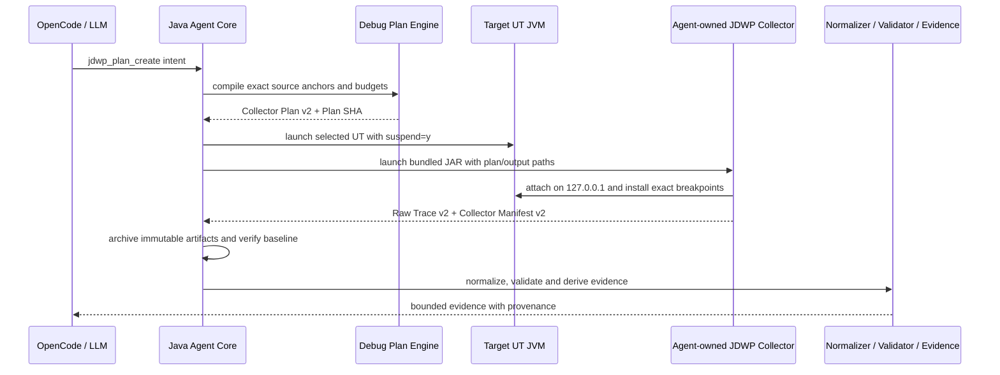

# Agent-owned JDWP Collector 实施设计

- 日期：2026-08-23
- 状态：已实施
- 范围：`jdwp-collector-core`、`tools/jdwp-batch-collector`、Plan/Raw/Summary v2

## 1. 目标

将 Algorithm Debug Agent 所需的最小 JDWP 批量采集能力作为本仓库源码维护，消除外部本地
仓库和手工 Collector 路径配置，同时保持用户侧工作流不变。

CodePathTracer 继续作为第三方库使用，不迁入、不修改，也不要求先于 JDWP 执行。LLM 根据问题
和已有证据选择 Static、CodePath 或 JDWP；不存在固定的 CodePath -> JDWP 前置依赖。

## 2. 非目标

- 不迁入 `jdwp-mcp-server`、Spring、MCP 或 sandbox。
- 不实现交互式单步、表达式求值或目标状态修改。
- 不 Attach 生产 JVM，仅启动离线目标 UT 子 JVM。
- 不增加 JDWP JAR SHA 校验。
- 不引入 CodePath/JDWP 并行采集。

## 3. 模块与调用关系

`jdwp-collector-core` 只提供 JDI 原语。`tools/jdwp-batch-collector` 只执行确定性 Plan。
`jdwp-collector-adapter` 继续管理目标 UT、端口、超时、stdout/stderr 和子进程生命周期。

## 4. 准确性收敛

1. Plan v2 必须携带 JVM 方法描述符，断点按类名、方法名、描述符、源码行精确匹配。
2. 同一未加载类只创建一个 `ClassPrepareRequest`，安装位置按 tracepoint、classloader、
   descriptor 和 codeIndex 幂等去重。
3. 达到 `maxHits` 后禁用该 tracepoint 的全部断点请求，不只禁用当前请求。
4. Raw v2 和 Summary v2 显式保留 `methodDescriptor` 与 `codeIndex`。
5. primitive 保留 JVM 类型和 JSON 标量类型；String 截断使用机器可读标记。
6. 对象字段使用数组并保留 declaring type，避免父子类同名字段互相覆盖。
7. `localNames` 与 `fieldPaths` 提供有界投影；为空时保留当前预算内默认采集。

## 5. 兼容性

- Collector Plan 新写入 `2.0`。
- Collector Raw Trace 新写入 `2.0`。
- Normalizer 同时读取 Raw `1.0` 和 `2.0`，单个 JSONL 文件禁止混用版本。
- `JdwpCaptureSpec` 保留原六参数构造器；旧 Plan 缺失投影字段时按空列表处理。
- `JdwpSnapshotSummary` 保留旧构造器和 v1 读取能力，新产物写 `2.0`。

## 6. 兼容性握手与完整性

Agent 不读取或校验 Collector JAR SHA。Collector Manifest v2 声明 Collector 版本、Raw Trace
版本和确定性能力集合，Agent 在归档前校验。Plan SHA 和 Raw Trace `ArtifactReference.sha256`
继续承担本次计划和证据文件的完整性校验，不能由能力握手替代。

## 7. 构建与发布

`scripts/package-jdwp-collector.ps1` 无参数构建两个源码模块，并把 fat JAR 复制到
`tools/jdwp-collector/jdwp-batch-collector.jar`。`bin/ada.cmd` 继续按仓库相对路径解析该 JAR。
OpenCode 安装器只安装 Agent/Skill/Tool 配置，不接收 Collector 路径参数。

## 8. 测试与验收

- Core 单元测试：typed primitive、String 截断。
- Collector 单元测试：v2 descriptor 契约、投影归一化、ClassPrepare 去重、descriptor 过滤。
- Normalizer 测试：Raw v1 兼容、Raw v2 精确位置、typed value、隐藏字段。
- Agent 回归：Manifest 能力握手、Plan Writer、Adapter、Baseline 和 Evidence 链。
- 发布验收：模块测试、根 Reactor 测试、打包脚本和真实 JDWP smoke。

真实 smoke 需要仓库已有 fixture 和当前 JDK 的 JDWP 能力；若环境条件不满足，测试必须明确
SKIP，不能把未执行写成通过。
