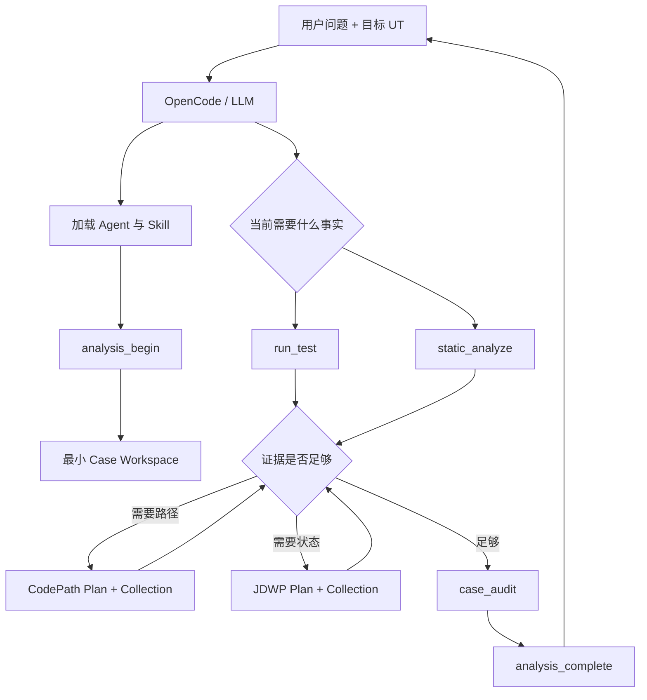

# Agent 运行时精简、完整审计与端到端验收详细设计

- 状态：Implemented
- 版本：1.0
- 日期：2026-08-25
- 对应实施计划：[2026-08-25 实施计划](../superpowers/plans/2026-08-25-agent-runtime-simplification-and-e2e-audit.md)
- 最终证据：[最终实施审计](../audits/agent-runtime-simplification-final-audit.md)

## 1. 问题

实现前存在以下偏离：

- Workspace 预建空目录，并残留空模块和 `.gitkeep`；
- Source/POM/Plan/Raw/Gantt 多套 SHA 没有一致的用户行为闭环；
- Gantt 内容比较会把正常的跨运行结果变化误判为采集污染；
- Collection ToolResponse 的 `runId` 容易被 LLM 当作 Case Run 引用；
- JDWP Plan 被重复登记；
- 缺失 UT 可能继续进入无意义分析；
- Eval 不能完整证明每个 Case 的应有文件和交互日志。

## 2. 设计目标

1. 只生成当前动作需要的目录和文件。
2. 只保留 ArtifactReference 完整性和失败目标复现两个 SHA 闭环。
3. 保持 CodePath/JDWP 独立、按问题自适应选择。
4. 所有工具失败使用稳定错误码并让 LLM 感知。
5. 每个真实 OpenCode E2E 同时审计 Workspace 和交互 JSONL。
6. 不把 Gantt 业务语义写入 Java。
7. 保持配置集中在 Agent 仓库并由安装器发布。

## 3. 核心决策

### 3.1 Workspace

- Case、Context、Analysis 在 `analysis_begin` 时创建最小控制面文件。
- Run、Plan、Collection、Evidence 只在对应工具实际执行时创建。
- `raw`、`logs`、`derived`、`validation` 按首个文件懒创建。
- 零字节 stdout/stderr 允许存在，因为它们是精确进程输出。
- 不保留空目录、占位文件或无消费者的重复 Artifact。

### 3.2 SHA

保留：

| SHA | Producer | Consumer | 不一致行为 |
|---|---|---|---|
| ArtifactReference | CaseArchiveRepository 登记文件 | artifact_read、gantt_inspect、case_audit | 拒绝读取/引用，返回完整性问题 |
| 失败事实指纹 | 普通失败 Run | 动态失败 Collection Validator | CHANGED/INCOMPARABLE，不得确认 |

内部 projectId/DFX/Eval 哈希不是证据门禁。

删除 Source、POM、Plan、Collector JAR、Raw Trace 重复 SHA 和 Gantt normalized SHA。

### 3.3 静态分析

保留单 Maven 模块的 Javac AST MethodCatalog。当前行范围用于导航和计划候选，不做跨版本校验。
找不到 selector 时返回 `TARGET_TEST_NOT_FOUND` 并停止动态流程。

### 3.4 动态采集

普通 Run 保存目标事实。CodePath/JDWP 各自通过独立 Collection 重跑同一 UT：

- 成功目标不比较 Gantt，`NOT_COMPARED`；
- 失败目标比较结构化失败指纹；
- 预算超限保留 `PARTIAL` 和 truncation；
- LLM 可创建更窄的新 Plan 继续，不设置全局固定采集次数。

### 3.5 ToolResponse

Collection 的 Java 内部执行标识仍叫 `runId`，JS 对 LLM 暴露为
`collectorExecutionRunId`。Skill 明确禁止把它放进 `referencedRunIds`。

### 3.6 Case 审计

`case_audit` 根据实际状态推导 expected files：

- 成功动作要求其成功产物；
- 失败动作要求结构化错误和已经产生的原始事实；
- 未执行动作不要求目录；
- 所有 ArtifactReference 统一校验；
- 报告 expected/actual、missing、unexpected、integrity issues 和 empty directories。

## 4. OpenCode 交互

此图不是固定状态机。唯一硬停止是目标 UT 不存在或已有前置失败已经足以回答问题时，不再做无意义采集。

## 5. Eval 设计

Eval Harness 运行真实 OpenCode，解析 JSONL tool parts，按 `callID` 合并同一次调用的状态快照，并验证：

- Tool 顺序和必需/禁止调用；
- LLM 答案中的预期事实和错误拒绝；
- Case expected files 与 actual files；
- 无空目录；
- Artifact 完整性；
- interaction.jsonl 事件配对、错误码和未忽略失败；
- 动态用例 completion、baseline、evidenceUsable；
- JDWP Plan 无重复登记。

Eval 的 `maxTargetTestExecutions` 是单个回归场景的预算，不是产品全局工作流限制。

## 6. E2E 场景

1. passing-ut
2. missing-ut
3. missing-input
4. algorithm-loop-guard
5. assertion-failure
6. static-current-source
7. codepath-independent
8. jdwp-independent
9. artifact-integrity-rejection

每个 Case 必须生成 `case-review.md`、Workspace audit 和 interaction audit。损坏用例要求 Agent 正确拒绝，
因此其 Workspace audit 的完整性结果预期为 false，Eval 总结果为 PASS。

## 7. 删除范围

- 空模块：`agent-evaluation`、`explanation-reporter`、`gantt-analysis`、`knowledge-engine`；
- 旧 Baseline 类型和服务；
- 无消费者的 Store/Resolver；
- Source/POM/Plan/Gantt/Raw 重复 SHA 字段和逻辑；
- JDWP Plan 的第二份 Artifact 登记；
- Workspace 初始化空目录和 `.gitkeep`；
- OpenCode 版本锁定和 Collector 外部路径要求。

## 8. 兼容和迁移

- 历史 Case 原样保留，不原地改写；
- 当前 Reader 忽略已废弃字段，不再执行旧门禁；
- OpenCode 使用安装副本，仓库更新后重新运行安装器；
- 路径由 `config/agent-settings.json` 控制，安装器打印实际生效值；
- 算法 Gantt 输出目录允许绝对路径。

## 9. 完成标准

- 根 Maven 与 Node 测试全通过；
- 安装器 Install/Check 成功；
- 九个真实 OpenCode E2E 均满足各自预期；
- 每个最终 Case expected files 等于 actual files；
- 除故意损坏用例外，Workspace 和交互审计通过；
- 没有空 Case 目录、空仓库目录、`.gitkeep`、旧空模块或生产链路旧 SHA；
- 当前文档与实现一致。

## 10. 变更记录

| 日期 | 版本 | 说明 |
|---|---|---|
| 2026-08-25 | 0.1 | 初始评审设计 |
| 2026-08-25 | 1.0 | 实施完成，补充真实 E2E、删除项和最终行为 |
