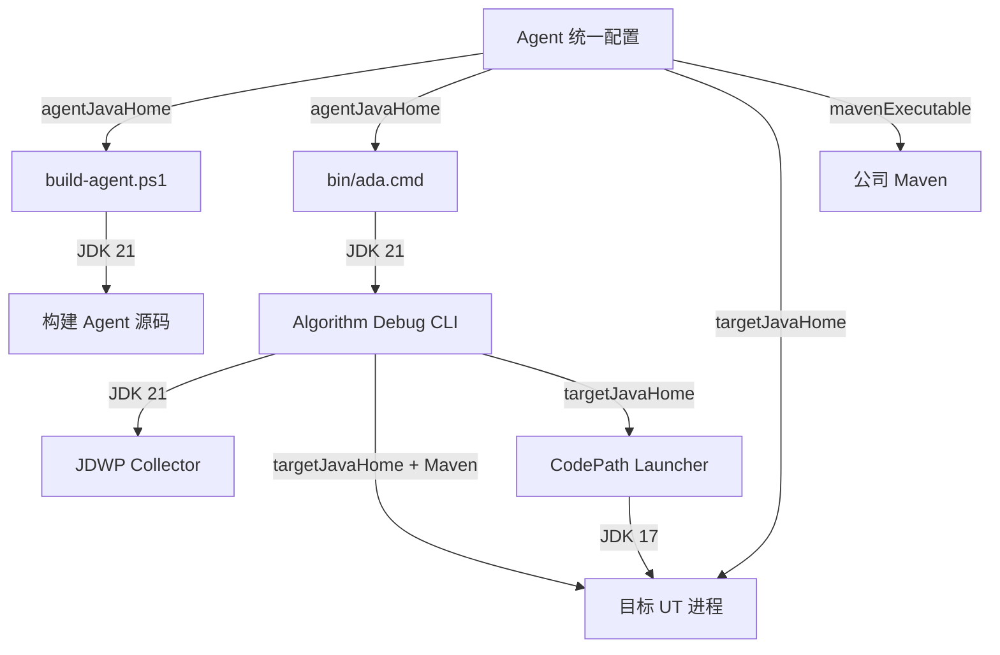

# 公司环境源码安装与双 JDK 设计

## 1. 目标

本设计解决以下实际部署场景：

- 用户从 GitHub 下载 Algorithm Debug Agent 的普通源码 ZIP，而不是仅含 JAR 的离线发行包。
- 公司 Maven 镜像可提供 Maven 插件、JUnit、Jackson 等主流依赖，但不提供 CodePathTracer。
- 公司电脑已有 JDK 17，算法模块及其 UT 继续使用 JDK 17。
- 用户可额外解压 JDK 21，但不修改系统 `JAVA_HOME`、`PATH` 或注册表。
- Agent 自身使用 JDK 21 构建和运行。
- OpenCode 在公司算法仓中启动后，既能调用 Agent 工具，也能按用户要求修改算法源码、UT 和配置。
- JDWP loopback attach 必须有仓库内可执行的验证脚本。

本设计不制作运行时专用安装包，也不复制公司算法源码到 Agent 仓。

## 2. 仓库边界

### 2.1 Agent 仓

Agent 仓负责保存：

- Agent、CLI、CodePath Launcher 和 JDWP Collector 源码。
- OpenCode Agent、Skill、Command、Custom Tool 的安装源文件。
- 构建脚本、安装脚本和 JDWP 环境验证脚本。
- CodePathTracer 的固定版本 Maven 制品及许可证。
- 默认配置、配置说明和公司环境安装说明。

### 2.2 公司算法仓

公司算法仓负责保存：

- 算法生产源码。
- 目标算法 UT。
- UT 使用的算法输入及业务配置。
- UT 运行后产生的算法结果。

OpenCode 应从公司算法模块目录启动。普通文件编辑由 OpenCode 自身工具完成；Agent Custom Tool 负责运行 UT、归档证据、静态分析、CodePath 和 JDWP 采集。两者不存在“运行时包导致不能修改源码”的限制。

## 3. CodePathTracer 依赖策略

CodePathTracer 继续作为第三方依赖，不把其上游源码合并为 Agent 模块。仓库中保存经过固定和许可确认的 Maven 制品：

```text
third-party/
  code-path-tracer/
    LICENSE
    README.md
  maven-repository/
    io/github/takahirom/codepathtracer/code-path-tracer/0.1.0-SNAPSHOT/
      code-path-tracer-0.1.0-SNAPSHOT.jar
      code-path-tracer-0.1.0-SNAPSHOT-sources.jar
      code-path-tracer-0.1.0-SNAPSHOT.pom
```

根 POM 声明仓库内 `file:` Maven Repository，路径基于 `${maven.multiModuleProjectDirectory}` 解析，Snapshot 更新策略为 `never`。因此：

- 公司 Maven 镜像继续提供主流依赖和 Maven 插件。
- CodePathTracer 仅从源码 ZIP 内的固定制品读取。
- 不依赖开发机的 `~/.m2` 缓存。
- 不使用 Maven `systemPath`。
- CodePathTracer 版本升级必须显式替换 JAR、Sources、POM、许可证说明，并执行回归测试。

## 4. 配置设计

在 Agent 仓库的统一配置中增加以下字段，默认值保留为空：

```json
{
  "agentJavaHome": "",
  "targetJavaHome": "",
  "mavenExecutable": ""
}
```

字段含义：

| 字段 | 用途 | 为空时行为 |
|---|---|---|
| `agentJavaHome` | 构建和运行 Agent CLI、JDWP Collector | 使用当前 `JAVA_HOME`，再回退到 `PATH` |
| `targetJavaHome` | 运行公司算法 Maven/JUnit 和 CodePath 目标 JVM | 使用目标进程当前 Java 环境 |
| `mavenExecutable` | 指定公司 Maven 可执行文件 | 使用 `mvn` |

配置文件必须保留带说明的默认字段，使用户知道可以修改。公司电脑只修改 Agent 仓中的这一个配置文件，不在每个算法仓创建 Agent 配置。

本地已有配置不填新字段时，行为保持不变。

## 5. 构建与安装

新增 `scripts/build-agent.ps1`：

1. 读取统一配置。
2. 校验 `agentJavaHome` 指向 Java 21 或更高版本。
3. 仅在脚本进程内临时设置构建所需的 `JAVA_HOME` 和 `PATH`。
4. 使用配置的 Maven 执行 Agent 构建。
5. 构建 CLI fat JAR、CodePath Launcher 和仓库内 JDWP Collector。
6. 使用 `finally` 恢复脚本进入前的进程环境。

脚本不得执行 `setx`，不得修改系统环境变量。现有 JDK 17 不受影响。

安装顺序：

```text
下载并解压 Agent 源码 ZIP
  -> 解压 JDK 21
  -> 编辑 Agent 统一配置
  -> 执行 build-agent.ps1
  -> 执行 install-opencode.ps1
  -> 执行 verify-jdwp-loopback.ps1
  -> 进入公司算法模块并启动 opencode
```

`install-opencode.ps1` 继续把仓库内 Agent、Skill、Command 和 Custom Tool 复制到 OpenCode 配置目录，并让 Launcher 指向 Agent 仓的 `bin/ada.cmd`。

## 6. 双 JDK 生效逻辑



箭头含义：

- 配置到脚本或进程的箭头表示该字段决定可执行程序选择。
- Agent CLI 和 Collector 使用 JDK 21。
- 算法 Maven/JUnit、CodePath Launcher 及目标 UT 使用 JDK 17。
- JDK 21 不接管公司算法构建，也不修改公司电脑的全局 Java 配置。

## 7. CodePath Launcher 的 Java 17 兼容

当前 Agent Contracts 使用 Java 21，CodePath Launcher 不能把 Java 21 Contracts JAR 带入公司 JDK 17 的目标进程。改造方式：

- CodePath Launcher 编译目标调整为 Java 17。
- Launcher 内定义最小、不可变的 `LauncherCodePathPlan` DTO。
- DTO 只包含 Launcher 实际读取的 Plan 字段。
- Plan JSON Schema 仍由 Agent Contracts 定义，Launcher DTO 通过契约测试保证可读取同一 JSON。
- 不复制 Agent 的业务逻辑，不引入第二套 Plan 生成规则。

这保证目标算法仍在 JDK 17 上运行，同时 Agent 其他模块继续使用 Java 21。

## 8. JDWP loopback 验证

仓库新增并提交：

```text
scripts/verify-jdwp-loopback.ps1
scripts/fixtures/jdwp-loopback/JdwpLoopbackProbe.java
scripts/fixtures/jdwp-loopback/collector-plan.template.json
```

验证脚本：

1. 从统一配置读取两个 JDK 路径，不接受路径命令参数。
2. 用 `targetJavaHome` 编译和启动 Probe JVM。
3. 在 `127.0.0.1` 随机可用端口开启 JDWP server。
4. 用 `agentJavaHome` 启动仓库内真实 JDWP Collector。
5. 在 Probe 断点采集局部变量 `marker=42`。
6. 校验 Raw Trace、Manifest、退出码和目标 JVM 恢复执行。
7. 超时或失败时终止自身启动的进程，并输出明确英文错误。

该脚本验证 JDK、端口、JDWP attach、Collector 和本机安全软件是否允许真实链路。它不绕过公司安全策略。

## 9. 公司算法仓使用流程

在公司算法模块目录执行 `opencode`。用户可以提出两类请求：

- 定位请求：运行目标 UT、归档控制台和 Gantt、按证据需要执行静态分析、CodePath 或 JDWP，然后解释根因。
- 修改请求：在证据支持后，由 OpenCode 修改公司算法源码或 UT，再运行目标 UT 验证。

Agent Workspace 仍位于统一配置指定的位置；公司算法源码保留在原仓。Agent 不要求为每个算法仓写额外配置文件。

## 10. 验收标准

- 当前电脑不填新配置仍可使用现有构建和安装流程。
- 公司电脑仅解压 JDK 21，不配置系统环境变量，即可构建和运行 Agent。
- 公司算法 Maven/JUnit 明确由 JDK 17 执行。
- 清空用户本地 CodePathTracer Maven 缓存后，源码 ZIP 仍可通过仓库内制品构建。
- JDWP loopback 脚本能明确报告 PASS 或具体失败环节。
- OpenCode 从公司算法模块启动后可调用 Agent，并可按用户请求修改该模块源码。
- 所有脚本输出为英文，文档说明为中文。

## 11. 非目标与风险

### 非目标

- 不制作 runtime-only 离线 ZIP。
- 不修改系统 Java 配置。
- 不把完整 CodePathTracer 上游源码合并进 Agent。
- 不自动修改公司 Maven `settings.xml`。
- 不自动绕过终端安全软件。

### 风险

- 公司 Maven 镜像若缺少构建插件或主流依赖，仍需公司镜像管理员补齐；仓库不复制全部 Maven Central。
- 公司安全软件可能禁止 JDWP loopback attach；验证脚本只能识别和报告。
- 公司算法使用超出 Java 17 的字节码或特殊测试启动器时，需要按目标仓实际构建方式增加 Adapter，但不改变双 JDK 边界。
