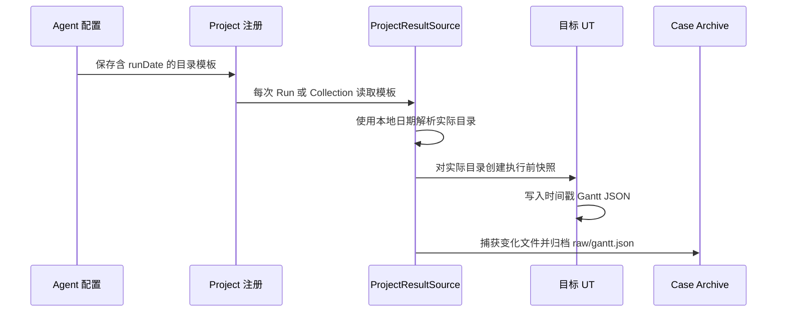

# 按运行日期解析 Gantt 输出目录

- 状态：已确认并实施
- 日期：2026-08-26
- 范围：Agent 结果目录解析和本地算法 Demo 输出目录

## 1. 问题

公司算法把每次 UT 的 Gantt JSON 写入 `D:\log\scheduler\yyyy-MM-dd\gant`，而 Agent 原先只支持固定目录。
如果继续配置 `D:\log\scheduler\gant`，UT 事实仍可归档，但 Agent 会把 Gantt 判断为 `ABSENT`。

## 2. 设计

统一配置使用 `D:\log\scheduler\${runDate}\gant`。`${runDate}` 只在 `ProjectResultSource` 创建本次
`ScheduleResultSource` 时按系统本地时区解析为 ISO 日期。安装器、OpenCode Adapter 和项目注册只透传并保存
模板。固定目录继续兼容，其他 `${...}` 标记在运行 UT 前返回明确配置错误。

普通 Run、CodePath Collection 和 JDWP Collection 已共享 `ProjectResultSource`，因此不分别实现日期逻辑。
执行前和执行后快照使用同一个已解析目录。Agent 不递归扫描历史日期，也不创建业务输出目录。

## 3. 兼容性和边界

- 原有固定绝对路径和历史相对路径行为不变。
- 不修改 CLI、Workspace Schema、Artifact 格式或 Harness 预算。
- 不支持任意日期格式、通配符或多个候选目录。
- 第一阶段按创建结果源时的日期工作，不处理跨午夜 UT 的双目录扫描。
- Demo 继续允许 `algorithm.result.directory` 系统属性覆盖完整输出目录。

## 4. 验证

- 用固定 `Clock` 验证时区和 `yyyy-MM-dd` 替换。
- 验证固定目录兼容和未知动态标记拒绝。
- 运行 Demo 全部默认 UT 和目标复现 UT，确认当天目录生成时间戳 JSON。
- 通过 Agent 运行目标 UT，确认 Workspace 中的 Gantt Artifact、Run Outcome、Case Audit 和 DFX 日志完整。

## 5. 自审

该设计只在现有统一结果源边界增加确定性路径解析，没有在三个采集链路复制代码，没有引入新依赖、配置文件、
Schema 版本或目录。日期来自可替换 `Clock`，核心行为可重复测试。

## E2E compatibility correction

A real OpenCode run found pre-existing Workspace registrations containing the removed `pomSha256` property. Project registration now ignores only this known legacy property while keeping strict rejection for every other unknown property. The regression test reads the legacy document before updating its configured result directory.
