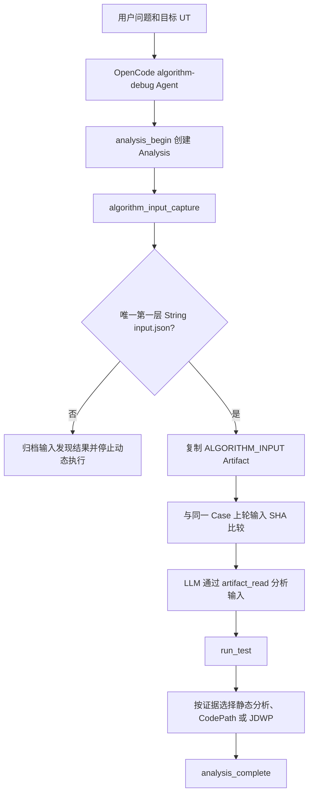
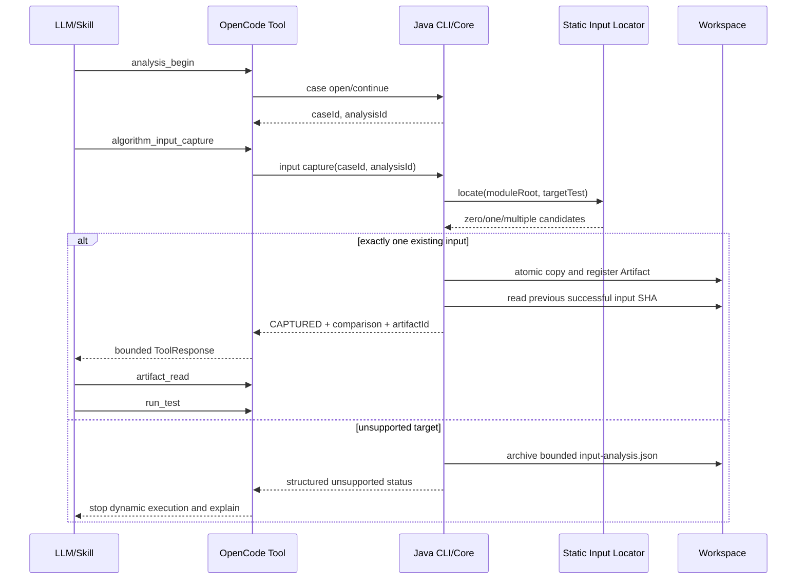

# OpenCode 安装生命周期与算法输入捕获可实施详细设计

- 文档状态：Approved
- 设计版本：1.0
- 创建日期：2026-08-27
- 目标里程碑：OpenCode 单目标 UT 可移植安装与输入证据闭环
- 关联决策：ADR-007、ADR-012

## 1. 背景与问题

当前仓库存在四个需要一次性闭环的问题：自有内容包含不必要的“目标环境/target-environment/target-environment”环境绑定表述；
`verify-ada-launcher.ps1` 从 Agent 同级目录推断 `hellomvn`；安装器只有 Install/Check，没有安全卸载；
目标 UT 中明确声明的算法输入 JSON 尚未在分析开始时归档，LLM 不能稳定获得最重要的输入证据。

## 2. 目标与非目标

### 2.1 目标

- 自有文档、代码、注释、测试和文件名使用“目标算法、目标环境、受限目标环境”等中性术语。
- 安装器不保存、不推断目标算法模块路径；目标模块只来自 OpenCode 或验证脚本当前工作目录。
- 提供幂等、安全、可验证的 OpenCode 卸载与重新安装闭环。
- 每个 Analysis 开始后确定性识别目标 UT 第一层唯一算法输入，复制为不可变 Artifact。
- 同一 Case 多轮 Analysis 使用现有 Artifact SHA 比较输入内容，明确 FIRST_CAPTURE、UNCHANGED、CHANGED。
- run_test、CodePath 和 JDWP 在当前 Analysis 没有有效输入快照时不得启动目标 UT。

### 2.2 非目标

- 不分析算法输入的领域语义，不在 Java 中生成业务结论。
- 不支持拼接、常量引用、系统属性、配置文件或辅助方法返回的输入路径。
- 不递归分析目标 UT 的 if/try/loop/lambda/local class 或被调用方法。
- 不支持一个目标 UT 使用多个不同算法输入路径。
- 不删除 Workspace、DFX、Eval、历史 Case、OpenCode 本体、Provider、模型或其他扩展。
- 不引入 JSON 规范化 SHA，不用输入 SHA 证明源码、UT、Gantt 或执行结果一致。

## 3. 路径契约

| 路径 | 唯一来源 | 是否允许用户修改 |
|---|---|---:|
| Agent 仓库 | PowerShell `$PSScriptRoot` | 否，自动发现 |
| 目标算法模块 | OpenCode/脚本当前工作目录 | 否，不保存 |
| OpenCode 配置目录 | `config/agent-settings.json` | 是 |
| Workspace/DFX/Eval | `config/agent-settings.json` | 是 |
| Gantt JSON 输出目录 | `config/agent-settings.json` | 是 |
| Agent JDK、目标 JDK、Maven | `config/agent-settings.json` 或当前环境 | 是 |

`resultJsonDirectory` 可以是绝对路径，也可以包含 `${runDate}`。它是目标算法输出约定，不是目标模块路径。

## 4. 总体方案



Workflow 决定顺序和 LLM 行为，Java Agent 负责 AST 识别、路径解析、数量检查、流式复制、SHA、归档和
执行门禁。LLM 不直接使用 shell 复制输入文件。

## 5. 算法输入识别契约

识别范围仅为目标测试方法体的直接子语句。候选必须同时满足：

1. 是局部变量声明；
2. 声明类型文本为 `String` 或 `java.lang.String`；
3. initializer 是单个字符串字面量；
4. 字符串按 `Locale.ROOT` 小写后以 `input.json` 结尾；
5. 路径是绝对路径，或可相对目标 Maven 模块根目录解析。

按规范化绝对路径去重。唯一不同路径数为 0 时返回 `ALGORITHM_INPUT_NOT_FOUND`，大于 1 时返回
`MULTIPLE_ALGORITHM_INPUTS_UNSUPPORTED`。正好 1 个时要求文件存在、可读且为普通文件。

单个输入硬上限为 256 MiB。复制采用流式 I/O、临时文件和原子提交，不把完整内容装入内存。

## 6. 模块与类设计

| 模块/类 | 职责 | 输入 | 输出 |
|---|---|---|---|
| `static-analysis/TargetTestInputLocator` | Javac AST 第一层输入候选定位 | moduleRoot、targetTest | `AlgorithmInputLocationResult` |
| `ada-contracts/AlgorithmInputSnapshot` | 版本化输入快照事实 | Case/Analysis、源锚点、Artifact | 不可变契约 |
| `ada-contracts/AlgorithmInputComparison` | 多轮内容比较 | 当前/上一 Artifact SHA | FIRST_CAPTURE/UNCHANGED/CHANGED/INCOMPARABLE |
| `case-management/CaseArchiveLayout` | Analysis 输入路径 | analysisId | discovery/snapshot 路径 |
| `case-management/CaseArchiveRepository` | 追加写输入发现和快照 | 版本化文档 | 原子归档文件 |
| `ada-core/AlgorithmInputCaptureService` | 编排定位、复制、Artifact 注册和比较 | workspace、project、case、analysis | `AlgorithmInputCaptureSummary` |
| `ada-core/AnalysisInputGate` | 动态执行前检查当前 Analysis 快照 | caseId、analysisId | 有效 Artifact 或结构化失败 |
| `algorithm-debug-cli` | `input capture` CLI 和 ToolResponse 映射 | CLI 参数 | 结构化响应 |
| `integrations/opencode` | `algorithm_input_capture` Custom Tool | caseId、analysisId | 摘要和 ArtifactReference |

## 7. Workspace 契约

```text
projects/<projectId>/cases/<caseId>/analyses/<analysisId>/input/
├── input-analysis.json
└── algorithm-input.json
```

`input-analysis.json` 始终存在于一次成功调用后。唯一输入有效时，`algorithm-input.json` 注册为
`ALGORITHM_INPUT`、`application/json` Artifact。多个、缺失或无候选时不复制候选文件，但保存有界发现事实。

输入 Artifact 的现有 `ArtifactReference.sha256` 仅用于：校验归档副本完整性、与同一 Case 上一个成功输入
Artifact 比较内容。文件名或路径变化但字节相同为 UNCHANGED；任一字节变化为 CHANGED。

## 8. 核心时序



## 9. 状态与错误

| 代码 | 是否允许动态执行 | 含义 |
|---|---:|---|
| `ALGORITHM_INPUT_CAPTURED` | 是 | 唯一输入已归档 |
| `TARGET_TEST_NOT_FOUND` | 否 | 目标 UT 不存在 |
| `ALGORITHM_INPUT_NOT_FOUND` | 否 | 第一层没有受支持的候选 |
| `ALGORITHM_INPUT_EXPRESSION_UNSUPPORTED` | 否 | 发现 input.json 意图但不是直接 String 字面量 |
| `MULTIPLE_ALGORITHM_INPUTS_UNSUPPORTED` | 否 | 存在多个不同输入路径 |
| `ALGORITHM_INPUT_FILE_NOT_FOUND` | 否 | 唯一路径不存在 |
| `ALGORITHM_INPUT_NOT_REGULAR_FILE` | 否 | 路径不是普通文件 |
| `ALGORITHM_INPUT_TOO_LARGE` | 否 | 超过 256 MiB |
| `ALGORITHM_INPUT_COPY_FAILED` | 否 | 确定性工具失败 |
| `ANALYSIS_INPUT_NOT_CAPTURED` | 否 | 动态 Tool 跳过了输入步骤 |

## 10. 多轮规则

每个新 `analysisId` 都重新定位和复制当前输入。比较只查找同一 Case 中时间上最近的成功输入 Artifact。

- FIRST_CAPTURE：没有历史成功输入；
- UNCHANGED：当前和上一成功输入 Artifact SHA 相同；
- CHANGED：SHA 不同，旧输入相关动态证据只能视为历史证据；
- INCOMPARABLE：历史索引损坏或历史 Artifact 不可验证，不能宣称相同。

输入 UNCHANGED 不代表源码或执行结果未变。CHANGED 时 Skill 必须要求重新运行目标 UT。

## 11. 安装与卸载生命周期

安装器继续从统一配置生成 OpenCode `lib/installation.mjs`。安装成功后在 OpenCode 配置目录写入
`.algorithm-debug-agent/install-manifest.json`，仅记录受管相对路径和安装时 SHA。Check 同时验证该清单。

卸载先预检查全部受管文件；有文件与安装清单 SHA 不同则在删除前整体失败。校验通过后删除受管文件和清单，
只移除已变空的 Agent 专属目录。Workspace、诊断、评测和其他 OpenCode 内容不删除。重复卸载返回成功。

## 12. 测试设计

### 12.1 输入单元测试

- 第一层相对路径、绝对路径、任意目录深度和大小写后缀；
- 多个不同路径、无候选、缺失文件、目录、超限文件；
- 拼接、字段常量、单独赋值、if/try/lambda/helper 中路径不被误接受；
- 多轮 FIRST_CAPTURE、UNCHANGED、CHANGED；
- run_test、CodePath、JDWP 在无当前 Analysis 输入时不启动外部进程。

### 12.2 安装生命周期测试

- Install/Check、重复 Install、Uninstall、重复 Uninstall、重新 Install；
- 不相关 sentinel 和 Workspace 在卸载后保留；
- 已修改受管文件导致卸载预检查失败且不发生部分删除；
- 脚本和自有内容不存在环境绑定术语或 `hellomvn` 推断。

### 12.3 端到端测试

- 本地目标算法 Demo 从当前目录完成输入捕获、Artifact 读取、UT、Gantt、Case 审计和完成分析；
- 多输入目标 UT 在启动 Maven 前停止；
- 当前 OpenCode 配置完成卸载、确认缺失、重新安装和真实能力发现。

## 13. 兼容与迁移

旧 Case 没有输入快照时可以读取，但任何新的动态执行都必须先在当前 Analysis 捕获输入。首次使用新安装器时
Install 生成所有权清单；之后卸载按清单安全执行。配置 Schema 继续为 1.0，不增加目标项目路径字段。

## 14. 风险与缓解

| 风险 | 影响 | 缓解 |
|---|---|---|
| UT 使用复杂路径表达式 | 不能捕获 | 明确返回 unsupported，不猜测 |
| 大输入占用 Workspace | 磁盘增长 | 256 MiB 硬上限、每 Analysis 可审计快照 |
| 输入变化但复用旧证据 | 错误结论 | SHA 比较和 Skill 强制重跑提示 |
| 卸载误删用户文件 | 数据损失 | 安装清单、全量预检查、冲突时零删除 |
| 旧安装无清单 | 首次卸载不可验证 | 先执行一次新 Install 完成清单迁移 |

## 15. 实现完成记录

实现结束后记录实际变更、测试命令、端到端 Workspace 文件和已知限制；不得以编译通过替代行为验证。


## 16. 变更记录：异常场景过度取证

真实 OpenCode `algorithm-loop-guard` 验收中，`run_test` 已提供异常类、规范化消息和首个业务栈帧，模型仍继续执行静态分析、JDWP、多次重复 Artifact 读取和通用子任务，最终超过 Eval 600 秒预算。Java Run、JDWP Collection、Workspace Audit 和 DFX 均成功，根因是 Skill 停止条件不够具体。

行为修正：动态采集不得作为通用的“增加信心”步骤；当异常事实和当前源码已足以解释抛出条件时立即完成。只有用户明确要求运行路径/状态，或一个具名运行时值能够区分两个仍成立的源码解释时，才使用 CodePath/JDWP。专用 Agent 禁止派生通用 task 子代理。回归测试由 `algorithm-loop-guard` 要求单次目标执行且禁止动态采集，独立 CodePath/JDWP Case 继续验证动态能力。
## 17. 变更记录：DFX 与 Case Audit 边界

多轮 Java CLI 验收发现，CLI 能完整创建 Case 和输入 Artifact，但不会经过 OpenCode JS Recorder，因此没有 `interaction.jsonl`；旧 Case Auditor 无条件要求该文件，导致完整业务产物被误判失败。这也与 `dfxEnabled=false` 和 Recorder 失败不得替代业务 ToolResponse 的契约冲突。

行为修正：`interaction.jsonl` 改为可选控制文件。存在时 Case Auditor 继续严格校验 JSONL；关闭 DFX、Recorder 失败或直接 Java CLI 调用时，缺失不构成业务 Case 问题。真实 OpenCode Eval 继续由独立 Interaction Audit 要求并验证日志，因此不会降低 OpenCode 端到端可观测性门禁。