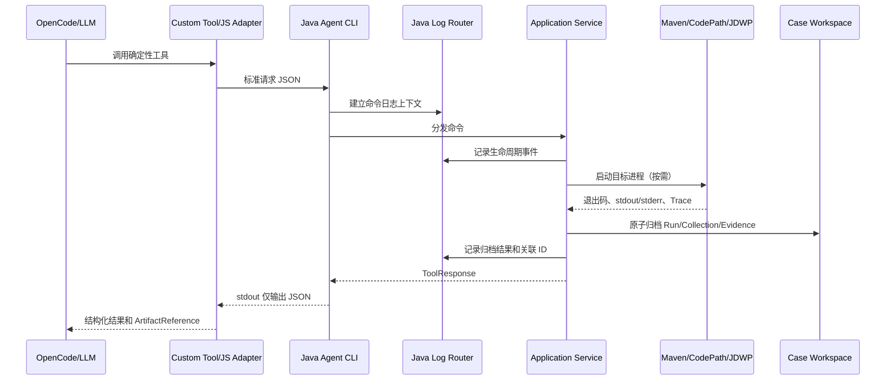

# Java Case 文件日志设计

## 1. 背景与目标

当前 OpenCode Adapter 已记录工具边界的 `interaction.jsonl`，Java Agent CLI 仍缺少内部执行日志。出现进程启动、归档、采集或校验故障时，只能从 ToolResponse 和零散产物反推执行位置。

本设计增加只写文件的 Java 执行日志，用于回答以下问题：

- Agent 收到了哪个命令，执行到了哪个阶段。
- Maven/JUnit、CodePath、JDWP 子进程是否启动、退出或超时。
- 输入、Gantt、Trace、Evidence 等产物是否完成归档。
- Agent 内部异常在哪个责任边界发生，并保留完整 cause 链。

日志不是业务证据，不参与算法结论，不替代 ToolResponse、Run Manifest、Raw Trace 或 Evidence Bundle。

## 2. 范围与非目标

### 2.1 本期范围

- Java CLI、Case、算法输入、UT、静态分析、CodePath、JDWP、Evidence 的关键生命周期事件。
- Case 日志和 bootstrap 日志的确定性路由。
- 英文纯文本格式、敏感信息清理、异常堆栈渲染。
- 日志写入失败隔离，保证 stdout 仍只输出 ToolResponse JSON。
- 单元、集成和关键端到端验证。

### 2.2 非目标

- 不增加 OpenCode Observability Plugin、后台线程、日志服务、数据库或日志查看器。
- 不记录 Prompt、回答、算法输入正文、Gantt 正文、JDWP 变量值或 Raw Trace。
- 不自动清理、压缩、上传日志。
- 不把日志作为 Evidence，不据此提升结论置信度。
- 不为手动从 IDE/Maven 启动且未经过 Agent 的 UT 生成 Agent 日志。

## 3. 路径契约

### 3.1 Case 已知

```text
<workspace>/projects/<projectId>/cases/<caseId>/logs/agent-YYYY-MM-DD.log
```

路径由统一路由器根据 `CaseArchiveLayout` 解析。业务服务不得拼接日志路径，也不得从 Tool/CLI 参数接收日志路径。

### 3.2 Case 尚未建立或启动失败

```text
<dfxDirectory>/java/agent-bootstrap-YYYY-MM-DD.log
```

`dfxDirectory` 来自安装配置。成功的独立 Workspace 初始化、Project 注册和 Doctor 检查不生成持久 Java 日志；失败时才写 bootstrap 日志。Case Open 在内存中暂存事件，成功后写入新 Case，失败后写入 bootstrap。

### 3.3 子进程原始输出

目标 UT 的标准输出和错误输出仍归档到：

```text
<case>/runs/<runId>/raw/stdout.log
<case>/runs/<runId>/raw/stderr.log
```

Collector 输出继续保存在对应 Collection Raw 目录。Java Agent 日志只记录引用 ID、状态、退出码、耗时和截断标志。

### 3.4 创建规则

- 首个事件写入时才创建目录和文件，不产生空目录或空日志。
- 同一天追加到同一文件，不覆盖已有内容。
- 路径必须规范化并限制在目标 Case 或 DFX 根目录内。
- 日志路径不可写时不回退到未知目录，不改变业务返回结果。

## 4. 日志格式

每个事件使用一行英文纯文本：

```text
2026-08-28T10:15:30.123+08:00 INFO component=RunApplicationService event=RUN_EXECUTION_STARTED outcome=STARTED projectId=p1 caseId=c1 runId=r1 message="Target test execution started"
```

固定字段：

- `timestamp`：带时区 ISO-8601 时间。
- `level`：`INFO`、`WARN`、`ERROR`，`DEBUG` 默认关闭。
- `component`、`event`、`outcome`、`message`。
- 可选关联字段：`projectId`、`caseId`、`analysisId`、`runId`、`planId`、`collectionId`、`evidenceId`、`artifactId`。
- 可选诊断字段：`durationMillis`、`code`、`command`、`exitCode`、`truncated`。

所有运行时日志内容使用英文。字段按固定顺序输出，动态值转义换行、引号和控制字符。

## 5. 脱敏与异常策略

### 5.1 禁止记录

- 用户问题、LLM 回答、完整命令行和环境变量。
- 算法输入、Gantt、Trace、局部变量或对象字段正文。
- 凭据、令牌、账号、网络地址和未脱敏业务绝对路径。

绝对路径统一替换为 `<redacted-path>`；关联产物只记录稳定 ID 或 Case 内相对路径。

### 5.2 异常

- 异常继续用于控制流、清理和 ToolResponse 错误映射，不能因增加日志而删除异常。
- 传播到 CLI 边界的异常只由 `AdaMain` 记录一次完整堆栈和 cause 链。
- 被捕获并转换、不再向上抛出的异常，由转换点记录一次完整堆栈。
- 目标 UT 堆栈保存在 Surefire/raw 产物，Collector 堆栈保存在 Collector stderr；Agent 日志只记录状态和引用。
- 日志自身失败被吞并，不得覆盖原异常，不得修改 ToolResponse。

## 6. 事件边界

| 组件 | 主要事件 |
| --- | --- |
| `AdaMain` / `CliCommandExecutor` | CLI 开始、分发、完成、失败 |
| `CaseApplicationService` | Case 打开、复用、Analysis 创建、检查、完成、Artifact 读取/截断 |
| `CaseWorkspaceAuditor` | Case 审计开始、完成 |
| `AlgorithmInputApplicationService` | 输入定位、候选校验、复制、复用比较、完成 |
| `RunApplicationService` | UT 启动、进程退出、结果分类、Gantt 捕获、产物归档、完成 |
| `MavenTestExecutor` / `ExternalProcessRunner` | 子进程启动、退出、超时、终止 |
| `StaticAnalysisApplicationService` | 静态分析和 CodePath/JDWP Plan 创建 |
| `JavaSourceCallGraphAnalyzer` | 源码解析开始、完成、部分结果 |
| `CollectionApplicationService` | CodePath Launcher、Raw Trace、基线、规范化、校验、Evidence、完成 |
| `JdwpCollectionApplicationService` | 目标 JVM、Collector、Attach、Raw Trace、基线、规范化、校验、Evidence、完成 |
| Normalizer / Validator / Evaluator | 规范化、确定性校验、证据充分性结果 |

Repository 不记录每次读取，只在关键记录原子提交失败时由上层异常边界记录。

## 7. 交互流程



箭头含义：调用箭头表示同步控制流；返回箭头表示结构化结果。日志路由器只旁路写盘，不参与 ToolResponse 计算。Workspace 中的原始输出和证据是 LLM 分析输入，Java 日志仅供执行故障复盘。

## 8. 技术实现

- 使用轻量内部日志门面和 JDK 文件 API，避免为少量确定性文件日志引入新的运行时框架依赖。
- `AgentLogContext` 保存命令关联 ID，不保存正文数据。
- `CaseLogPathResolver` 负责受限路径计算。
- `JavaExecutionLogRouter` 负责 Case/bootstrap 路由、缓冲与失败隔离。
- `AgentLogFormatter`、`SensitiveLogSanitizer`、`ThrowableLogRenderer` 分别负责格式、脱敏和堆栈。
- 文件追加采用进程内锁与 append 模式；每条事件一次写入，避免覆盖。跨进程允许行级顺序不同，但不允许丢失或截断已有日志。

采用内部实现的原因：目标仅是单一文本文件协议；引入 SLF4J/Logback 会增加离线安装依赖、绑定配置和潜在 stdout 状态输出。若未来出现多 Appender、级别动态配置或远程采集需求，再通过 ADR 评估框架迁移。

## 9. 失败处理

| 场景 | 行为 |
| --- | --- |
| Case 路径可写 | 写 Case 日志 |
| Case Open 成功 | 将缓冲事件刷新到新 Case |
| Case Open 失败 | 将缓冲事件和异常写 bootstrap |
| DFX 路径不可写 | 丢弃日志写入失败，保留原 ToolResponse |
| UT/Collector 失败 | 按业务规则归档 Raw 输出并返回结构化失败；Agent 日志记录状态 |
| Agent 内部异常 | CLI 边界写一次完整堆栈，返回既有错误码 |

## 10. 验收标准

- Case 命令的日志只出现在对应 Case 的 `logs` 目录。
- 启动/Case 创建失败只写 bootstrap；成功独立命令不生成 Workspace 级日志。
- stdout 保持单一合法 ToolResponse JSON，不含日志文本。
- 日志全英文、固定格式、绝对路径和敏感字段已脱敏。
- Agent 异常包含完整堆栈和 cause，且同一异常不重复打印。
- 日志写入失败不改变业务状态、退出码和 ToolResponse。
- 正常、目标 UT 不存在、算法异常、断言失败、CodePath、JDWP 用例均能从日志定位阶段，并且 Workspace 审计通过、无空目录和无意义文件。

## 11. 兼容性与风险

- 不修改 ToolResponse、Case/Run/Collection Schema，属于向后兼容的附加观测产物。
- 日志不是必需 Artifact，旧 Workspace 仍可读取。
- 多进程同时追加同一日期文件时，事件顺序以各行时间戳和关联 ID 判断；本期不引入集中式日志锁服务。
- 运行数据脱敏优先于诊断完整性，详细业务正文仍从受权限控制的 Case 证据文件查看。

