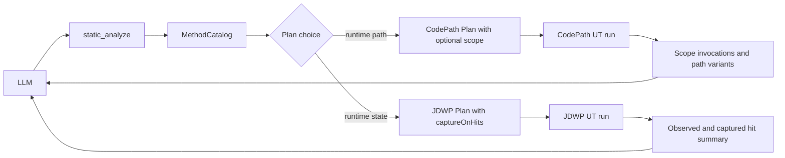
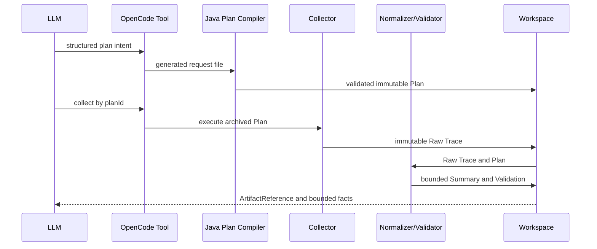

# Static Analysis and Runtime Evidence Optimization Design

- 文档状态：Approved
- 设计版本：1.0
- 创建日期：2026-08-28
- 目标里程碑：大型单模块算法 UT 的静态与动态证据优化
- 关联需求：提高 LLM 选择 CodePath/JDWP 采集位置和解释重复调用的能力

## 1. 背景与问题

当前静态分析使用 JDK javac 生成 `MethodCatalog`，但没有使用目标模块完整 Maven Test
Classpath，接口和抽象方法调用也只保留 javac 的声明目标。CodePath Raw Trace 能保留每次方法
进入和退出，但派生摘要会把重复调用汇总，LLM 难以比较主循环中不同调用。JDWP 只能采集前
`maxHits` 次命中，不能低成本获取后续指定调用序号的状态。

本设计在现有边界内增强确定性证据，不向 Java 代码加入算法业务语义。

## 2. 目标与非目标

### 2.1 目标

- 静态分析在可用时使用 Maven Test Classpath，并在不可用时明确降级。
- 区分直接静态调用和当前源码范围内的多态候选调用。
- CodePath 能按一个可选 Scope 方法划分重复调用并聚类路径变体。
- JDWP 能观察多次断点命中但只在指定序号采集状态。
- OpenCode Tool 使用结构化 Plan 参数，减少 LLM 手写协议字段。
- DFX 记录阶段摘要、预算和失败栈，不记录源码、算法输入或变量值。

### 2.2 非目标

- 不引入 JavaParser、Spoon、图数据库、完整 points-to analysis。
- 不处理跨 Maven 模块完整调用图、反射目标推断和多线程 Trace 关联。
- 不理解 wafer、lot、chamber、策略等业务语义。
- 不设固定采集轮数，不把 5 到 15 个方法作为工作流规则。
- 不增加 Source、CodePath 或 Gantt SHA 正确性门禁。
- 不生成每次 Scope 调用一个独立文件，不新增知识引擎或数字置信度模型。

## 3. 现状与约束

- 目标是单个明确算法 UT，CodePath 和 JDWP 每次采集都会独立重跑 UT。
- LLM 负责规划和证据充分性判断，Java 负责解析、校验、采集和归档。
- Raw Trace 只读，派生产物追加到当前 `analysisId`，不覆盖历史证据。
- CodePath 单 Plan 最多 50 个方法是性能安全限制，不是推荐采集数量。
- 当前阶段按用户确认暂不处理多线程；Scope 配对以单线程有序事件为前提。

## 4. 用例与验收标准

| 用例 | 输入/前置条件 | 预期结果 | 验证层级 |
|---|---|---|---|
| Test Classpath 可用 | Maven 目标模块可解析测试依赖 | 外部测试类型可解析，MethodCatalog 告警减少 | Integration |
| Test Classpath 不可用 | Maven Classpath 解析失败 | static_analyze 继续，状态为 INCOMPLETE | Unit/E2E |
| 接口分派 | 调用接口且源码中有多个实现 | 输出 DIRECT 声明边和 POLYMORPHIC_CANDIDATE 边 | Unit |
| 重复 Scope | Scope 方法运行 15 次 | 15 个 invocation，路径相同时 1 个 variant | Unit/E2E |
| 路径离群 | 第 8 次 Scope 进入额外分支 | variant 能关联 invocation ordinal 8 | Unit |
| JDWP 稀疏命中 | maxHits=15，captureOnHits=[1,8,15] | 观察 15 次，只保存 3 个快照 | Unit/Integration |
| 工具工作流 | OpenCode 创建结构化 Plan | JS 生成 ID/时间，Java 确定性校验 | Contract/Eval |

## 5. 总体方案



静态分析只提供直接关系和候选关系。CodePath 用运行时事件确认实际路径；JDWP 在路径已聚焦后
采集少量状态。Agent 不自动串联三者，由 LLM 根据证据充分性选择下一步。

## 6. 模块与类设计

| 模块/类 | 职责 | 变化 |
|---|---|---|
| `JavaSourceCallGraphAnalyzer` | javac 源码目录和调用边 | 接收 Classpath，增加多态候选边和英文诊断 |
| `MethodCallEdge` | 静态调用关系 | 增加可选 resolution kind |
| `CodePathPlanRequest/Compiler` | CodePath 意图校验 | 增加可选 scopeMethodKey |
| `MethodPathNormalizer` | Raw CodePath 派生 | 生成 Scope invocation 和 path variant |
| `JdwpTracepointRequest/Spec` | JDWP 断点采集意图 | 增加可选 captureOnHits |
| `TracePlanExecutor` | JDWP 断点执行 | 分离 observed hit 和 captured hit |
| OpenCode Tool/JS Adapter | LLM 工具适配 | 接收结构化字段，生成 ID、时间和请求文件 |

## 7. 数据与契约设计

### 7.1 MethodCallEdge

增加可选枚举：

```text
DIRECT
POLYMORPHIC_CANDIDATE
```

旧产物缺失该字段时按 `DIRECT` 读取。候选边不能作为运行时事实。

### 7.2 CodePath Plan 和 Summary

Plan 增加可选 `scopeMethodKey`。该方法必须在 MethodCatalog 和 selectedMethodKeys 中。

MethodPath Summary 增加可选：

```text
scope
invocations[]
pathVariants[]
```

`PATH_001` 是当前摘要内顺序 ID，不是哈希。Raw CodePath Schema 不变。

### 7.3 JDWP Plan 和 Summary

Tracepoint 增加可选 `captureOnHits`。缺失时保持采集前 `maxHits` 次的旧行为。存在时序号必须
唯一、升序、正数且不大于 `maxHits`。

Raw Snapshot 增加可选命中序号；Summary 增加 observed、captured、skipped 统计。旧产物读取时
允许这些字段缺失。

## 8. 核心流程



Plan Compiler 拒绝未知方法、非法行号、非法预算和非法命中序号。Collector 失败仍保留 manifest、
stdout/stderr 和 DFX 栈。Normalizer 不调用 LLM。

## 9. 错误处理与可观测性

- Maven Classpath 失败：静态分析降级并记录 `TEST_CLASSPATH_UNAVAILABLE`。
- Scope 未命中或事件不配对：摘要为 PARTIAL，不宣称路径一致。
- JDWP 未到达请求序号：记录 observed/captured 差异并标为 PARTIAL。
- DFX 只记录 caseId、analysisId、planId、计数、预算、状态、耗时和异常栈。
- 不记录源码内容、输入 JSON、局部变量值、对象字段值和 Raw Event 明细。

## 10. 性能与容量预算

- 继续使用现有文件数、方法数、调用边、事件数、Raw 字节数、超时和对象展开预算。
- 多态候选边受现有全局 `maxEdges` 控制，不增加每调用点的复杂预算。
- Scope 摘要受现有 NormalizationBudget 控制；超限时标记 truncated。
- JDWP 未选择的命中只计数并立即 resume，不展开变量；仍承认断点命中的短暂停顿。
- 不记录逐事件 DFX 日志。

## 11. 安全、隐私与无侵入性

- 不修改目标算法生产源码。
- 使用外部 JUnit Launcher、CodePath Agent 和 JDWP loopback attach。
- 所有路径继续由统一配置和当前项目上下文解析。
- 新字段不得包含未脱敏业务值。

## 12. 测试设计

- 单元：Classpath 降级、直接/候选边、Scope 配对/聚类、JDWP 稀疏命中。
- 契约：旧 JSON 兼容、新字段 Schema、非法 Plan 拒绝。
- 集成：真实 CodePath Launcher、真实 JDWP Collector。
- E2E：成功 UT、业务异常、断言失败、Scope 重复调用、指定命中快照。
- Eval：真实 OpenCode 结构化工具调用和 Workspace/DFX 完整性。

## 13. 实施步骤

1. 先增加失败测试和兼容契约。
2. 实现静态 Classpath、多态候选边和 DFX。
3. 实现 CodePath Scope 摘要和校验。
4. 实现 JDWP captureOnHits 和命中统计。
5. 更新 OpenCode Tool、Agent、Skill、Schema 和文档。
6. 执行模块测试、根项目测试、真实 E2E 和产物审计。

## 14. 兼容、迁移与回滚

- 新 Schema 字段均为可选，旧产物仍可读取。
- OpenCode Tool 是安装副本，仓库修改后需重新安装；不长期保留旧 requestJson 入口。
- Java CLI 的内部请求文件机制保持不变。
- 任一动态能力失败不覆盖之前 Raw Trace，可回退到当前静态/动态证据。

## 15. 风险

| 风险 | 影响 | 缓解措施 | 状态 |
|---|---|---|---|
| Maven 插件在受限镜像不可用 | Classpath 不完整 | 降级为 INCOMPLETE，不阻塞静态分析 | Resolved |
| 多态候选过多 | MethodCatalog 增大 | 使用现有 maxEdges 并标记截断 | Resolved |
| Scope 事件因截断不配对 | 路径聚类不完整 | invocation 标记 incomplete，Validator 降级 | Resolved |
| JDWP 高频断点仍有暂停 | UT 运行变慢 | 稀疏展开、maxHits、超时和立即 resume | Resolved |
| 多线程事件交错 | Scope 配对不可靠 | 当前明确不支持，后续独立设计 | Accepted |

## 16. 文档同步清单

- [x] Mermaid 流程和时序
- [ ] Schema 与契约说明
- [ ] Agent/Skill 工作流
- [ ] current-capabilities
- [ ] Eval Case 与最终审计

## 17. 实现完成记录

实现完成后填写实际变更、验证命令、E2E 路径、已知限制和偏差。

## 18. 变更记录

| 日期 | 版本 | 变更内容 | 作者 |
|---|---|---|---|
| 2026-08-28 | 1.0 | 初始批准设计 | Codex |
## 实施与验收结果（2026-08-28）

本设计已按精简边界完成实施：

- 静态分析使用 Maven test classpath，方法调用边区分 `DIRECT` 与 `POLYMORPHIC_CANDIDATE`；classpath 无法解析时保留有界 `INCOMPLETE` 结果和结构化诊断，不伪造完整调用图。
- CodePath Plan 增加可选 `scopeMethodKey`。Normalizer 按该方法的每次进入/退出划分独立调用，并生成稳定的路径变体；不在 Java 代码中写死方法数量、采集轮数或业务语义。
- JDWP Tracepoint 增加可选 `captureOnHits`。Collector 仍统计所有命中，但只在选定命中序号暂停并展开状态；`maxHits` 继续作为生命周期上限。
- OpenCode Tool 改为结构化参数。`planId`、`tracepointId`、时间和默认预算由 Adapter 确定性生成，大模型只选择方法、Scope、断点和投影字段。
- Skill 已补充静态候选边、CodePath Scope、路径变体和 JDWP 稀疏命中的决策规则，明确按证据缺口决定是否继续采集，不规定固定轮数。

回归与构建结果：

- 根 Maven 全模块测试通过。
- CodePath Launcher 测试通过，JDWP 相关 25 项定向测试通过。
- OpenCode Adapter Node 测试 40/40 通过，Eval Harness 测试 5/5 通过。
- `scripts/build-agent.ps1` 构建通过，安装器 `Install` 与 `Check` 均通过。

真实 OpenCode 端到端结果：

- 静态分析用例通过：解析 13 个 test classpath 条目，产出 33 个方法、48 条调用边、0 条编译诊断。
- CodePath 用例通过：采集 2878 条事件、856892 字节，归一化状态 `COMPLETE`；Scope 共 15 次调用，15 次完整、0 次不完整，聚合为 1 个路径变体，无截断。Workspace 预期与实际产物均为 50，交互审计 189 个事件，0 个问题、0 个空目录、0 个真实错误日志。
- JDWP 用例通过：一个 Tracepoint 使用 `maxHits=1`、`captureOnHits=[1]`，命中并保留 1 个 Snapshot；Raw Trace 为 3 条记录、6938 字节，Collector 与目标 JVM 退出码均为 0。对象展开触发 `COLLECTOR_VALUE_LIMIT`，因此 Normalizer 正确标记 `PARTIAL`，Validator 仍为 `VALID`，Evidence 可用；Workspace 预期与实际产物均为 58，交互审计 99 个事件，0 个问题、0 个空目录、0 个错误日志。

验收中发现并修复了两个真实集成缺陷：Launcher DTO 未接受 `scopeMethodKey`，以及 Eval 的 CodePath 必需文本正则存在乱码。两项均补充了回归测试。当前保留的 `PARTIAL` 是 JDWP 值展开预算的可见结果，不是失败，也不得由 LLM 宣称未保留字段已被确认。
