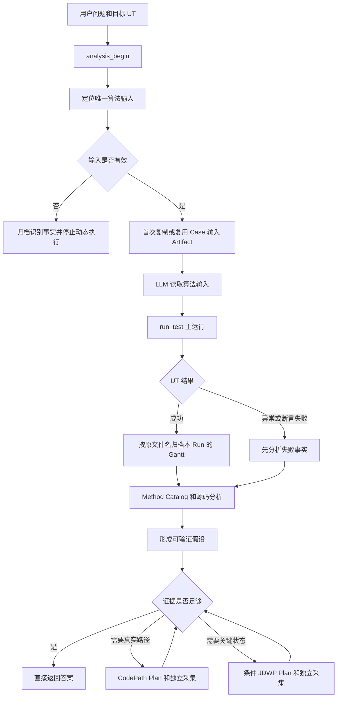

# 输入优先的因果证据与条件 JDWP 可实施设计

- 文档状态：Approved
- 设计版本：1.0
- 创建日期：2026-09-01
- 适用范围：单 Maven 算法模块、单目标 JUnit UT、OpenCode algorithm-debug Agent
- 取代设计：算法输入捕获、静态与运行时证据优化、P3 JDWP 集成和 Demo 领域知识主动加载的旧设计

## 1. 目标与边界

本设计把算法输入作为初始世界状态，把 UT 输出 Gantt 作为待解释现象，把 Method Catalog 和源码作为候选因果路径，
把 CodePath 和 JDWP 作为按证据缺口选择的运行时验证工具。LLM 负责提出假设、选择下一步证据和解释；Java 只负责
定位、复制、解析、校验、采集、预算、关联和归档。

本设计不新增业务规则引擎、Gantt 语义引擎、JSON 业务解释器、Decision Catalog、符号执行、因果图数据库、固定采集轮数
或数字置信度模型。Collector 不包含 wafer、chamber、job 或调度策略语义。

## 2. 核心数据流



CodePath 和 JDWP 都独立重新运行目标 UT。它们归档自己的 Run、Plan、Raw Trace、派生摘要和 Evidence，但不把采集运行
产生的 Gantt 注册为新的主要 Gantt Artifact。新的采集轮次通过新的 Plan、Collection 和 Evidence 追加保存。

## 3. 算法输入契约

目标 UT 方法第一层直接声明的候选必须同时满足：

1. 类型为 `String` 或 `java.lang.String`。
2. initializer 是单一字符串字面量。
3. 文件名按 `Locale.ROOT` 小写后以 `input.json` 或 `input_.json` 结尾。
4. 路径是绝对路径，或能相对目标 Maven 模块根目录解析。
5. 规范化绝对路径去重后恰好只有一个候选。

首次成功捕获时，使用源文件 basename 作为归档文件名，不再改名为 `algorithm-input.json`。复制使用流式 I/O、临时文件、
原子提交和无覆盖写入。Artifact SHA 只用于归档完整性验证和幂等复用，不作为业务正确性或源码一致性门禁。

同一 Case 后续 Analysis 重新执行确定性定位，但复用 Case 已有输入 Artifact，不复制第二份。源路径或内容已经变化时返回
`ALGORITHM_INPUT_CHANGED`，不覆盖旧证据；新的输入应开始新 Case。同一 Analysis 的重复 Tool 调用返回同一 ArtifactReference。

## 4. Gantt 归档契约

`run_test` 在启动 UT 前后快照配置的 Gantt 目录，只接受本 Run 唯一新增或变化且可解析的 JSON。归档使用源文件 basename，
不再统一改名。同一 `runId` 的重试不重复复制；用户重新执行 `run_test` 会创建新 `runId` 并归档该次结果。

CodePath/JDWP 运行不注册主要 Gantt。多个变化 JSON 返回歧义状态；没有 Gantt 不改变 UT 的成功、异常、断言失败或未执行事实。
Gantt 内容 SHA 不参与动态证据门禁。

## 5. 静态分析和 CodePath

现有 Method Catalog、Maven Test Classpath、直接调用边和有界多态候选继续作为静态入口。LLM 读取输入和源码后选择方法；
Java 不生成业务分支结论。本阶段不增加 Decision Catalog。

CodePath Collector 保持方法级进入/退出采集，不增加对象值条件。Plan 增加调查意图和 Evidence lineage；现有 Scope、路径变体、
事件数、字节数和超时预算保持。不得把 5 到 15 个方法或固定轮数写成工作流规则。

## 6. InvestigationIntent

CodePath 和 JDWP Plan 使用同一个小型不可变契约：

```json
{
  "questionToAnswer": "Which runtime state caused the delayed operation?",
  "hypothesis": "Another object may occupy the required resource.",
  "basedOnEvidenceIds": ["evidence-001"],
  "expectedObservations": ["Actual strategy implementation", "Resource occupant"]
}
```

文本、列表长度和 ID 格式由 Contracts 校验。Core 在归档 Plan 前校验 Evidence 存在且属于当前 Case；允许引用同一 Case 的历史
Analysis Evidence。Java 不判断问题、假设或预期观察的业务真实性。

## 7. 条件 JDWP

条件只读取断点栈顶帧的一个局部变量或方法参数，并沿普通实例字段路径读取值。第一版只支持 `EQUALS`，期望值支持字符串、
整数、浮点数、布尔值、字符、枚举名和 null。禁止调用方法、getter、表达式求值、集合过滤、数组查询和目标 JVM 状态修改。

```json
{
  "localName": "waferContext",
  "fieldPath": ["waferId"],
  "operator": "EQUALS",
  "expected": {"type": "STRING", "value": "W1"}
}
```

每个 Tracepoint 使用下列独立计数：

| 字段 | 含义 |
|---|---|
| `observedHits` | 断点物理触发次数 |
| `matchedHits` | 条件返回 MATCHED 的次数；无条件时等于 observedHits |
| `capturedHits` | 完整快照写盘次数 |
| `unavailableHits` | 条件无法确定计算的次数 |

计划使用 `maxObservedHits`、`maxCapturedHits`、`captureFirstMatchedHits` 和
`captureEveryMatchedHits`。条件结果必须区分 `MATCHED`、`NOT_MATCHED`、
`UNAVAILABLE`。UNAVAILABLE 保留第一个确定性原因。条件不匹配时立即恢复事件线程，不展开对象图。硬预算同时包含断点观察数、
快照数、Raw 事件数、字节数、对象深度、字段项数、字符串长度、总超时和空闲超时。

## 8. Schema 与兼容

新的 CodePath/JDWP Plan 和 Collector Plan 升级主版本。当前写入只产生新版本；历史 v2 Schema 保留用于旧 Workspace Artifact
校验，不允许把旧 Plan 重新绑定到新源码执行。Collector 内部不再保留无真实调用方的 v1 运行时兼容分支。

输入和 Gantt Artifact 路径行为是新 Case 的行为变化。旧 Case 继续只读；不得迁移、覆盖或重命名历史文件。

## 9. Skill 停止条件

Skill 必须先读输入，再运行主 UT，再结合 Gantt/失败事实和源码形成假设。只有实际调用路径不确定时使用 CodePath；只有运行时值
能区分剩余假设时使用 JDWP。证据指向其他对象时，新 Plan 必须引用来源 Evidence。异常事实和当前源码已经足以解释时立即停止。

最终答案区分 `CONFIRMED_FACT`、`VALIDATOR_CONCLUSION`、`SOURCE_INFERENCE`、`LLM_HYPOTHESIS` 和 `MISSING_EVIDENCE`。

## 10. DFX 与安全

DFX 记录 caseId、analysisId、runId、planId、collectionId、阶段、预算、observed/matched/captured/unavailable 计数、停止原因和异常栈。
不得记录算法输入内容、源代码、变量值、凭据或未脱敏绝对路径。日志失败不得改变 Tool 的业务结果。

## 11. 验证与 Eval

所有行为按 Red-Green-Refactor 实现。每阶段先运行受影响模块测试，再运行依赖模块测试。跨契约阶段运行根项目 `mvn test`。
最终真实 OpenCode E2E 覆盖主运行、CodePath、条件 JDWP、条件不可用、错误假设拒绝和跨对象因果追踪，并逐 Case 审计
Workspace 文件、Schema、Artifact 完整性、Interaction 和 DFX 日志。
