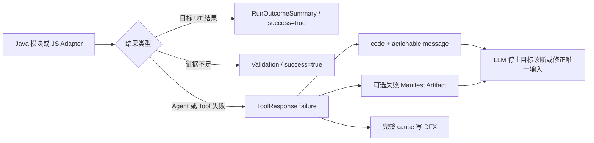

# 面向模型的错误闭环设计

## 1. 目标

在不增加队列、锁、自动重试、日志读取 Tool 或错误状态机的前提下，使 OpenCode 中的大模型能够区分目标 UT 结果、证据不足和 Agent/工具失败，并据此停止错误推断或执行唯一必要的恢复动作。

本设计不依赖任何具体算法 Demo。所有行为仅依赖 Java/Maven 目标 UT、现有 Case/Analysis、现有采集契约和安装配置。

## 2. 保持不变的边界

- 保留 `ToolResponse 2.0` 的 `success/code/message/data/artifacts`，不升级 Schema。
- 目标 UT 异常、断言失败和构建失败仍作为 `RunOutcomeSummary` 返回，不伪装成 Agent 崩溃。
- Validation、Sufficiency 和截断仍是结构化结果，不使用异常代替证据不足。
- Java 和 JS DFX 日志继续供人工诊断，不开放日志读取 Tool，也不作为算法 Evidence。
- `run_test`、`codepath_collect` 和 `jdwp_collect` 继续使用单会话门禁，不排队、不加锁、不自动重试。
- 最终答案继续由 Agent、Skill 和 Eval 约束，不增加答案重写中间件。

## 3. 模型可见错误契约

`success=false` 表示本次 Tool 没有产生可用于诊断目标 UT 的结果。错误响应必须保留稳定错误码，提供不含本机绝对路径的英文消息，并明确下一步动作。若失败阶段已经安全归档 Manifest，则通过现有 `artifacts` 返回其引用。

```mermaid
flowchart LR
    M["Java 模块或 JS Adapter"] --> C{"结果类型"}
    C -->|"目标 UT 结果"| R["RunOutcomeSummary / success=true"]
    C -->|"证据不足"| V["Validation / success=true"]
    C -->|"Agent 或 Tool 失败"| F["ToolResponse failure"]
    F --> E["code + actionable message"]
    F --> A["可选失败 Manifest Artifact"]
    F --> L["完整 cause 写 DFX"]
    E --> D["LLM 停止目标诊断或修正唯一输入"]
    A --> D
```

箭头表示确定性数据传递，不表示 LLM 自动执行重试。大模型只有在前一个 ToolResponse 返回并产生新的具体证据缺口后，才能创建下一次动态采集。

## 4. CLI 错误消息

CLI 使用一个包内 `CliFailureMessages` 生成公开消息。只有确实需要特定恢复动作的错误使用显式文本；其他错误由稳定错误码生成人类可读文本，并统一声明本次结果不是目标 UT 证据。这样避免维护与真实错误码不断漂移的大型 switch。

Plan 编译失败保留现有最多 512 字符的有界原因。原始异常消息、绝对路径和调用栈不进入 ToolResponse。

## 5. 启动失败

`AdaMain.main` 在创建默认应用之前建立最外层保护。运行工具链文件缺失使用 `CLI_TOOLCHAIN_FILE_MISSING`，其他初始化异常使用 `CLI_BOOTSTRAP_FAILED`。两者始终输出单个合法 ToolResponse；详细异常只尝试写入 bootstrap DFX，日志失败不能改变响应。

## 6. 动态采集失败

`CaseRunException` 增加不可变 ArtifactReference 列表并保留旧构造函数。CodePath/JDWP 在失败 Manifest 和 Baseline 已经写入后，只注册这两个有界 JSON 文件并附加到异常。注册失败作为 suppressed cause 保留，不覆盖原始采集错误。

失败响应不直接附加 stdout/stderr 或 Raw Trace，避免让模型从未校验证据和日志中推断算法根因。

## 7. 重叠调用

门禁拒绝第二个目标执行 Tool，并在消息中写明 `requestedTool` 和 `activeTool`。被拒绝的 Tool 不进入队列、不启动目标 JVM，也不产生 Run/Collection。模型必须等待活动 Tool 完成，读取结果后重新判断下一步。

## 8. 测试

- CLI：启动失败仍输出合法、脱敏 ToolResponse；未知领域错误不再显示 Workspace 误导文案；失败 Artifact 能透传。
- CodePath/JDWP：失败 Manifest 与 Baseline 已注册并出现在 `CaseRunException.artifacts`。
- OpenCode：传输错误具有专用消息；重叠消息包含两个 Tool 名；第二个命令未执行。
- 回归：根 Maven 测试、OpenCode/Eval Node 测试、构建、安装检查和 JDWP loopback。

## 9. 明确不实现

- 不实现命令队列、文件锁、跨会话协调和自动重试。
- 不增加错误分类 Schema、错误知识库或新异常框架。
- 不让 LLM 读取 DFX 日志。
- 不修改目标算法源码、POM、UT 或算法输出目录。

## 10. 2026-09-06 Agent 自身故障交接补充

根因：`algorithm-debug` 明确禁用 Bash，但 Adapter 启动失败和非法响应只要求检查 DFX，
没有明确说明检查、构建和重新安装必须交接给 OpenCode Build Agent 或外部 PowerShell，
模型因此可能把权限边界描述成能力缺失。

行为变化保持最小：继续使用 `bash: deny`，不新增 Tool、Schema、错误状态机或自动修复；
仅要求 Agent 和 Skill 将 CLI 启动、安装、Bootstrap 或非法响应分类为
`AGENT_OR_ENVIRONMENT_FAILURE`，停止目标算法推断，并返回失败 Tool、原始结构化错误码、
Case/Analysis 目录（仅在已创建时）及 Build Agent/PowerShell 恢复动作。成功 ToolResponse 中的
目标 UT 异常、断言失败和超时仍是目标执行事实，不得归入该类别。

兼容性：Custom Tool 输入输出、ToolResponse 2.0、Workspace、CLI 和正常算法分析顺序均不变。
回归测试必须同时证明 Bash 仍被拒绝、Adapter 错误包含交接动作、目标 UT 失败不触发错误交接，
并通过安装能力发现和真实无 Bash OpenCode E2E。

Clean build 验证还暴露了一个既有测试夹具抖动：`ready-exit` 从创建 JDWP 子进程时就开始固定
存活倒计时，负载较高时会在端口开始监听前销毁子进程。测试夹具改为先确定 loopback 端口已经
监听，再开始原有存活窗口；Coordinator 和生产 Collector 行为不变。

## 11. 2026-09-06 实施审计

| 验证项 | 结果 |
| --- | --- |
| Agent/Skill 与 Adapter 聚焦契约测试 | 21/21 通过 |
| 全部 OpenCode Adapter 与 Eval Node 测试 | 71/71 通过 |
| 根项目 Maven 测试 | 19 个 Reactor 模块全部成功 |
| JDWP `ready-exit` 抖动回归 | 连续 5/5 通过 |
| `build-agent.ps1` clean build | 20 个 Reactor 模块构建成功 |
| 隔离安装器生命周期 | 重复安装、Check、卸载和重装通过 |
| 本机安装生命周期 | 卸载、安装、Check 通过 |
| OpenCode 实际能力发现 | `bash` 的 `*` 规则解析为 `deny`；新故障分类和 Build 交接 Prompt 已加载 |
| Java Launcher 与 JDWP loopback | 通过 |

真实 Smoke 报告为
`C:\Users\zhao1k\AppData\Local\algorithm-debug-agent\evals\20260906103110-bad3501f`。
`passing-ut`、`missing-ut`、`missing-input` 和 `algorithm-loop-guard` 四个已启动 Case 全部通过，
证明正常成功、目标缺失、输入缺失和目标异常均未被错误交接；整份报告的 Bash Tool 调用数为 0。
其余六个 Case 的 Tool 序列均为空，OpenCode 在调用 Agent 前返回
`unknown certificate verification error`。同一时刻不调用任何 Tool 的最小 `opencode run`
请求也复现该错误，且 `1.18.29` 已是 npm 可用最新版，因此这些 Case 是外部模型连接阻塞，
不计为 Agent 失败，也不计为通过。模型连接恢复前不得宣称本轮 Smoke 10/10 通过。
