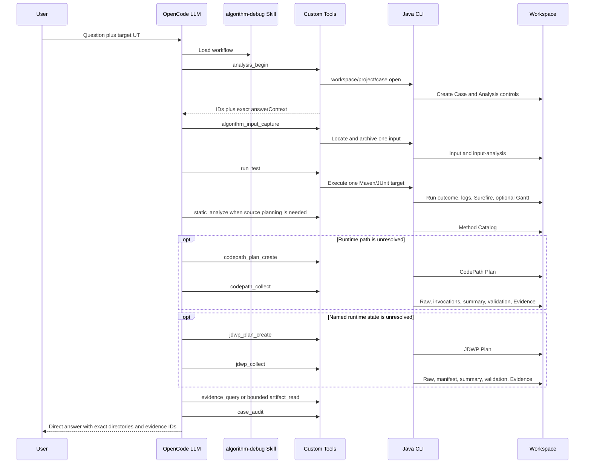

# Runtime Evidence Usability and Single-Session Sequencing

Updated: 2026-09-03

## 1. Goal

This design makes one OpenCode analysis session reliably execute a target Java/Maven algorithm UT,
collect bounded runtime evidence, and return a directly traceable answer. Deterministic code owns
execution, parsing, validation, hashing, archival, and querying. The LLM owns evidence planning,
sufficiency decisions, and causal explanation.

The implementation contains no file lock, Java global lock, cross-process lease, or automatic queue.
It does not coordinate multiple OpenCode sessions.

## 2. Actual runtime sequence



A second dynamic tool may be planned only after the prior collection has returned and its remaining
evidence gap is known. When JDWP refines CodePath, its Plan cites the exact preceding CodePath
Evidence ID.

## 3. Single-session target execution gate

`integrations/opencode/lib/tool-runtime.mjs` stores one closure-scoped
`activeTargetExecution`. `run_test`, `codepath_collect`, and `jdwp_collect` enter the same guard before
their first asynchronous operation. A second request is rejected immediately with
`ADA_TARGET_EXECUTION_SEQUENCE_VIOLATION`; it does not prepare the project, start the Java CLI, create
a Run, or create a Collection. `finally` always releases the state.

The gate prevents overlap inside one OpenCode Runtime only. It intentionally does not wait, queue, or
lock.

## 4. CodePath v4

The Plan selects 1 to 50 exact Method Catalog keys. Each method contains up to 32 scalar projections.
The only projection grammar is:

```text
arg[0]
arg[1].field.subfield
return
return.field
```

`arg0` is invalid. Field depth is at most eight. Getters, arbitrary expressions, collection scans,
Map-key scans, and complete object graphs are unsupported.

The Launcher records method enter/exit and requested scalar values. Projection failure records
`UNAVAILABLE` or `TRUNCATED` without dropping the invocation. The Normalizer deterministically pairs
events into `derived/codepath-invocations.jsonl` and derives a bounded Method Path Summary. It does
not invent invocation IDs, parent IDs, or business entity mappings.

Plan compilation failures return a bounded, single-line reason so the LLM can correct the exact field
instead of guessing.

## 5. JDWP v4

Each tracepoint selects one exact method and executable source line. A generic optional condition
reads a top-frame local, parameter, `this`, or a bounded instance-field path and compares one typed
scalar with `EQUALS`.

Separate budgets control:

- `maxObservedHits`: breakpoint encounters before disabling the tracepoint.
- `maxCapturedHits`: maximum full snapshots.
- `captureFirstMatchedHits`: consecutive first matched snapshots.
- `captureEveryMatchedHits`: periodic matched-hit sampling after the first group.
- `localNames` and `fieldPaths`: explicit state projection.
- `maxFrames`, `maxDepth`, `maxItems`, and `maxStringLength`: snapshot expansion bounds.

While the event thread is suspended, the Collector copies only the selected detached values. It
resumes the event set in `finally`, then the same Collector thread appends JSONL through one buffered
writer. There is no asynchronous writer or producer-consumer queue.

The Manifest keeps observed, matched, captured, and unavailable counters distinct. A later Plan may
increase observation coverage when a prior budget ended before the relevant invocation, but it must
cite the prior Evidence and state the concrete gap.

## 6. Evidence access

`evidence_query` reads only registered, SHA-verified `CODEPATH_INVOCATIONS` and
`JDWP_SNAPSHOT_SUMMARY` artifacts. It supports exact structural filters, offset/limit pagination, and
a byte budget. Query output is ephemeral; the source Artifact remains the immutable provenance.

`artifact_read` remains the bounded fallback for raw text and small control documents. Neither tool
performs business interpretation.

## 7. Direct answer contract

The model-authored answer is not stored in Workspace. `analysis_begin` returns an `answerContext`
containing the exact Case and Analysis relative directories. The answer copies both lines verbatim,
lists capabilities actually used, classifies claims, and cites full exact Run, Collection, Evidence,
and Artifact IDs without abbreviating them.

## 8. Quality gates

The Smoke Suite contains 10 scenarios. `quality-50.json` contains 50 unique real OpenCode scenarios
across passing runs, missing targets, input boundaries, algorithm exceptions, assertion failures,
static analysis, CodePath, JDWP, Artifact corruption, and cross-wafer causal refinement.

The Eval Harness audits protected source immutability, Tool order, target execution overlap, Plan
intent, CodePath-to-JDWP Evidence lineage, conditional JDWP, answer context, full evidence IDs,
Workspace expected/actual files, Artifact integrity, and interaction JSONL.

## 9. Non-goals

- No target-algorithm business semantics in Java tools.
- No Gantt semantic root-cause engine.
- No automatic modification of target production source.
- No complete whole-program call graph guarantee.
- No multi-session concurrency protocol.
- No database, vector store, or unbounded object expansion.

## 10. Change record

| Date | Version | Change |
|---|---:|---|
| 2026-09-03 | 2.0 | Replaced speculative observation/query design with the implemented CodePath v4, JDWP v4, one evidence query, direct answer, and non-locking single-session sequencing contracts. |