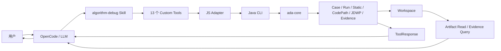

# Algorithm Debug Agent 全仓库一致性审计设计

## 1. 背景与问题

当前仓库已经历多轮功能迭代。Case、UT 执行、静态分析、CodePath、JDWP、Evidence、OpenCode
Adapter、Skill 和安装脚本的演进速度不同，存在以下系统性风险：

- Java 契约、JSON Schema、TypeScript Tool 参数和 Skill 描述可能不一致。
- 单个模块内部测试通过，但跨模块组合后的状态、ID、错误或产物语义可能不一致。
- Tool 返回的信息可能不足以让 LLM 判断停止、恢复、修改 Plan 或拒绝假设。
- 历史设计、旧 Schema 或旧字段可能已经失去调用方，却继续增加维护成本。
- 测试可能覆盖实现细节，但没有覆盖真实 OpenCode 会话和 Workspace 产物闭环。

本次工作不是增加新的业务能力，而是确认当前能力真实、闭环、可解释，并以失败测试驱动必要修复。

## 2. 目标与非目标

### 2.1 目标

1. 建立从 Skill 到 Workspace 的跨层功能追踪矩阵。
2. 逐模块检查潜在缺陷、职责漂移、重复实现和失效代码。
3. 检查所有模型可见成功、失败、部分结果和冲突状态是否具备明确下一步语义。
4. 检查 Skill、OpenCode Agent Prompt 和 Tool 描述是否与确定性后端一致。
5. 修复有证据的问题，并为每项行为修复增加回归测试。
6. 通过 Java、Node、脚本、Collector、Eval 和真实 OpenCode E2E 验证完整链路。
7. 最终只保留与当前实现一致的使用文档、设计和兼容资产。

### 2.2 非目标

- 不增加目标算法业务语义。
- 不修改目标算法生产源码来增加 Trace。
- 不引入新的 Agent 框架、消息队列、文件锁或跨会话协调。
- 不为了统一风格而重写正常工作的模块。
- 不自动删除仍有兼容调用方的旧 Schema 或 ADR。
- 不把 Demo 特性写入通用 Agent 代码。

## 3. 当前运行边界



审计以一个目标 Maven 算法模块、一个目标 JUnit UT、一个受支持算法输入为基本场景。普通 Run、
CodePath 和 JDWP 都可能执行目标 UT，但必须在单个 OpenCode Runtime 内串行完成。

## 4. 审计不变量

### 4.1 证据不变量

- LLM 负责假设、规划、充分性判断和解释；代码负责确定性执行、解析、校验、关联和归档。
- Raw Trace 只读；Normalizer 只能生成派生产物；Validator 不得推断业务语义。
- Artifact SHA 只验证已注册字节的完整性，不证明业务结果一致。
- 失败 UT 的动态复现只比较结构化失败指纹；成功 Gantt 不作为动态采集门禁。
- 截断、不可用、冲突和缺失必须显式呈现，不能伪装成未发生或确认事实。

### 4.2 身份和产物不变量

- 一个目标 UT 对应一个 Case；需要新确定性工作时追加 Analysis。
- Run、Plan、Collection、Evidence 和 Artifact 必须能追溯到正确 Case 与 Analysis。
- 历史产物只追加、不覆盖；目录按需创建，不保留空目录。
- 模型生成的最终回答直接返回用户，不写入 Workspace。

### 4.3 模型交互不变量

- Tool 失败不能被解释为目标算法失败。
- 目标 UT 失败仍是有效运行证据，不应被包装成 Tool 崩溃。
- 每个模型可见错误必须明确：发生了什么、哪些数据仍可信、下一步允许做什么。
- Skill 不规定固定采集轮数；每一轮必须针对一个能改变结论的证据缺口。
- Java 能确定性保证的规则不能只依赖 Prompt。

## 5. 审计方法

### 5.1 纵向功能追踪

对每个 Custom Tool 建立以下链路：

```text
用户场景
-> Skill 决策规则
-> OpenCode Agent Prompt
-> TypeScript Tool Schema
-> JS Adapter
-> CLI 命令
-> Application Service
-> Java Contract / JSON Schema
-> Workspace 产物
-> ToolResponse
-> LLM 下一步动作
```

链路任意一层缺失、矛盾或失去消费方，均形成审计 Finding。

### 5.2 横向模块检查

按依赖方向检查 Contracts、Case、Run、Static、CodePath、JDWP、Normalizer、Validator、Evidence、
Core、CLI、OpenCode 和脚本。每个模块统一检查职责、输入、输出、失败、边界、预算、日志、测试和文档。

### 5.3 缺陷处理

每项 Finding 记录严重级别、真实影响、根因、证据、最小修复和回归测试。行为修复执行
Red-Green-Refactor；没有失败证据的重构不得混入本次工作。

## 6. Finding 分级

| 级别 | 判定标准 |
| --- | --- |
| P0 | 可能执行错误目标、损坏或覆盖证据、越界访问、泄漏敏感数据 |
| P1 | 可能让 LLM 使用错误证据、把线索当事实、漏报截断或形成错误结论 |
| P2 | 工具失败无法恢复、Schema 漂移、安装不稳定或关键边界缺少验证 |
| P3 | 重复代码、无调用字段、旧文档、命名和局部可维护性问题 |

## 7. 模型可见错误闭环

每个 Tool 的失败和部分成功必须检查以下字段或等价信息：

| 问题 | 必须回答 |
| --- | --- |
| 错误主体 | Agent、环境、Collector、目标 UT 或输入 |
| 执行阶段 | 校验、启动、执行、采集、归档、Normalize、Validate 或 Query |
| 可信产物 | 哪些 Artifact、Manifest 或计数仍可使用 |
| 禁止推断 | 该结果不能证明什么 |
| 恢复动作 | 停止、修正参数、读取 Manifest、创建新 Plan 或修复环境 |
| 重试规则 | 是否允许原样重试，是否必须等待前一请求返回 |

## 8. 测试策略

验证顺序固定为：

1. 失败回归测试。
2. 受影响模块测试。
3. Java 契约和 Schema 测试。
4. 根 Reactor 与 CodePath Profile 测试。
5. OpenCode Adapter 和 Eval Harness 测试。
6. 构建、安装、卸载和重复安装验证。
7. CodePath Launcher 和 JDWP loopback 验证。
8. Smoke、Quality 和真实 OpenCode E2E。
9. 每个 E2E Case 的 Workspace、Artifact、interaction.jsonl 和 Java 日志审计。

## 9. 完成标准

- 13 个 Tool 均有完整跨层追踪记录。
- 所有 Maven 模块均完成模块审计并记录结论。
- 所有 P0、P1 问题完成修复和回归测试。
- P2、P3 问题完成修复，或在最终报告中说明保留原因和风险。
- Java、Node、脚本、Collector 和真实 OpenCode E2E 均有执行结果。
- Workspace 中不存在预期缺失、未注册文件、空目录或覆盖历史。
- Skill、OpenCode Agent Prompt、Tool Schema、Java 契约和当前文档一致。
- 最终报告明确当前可靠能力、已知边界和未完成风险。

